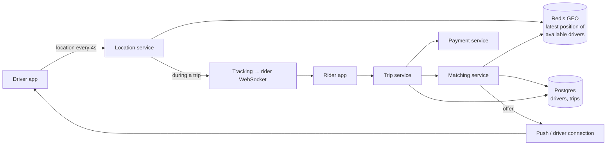
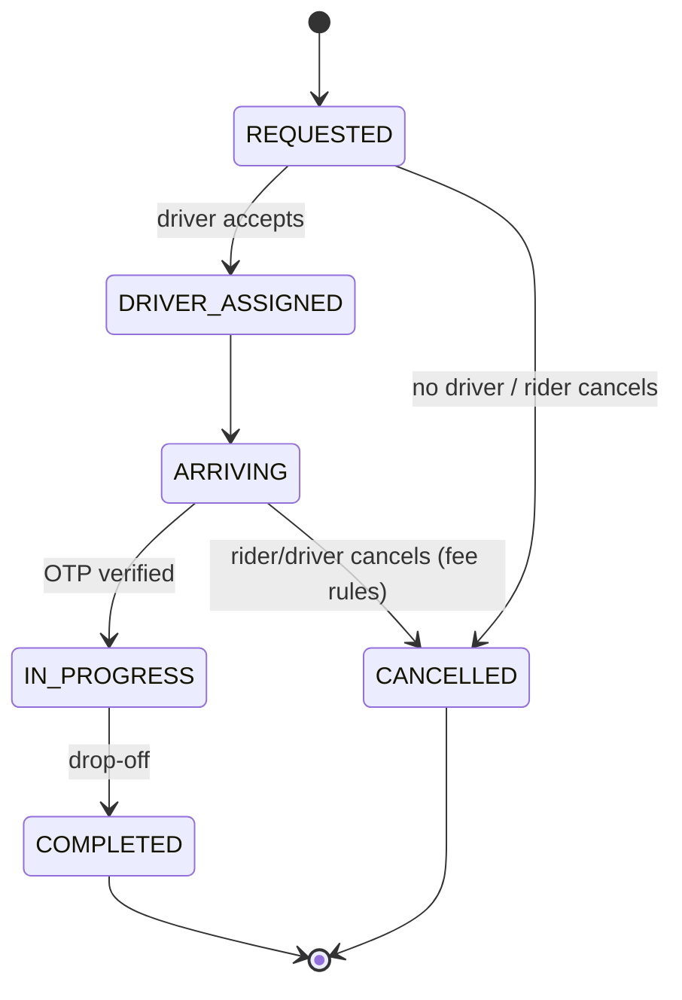

# Ride-Sharing — L4 (Mid-level / SDE2) Interview

> **Level expectation:** a working design: drivers report locations, riders find nearby drivers, a ride gets assigned to exactly one driver, the trip progresses through clear states, and the rider can track the car. Use a geo index instead of scanning all drivers, and make assignment atomic.

> 🆕 Never thought about what happens behind "Finding your ride…"? Read [00-understand-the-product.md](00-understand-the-product.md) first.

Legend: **🧑‍💼 Interviewer** · **🧑‍💻 Candidate** · **📝 Note** = commentary for you.

---

## 1. Clarifying requirements

**🧑‍💼 Interviewer:** Design Uber.

**🧑‍💻 Candidate:** Uber is huge, so let me scope it:
- Core flow only: rider requests → driver matched → pickup → trip → drop-off → payment?
- Ride types (pool/shared rides, scheduled rides)?
- Payments in scope, or just "charge at the end"?
- Global or one country?

**🧑‍💼 Interviewer:** Core flow, single-rider trips, one country with many cities. Payment: just charge at the end.

**🧑‍💻 Candidate:**

**Functional**
1. Drivers go online/offline and share their location.
2. Riders see nearby drivers and a fare estimate.
3. Rider requests a ride → matched to a nearby available driver who accepts.
4. Trip: driver arrives → starts → completes; rider tracks the car live.
5. Fare charged at the end.

**Non-functional**
1. **Matching is fast:** a few seconds.
2. **A driver is never assigned to two trips.**
3. Location updates are frequent and many; the system must keep up.
4. Trips are durable: a crash must not lose an active trip.

---

## 2. Back-of-the-envelope estimates

**🧑‍💻 Candidate:** Assumptions: **1M drivers online at peak**, **10M trips/day**. (Method: [back-of-the-envelope](../../concepts/back-of-the-envelope.md).)

| What | Calculation | Result |
|---|---|---|
| Location updates | 1M drivers ÷ every 4 s | **250k writes/s** |
| Ride requests | 10M / ~86,400 s | ~115/s avg, **~1k/s peak** |
| Fare estimate / app opens | ~10× requests | ~10k/s peak |
| Location index size | 1M × ~100 B (id, lat, lng, status, ts) | **~100 MB**: fits in memory easily |
| Location history (if kept) | 250k/s × ~50 B × 86,400 | **~1 TB/day** → cheap cold storage, not the hot path |

**🧑‍💻 Candidate:** Takeaways:
- **250k writes/s of data where only the latest value matters** → in-memory, overwrite in place. A database that keeps every write durably would be wasted effort.
- The live index is small (~100 MB); the challenge is write rate and geographic queries, not size.
- Ride requests are comparatively few (~1k/s), so the matching logic can afford a few database calls per request.

---

## 3. API

```http
# Driver app
POST /v1/drivers/me/status       { "status": "ONLINE" | "OFFLINE" }
PUT  /v1/drivers/me/location     { "lat": 12.9352, "lng": 77.6245, "ts": 1791381572 }   ← every ~4 s
POST /v1/offers/{offerId}/accept

# Rider app
POST /v1/fare-estimates          { "pickup": {...}, "drop": {...} }
POST /v1/trips                   { "pickup": {...}, "drop": {...}, "fareEstimateId": "fe_9" }   → 202 { "tripId": "t_77" }
GET  /v1/trips/{tripId}          → state, driver, ETA
WS   /v1/trips/{tripId}/live     ← driver location pushed every few seconds during the trip
```

---

## 4. High-level design



**🧑‍💻 Candidate:**
- **Location service:** receives updates, writes the latest position into an in-memory geo index ([Redis GEO](../../technologies/redis.md)).
- **Matching service:** finds nearby available drivers, sends an offer, handles accept/timeout, assigns atomically.
- **Trip service:** owns the trip **state machine** in [Postgres](../../technologies/postgresql.md).
- **Tracking:** during a trip, the driver's updates are also forwarded to the rider over a [WebSocket](../../technologies/websockets-and-sse.md).

---

## 5. Deep dives

### 5.1 Finding nearby drivers

**🧑‍💻 Candidate:** Checking all 1M drivers' distances per request is far too slow. A **geospatial index** groups points by area so a radius query only looks at nearby cells ([geospatial indexing](../../concepts/geospatial-indexing.md)). Redis has this built in (it encodes positions as **geohashes**, short codes where nearby points share prefixes, stored in a sorted set):

```text
GEOADD drivers:available 77.6245 12.9352 driver:ravi          # on each location update (lng, lat!)
GEOSEARCH drivers:available FROMLONLAT 77.6200 12.9340 BYRADIUS 3 km ASC COUNT 10 WITHDIST
→ driver:ravi 0.51 km, driver:sana 1.17 km, ...
```

- Only **available** drivers go in `drivers:available`; when assigned, the driver is removed (`ZREM`), and re-added when the trip ends.
- **Stale drivers:** if the app dies without going offline, its position stays forever. Keep `lastSeen:{driver}` with a short TTL (~30 s) and skip drivers whose key has expired ([heartbeats](../../concepts/presence-and-heartbeats.md)); a cleanup job removes them.

### 5.2 Assigning exactly one driver

**🧑‍💻 Candidate:** Two ride requests at the same moment can both pick Ravi. The fix is to make "is he free → take him" **one atomic step** in the database ([distributed locks & leases](../../concepts/distributed-locks-and-leases.md)):

```sql
UPDATE drivers
   SET status = 'OFFERED', offer_trip_id = :tripId, offer_expires_at = now() + interval '15 seconds'
 WHERE driver_id = :driverId AND status = 'AVAILABLE';
-- 1 row updated → Ravi is reserved for this trip. 0 rows → someone else got him; try the next driver.
```

Then send the offer. On **accept** → `status = 'ON_TRIP'`; on **decline/timeout** → back to `AVAILABLE`, and offer to the next driver in the list.

> 📝 **Note:** "Conditional update in the database" is the simplest correct answer to exclusivity: no separate lock service, and the guarantee lives where the data lives.

### 5.3 Trip state machine



Each transition is a conditional update too: `UPDATE trips SET state='IN_PROGRESS' WHERE id=? AND state='ARRIVING'`. A duplicate "start trip" tap or a stale request can't move the trip backwards or skip steps.

### 5.4 Live tracking

**🧑‍💻 Candidate:** While a trip is active, the location service also publishes the driver's updates to a channel for that trip; the rider's app holds a WebSocket and receives them every few seconds. If the WebSocket drops, the app falls back to polling `GET /trips/{id}` until it reconnects.

---

## 6. Follow-ups

**🧑‍💼 Interviewer:** Redis restarts and the geo index is empty.

**🧑‍💻 Candidate:** Every online driver sends a location within the next ~4 seconds, so the index rebuilds itself almost immediately. That's why it doesn't need to be durable. Matching just finds fewer drivers for a few seconds. Trips themselves are in Postgres, so nothing important is lost.

**🧑‍💼 Interviewer:** Why not store locations in Postgres?

**🧑‍💻 Candidate:** 250k updates/s, each one making a durable write (transaction log, index updates), for data that's overwritten 4 seconds later, would need a large, expensive cluster and gain nothing. The *trip* is durable; the *current position* is not worth persisting synchronously. If we want history (disputes, analytics), stream updates asynchronously to cheap storage.

**🧑‍💼 Interviewer:** Fare estimates?

**🧑‍💻 Candidate:** Call a routing/maps service for distance and time, apply the city's rate card (base + per km + per minute), and multiply by surge if any. Return an estimate ID valid for a few minutes, so the price the rider accepted is the one used. [L5](L5-senior.md#36-surge-pricing-with-stream-processing) covers surge.

**🧑‍💼 Interviewer:** A driver doesn't respond to the offer.

**🧑‍💻 Candidate:** The offer has `offer_expires_at`. A timer (or a periodic job) resets expired offers to `AVAILABLE` and moves on to the next candidate. The rider sees "Finding your ride…" a bit longer.

---

## 7. What the interviewer was evaluating (L4)

- [ ] Scoped to the core flow
- [ ] Estimated update rate and concluded "in-memory, latest value only"
- [ ] Geo index with radius search instead of scanning
- [ ] Atomic, conditional assignment so a driver can't get two trips
- [ ] Trip state machine with guarded transitions in a durable DB
- [ ] Stale-driver handling (TTL/heartbeats)
- [ ] Live tracking via WebSocket with a fallback

## 8. Common mistakes at this level

| Mistake | Why it hurts |
|---|---|
| `SELECT * FROM drivers` and compute distances in code | O(all drivers) per request |
| `WHERE lat BETWEEN … AND lng BETWEEN …` on a normal B-tree index | Index helps one dimension only; still scans a big strip |
| Check "available?" then update in two steps | Two riders get the same driver |
| Writing every location update to the main SQL DB | Expensive, pointless durability |
| No timeout on offers | A sleeping driver blocks the request forever |
| Trip state as free-form status strings updated without guards | Trips jump states; double completion, double charges |

➡️ Next: [L5-senior.md](L5-senior.md)
