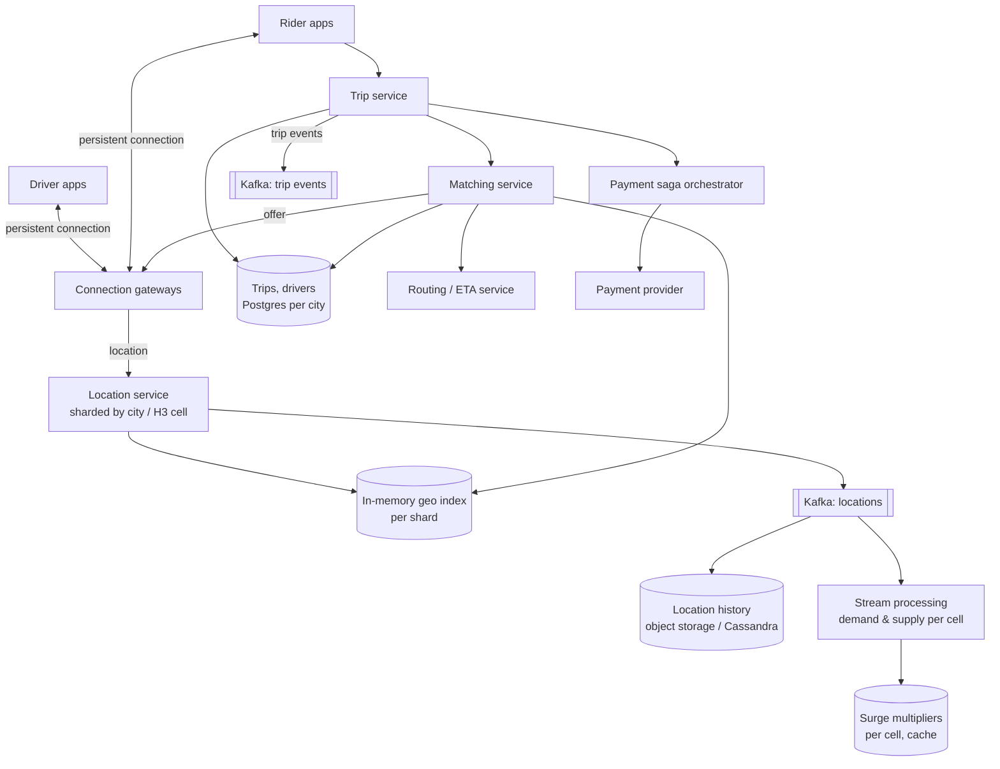
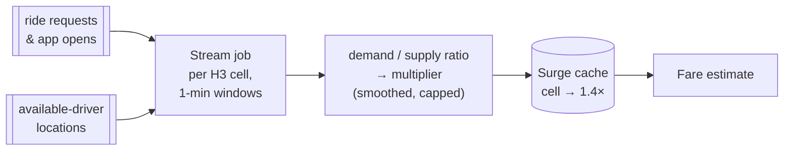
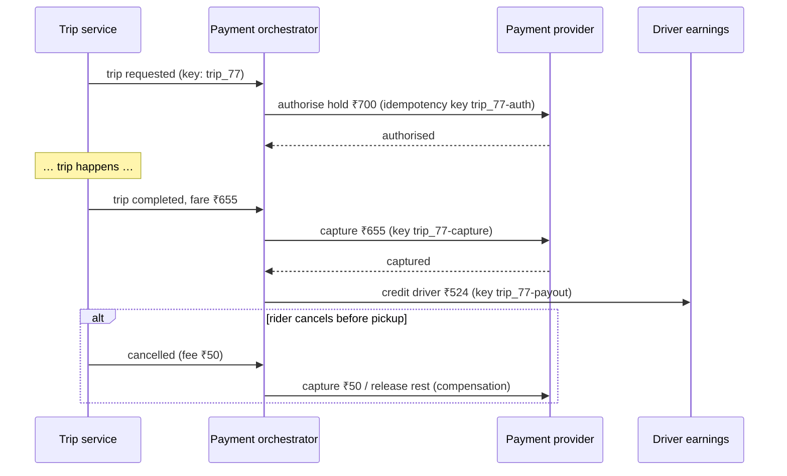

# Ride-Sharing — L5 (Senior) Interview

> **Level expectation:** you drive and go deep on what's genuinely hard here: **geo-partitioning**, **searching and ranking by real ETA**, **exclusive offers with leases and timeouts**, **250k location writes/s**, **surge from streaming data**, and a **payment saga**, each with numbers and failure handling. Read [L4-mid.md](L4-mid.md) first.

Legend: **🧑‍💼 Interviewer** · **🧑‍💻 Candidate** · **📝 Note** = commentary for you.

---

## 1. Requirements

**🧑‍💻 Candidate:** Core flow as in L4, plus **surge pricing**, **payments with card holds**, **cancellations with fees**, and **many cities**. Targets:

| Property | Target |
|---|---|
| Request → driver accepted | p50 < 10 s, p99 < 30 s (dominated by drivers' reaction time) |
| Matching computation | p99 < 500 ms per attempt |
| Location freshness in the index | < 5 s old |
| Assignment | Strictly exclusive |
| Payment | Never double-charge; never lose a completed trip's charge |

Scale from [L4](L4-mid.md#2-back-of-the-envelope-estimates): 1M drivers online, 250k location writes/s, ~1k ride requests/s peak, ~10k fare estimates/s.

---

## 2. Architecture



---

## 3. Deep dives

### 3.1 Partition by geography

**🧑‍💻 Candidate:** A rider in Bengaluru is never matched with a driver in Mumbai, so the **city** (or region) is the natural shard ([sharding](../../concepts/sharding-and-replication.md)):
- Location index, matching, and the trips DB are **per city**. Big cities can be split further by **H3 cells** (Uber's hexagonal grid) owned by different index shards ([geospatial indexing](../../concepts/geospatial-indexing.md)).
- **Hot spots** move during the day (office districts at 9 am, nightlife at 11 pm). Assign cells to shards with [consistent hashing](../../concepts/consistent-hashing.md) so rebalancing moves few cells.
- **Border cases:** a pickup near a shard boundary searches neighbouring cells that belong to another shard. The matching service queries both (scatter-gather) and merges.
- A city is also a **failure domain**: an outage in Mumbai's shard doesn't affect Delhi ([L6](L6-staff.md) builds on this).

### 3.2 Ingesting 250k location updates/s

- Driver apps keep a **persistent connection** to gateways (like [chat](../chat-system/L4-mid.md)), so there's no TCP + TLS handshake (connection setup round trips) per update. Updates are tiny (~50 bytes).
- Gateways route each update to the shard owning the driver's current cell. The shard **overwrites** that driver's entry in memory: no history, no durability on the hot path.
- **Out-of-order updates** (mobile networks reorder) are dropped if their timestamp is older than the stored one.
- Updates are also appended to [Kafka](../../technologies/kafka.md) for history, ETA models and surge. That stream is consumed asynchronously and never blocks the index.
- Drivers **on a trip** can send more often (every 1–2 s) for smooth tracking; idle drivers far from demand can send less often. That's an easy capacity lever.

### 3.3 Search and ranking by ETA

```text
cells = [pickupCell]
candidates = []
while len(candidates) < 10 and ring <= MAX_RING:
    candidates += availableDriversIn(kRing(pickupCell, ring))   -- next ring of hexagons
    ring += 1
etas = routing.matrix(candidates → pickup)                       -- ONE batch call
rank by eta (+ small penalties: driver just finished a long trip, low acceptance history…)
```

- Straight-line distance is a poor proxy: rivers, one-ways, flyovers. A **routing service** (road graph + live traffic) gives real ETAs. Calling it per driver is slow, so use a **matrix** call (many origins → one destination) in one request.
- **Ring expansion** keeps work proportional to local density: downtown finds 10 drivers in ring 1; suburbs may need ring 4.

### 3.4 Offers: leases, timeouts, sequential vs parallel

**🧑‍💻 Candidate:** A driver gets ~15 s to accept. During that time he must not receive another offer: that's a **lease**, an exclusive reservation that **expires by itself** ([distributed locks & leases](../../concepts/distributed-locks-and-leases.md)).

```sql
UPDATE drivers
   SET state = 'OFFERED', offer_id = :offerId, lease_until = now() + interval '15 seconds'
 WHERE driver_id = :d
   AND (state = 'AVAILABLE' OR (state = 'OFFERED' AND lease_until < now()));   -- expired lease = free
```

- **Why in the DB, not a Redis lock?** The driver's state lives in the trips DB; a separate lock can disagree with it (lock expired but DB still says OFFERED, or the reverse). One conditional update = one source of truth. The `offer_id` acts as a **fencing token** (a unique number proving which reservation you hold): accepting is `UPDATE … SET state='ON_TRIP' WHERE driver_id=:d AND offer_id=:offerId`, so a late "accept" for an expired offer can't hijack the driver.
- **Sequential offers** (one driver at a time): fair, no wasted driver attention, but slow if several decline.
- **Parallel offers** (top 3 at once, first to accept wins): faster, but annoys drivers who accept and then lose. Common middle ground: sequential with short timeouts, parallel only when demand is very high.

### 3.5 Idempotent trip requests

A rider double-taps "Book", or the app retries after a timeout. `POST /trips` carries a client-generated `requestId`; a unique constraint on `(rider_id, request_id)` makes the second insert fail, and the API returns the first trip ([idempotency](../../concepts/idempotency-and-delivery-semantics.md)). Also a rule: one active trip per rider.

### 3.6 Surge pricing with stream processing



- A [stream processing](../../technologies/stream-processing.md) job (Flink/Kafka Streams) counts **demand** (requests and fare checks) and **supply** (available drivers) per cell per 1-minute **window** (a time bucket the stream is grouped into), computes a multiplier, **smooths** it (no wild jumps between minutes) and **caps** it (product/regulatory limit).
- The fare estimate **locks** the multiplier shown to the rider for a few minutes (`fareEstimateId`), so the price doesn't change between "see price" and "book".
- If the surge pipeline is down, use the last known values, then decay to 1.0×. Never block bookings on pricing analytics.

### 3.7 Payment saga

**🧑‍💻 Candidate:** Trip, rider payment and driver payout live in different services and a third-party provider, so there's no single database transaction ([sagas](../../concepts/sagas-and-distributed-transactions.md)):



- Every step has an **idempotency key**, so retries after timeouts are safe.
- Every step has a **compensation** (release hold, refund, reverse payout).
- Trip events reach the orchestrator via an **outbox** (the event is written in the same DB transaction as the trip state change), so "trip completed but nobody charged" can't happen.
- If capture fails (card expired), the trip is still completed: the debt goes to the rider's account for collection, and the driver is still paid. Business rule, documented.

---

## 4. Failure modes

| Failure | Impact | Mitigation |
|---|---|---|
| Geo index shard dies | No drivers found in that area for seconds | Replica takeover; index rebuilds from updates within ~4 s |
| Routing/ETA service slow | Matching latency up | Timeout → fall back to straight-line distance × city speed factor |
| Gateway node dies | Its drivers/riders reconnect | Jittered reconnect; leases expire safely; trip state in DB |
| Driver app offline mid-offer | Offer not answered | Lease expires → next driver |
| Driver app offline mid-trip | Tracking stops | Trip stays IN_PROGRESS; fare from last known route + resync later |
| Trips DB primary failover | Assignments pause briefly | Synchronous replica, fast failover; matching retries |
| Surge pipeline down | Stale prices | Last known, decay to 1.0× |
| Payment provider down | Captures fail | Saga retries with backoff; trips don't block on it |

---

## 5. Follow-ups

**🧑‍💼 Interviewer:** Airport pickups: drivers wait in a lot for an hour. Nearest-first is unfair.

**🧑‍💻 Candidate:** Airports are a special zone: a **FIFO queue** of drivers who entered the airport geofence (a virtual boundary). Requests from the airport go to the head of the queue, not the nearest driver. Same matching interface, different strategy per zone, like the [elevator dispatch Strategy](../../../LLD/interviews/elevator-system/L5-senior.md#32-dispatch-a-cost-function).

**🧑‍💼 Interviewer:** Why not a graph or spatial database like PostGIS for everything?

**🧑‍💻 Candidate:** PostGIS is great for durable, complex geo queries (zones, geofences, analytics). For 250k overwrites/s of ephemeral points, an in-memory index is far cheaper. Use both: PostGIS for geofences and city/zone definitions, in-memory cells for live drivers.

---

## 6. What the interviewer was evaluating (L5)

- [ ] Geo-partitioning by city/cell; boundary handling; moving hot spots
- [ ] Ingestion design for 250k/s: persistent connections, overwrite, drop out-of-order, async history
- [ ] Ring search + batched ETA ranking
- [ ] Offer leases in the source-of-truth DB with fencing via offer id; sequential vs parallel trade-off
- [ ] Idempotent trip creation
- [ ] Surge via windowed stream processing, smoothed/capped, locked by estimate ID, with fallback
- [ ] Payment saga: auth → capture → payout, idempotency keys, compensations, outbox
- [ ] Failure table with a degraded mode for each dependency

## 7. Common mistakes at this level

| Mistake | Why it hurts at L5 |
|---|---|
| A Redis lock for the driver plus driver status in the DB | Two sources of truth that can disagree |
| Leases without fencing | A late accept from an expired offer hijacks the driver |
| Ranking by straight-line distance only | Bad matches across rivers/highways |
| One global location index | Single bottleneck; global blast radius |
| Synchronous surge computation on the booking path | Bookings fail when analytics is slow |
| Charging the full fare at request time | Refund chaos on cancellations; use authorise + capture |

⬅️ Previous: [L4-mid.md](L4-mid.md) · ➡️ Next: [L6-staff.md](L6-staff.md)
