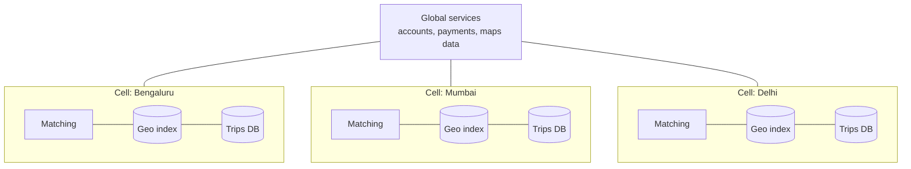

# Ride-Sharing — L6 (Staff) Interview

> **Level expectation:** the L5 architecture is assumed and summarised quickly. The staff conversation treats ride-sharing as a **two-sided marketplace**: global vs greedy matching, positioning supply, surge as policy, experiments that don't lie, the city as an isolation cell, safety and fraud, and degraded modes. Read [L5-senior.md](L5-senior.md) first.

Legend: **🧑‍💼 Interviewer** · **🧑‍💻 Candidate** · **📝 Note** = commentary for you.

---

## 1. It's a marketplace, not a lookup

**🧑‍💼 Interviewer:** Design Uber's dispatch.

**🧑‍💻 Candidate:** The L5 design matches each request greedily to its best driver. That's locally optimal and globally wasteful. Two requests, two drivers:

```text
Rider A ── 1 min ── Driver X ── 2 min ── Rider B
                                              Driver Y is 9 min from A, 3 min from B

Greedy (A first): A←X (1 min), B←Y (3 min)    total pickup 4 min ✓ fine here
Greedy (B first): B←X (2 min), A←Y (9 min)    total pickup 11 min ✗
Batch:            consider both together → A←X, B←Y, 4 min regardless of arrival order
```

- **Batch matching:** collect requests and available drivers over a short window (~1–2 s) per area, then solve an **assignment problem** (minimise total ETA, plus constraints). Classic algorithms (Hungarian method, min-cost flow) handle hundreds × hundreds within milliseconds.
- **Cost:** adds up to the batch window of latency to every match. Worth it in dense areas; in sparse suburbs, match immediately.
- **Objective is a policy choice:** minimise total pickup time? Maximise completed trips? Balance driver earnings (fairness)? These conflict, and the weights are set with product and ops, not just engineering.

> 📝 **Note:** Reframing "find the nearest driver" as "optimise the whole market over a short window" is the classic staff insight for this problem.

---

## 2. Positioning supply before demand appears

- **Demand forecasting** per cell for the next 15–60 min (events, weather, office hours) from historical data and streams.
- **Driver guidance:** heatmaps and incentives to move toward forecast demand. Drivers are independent, so this nudges rather than commands.
- **Surge as a balancing tool**, not just revenue: higher prices both reduce demand and attract drivers. Its effect is measured on *wait times and completion rates*, not just fare.

---

## 3. Surge as policy

| Concern | Design response |
|---|---|
| Public backlash / regulation (many cities and countries cap surge) | Caps per city in config; audit log of multipliers |
| Emergencies (floods, strikes) | Manual override to cap or disable surge per area; it's been a real PR crisis for ride companies |
| Volatility ("1.2× → 2.5× → 1.1× within a minute") | Smoothing and hysteresis (don't flip back and forth) |
| Gaming (drivers going offline together to trigger surge) | Detect coordinated supply drops; compute supply from longer windows |

Surge is computed by the streaming pipeline (L5); the *policy* (caps, overrides, smoothing parameters) is separate, versioned configuration owned by city ops.

---

## 4. Experiments in a two-sided market

**🧑‍💻 Candidate:** Normal A/B tests split *users* randomly. In a marketplace that **lies**: if half the riders get a new matching algorithm that grabs drivers more aggressively, they "win" by stealing drivers from the control group. The test shows a gain that wouldn't exist at 100% rollout.

- **Switchback experiments:** alternate the *whole city or area* between variant A and B in time slices (e.g. 30 min each), then compare slices. Both sides of the market experience the same variant at once.
- **Geo experiments:** comparable cities/areas as treatment vs control.
- Guardrails: rider wait time, driver earnings per hour, cancellation rates, safety incidents.

> 📝 **Note:** Knowing *why* standard A/B testing breaks in marketplaces (interference between groups) is a signal of real production experience.

---

## 5. City as a cell



- Each city (or group of small cities) runs its own **cell**: matching, index, trips DB, surge pipeline. A bad deploy or overload hits one cell, not the country. Deploy cell by cell (small city first).
- **Cross-cell trips** (airport in another district, intercity rides) are rare: the pickup cell owns the trip.
- **Cell failover:** a standby in another region with replicated trips DB; geo index and surge rebuild from live streams in seconds. Active trips continue on the drivers' apps (they know the destination), and the backend catches up on reconnect.
- **Data residency:** cells naturally keep a country's data in-country where required.

---

## 6. Safety and fraud

- **Safety features:** trip sharing, SOS button, route-deviation and long-stop detection (stream processing over in-trip locations), driver identity checks (selfie verification). These are **critical paths**: SOS must work even when other features are degraded, so it gets its own minimal dependency chain.
- **GPS spoofing:** drivers fake locations to appear near airports or high-surge zones. Detect via impossible speeds/jumps, mismatch with cell-tower/Wi-Fi signals, known spoofing apps, and **map matching** (snapping points to roads; points that never align with roads are suspicious).
- **Collusion:** fake rides between colluding accounts for incentives/promotions → graph analysis of rider–driver pairs, device fingerprints.
- **Location privacy:** driver/rider location history is highly sensitive (home, work). Restrict access, retain only as long as needed for disputes and safety, and anonymise for analytics.

---

## 7. Degradation ladder

| Dependency down | Behaviour |
|---|---|
| Routing/ETA | Straight-line × city speed factor; wider candidate lists |
| Batch optimiser | Greedy matching (L5) |
| Surge pipeline | Last known, decaying to 1.0×; fares still quoted |
| Payment provider | Trips continue; captures queued; cash option where available |
| Maps tiles for the app | App shows addresses/ETA text; core matching unaffected |
| Whole cell | Failover to standby cell; drivers keep trip details locally |

Each level has an owner, a switch, and is practised in game days.

---

## 8. Curveballs

**🧑‍💼 Interviewer:** Wait times in one city went up 30% after a release, but all service metrics are green.

**🧑‍💻 Candidate:** In a marketplace, the "service" can be healthy while the *market* is broken. Look at funnel metrics: requests → offers → acceptances → pickups. If acceptance dropped, maybe the release changed offer timing or showed less info to drivers. If offers per request rose, maybe candidate ranking got worse. That's why the dashboards for this system must include **marketplace health** (wait time, acceptance rate, completion rate per cell) alongside latency and errors, and the release should have run as a switchback experiment first.

**🧑‍💼 Interviewer:** Shared rides (pool)?

**🧑‍💻 Candidate:** It changes matching from "one rider ↔ one driver" to "insert a rider into an existing route if the detour for current riders stays under X minutes". That's a vehicle-routing problem, solved heuristically in the same batch window. Trip state becomes per-rider-within-vehicle, and pricing must be quoted before the match is known, which is a different contract. I'd treat it as a separate product surface reusing the location index, routing and payments.

---

## 9. What the interviewer was evaluating (L6)

- [ ] Reframed matching as market optimisation (batch assignment) with explicit objectives
- [ ] Supply positioning and surge as a balancing policy with caps, overrides, anti-gaming
- [ ] Recognised interference in marketplace experiments; switchbacks/geo tests
- [ ] City as a cell: isolation, rollout, failover, residency
- [ ] Safety as a critical path; GPS spoofing and collusion detection; location privacy
- [ ] Degradation ladder per dependency
- [ ] Marketplace health metrics alongside service metrics

## 10. Common mistakes at this level

| Mistake | Why it hurts at L6 |
|---|---|
| Only greedy nearest-driver matching | Leaves large efficiency gains on the table in dense areas |
| Treating surge as a pure formula | Ignores regulation, emergencies and trust |
| User-split A/B tests for dispatch changes | Interference makes results wrong |
| One national deployment | National blast radius for every bug |
| Safety features sharing fragile dependencies | SOS fails exactly when things go wrong |
| Monitoring only latency/errors | Market failures look "green" |

⬅️ Previous: [L5-senior.md](L5-senior.md) · 🏠 [Problem overview](README.md)
