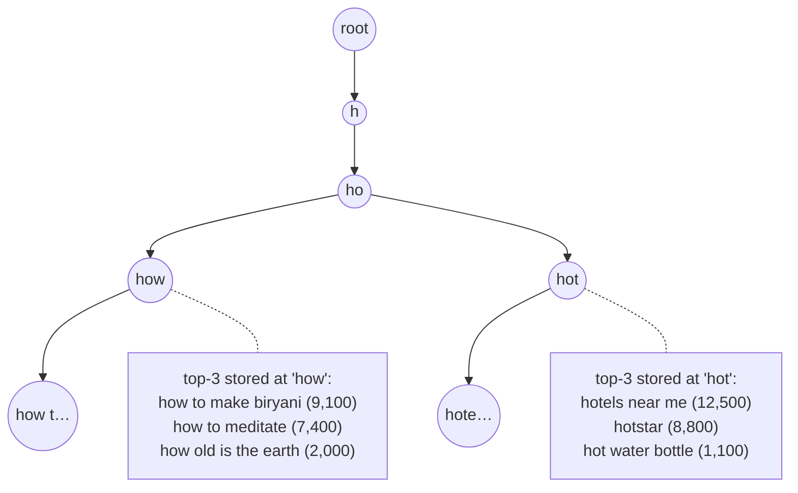
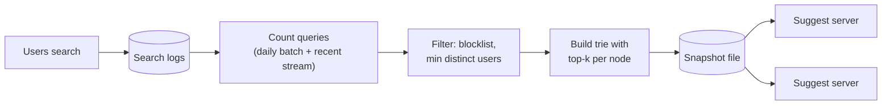

# Start Here: What Is Search Autocomplete? (Before the Interview)

> You type "how to m" and, before you finish, the box offers "how to make biryani", "how to meditate", "how to make money online". It feels like a tiny feature. Behind it is a system answering **one request per keystroke** for hundreds of millions of people in tens of milliseconds, fed by a pipeline that counts billions of searches, plus a surprising amount of judgement about what *not* to suggest.
>
> Time: ~15 minutes. Then: [L4](L4-mid.md) → [L5](L5-senior.md) → [L6](L6-staff.md).

---

## 1. The story: saving people from typing

A user on a phone in a moving auto-rickshaw wants to search for "hyderabad biryani near me". Typing 26 characters on a small screen is slow and full of typos. If after "hyd bir" the box already shows the full query, they tap once and they're done.

That's **autocomplete** (also *typeahead* or *search suggestions*): after each keystroke, show a handful (usually 5–10) of likely completions of what the user has typed so far, the **prefix**.

💡 **Prefix:** the beginning of a word or phrase. "hyd", "hyde" and "hyderabad bir" are all prefixes of "hyderabad biryani".

Why companies care:
- **Fewer keystrokes**, faster searches, fewer typos ("biriyani" never gets typed if "biryani" is suggested).
- **Better searches:** suggestions steer people to queries that actually have good results.
- **It's the first thing users touch.** If it's slow (the suggestion appears after you've typed the next letter), it's useless.

What goes wrong with a naive version ("run `SELECT query FROM searches WHERE query LIKE 'hyd%' ORDER BY count DESC LIMIT 5` on every keystroke"):
- **Volume:** one search = many keystrokes = many requests. Millions of users typing → hundreds of thousands of requests per second.
- **Latency:** a database scan per keystroke can't answer in a few milliseconds.
- **Staleness:** a cricket final starts and everyone searches "ind vs aus live score"; yesterday's counts don't know.
- **Embarrassment:** the most popular completions of some prefixes are offensive, defamatory, or someone's private information.

---

## 2. Where you've already seen it

| Where | What's being completed |
|---|---|
| **Google / Bing / YouTube search box** | Popular queries, trending topics, your own history |
| **Amazon, Flipkart, Swiggy, Zomato** | Product names, restaurants, dishes, categories |
| **Your IDE** (IntelliJ completion) | Class and method names: same idea, different ranking |
| **Your shell** (`kubectl get po<TAB>`) | Commands and resource names |
| **Slack / Teams** `@mentions`, `#channels` | People and channels, ranked by who you talk to |
| **Grafana / Kibana query bars** | Metric names, label values, field names |

> 💡 **Infra analogy:** Grafana's metric-name dropdown is autocomplete over a few million time-series names. It's fast because it searches a pre-built index, not the raw data. Same trick here.

---

## 3. The features, through situations

### 3.1 "Show me completions as I type" → prefix lookup
After every keystroke, find the top completions starting with the current prefix. The data structure built for "everything starting with X" is a **trie** (a tree where each step down adds one character), see [tries & prefix search](../../concepts/tries-and-prefix-search.md). → L4 §4.

### 3.2 "The popular ones first" → ranking by count
"how to m" has thousands of possible completions. Show the ones searched most often. That needs **counts** from the search logs, and fast **top-k** selection (the k best of many). → [Top-k & heavy hitters](../../concepts/top-k-and-heavy-hitters.md), L4 §5.1.

### 3.3 "Don't make me wait" → precompute and cache
The suggestion must appear before the next keystroke: humans type a character every ~100–300 ms, so the whole round trip should be well under 100 ms. So answers are **precomputed** (the top 10 for every prefix is stored ahead of time), kept in memory, and the very common short prefixes ("a", "ho") are **cached** in the browser and at the [CDN](../../technologies/cdn.md). → L4 §5.2–5.3.

### 3.4 "Don't send a request for every letter" → debouncing
Typing "biryani" quickly is 7 keystrokes in about a second. The app waits until typing pauses (e.g. 50–150 ms) before asking, and cancels outdated requests. That's **debouncing**, and it can cut requests several-fold. → L4 §5.4.

### 3.5 "Something is happening right now" → trending
A cricket final, an earthquake, a new phone launch: queries that didn't exist an hour ago are suddenly everywhere. Daily counts are too slow. A **streaming** pipeline counts recent searches and boosts what's rising. → [Stream processing](../../technologies/stream-processing.md), L5 §3.2.

### 3.6 "I meant biryani" → typo tolerance
"biriyani", "briyani", "biryni". Matching only exact prefixes fails users who misspell. **Fuzzy matching** (allowing 1–2 wrong characters) helps, at a cost. → L5 §3.5.

### 3.7 "You searched this yesterday" → personalisation
Your own recent searches, your city, your language. Blending global popularity with *your* history makes suggestions far more useful, and raises privacy questions. → L6 §2.

### 3.8 "Never suggest that" → safety filtering
Popular isn't the same as acceptable. Offensive phrases, defamation ("[person's name] is a criminal"), and **rare queries that reveal private information** (someone searched their friend's full name plus a medical condition) must never be suggested. → L4 §5.5, L6 §3.

💡 **k-anonymity (in plain words):** only show a query if at least *k* different people searched it, so a suggestion can never reveal one person's search.

---

## 4. The key mechanism: a trie with the answers stored inside it



Each node is a prefix. Following "h" → "o" → "w" takes 3 steps for a 3-letter prefix, no matter how many queries exist. The trick that makes it fast: **each node already stores its top completions**, computed offline from the counts. Serving is then: walk down the prefix, return the stored list. No searching, no sorting at request time.

The other half is the **offline pipeline** that rebuilds this structure from search logs:



---

## 5. Try it yourself

> These are public endpoints widely used for exactly this. The environment this repo was written in blocked outbound network access, so the outputs weren't re-checked here; they should work from your laptop. They're unofficial for some providers and may change.

```sh
# Wikipedia's suggestion API (documented, public): titles starting with "distrib"
curl -s 'https://en.wikipedia.org/w/api.php?action=opensearch&search=distrib&limit=5&format=json'

# Google's suggest endpoint used by browsers (unofficial; returns JSON)
curl -s 'https://suggestqueries.google.com/complete/search?client=firefox&q=system+des'

# DuckDuckGo's autocomplete (unofficial)
curl -s 'https://duckduckgo.com/ac/?q=kuber'
```

Then watch it live: open your browser's **DevTools → Network** tab, go to a search site, and type slowly, then quickly. Count how many suggestion requests fire. Notice that fast typing sends fewer requests (debouncing), and that requests for older prefixes get cancelled.

---

## 6. From experience to requirements

| What the user experiences | Requirement |
|---|---|
| Suggestions appear as they type | **F:** return top ~10 completions for a prefix |
| Popular things first | **F:** rank by frequency (and other signals later) |
| Never noticeably slow | **NF:** server p99 ≈ 10–20 ms; end-to-end < 100 ms |
| Works for everyone at once | **NF:** very high read QPS (one request per few keystrokes) |
| Breaking news shows up | **NF:** freshness: minutes for trending, a day is fine for the rest |
| Suggestions are never offensive or private | **F:** blocklists, minimum distinct-user thresholds, takedown process |
| Typos still work | **F (later):** fuzzy matching |
| My own history helps | **F (later):** personalisation |
| A broken suggestion service never breaks search | **NF:** highly available; failing open (no suggestions) is acceptable |

---

## 7. Mini glossary

| Term | Plain meaning |
|---|---|
| Autocomplete / typeahead | Suggesting completions while the user types |
| Prefix | The part typed so far |
| Trie | A tree where each step adds one character; a node = a prefix |
| Top-k | The k highest-ranked items (e.g. top 10 completions) |
| Debouncing | Waiting for a pause in typing before sending a request |
| Query log | A record of every search (query text, time, region, …) |
| Trending | A query whose recent count is much higher than usual |
| Fuzzy matching | Matching despite small spelling differences |
| k-anonymity threshold | Only suggest queries made by at least k different users |
| Snapshot | A built index saved as a file that servers load |

➡️ Next: [README.md](README.md) · then [L4-mid.md](L4-mid.md)
