# Search Autocomplete — L4 (Mid-level / SDE2) Interview

> **Level expectation:** split the problem into a **fast read path** (prefix → top suggestions from memory) and an **offline build path** (logs → counts → index). Use a trie with precomputed top-k per node, size it with arithmetic, replicate it, cache short prefixes, debounce on the client, and filter unsafe suggestions. Updating once a day is acceptable at this level.

> 🆕 Never thought about how autocomplete works? Read [00-understand-the-product.md](00-understand-the-product.md) first. It explains prefixes, tries and the build pipeline with pictures.

Legend: **🧑‍💼 Interviewer** · **🧑‍💻 Candidate** · **📝 Note** = commentary for you.

---

## 1. Clarifying requirements

**🧑‍💼 Interviewer:** Design search autocomplete for a large search product.

**🧑‍💻 Candidate:** Questions first:
- What are we completing: past search queries, product names, or documents? (It changes the data source.)
- How many suggestions per prefix, and ranked by what? Popularity only?
- Scale: daily users and searches?
- Freshness: is a daily update OK, or must trending topics appear within minutes?
- Languages? Typos? Personalisation?
- Any content rules (offensive or private suggestions)?

**🧑‍💼 Interviewer:** Complete **past search queries**. Top 10 by popularity. 100M daily active users, about 10 searches each per day. Daily freshness is fine for now. English only, no typos, no personalisation. Yes, don't suggest offensive things.

**🧑‍💻 Candidate:**

**Functional**
1. `suggest(prefix)` → up to 10 completions, most popular first.
2. Counts come from the search logs; rebuild daily.
3. Never suggest blocked terms.

**Non-functional**
1. **Fast:** server p99 under ~20 ms, so end-to-end stays under 100 ms (people type a character every ~100–300 ms).
2. **High read QPS** (calculated below).
3. **Highly available**, but failing **open** is fine: if suggestions are down, search still works.
4. **Eventually consistent:** today's searches show up in tomorrow's suggestions.

> 📝 **Note:** "Failing open is fine" is a useful thing to say. Autocomplete is an enhancement; it must never take the search box down with it. That lets you choose availability and simplicity over consistency everywhere.

---

## 2. Back-of-the-envelope estimates

(Method: [back-of-the-envelope](../../concepts/back-of-the-envelope.md).)

| What | Calculation | Result |
|---|---|---|
| Searches/day | 100M users × 10 | **1B searches/day** |
| Suggestion requests/search | ~20 characters typed, but debouncing sends about 1 per pause → assume ~5 | 5 |
| Suggestion requests/day | 1B × 5 | **5B/day** |
| Average QPS | 5B ÷ 86,400 s | **~58k QPS** |
| Peak QPS | ~2× average | **~120k QPS** |
| Query logs | 1B searches × ~100 bytes (query, time, region, user hash) | **~100 GB/day** |
| Queries worth suggesting | of hundreds of millions of distinct queries, most are typed once; keep those searched by enough distinct users | assume **~20M queries** |
| Trie nodes | 20M queries × ~25 characters = 500M characters; shared prefixes cut that a lot | assume **~100M nodes** |
| Trie memory | 100M nodes × ~100 bytes (children + top-10 list of 4-byte query IDs) | **~10 GB** (+ ~0.5 GB of query strings) |

**🧑‍💻 Candidate:** Two conclusions:
- **The index is small (~10 GB) but the traffic is large (~120k QPS).** It fits in one server's memory, so every server can hold a **full copy**: we **replicate** for throughput instead of **sharding** (splitting) the data. Sharding only becomes necessary in L5, when we add more data per node.
- Serving is pure in-memory lookups: maybe ~20k requests/s per server, so 120k ÷ 20k = 6 servers at peak; with headroom and spreading across availability zones, **~12–15 servers**.

💡 **Sharding vs replication:** sharding splits data so each server has a part; replication copies all of it to each server. See [sharding & replication](../../concepts/sharding-and-replication.md).

---

## 3. API

```http
GET /v1/suggest?q=how%20to%20m&limit=10
→ 200 OK
Cache-Control: public, max-age=300
{ "prefix": "how to m", "suggestions": ["how to make biryani", "how to meditate", "how to make money online", ...] }
```

- `q` is **normalised** on the server: lowercase, trim, collapse repeated spaces, so "How  To M" and "how to m" share one cache entry.
- `GET` with a cache header so browsers and the [CDN](../../technologies/cdn.md) can cache popular prefixes.

---

## 4. High-level design

```mermaid
flowchart TB
    subgraph Online["Read path (every keystroke)"]
        B[Browser / app<br/>debounce + local cache] --> CDN[CDN<br/>caches short prefixes]
        CDN --> LB[Load balancer]
        LB --> S1[Suggest server<br/>full trie in memory]
        LB --> S2[Suggest server<br/>full trie in memory]
        LB --> S3[Suggest server ...]
    end
    subgraph Offline["Build path (daily)"]
        SS[Search service] -->|query events| K[(Kafka)]
        K --> LOGS[(Query logs<br/>object storage)]
        LOGS --> AGG[Daily aggregation job<br/>count per query]
        AGG --> F[Filter: blocklist,<br/>min distinct users]
        F --> BLD[Trie builder<br/>top-10 per node]
        BLD --> SNAP[(Trie snapshot<br/>versioned file)]
    end
    SNAP -.->|servers download<br/>new version, swap| S1
    SNAP -.-> S2
    SNAP -.-> S3
```



**🧑‍💻 Candidate:** Two independent halves:
- **Read path:** stateless servers, each with the whole trie in memory, behind a [load balancer](../../technologies/load-balancer.md). No database on the request path.
- **Build path:** search events go to [Kafka](../../technologies/kafka.md) and land in [object storage](../../technologies/object-storage.md); a daily batch job counts them, filters, builds the trie, and publishes a versioned snapshot file. Servers load the new version in the background and switch to it.

> 📝 **Note:** The separation is the core idea: the expensive work (counting billions of events, sorting) happens once a day offline; the per-keystroke work is a few pointer hops in memory.

---

## 5. Deep dives

### 5.1 Counting and picking the top 10

**🧑‍💻 Candidate:** The daily job reads the last N days of logs (e.g. 30) and computes `query → count`, normalised the same way as the API. That's a group-by-and-count over 30 days × 1B searches/day = **30B log rows**: a job for a batch framework like Spark (which splits the work across many machines), not a single database. Simpler: count each day once, keep daily `query → count` tables, and sum the last 30.

Picking the top 10 completions of a prefix from thousands of candidates: keep a **min-heap of size 10** while scanning: O(n log 10) instead of sorting everything ([top-k & heavy hitters](../../concepts/top-k-and-heavy-hitters.md)).

**Ranking at L4:** count with a gentle **recency weight**, e.g. each day's count multiplied by 0.9^(days ago), so a query popular last week outranks one popular a month ago. That's a one-line change in the aggregation.

### 5.2 The trie with top-k stored at every node

**🧑‍💼 Interviewer:** Why store the top 10 at every node? Can't you just walk the subtree at query time?

**🧑‍💻 Candidate:** Walking the subtree under "a" means visiting millions of nodes per request. Precomputing moves that cost to build time ([tries & prefix search](../../concepts/tries-and-prefix-search.md)):

| Approach | Request cost | Memory | Build cost |
|---|---|---|---|
| Trie, find completions by walking the subtree | O(prefix length + subtree size): huge for short prefixes | small | small |
| **Trie with top-10 per node** | **O(prefix length)**: ~10 pointer hops, then return a stored list | +40 bytes per node (10 × 4-byte IDs) | one bottom-up pass: each node's top-10 = best 10 of its own count and its children's lists |
| Hash map `prefix → top-10` | O(1) | larger (every prefix stored as a string key) | same |

Build bottom-up: a node's list is the best 10 among (its own query, if it is a complete query) and the lists of its children. Each node merges a few small lists, so the whole build is roughly linear in the number of nodes.

**Memory tricks:** store query **IDs** (4 bytes) in the lists, with one array of query strings; cap the trie depth (prefixes longer than ~30 characters are rare and can fall back to the deepest stored node); use a compact array layout instead of Java objects per node (object headers alone cost ~16 bytes each).

### 5.3 Caching at every layer

| Layer | What | Why it works |
|---|---|---|
| **Browser / app** | Results for prefixes already typed in this session | Backspace and retyping are very common |
| **CDN** | Responses for short prefixes (1–3 characters), `max-age` a few minutes | There are only 26 one-letter and 676 two-letter prefixes in English; they're the most requested and identical for everyone |
| **Server** | The trie itself is the cache | Already in memory |

Short prefixes are both the **most requested** (everyone types the first letter) and the **least specific**, so caching them at the edge removes a big share of traffic.

### 5.4 Client-side debouncing

**🧑‍💻 Candidate:** The client waits ~50–150 ms after the last keystroke before requesting, **cancels** in-flight requests for older prefixes, and ignores late responses (otherwise a slow reply for "ho" could overwrite the newer reply for "hot"). This roughly divides request volume by 3–5 and costs the user nothing, since a fast typist wouldn't see the intermediate suggestions anyway.

### 5.5 Filtering

- A **blocklist** of terms and patterns, applied at build time (blocked queries never enter the trie) and also checked at serve time (so an urgent addition takes effect without a rebuild).
- **Minimum distinct users:** a query is eligible only if at least, say, 20 different users searched it. This keeps out one person's private searches and makes it harder for one bot to inject a suggestion.

### 5.6 Shipping a new trie safely

- The builder writes a **versioned snapshot** (`trie-2026-10-08.bin`) plus a checksum to object storage.
- Each server downloads it in the background, loads it into new memory, runs a few sanity checks (number of queries within ±20% of yesterday, known prefixes return results), then **swaps one reference** atomically. Old version is freed. Readers never see a half-built trie.
- Roll out to a few servers first; if error rates or empty-result rates jump, roll back to the previous version.

💡 **Infra analogy:** this is a config/artifact rollout: build once, verify, canary, swap a pointer, keep the previous version for rollback. Same discipline as deploying a new container image.

---

## 6. Follow-ups

**🧑‍💼 Interviewer:** Why not just use the database with `LIKE 'prefix%'`?

**🧑‍💻 Candidate:** Even with an index on `query`, ranking needs "all matches, sorted by count, top 10": for "a" that's millions of rows per request, 120k times a second. Precomputing the answer per prefix makes each request trivially cheap. A database is fine for the *build* inputs, not for serving.

**🧑‍💼 Interviewer:** A server restarts. How long until it serves?

**🧑‍💻 Candidate:** It downloads ~10 GB from object storage (a minute or two on a fast network) and builds memory structures. Until then its readiness probe fails, so the load balancer sends it no traffic. With 12+ servers, losing one costs ~8% capacity.

**🧑‍💼 Interviewer:** What about the long tail: a prefix nobody has typed before?

**🧑‍💻 Candidate:** The trie returns the deepest existing node's list, or nothing. Returning nothing is fine: the user just keeps typing. Search still works.

---

## 7. What the interviewer was evaluating (L4)

- [ ] Clarified the data source, ranking, freshness and safety requirements
- [ ] QPS from users × searches × requests per search; noticed the index is small and traffic is large → replicate
- [ ] Split read path and offline build path
- [ ] Trie with top-k per node, with request cost O(prefix length) and memory estimate
- [ ] Caching at browser and CDN for short prefixes; client debouncing and cancellation
- [ ] Blocklist and minimum distinct users
- [ ] Safe versioned rollout of the built index

## 8. Common mistakes at this level

| Mistake | Why it hurts |
|---|---|
| Querying a database per keystroke | Far too slow and expensive at 100k+ QPS |
| Walking the subtree at request time | Short prefixes touch millions of nodes |
| Sharding a 10 GB index | Adds a routing layer for no reason; replication is simpler |
| Updating the live trie in place | Readers see half-updated data; locking slows every request |
| No client debouncing | 3–5× more traffic for no user benefit |
| Ignoring unsafe suggestions | The most popular completion of some prefixes is unacceptable |

➡️ Next: [L5-senior.md](L5-senior.md)
