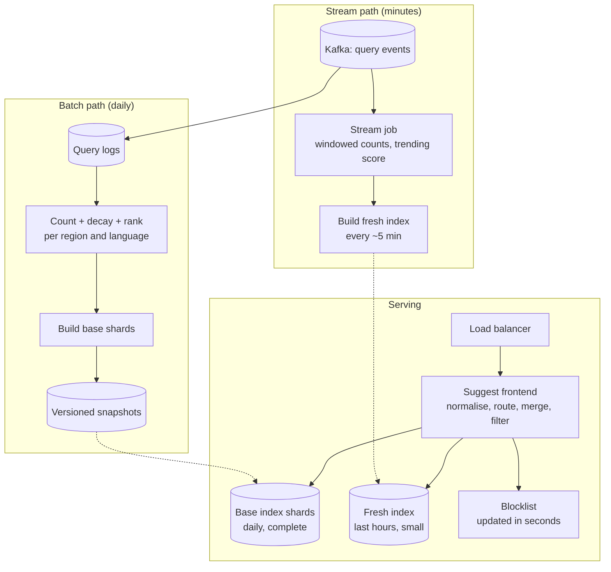

# Search Autocomplete — L5 (Senior) Interview

> **Level expectation:** the L4 split (offline build, in-memory serving) is assumed. Now the requirements push on it: **trending queries within minutes**, an index that **no longer fits on one machine**, **typo tolerance**, many **languages and regions**, and ranking beyond raw counts. You should combine a slow complete index with a fast small one, count streams with bounded memory, choose a sharding scheme that avoids hot spots, and ship new indexes safely. Read [L4-mid.md](L4-mid.md) first.

Legend: **🧑‍💼 Interviewer** · **🧑‍💻 Candidate** · **📝 Note** = commentary for you.

---

## 1. Requirements (sharpened)

Same as L4 (100M DAU, ~120k QPS peak, p99 ≤ 20 ms), plus:
- **Trending within ~10 minutes:** when a cricket final starts, "ind vs aus live score" must show up while it matters.
- **20 languages / 50 regions:** suggestions differ by language and country.
- **Typos:** "biriyani" should still find "biryani".
- **Bigger index:** with per-region variants, ~500M eligible queries.

---

## 2. Architecture

**🧑‍💻 Candidate:** This is a **lambda-style** design: a batch path that's complete and accurate but a day old, and a stream path that's recent but only covers what's hot. The frontend merges both per request.

💡 **Lambda architecture:** running a slow-but-complete batch pipeline and a fast-but-partial streaming pipeline side by side, and merging their outputs when serving.

---

## 3. Deep dives

### 3.1 When the index doesn't fit: how to shard

**🧑‍💻 Candidate:** 500M queries → roughly 5 × L4's size, plus per-region lists. Call it **~100–150 GB**: too much for comfortable replication on every server. Options ([sharding & replication](../../concepts/sharding-and-replication.md)):

| Scheme | How a prefix finds its shard | Problem |
|---|---|---|
| By first letter (`a…`, `b…`) | first character | Badly uneven: far more queries start with "s" or "c" than "x" or "q" |
| By prefix **range** with boundaries chosen from data (`a–an`, `ao–b`, …) | binary search over boundaries | Balanced by size, but traffic still clusters on popular ranges; boundaries need recomputing |
| **By hash of the full prefix** (store `prefix → top-k` as a key-value map) | `hash(prefix) % shards` (or [consistent hashing](../../concepts/consistent-hashing.md)) | Even spread of both data and traffic; loses the trie's shared structure (more memory per prefix) |

**My choice:** hash of the full prefix. Each request needs exactly one prefix's list, so one shard answers it; no trie walking across machines. The extra memory is acceptable, and **hot prefixes** ("a", "s", "how") are handled by the CDN and by a small **replicated "head" table** of the top ~100k prefixes that every frontend keeps in memory.

> 📝 **Note:** A nice consequence: since each prefix lives on exactly one shard, shards don't have to switch to a new index version at the same instant. A user typing "ho" then "hot" may hit two shards on different versions; each answer is still internally consistent.

### 3.2 Trending: a small fresh index next to the big one

**🧑‍💼 Interviewer:** How do you get a brand-new query into suggestions within 10 minutes?

**🧑‍💻 Candidate:** Don't rebuild the 150 GB index every 10 minutes. Build a **small fresh index** of only what's hot right now ([stream processing](../../technologies/stream-processing.md)):

1. A stream job reads query events from [Kafka](../../technologies/kafka.md), partitioned by query so each worker owns a set of queries.
2. It keeps **windowed counts**: e.g. counts per 5-minute bucket over the last few hours.
3. **Trending score** = how much more often a query is searched now than usual: `recent rate ÷ (baseline rate + smoothing)`. A query going from 10/hour to 50,000/hour scores very high; "facebook" (always huge) does not.
4. Every ~5 minutes, take the top ~100k queries by trending score (top-k with a heap) and build a small prefix index (tens of MB), publish it, and frontends swap it in.

**Merging at request time:** the frontend fetches the base list and the fresh list for the prefix and merges them by score: `final = base_score + boost × trending_score`, then takes the top 10. A trending query enters at the right position without the base index knowing it exists.

**Decay instead of windows**, alternatively: keep one number per query and on each event do `score = score × e^(−λ·Δt) + 1`. With a half-life of 1 hour, a burst fades by half every hour. One number per query, no buckets ([top-k & heavy hitters](../../concepts/top-k-and-heavy-hitters.md)).

### 3.3 Counting a stream without counting everything

**🧑‍💻 Candidate:** Most queries in the stream are typed once. Keeping an exact counter for every distinct query of the last few hours wastes memory on the long tail. Two standard tools:
- **Count-Min Sketch:** a small 2-D array of counters with several hash functions; estimates any query's count, never under-counting, over-counting by at most ε × total with probability 1 − δ. Size: width = ⌈e/ε⌉, depth = ⌈ln(1/δ)⌉. With ε = 0.0001 and δ = 0.01: width = ⌈2.718 ÷ 0.0001⌉ = 27,183, depth = ⌈ln 100⌉ = ⌈4.6⌉ = 5 → 27,183 × 5 × 4 bytes ≈ **544 KB**, regardless of how many distinct queries arrive.
- **Space-Saving / Misra-Gries:** keep exactly k counters for the candidate heavy hitters; when a new query arrives and all counters are taken, replace the smallest. Finds the frequent queries with guaranteed error bounds.

Pattern: sketch to **estimate** counts cheaply, plus a heap of size k to **remember** the current top candidates with their exact names.

### 3.4 Ranking beyond raw counts

| Signal | Why |
|---|---|
| Decayed popularity (base) | The backbone |
| Trending score (fresh) | Things happening now |
| Region and language match | "football" means different things in India, the UK and the US |
| **Result quality:** how often people click a result after this query | A popular query with no good results is a bad suggestion |
| Suggestion **acceptance rate** (shown → clicked) | Learns from the suggestions themselves |
| Query length / completeness | Prefer complete, well-formed queries over fragments |

Combine with a weighted score computed at build time, per region × language. Learned ranking models come later (L6); a weighted sum is a good start and easy to debug.

### 3.5 Typo tolerance

**🧑‍💻 Candidate:** Options, cheapest first:
1. **Only when needed:** if the exact prefix returns fewer than ~3 results, try fuzzy. Most requests never pay for it.
2. **Spelling variants precomputed:** map frequent misspellings to the right query at build time ("biriyani" → "biryani"), learned from logs where users typed X then immediately searched Y.
3. **Fuzzy traversal** of the trie allowing edit distance 1: at each character, also try skipping it, inserting one, or swapping it. 💡 **Edit distance** (Levenshtein) is the number of single-character inserts, deletes or substitutions needed to turn one string into another: "biriyani" → "biryani" is 1. The number of paths grows quickly with distance, so cap at 1 (2 for long prefixes).
4. Engines like [Elasticsearch](../../technologies/elasticsearch.md) offer fuzzy completion built in (using precompiled automata), if we use one.

### 3.6 Languages and normalisation

- **Unicode normalisation** (the same character can be encoded in more than one way) and case-folding, applied identically at build and query time.
- **Separate indexes per language** (and per region): smaller, and rankings don't mix.
- **Transliteration:** many Indian users type Hindi in Latin letters ("kal ka mausam"). Treat transliterated queries as their own entries; they're common enough to rank on their own counts.

### 3.7 Building and shipping 50 regional indexes daily

- Build per region × language in parallel; each output is a set of shard files plus a manifest (version, checksums, query count).
- **Sanity gates** before publishing: query count within ±20% of yesterday; a fixed list of "canary prefixes" must return expected top results; blocklist re-applied.
- Servers pull new shard files, load them, swap a reference; the previous version stays on disk for **instant rollback**.

---

## 4. Failure modes

| Failure | Behaviour | Mitigation |
|---|---|---|
| Daily build fails | Base index stays a day older | Keep serving yesterday's; alert; fresh index still adds trends |
| Stream job lags | Trending suggestions late | Alert on consumer lag; base index still works |
| A bad index slips through | Wrong or empty suggestions | Sanity gates, canary rollout, one-command rollback |
| Shard down | Prefixes on it return nothing | Replicas per shard; frontend fails open (empty list) |
| Hot prefix overload | One shard melts | CDN caching, replicated head table, more replicas for hot shards |
| Bot floods a query to make it trend | Manipulated suggestion | Count distinct users (not events), rate-limit per user, trending review thresholds |

---

## 5. Follow-ups

**🧑‍💼 Interviewer:** A celebrity's name suddenly trends with a defamatory phrase. How fast can you remove it?

**🧑‍💻 Candidate:** The serve-time blocklist is checked on every response and pushed to frontends within seconds (a small config, like a feature flag). The next base and fresh builds also exclude it. The removal path must not wait for a rebuild.

**🧑‍💼 Interviewer:** How would you measure whether suggestions are good?

**🧑‍💻 Candidate:** Acceptance rate (suggestion shown → chosen), **keystrokes saved** per search, and whether searches that started from a suggestion end in a click. Compare variants with A/B tests ([observability](../../concepts/observability.md) for the serving metrics: p99 latency, empty-result rate, cache hit rate).

---

## 6. What the interviewer was evaluating (L5)

- [ ] Lambda-style base + fresh indexes, merged per request
- [ ] Trending score as rate vs baseline (or exponential decay), not raw count
- [ ] Count-Min Sketch / Space-Saving with sizing arithmetic
- [ ] Sharding by hash of prefix (or justified alternative), and handling hot prefixes
- [ ] Ranking signals beyond counts
- [ ] Typo tolerance only when needed; edit distance; cost awareness
- [ ] Per-language/region indexes and normalisation
- [ ] Safe daily builds with gates, canaries, rollback; fast serve-time blocklist

## 7. Common mistakes at this level

| Mistake | Why it hurts at L5 |
|---|---|
| Rebuilding the whole index every few minutes for freshness | Huge cost; fragile; a small fresh index does the job |
| Trending = highest recent count | Always-popular queries dominate; nothing actually "trends" |
| Sharding by first letter | Massive skew between letters |
| Fuzzy matching on every request | Latency and CPU explode for little gain |
| Blocklist applied only at build time | Removing a harmful suggestion waits a day |
| Counting events instead of distinct users | One bot can manufacture a trend |

⬅️ Previous: [L4-mid.md](L4-mid.md) · ➡️ Next: [L6-staff.md](L6-staff.md)
