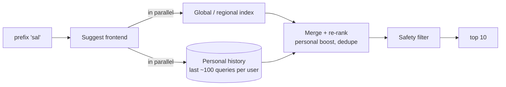

# Search Autocomplete — L6 (Staff) Interview

> **Level expectation:** the L5 machinery (base + fresh indexes, sharding, ranking, fuzzy) is known. The staff conversation is about **what "good" means and how to measure it**, personalisation without creepiness, the **safety, privacy and legal** side of putting words in millions of people's search boxes, **feedback loops**, global latency, cost, and build vs buy. Read [L5-senior.md](L5-senior.md) first.

Legend: **🧑‍💼 Interviewer** · **🧑‍💻 Candidate** · **📝 Note** = commentary for you.

---

## 1. Shape the problem: what are we optimising?

**🧑‍💼 Interviewer:** Leadership asks: "is autocomplete good?" How do you answer?

**🧑‍💻 Candidate:** Define it before building more:

| Metric | What it tells us | Guardrail or goal? |
|---|---|---|
| **Keystrokes saved** per search | The core user value | Goal |
| **Acceptance rate**: suggestion chosen ÷ suggestions shown | Are suggestions relevant? | Goal |
| **Downstream success**: searches from a suggestion that end in a result click | Are we steering people to *good* queries, not just popular ones? | Goal |
| p99 latency at the client, empty-result rate | Is it fast and present? | Guardrail |
| Harmful-suggestion reports, removal time | Is it safe? | Guardrail |

**Latency budget**, end to end, for a user in Chennai: typing gap ~150 ms is the deadline. Network round trip to a nearby region ~20–40 ms, CDN hit ~10 ms, server work ~5 ms, rendering ~10 ms. The network dominates, so **where** we serve matters more than how fast the trie is (§5).

> 📝 **Note:** Turning "make it better" into a short list of goals plus guardrails is the staff move. Without guardrails, a team optimising acceptance rate will happily suggest clickbait.

---

## 2. Personalisation

**🧑‍💻 Candidate:** Users re-search their own things constantly ("salary slip portal", their colleague's name in the internal directory). Personal history is the strongest single signal for them.

- **Store:** last ~100 queries per signed-in user with timestamps, in a key-value store keyed by user ([Redis](../../technologies/redis.md) for hot users, [Cassandra](../../technologies/cassandra.md) behind it). Prefix-match 100 strings in memory: microseconds.
- **Budget:** fetch personal and global **in parallel** with a strict timeout (~10 ms); if personal is slow, serve global only. Personalisation must never make suggestions slower or less available.
- **Privacy:** visible "remove from history", respect incognito/private modes, never use one user's history in another user's suggestions, and keep history on device where the product allows it (the app can do the personal merge locally).
- **Shared devices:** a family laptop shows one person's searches to another. Offer per-profile history and a clear switch-off.

---

## 3. Safety, privacy and legal

**🧑‍💼 Interviewer:** Why is this harder than "add a blocklist"?

**🧑‍💻 Candidate:** Because the system **speaks on the company's behalf**: a suggestion looks like the product saying it.

| Risk | Example | Defence |
|---|---|---|
| **Privacy leak** | A rare query with a private person's name and a medical condition | Minimum **distinct users** (k-anonymity threshold) before a query is eligible; higher thresholds for queries containing names |
| **Defamation** | "[person] is a fraud" becomes popular | Classifiers for person-name + negative-claim patterns; fast removal path; legal escalation |
| **Sensitive categories** | Elections, health, religion, self-harm | Policy per category (e.g. no predictive completions about candidates; helpline results for self-harm) |
| **Manipulation** | Click farms and bots typing a brand name + "scam", or "autocomplete SEO" | Count distinct real users, discount new/suspicious accounts, human review before a brand-new query trends |
| **Legal requests** | Court orders, data-protection removal requests (e.g. the EU's "right to be forgotten") | A removals system with audit log, per-country scope, and SLA |

**Operationally:** a serve-time blocklist that propagates in seconds (L5), a **review queue** for the fresh/trending index above a threshold, a "report this suggestion" button, and an **audit log** of every removal (who, why, when, which countries). These are product and legal processes; the system must make them fast and traceable.

> 📝 **Note:** The k-anonymity threshold is the most elegant safety mechanism here: it's one number in the build job, and it removes a whole class of privacy incidents.

---

## 4. Feedback loops and experimentation

**🧑‍💻 Candidate:** Suggestions change what people search, and what people search becomes tomorrow's suggestions. That loop has consequences:
- **Rich get richer:** the top suggestion gets clicked because it's on top, gains counts, stays on top. New, better queries struggle to break in.
- **Fix:** count queries that were **typed in full** separately from ones **accepted from a suggestion**, and weight accepted ones less (or use position-debiased click models). Occasionally explore: show a lower-ranked candidate in a small share of traffic to learn its true acceptance rate.

**Experiments:** every ranking change ships behind an A/B test on the goal metrics, with guardrails (latency, empty-result rate, report rate). Offline evaluation first: replay held-out search logs and check whether the query the user eventually searched appeared in the top 10 after k keystrokes (and at which position: **MRR**, mean reciprocal rank, rewards finding it near the top).

💡 **MRR:** for each test case, 1 ÷ (position of the right answer), averaged. Position 1 → 1.0, position 2 → 0.5, not shown → 0.

---

## 5. Global serving and cost

**Where to serve:** run suggest frontends and index replicas in every major region; send users to the nearest with GeoDNS or anycast ([DNS](../../technologies/dns.md)). Push the **head** (top ~100k prefixes per region, a few MB) to the **CDN edge**: a large share of requests never reach a region at all.

**Cost arithmetic** (rough): base index ~150 GB × 3 replicas per shard group = ~450 GB of RAM per region. Across 6 regions: 450 × 6 = **~2.7 TB of RAM**. At, say, 512 GB usable per large server, that's 2.7 TB ÷ 512 GB ≈ 6 servers' worth of memory (more in practice for CPU, headroom and failure domains). Memory, not CPU, is the bill. Levers:
- Serve **region-specific** indexes only in their region (the Brazil-Portuguese index doesn't need replicas in Mumbai).
- **Compress** the structure: finite-state transducers (an automaton that shares both prefixes and suffixes, used by Lucene) are far smaller than a pointer-based trie ([tries & prefix search](../../concepts/tries-and-prefix-search.md)).
- Drop the long tail: prefixes deeper than ~20 characters rarely get requests; fall back to the parent node's list.

---

## 6. Build vs buy

| Option | When |
|---|---|
| **[Elasticsearch](../../technologies/elasticsearch.md) / OpenSearch** completion suggester or search-as-you-type (built on an [inverted index](../../concepts/inverted-index.md): a map from each word, or word prefix, to the documents containing it) | Completing a catalogue (products, documents, people) with filters and typo tolerance; a team that already runs it |
| **Hosted search** (Algolia, Typesense Cloud, similar) | Small/medium catalogues, fast time-to-market, predictable per-request pricing |
| **Custom in-memory service** (this design) | Web-scale query completion with custom ranking, freshness and safety pipelines |
| **Database `LIKE` / trigram index** | Internal tools with small data and low QPS: perfectly fine there |

**🧑‍💻 Candidate:** Most products complete a **catalogue**, not query logs, and should start with their search engine's suggester. The custom build pays off only when query-log completion at huge scale is a core product, where ranking, freshness and safety need full control.

---

## 7. Curveballs

**🧑‍💼 Interviewer:** After a ranking change, acceptance rate went up 8% but downstream success went down.

**🧑‍💻 Candidate:** We're suggesting things people click but don't want: likely shorter, catchier, or more sensational queries. Roll back or reweight with result-quality signals. This is exactly why downstream success is a goal metric and not just acceptance.

**🧑‍💼 Interviewer:** A regulator in one country requires removing a suggestion there but not elsewhere.

**🧑‍💻 Candidate:** Removals are scoped: the blocklist entry carries a country list, checked at serve time against the request's region. The audit log records the legal basis. Builds for that country exclude it too.

**🧑‍💼 Interviewer:** The fresh index starts suggesting a query nobody has heard of, at huge volume, at 3 a.m.

**🧑‍💻 Candidate:** Classic manipulation shape: sudden volume from few distinct users or new accounts. Distinct-user counting and new-account discounting should block it; anything that passes still waits in the review queue if it's above the trending threshold and matches sensitive patterns. On-call gets an alert on unusual trending volume, like any other anomaly.

---

## 8. What the interviewer was evaluating (L6)

- [ ] Defined goal metrics and guardrails; latency budget dominated by network
- [ ] Personalisation in parallel with strict timeout; privacy controls
- [ ] Safety as a product + legal system: k-anonymity, defamation, sensitive categories, manipulation, scoped removals, audit
- [ ] Feedback-loop awareness; debiasing; offline MRR and online A/B testing
- [ ] Global serving with edge caching of head prefixes; memory cost arithmetic and levers
- [ ] Build vs buy, recognising most products complete catalogues

## 9. Common mistakes at this level

| Mistake | Why it hurts at L6 |
|---|---|
| Optimising acceptance rate alone | Clickbait suggestions; worse searches |
| Personalisation on the critical path without a timeout | One slow store makes every keystroke slow |
| Safety as an afterthought blocklist | Privacy leaks and defamation are company-level incidents |
| Ignoring the feedback loop | Top suggestions entrench themselves forever |
| Same index replicated to every region | Memory bill multiplied for no benefit |
| Building custom completion for a product catalogue | Months of work an off-the-shelf suggester already does |

⬅️ Previous: [L5-senior.md](L5-senior.md) · 🏠 [Problem overview](README.md)
