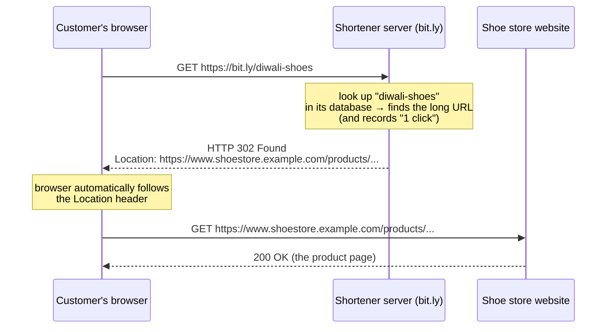

# Start Here: What Is a URL Shortener? (Before the Interview)

> You can't design something you've never used. This page makes you a **user** of a URL shortener first. Every feature mentioned in the interviews (custom alias, expiry, analytics, 302 redirects…) is explained here through a real situation where someone needs it.
>
> Time: ~15 minutes. Then go to the interviews: [L4](L4-mid.md) → [L5](L5-senior.md) → [L6](L6-staff.md).

---

## 1. The problem, as a story

Meet **Priya**, who runs marketing for a small online shoe store. She wants to share this product page:

```
https://www.shoestore.example.com/products/men/running/ultraboost-22?color=black&size=10&utm_source=instagram&utm_medium=social&utm_campaign=diwali_sale_2026
```

That's ~190 characters. Watch what goes wrong with it:

| Where Priya shares it | What goes wrong with the long link |
|---|---|
| **SMS** to customers | One SMS holds 160 characters. The link alone doesn't fit, so the message splits into 2–3 SMS and she pays for each. |
| **Printed poster** in a mall | Nobody is going to *type* 190 characters from a poster. |
| **Instagram/Twitter post** | Eats most of the character limit, and looks ugly/spammy. |
| **Radio ad** | "Visit h-t-t-p-s colon slash slash w-w-w dot…" Impossible to say. |
| **Email** | Long links sometimes wrap onto two lines and break when clicked. |
| **Her boss asks:** "how many people clicked the Instagram link vs the SMS one?" | A normal link gives her no idea. |

So she goes to a URL shortener (bit.ly, tinyurl.com…), pastes the long link, and gets:

```
https://bit.ly/3xK9aQ2
```

22 characters. Fits in an SMS, easy to put in a post, and when anyone opens it they land on the exact same long page. That's the **whole core product**.

> 💡 **Short URL** = a short web address whose only job is to send you to a long one. The random-looking part at the end (`3xK9aQ2`) is called the **short code** (or **slug**, or **key**). It is the ID of the link.

---

## 2. You've already used these, probably without noticing

| Where | What you saw | Why they use it |
|---|---|---|
| **YouTube** "Share" button | `youtu.be/dQw4w9WgXcQ` | Shorter, branded links |
| **Amazon** app "Share" | `amzn.to/3AbCdEf` / `amzn.in/d/...` | Short, and Amazon knows which shares lead to purchases |
| **Twitter/X** | Every link you post becomes `t.co/...` | Twitter checks links for malware *when clicked*, and counts clicks |
| **Bank / delivery SMS** | "Track your order: `bit.ly/...`" | SMS length limits + click tracking |
| **QR codes** on restaurant menus, posters | QR usually encodes a short link | A shorter URL → simpler QR code that scans more reliably, and the business can change where it points later |
| **At work (big tech companies)** | `go/oncall`, `go/runbook-db` | Internal shortener ("go links"): human-readable names for long wiki/dashboard URLs. If your infra team has a `go/` link for Grafana dashboards, that's this. |

**So a URL shortener isn't just "make it short". People use it to:**
1. **Make it fit**: SMS, tweets, QR codes.
2. **Make it memorable / sayable**: posters, radio, presentations.
3. **Measure**: who clicked, when, from where.
4. **Control**: change or disable where a link goes *after* sharing it.

---

## 3. Experience the features (this is where the interview terms come from)

### 3.1 Generated short code (the default)
Priya pastes the long URL and clicks "Shorten". The service **invents** a code: `bit.ly/3xK9aQ2`.
- She doesn't care what the code is. It just needs to be **short** and **never the same as anyone else's code** (otherwise her customers would land on someone else's page!).
- 👉 In the interview this becomes the hardest technical question: *how do you generate billions of short, unique codes quickly?*

### 3.2 Custom alias: "I want to choose the name"
For the poster, `bit.ly/3xK9aQ2` is hard to remember and easy to mistype (is that a capital `K`? a zero or an `O`?). So Priya types her own ending:

```
bit.ly/diwali-shoes
```

That's a **custom alias**: the user picks the code instead of the system generating it.

| Why people want it | Example |
|---|---|
| Easy to remember and type | `bit.ly/diwali-shoes` on a poster |
| Easy to say out loud | Radio: "go to bit dot l y slash diwali shoes" |
| Looks trustworthy (you can guess where it goes) | `bit.ly/acme-careers` vs `bit.ly/x7Qp2` |
| Branding | `go/oncall` at your company |

**The catch:** only **one** person in the whole world can own `diwali-shoes`. If another store tries to take it, they must get an error: "*this alias is taken*" (HTTP `409 Conflict`, the status code a server returns when your request clashes with existing data).
- 👉 In the interview: *how do you guarantee two people can't grab the same alias at the same moment?* (Uniqueness, race conditions, DB constraints.)

### 3.3 Expiry: "this link should stop working later"
Priya's Diwali sale ends on 15 November. After that, the link should stop sending people to a sale page that no longer exists. She sets **expires on: 15 Nov**.

After that date, clicking the link shows "*This link has expired*" (HTTP `410 Gone`, a status code meaning "this existed but is deliberately gone") instead of the page.

| Why people want it | Example |
|---|---|
| Limited-time offers | Sale links, event registrations |
| Security | A link to a shared document that should only work for 7 days |
| Cleanup | Free-tier links that nobody has clicked in 2 years |

- 👉 In the interview: *how do you delete billions of expired links efficiently, and make sure an expired link is never served from a cache (a fast in-memory copy of recently used data)?*

### 3.4 Analytics: "how many people clicked?"
Priya creates **three different short links to the same product page**:

```
bit.ly/diwali-sms    → same product page
bit.ly/diwali-insta  → same product page
bit.ly/diwali-poster → same product page
```

A week later her dashboard shows:

```
diwali-sms     ████████████████████  4,210 clicks   (mostly mobile, 7–9 pm)
diwali-insta   ██████                1,150 clicks   (mostly Mumbai, Delhi)
diwali-poster  ██                      380 clicks
```

Now she knows SMS works best, and her boss gets the answer. **This is why businesses pay for URL shorteners.** Shortening is free; *analytics* is the product.

- 👉 In the interview: *how do you record every click without slowing down the redirect?* (Async processing, i.e. doing the slow work later in the background; Kafka, a message log that buffers events between services.) And it's the reason for the **302 vs 301** question below.

### 3.5 Edit / disable a link
Priya printed 5,000 posters with `bit.ly/diwali-shoes`, then noticed the product page URL had a typo. With a normal link, she'd reprint everything. With a short link, she just **changes where it points**, and every poster is fixed instantly.

Same idea in reverse: if someone uses the service to spread a **phishing** link ("Your bank account is locked, click bit.ly/xyz"), the service must be able to **disable** that link immediately.

- 👉 In the interview: *how fast can a change reach every server and cache worldwide?* And: *abuse prevention* (stopping bad actors, such as phishers, from using the service).

---

## 4. What actually happens when someone clicks a short link

This is the one technical idea you need before the interview: the **HTTP redirect**.



The customer never sees the shortener's response. It takes a few milliseconds and the browser immediately jumps to the real page. From the customer's point of view, "the short link opened the shoe page".

What the shortener sends back is tiny. Just a status code and one header:

```http
HTTP/1.1 302 Found
Location: https://www.shoestore.example.com/products/men/running/ultraboost-22?color=black&size=10
```

### 301 vs 302: why the interviews keep asking about it
Both are "redirect" status codes. The difference is **what the browser remembers**:

| | **301 Moved Permanently** | **302 Found** (temporary) |
|---|---|---|
| Browser's thinking | "This link will *always* go there. I'll remember it and skip the shortener next time." | "This might change. I'll ask the shortener every time." |
| 2nd click by the same person | Goes **directly** to the store, never reaches bit.ly | Goes through bit.ly again |
| Click counting | ❌ Repeat clicks are invisible | ✅ Every click is counted |
| Edit / disable the link later | ❌ Browsers that cached it keep going to the old page | ✅ Takes effect on the next click |
| Load on the shortener | Lower | Higher |

Since analytics and editing/disabling are the business (section 3), most shorteners use **302**.

---

## 5. Try it on a real URL shortener (5 minutes)

You don't need to build anything. Use a free public shortener and watch it work:

1. Go to **https://tinyurl.com** (no account needed) or **https://bitly.com** (free account).
2. Paste any long link, e.g. a Wikipedia article, and click shorten. You get your **generated short code**.
3. On TinyURL, try the optional *alias* field: pick a name like `my-test-link-2026`. Then try a very common word like `test`. It will say it's taken. That's the **custom alias uniqueness** problem.
4. Open the short link in your browser. Watch the address bar: it starts at the short link and ends on the real page. That's the **redirect**.
5. Want to see the redirect itself? In a terminal:
   ```sh
   curl -sI https://tinyurl.com/<your-code>
   ```
   `-I` asks only for headers, so curl shows you the redirect instead of following it. You'll see a `3xx` status line and a `Location:` header with your long URL. **That single response is the entire product you'll design.** Check which status code it uses (301 or 302) and think about what that means for click counting.
6. On Bitly's free dashboard, click your link a few times from your phone and laptop, then look at the **click stats** (count, device, location). That's the **analytics** feature, and the reason Bitly is a business.

### What a naive version would get wrong

Imagine the simplest possible version: one server process, links kept in a `HashMap`, codes `1, 2, 3…` from a counter. It would "work" on your laptop. Here's why the interview exists:

| Naive choice | What goes wrong | Interview topic |
|---|---|---|
| Links stored in memory (`HashMap`) | Server restarts → every link ever shared is broken | Durable **database** (data survives restarts because it is written to disk) |
| One server | It crashes → links printed on posters stop working | **Replicas** (extra copies of the server/data), **load balancer** (spreads requests across servers) |
| Counter `1, 2, 3…` inside that one server | Add a second server → both hand out code `1` for different URLs | **Unique ID generation across servers** |
| Codes are `1, 2, 3` | Anyone can try `/4`, `/5`… and see other people's private links | **Non-guessable codes** |
| Handles 10 requests/second | Millions of clicks when a link goes viral | **Caching, scaling, estimates** (back-of-the-envelope maths for traffic and storage) |
| Count the click inside the redirect | A slow analytics write slows every click | **Async analytics (Kafka)** |

---

## 6. From experience to requirements

When the interviewer says "design a URL shortener", this is how the product turns into a requirements list. This is exactly what the candidate does in section 1 of every interview file:

| What a user experiences | Requirement | Type |
|---|---|---|
| Paste long link → get short link | `shorten(longUrl) → shortUrl` | Functional |
| Click short link → land on page | Redirect `GET /{code}` | Functional |
| Choose `diwali-shoes` | Custom alias, globally unique | Functional |
| Link stops working after the sale | Expiry | Functional |
| "How many clicked?" | Click analytics | Functional |
| Click feels instant | Redirect latency (time to answer the click) < ~50–100 ms | Non-functional |
| Posters printed with the link must work for years | **High availability** (stays up) **+ durability** (never lose a link) | Non-functional |
| My link never opens someone else's page | Codes are **unique** | Non-functional (correctness) |
| Nobody can guess my private links | Codes are **not predictable** | Non-functional (security) |
| Way more clicks than new links | **Read-heavy** (~100 reads : 1 write) | Shapes the whole design |

---

## 7. Mini glossary

| Term | Meaning in plain words |
|---|---|
| **Long URL / destination** | The original page address |
| **Short code / slug / key** | The part after the domain: `3xK9aQ2` or `diwali-shoes` |
| **Custom alias** | A short code the *user* chose instead of the system generating it |
| **Redirect** | Server reply that says "not here, go to this other address" |
| **301 / 302** | Permanent (browser remembers) vs temporary (browser asks every time) redirect |
| **410 Gone** | "This existed but was deliberately removed/expired" (vs `404`, never existed) |
| **409 Conflict** | "Can't do that, it clashes with something existing" (alias taken) |
| **Click / hit** | One time someone opened the short link |
| **Read-heavy** | Far more reads (clicks) than writes (new links), so optimise reading |
| **Base62** | Writing numbers using 62 characters (`0-9 a-z A-Z`) so they're shorter. Explained in [ID generation](../../concepts/id-generation.md) |

➡️ **Now you're a user. Next, design it:** [L4-mid.md](L4-mid.md)
