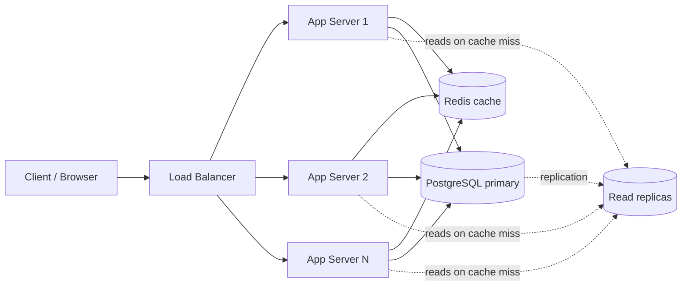
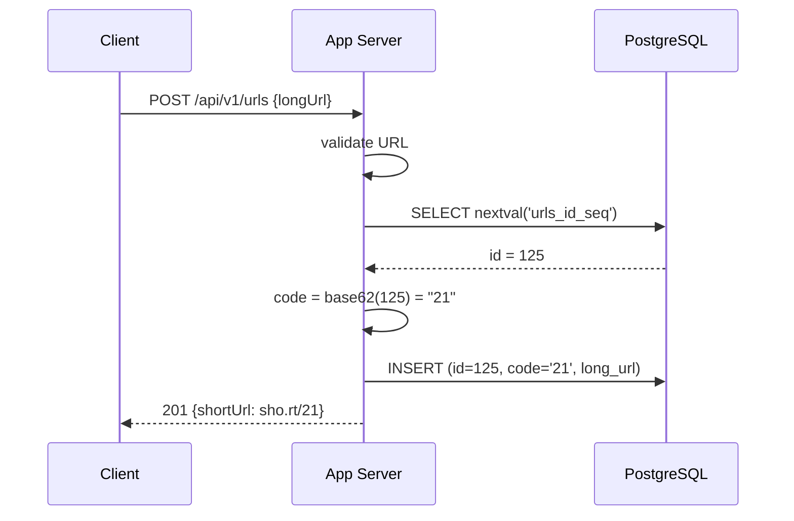
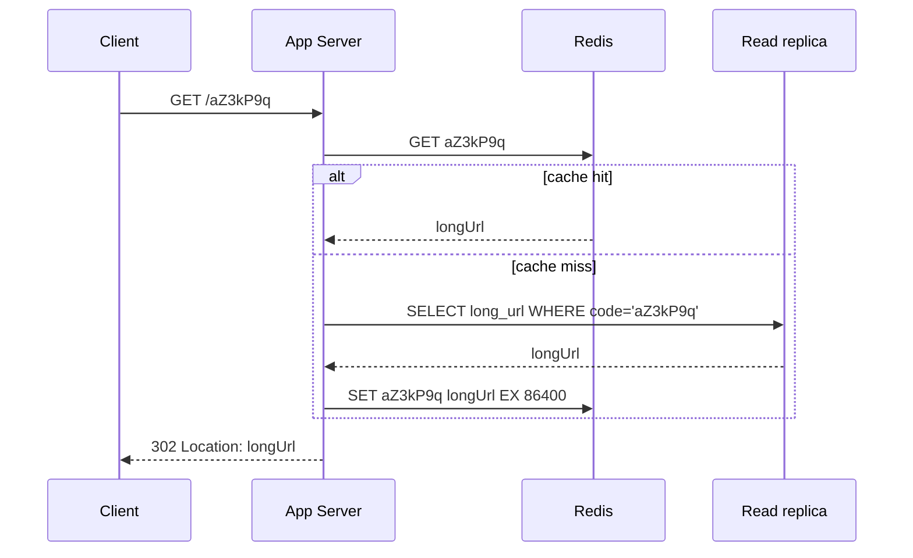

# URL Shortener — L4 (Mid-level / SDE2) Interview

> **Level expectation:** produce a correct, complete, *working* design in ~40 minutes. You are not expected to discover every edge case alone, but you should handle them well when the interviewer raises them. Clarity beats cleverness.

Legend: **🧑‍💼 Interviewer** · **🧑‍💻 Candidate** · **📝 Note** = commentary for you, not said in the interview.

---

## 1. Clarifying requirements

**🧑‍💼 Interviewer:** Let's design a URL shortening service, like bit.ly.

**🧑‍💻 Candidate:** Sure. Before I start, a few questions so I build the right thing.
- The core flow is: user submits a long URL → gets a short URL. Anyone opening the short URL is redirected to the long one. Correct?
- Can users choose a custom alias, like `sho.rt/my-resume`?
- Do links expire?
- Do we need click analytics?
- Do users need accounts, or is it anonymous?

**🧑‍💼 Interviewer:** Core flow yes. Custom alias — nice to have. Expiry — optional, with a default of never. Analytics — just a click count for now. Assume anonymous use.

**🧑‍💻 Candidate:** Got it. So, functional requirements:

1. `shorten(longUrl) → shortUrl`
2. `GET /{code}` redirects to the long URL
3. *(nice to have)* custom alias, optional expiry, click count

Non-functional:

1. **Redirects must be fast** — say under ~100 ms — because it sits between the user and the page they wanted.
2. **Highly available** — if redirects break, every link anyone has ever shared breaks.
3. **Short codes must be unique** — two different long URLs must never get the same code.
4. Short codes shouldn't be trivially guessable (nice to have).

> 📝 **Note:** Separating functional ("what it does") from non-functional ("how well it does it") is the single most visible signal of structure at L4. Spend ~3–5 minutes here, not 10.

---

## 2. Back-of-the-envelope estimates

**🧑‍💼 Interviewer:** What scale should we design for?

**🧑‍💻 Candidate:** Let me assume **100 million new URLs per month**, and since people click links far more often than they create them, a **100:1 read:write ratio**. (Full method: [back-of-the-envelope](../../concepts/back-of-the-envelope.md).)

| What | Calculation | Result |
|---|---|---|
| Seconds per month | 30 × 86,400 ≈ 2.6M | ~2.5 × 10⁶ s |
| Write QPS | 100M / 2.5M | **~40 writes/s** (peak ×2–3 ≈ 100/s) |
| Read QPS | 40 × 100 | **~4,000 reads/s** (peak ≈ 10k/s) |
| URLs over 5 years | 100M × 12 × 5 | **6 billion** |
| Storage per URL | long URL ~100 B + code + timestamps + overhead → round up | ~500 B |
| Total storage | 6B × 500 B | **~3 TB** |

**🧑‍💻 Candidate:** Takeaways: writes are tiny; reads are moderate; 3 TB is large for one machine but not crazy. **The system is read-heavy, so caching will matter most.**

> 📝 **Note:** At L4 the interviewer mostly checks that you *can* do this and that you draw a conclusion ("read-heavy → cache"). Round aggressively.

### How long should the code be?

**🧑‍💻 Candidate:** Using characters `[a-z A-Z 0-9]` = 62 characters ("Base62"):

- 62⁶ ≈ 56 billion
- 62⁷ ≈ 3.5 trillion

We need 6 billion, so 6 characters already work, but **7 gives huge headroom** for almost no cost. I'll use 7.

---

## 3. API

**🧑‍💻 Candidate:**

```http
POST /api/v1/urls
Content-Type: application/json

{ "longUrl": "https://example.com/some/very/long/path", "customAlias": "my-resume", "expiresAt": null }

→ 201 Created
{ "shortUrl": "https://sho.rt/aZ3kP9q", "code": "aZ3kP9q" }
```

```http
GET /{code}
→ 302 Found
Location: https://example.com/some/very/long/path
```

```http
GET /api/v1/urls/{code}/stats
→ 200 OK  { "clicks": 1234 }
```

Errors: `400` invalid URL, `409` alias already taken, `404` unknown code, `410 Gone` expired code.

**🧑‍💼 Interviewer:** Why 302 and not 301?

**🧑‍💻 Candidate:**
- **301 Moved Permanently** — the browser *caches* the redirect. The next click never reaches us. Less load, but we lose click counts and can't change or expire the link.
- **302 Found** (temporary) — the browser asks us every time. More load, but we see every click.

Since we need click counts, **302**. If we didn't care about analytics, 301 would save a lot of traffic.

> 📝 **Note:** This is one of the most commonly asked follow-ups for this problem. Know it cold.

---

## 4. High-level design



**🧑‍💻 Candidate:** Components:

- **[Load balancer](../../technologies/load-balancer.md)** — spreads traffic across app servers and removes unhealthy ones.
- **App servers** — *stateless*, so we can add more behind the LB when traffic grows. All state lives in the DB/cache.
- **[PostgreSQL](../../technologies/postgresql.md)** — the source of truth. Primary takes writes; read replicas take reads.
- **[Redis](../../technologies/redis.md)** — cache of `code → longUrl` for the redirect path.

### Data model

```sql
CREATE TABLE urls (
    id          BIGSERIAL PRIMARY KEY,
    code        VARCHAR(16) NOT NULL UNIQUE,
    long_url    TEXT        NOT NULL,
    created_at  TIMESTAMPTZ NOT NULL DEFAULT now(),
    expires_at  TIMESTAMPTZ NULL,
    click_count BIGINT      NOT NULL DEFAULT 0
);
```

The `UNIQUE` index on `code` is what makes lookups fast (B-tree index) and also guarantees no duplicates.

### Write flow (shorten)



Getting the ID from the sequence *first* means we can compute the code and do a single `INSERT`, instead of inserting, then updating the row with its code.

### Read flow (redirect)



This read pattern is called **cache-aside** — the app checks the cache, falls back to the DB, then fills the cache. See [caching strategies](../../concepts/caching-strategies.md).

---

## 5. Deep dive: generating the short code

**🧑‍💼 Interviewer:** Walk me through how you generate the code. What are the options?

**🧑‍💻 Candidate:** Two main options (more in [ID generation](../../concepts/id-generation.md)):

**Option A — Hash the URL.** `MD5(longUrl)` → take the first 7 Base62 characters.
- ✅ Same long URL always gives the same code (natural dedup).
- ❌ Truncating a hash means **collisions are possible**. We'd have to check the DB, and on collision, append something and re-hash. Extra round trips.

**Option B — Counter + Base62 encoding.** Use the DB's auto-increment `id`, convert it to Base62.
- ✅ **No collisions ever** — every ID is unique by definition.
- ✅ Simple.
- ❌ Codes are sequential, so someone can guess `…21`, `…22`, `…23` and scrape all links.
- ❌ One DB generates all IDs.

I'll go with **Option B** — it's simplest and correct. Base62 is just converting a number to base 62, like converting to hex but with 62 digits:

```java
private static final String ALPHABET =
    "0123456789abcdefghijklmnopqrstuvwxyzABCDEFGHIJKLMNOPQRSTUVWXYZ";

static String toBase62(long n) {
    if (n == 0) return "0";
    StringBuilder sb = new StringBuilder();
    while (n > 0) {
        sb.append(ALPHABET.charAt((int) (n % 62)));
        n /= 62;
    }
    return sb.reverse().toString();
}
// toBase62(125) -> "21"   (2*62 + 1 = 125)
```

**🧑‍💼 Interviewer:** You said sequential codes are guessable. Does that matter?

**🧑‍💻 Candidate:** It can — people shorten private Google Docs links assuming nobody can find them. A cheap fix: start the counter at a large number so codes are 7 characters, and **shuffle the bits** of the ID with a fixed reversible function (or encrypt the ID with a small block cipher) before Base62. Codes look random but remain unique because the function is one-to-one.

> 📝 **Note:** At L4, recognising the trade-off is enough. The full bit-shuffling scheme is an L5+ detail.

### Custom alias

**🧑‍💻 Candidate:** If a custom alias is given, we skip generation and `INSERT` with `code = alias`. The `UNIQUE` constraint rejects duplicates atomically — we catch the violation and return `409 Conflict`. **Don't** do "SELECT to check, then INSERT" — two users could both pass the check at the same time (a race condition).

---

## 6. Deep dive: caching

**🧑‍💼 Interviewer:** How big should the cache be?

**🧑‍💻 Candidate:** Reads per day ≈ 4,000 × 86,400 ≈ 350M. Popularity is skewed — roughly 20% of links get 80% of clicks. If we cache 20% of a day's requests: 0.2 × 350M × 500 B ≈ **35 GB**. That fits in one Redis node with a replica. Use the **LRU eviction policy** so popular links stay, old ones fall out, and a **TTL** (e.g. 24 h) so the cache doesn't hold stale data forever.

**🧑‍💼 Interviewer:** What if Redis goes down?

**🧑‍💻 Candidate:** Redirects still work — they just fall through to the DB, which is slower. Redis is a cache, not the source of truth. We should have a Redis replica for failover and make sure the read replicas can absorb a spike for a few minutes.

---

## 7. Follow-ups

**🧑‍💼 Interviewer:** How do you count clicks?

**🧑‍💻 Candidate:** Simplest: `UPDATE urls SET click_count = click_count + 1` on each redirect. But at 4,000 reads/s that's 4,000 writes/s on hot rows — row locks on popular links. Better: `INCR clicks:{code}` in Redis (fast, atomic), and a background job flushes counts to the DB every minute. We might lose up to a minute of counts if Redis crashes, which is fine for a click counter.

**🧑‍💼 Interviewer:** How do expired links get handled?

**🧑‍💻 Candidate:** On redirect, check `expires_at` — if past, return `410 Gone`. Set the Redis TTL to no later than the expiry. A nightly job deletes expired rows in batches.

**🧑‍💼 Interviewer:** The same long URL submitted twice — same short code?

**🧑‍💻 Candidate:** With the counter approach, no — each submission gets a new code. That's actually fine and simpler: different users may want separate stats. If we wanted dedup, we'd add an index on a hash of `long_url` and look it up first.

**🧑‍💼 Interviewer:** What happens when 3 TB doesn't fit on one Postgres?

**🧑‍💻 Candidate:** We'd shard by `code` — hash the code to pick a shard. But honestly, at 3 TB over 5 years, a single large Postgres instance with read replicas can carry us for a long time, and sharding brings a lot of operational pain, so I'd delay it. (See [sharding & replication](../../concepts/sharding-and-replication.md).)

---

## 8. What the interviewer was evaluating (L4)

- [ ] Asked clarifying questions, split functional / non-functional
- [ ] Did rough estimates and drew a conclusion ("read-heavy")
- [ ] Clean REST API with correct status codes; knows 301 vs 302
- [ ] Stateless app tier behind a load balancer
- [ ] A working code-generation scheme with its trade-off stated
- [ ] Used a cache on the read path and knows it's not the source of truth
- [ ] Used DB constraints (UNIQUE) instead of check-then-insert
- [ ] Handled follow-ups calmly and correctly

## 9. Common mistakes at this level

| Mistake | Why it hurts |
|---|---|
| Jumping straight to drawing boxes | Looks like you'd build the wrong thing at work too |
| "I'll use Kafka, Cassandra, Kubernetes, microservices…" for 40 writes/s | Signals buzzword-driven design. Every component needs a reason. |
| Hash + truncate without mentioning collisions | Correctness bug in the core feature |
| Check-then-insert for custom aliases | Race condition |
| Updating click count synchronously in the DB on every redirect | Turns the read path into a write path; hot-row contention |
| Making the cache the source of truth | Redis restart = all links lost |
| Spending 15 minutes on estimation | Leaves no time for the design |

➡️ Next: [L5-senior.md](L5-senior.md) — same problem, senior-level depth.
