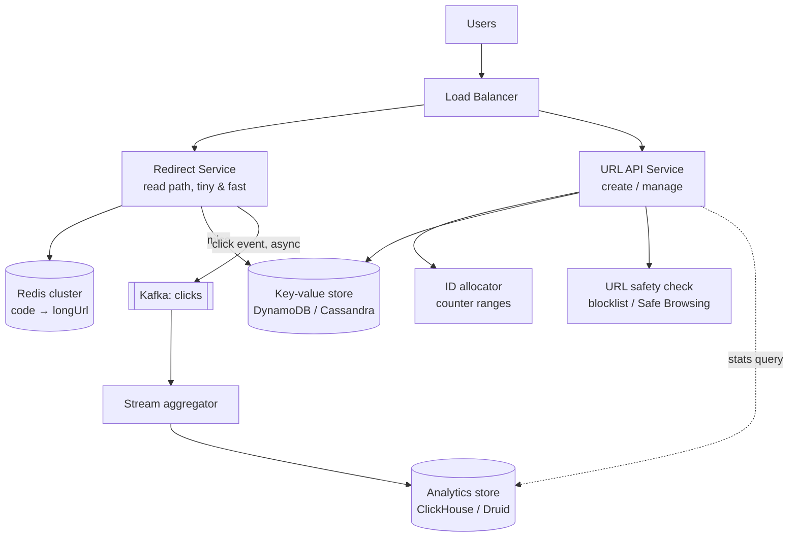
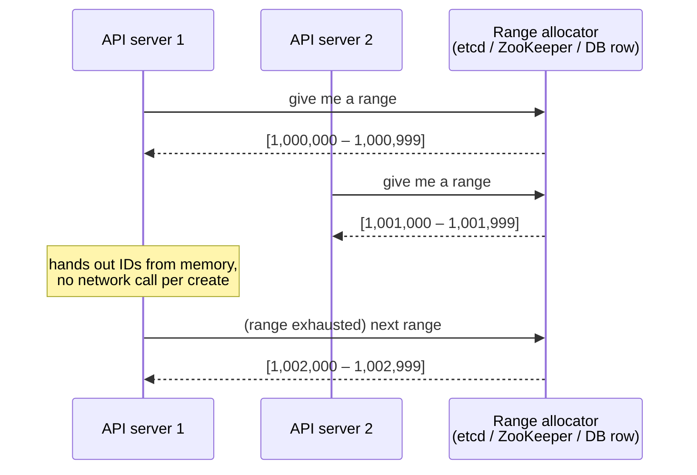
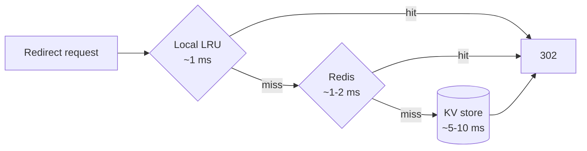

# URL Shortener — L5 (Senior) Interview

> **Level expectation:** you *drive* the interview. Every major choice is backed by a number or a trade-off. You compare 2–3 options for each hard part and commit to one. You raise failure modes, abuse, and operational concerns **before** the interviewer asks. Read [L4-mid.md](L4-mid.md) first — this file focuses on what's *different*.

Legend: **🧑‍💼 Interviewer** · **🧑‍💻 Candidate** · **📝 Note** = commentary for you.

---

## 1. Clarifying requirements

**🧑‍💼 Interviewer:** Design a URL shortener.

**🧑‍💻 Candidate:** Let me scope it. I'll propose requirements and you correct me.

**Functional**
1. Create short URL (generated code or custom alias), optional expiry.
2. Redirect `GET /{code}`.
3. Basic analytics: click counts over time, maybe referrer/country.
4. Users with accounts can list/delete their links. *(I'll keep this light.)*

**Non-functional — with numbers**
| Property | Target | Why |
|---|---|---|
| Redirect latency | p99 < 50 ms server-side | It's in the critical path of every click |
| Redirect availability | 99.99% | A broken redirect breaks links printed on posters, in emails, everywhere |
| Create availability | 99.9% | Users can retry; less critical |
| Consistency | Created link usable within ~1 s globally; **code uniqueness is strict** | Eventual consistency is fine for reads, never for uniqueness |
| Durability | A created link must never be lost | Losing links is the worst failure for this product |

**🧑‍💻 Candidate:** Also — is this a public service (bit.ly) or internal? Public means **abuse** (phishing, spam) is a real requirement.

**🧑‍💼 Interviewer:** Public. Go with your numbers.

> 📝 **Note:** Senior signal #1: **different SLOs for different paths**. Redirect and create are not equally important, and you designed for that from minute 2.

---

## 2. Estimates that drive decisions

Same base numbers as L4 (100M creates/month, 100:1) — see [back-of-the-envelope](../../concepts/back-of-the-envelope.md):

| Metric | Value | **Design consequence** |
|---|---|---|
| Write QPS | ~40 avg, ~100 peak | ID generation doesn't need to be exotic — but must not be a single point of failure |
| Read QPS | ~4k avg, ~20k peak (viral links) | Cache is mandatory; app tier scales horizontally |
| Storage, 5 yrs | 6B rows × ~500 B ≈ 3 TB (+replication ×3 = 9 TB) | Beyond comfortable single-node; pick a store that partitions natively **or** plan sharding |
| Cache (20% of daily hot set) | ~35 GB | One Redis primary + replica is enough; cluster only for availability/throughput |
| Bandwidth (reads) | 4k × ~500 B ≈ 2 MB/s | Not a concern — don't spend time on it |
| Code length | 62⁷ ≈ 3.5T ≫ 6B | 7 chars, room for ~500 years at this rate |

> 📝 **Note:** Notice the right column. L4 computes numbers; L5 **uses** them. "Bandwidth isn't a concern, moving on" is also a senior move — knowing what *not* to optimise.

---

## 3. API

Same as L4, plus:

```http
POST /api/v1/urls          Authorization: Bearer <token>   (optional, anonymous allowed but rate-limited harder)
Idempotency-Key: 6f1c...   ← client retry won't create two links

GET  /api/v1/urls?cursor=...        list my links (cursor pagination, not offset)
DELETE /api/v1/urls/{code}
GET  /api/v1/urls/{code}/stats?from=...&to=...&granularity=hour
```

**🧑‍💻 Candidate:** Redirect returns **302** by default because we have analytics (L4 covered why). I'd also add `Cache-Control: private, max-age=0` so intermediaries don't cache it. If a customer explicitly opts out of analytics we could return 301 for them.

> 📝 **Note:** `Idempotency-Key` is a small detail that shows production experience: mobile clients retry on timeouts, and without it a retry creates a duplicate link.

---

## 4. High-level design



**🧑‍💻 Candidate:** Key decisions:

1. **Split read and write services.** The redirect path is 100× the traffic and has a 10× stricter SLO. Separating them means a bad deploy or overload in the create API can't take down redirects, and each scales independently.
2. **Key-value store** for URL mappings (justified in §5.2).
3. **Analytics is fully async** via [Kafka](../../technologies/kafka.md). The redirect never waits on analytics.
4. **Safety check** on create because we're public.

---

## 5. Deep dives

### 5.1 Short code generation — compare and commit

**🧑‍💻 Candidate:** Four options (details in [ID generation](../../concepts/id-generation.md)):

| Option | Unique? | Coordination | Guessable? | Verdict |
|---|---|---|---|---|
| Hash(longUrl) truncated to 7 chars | Collisions — must check & retry | DB read per create | No | Extra round trips, retry logic, dedup is a mixed blessing |
| DB auto-increment → Base62 | Yes | Every create hits one sequence | Yes (sequential) | Single bottleneck/SPOF for ID generation |
| Pre-generated key service (KGS) | Yes | Fetch from a pool of unused keys | No (random) | Works, but you store & manage billions of unused keys |
| **Counter ranges** + Base62 + bit-shuffle | Yes | **One call per 1,000+ IDs** | No (after shuffle) | ✅ Chosen |

**How counter ranges work:**



- The allocator is a single atomic counter in [etcd/ZooKeeper](../../technologies/zookeeper-etcd.md) (or one row in a DB updated with `UPDATE ... SET next = next + 1000 RETURNING`, or Redis `INCRBY`). It's hit ~once per 1,000 creates → ~0.04 calls/s. Trivial load.
- **If a server crashes, its unused IDs are lost.** Who cares — we have 3.5 trillion. Gaps are fine.
- **If the allocator is down**, servers keep issuing from their current range. With ranges of 10k and ~100 creates/s split across servers, we have minutes of buffer — and creates are the lower-SLO path anyway.
- **Guessability:** apply a reversible bit permutation / small-block cipher (e.g. a Feistel network over a **41-bit** ID space) before Base62, and left-pad to 7 chars. Unique in, unique out, but looks random. Why 41 bits: 2⁴¹ ≈ 2.2 trillion < 62⁷ ≈ 3.5 trillion, so every output fits in 7 characters — with 42 bits (4.4T) some outputs would need 8. And 2.2T is still ~370× our 6B five-year need.

**🧑‍💼 Interviewer:** Why not just Snowflake IDs?

**🧑‍💻 Candidate:** Snowflake is 64 bits → 11 Base62 chars. Too long for a *short* URL. Its benefits (time-ordering, no coordination) don't matter here; length does.

### 5.2 Storage choice

**🧑‍💻 Candidate:** Access pattern: **"get value by key"**, ~4k–20k/s reads (mostly absorbed by cache), ~100/s writes, 3 TB growing, no joins, no multi-row transactions.

| | [PostgreSQL](../../technologies/postgresql.md) | [DynamoDB / Cassandra](../../technologies/cassandra.md) |
|---|---|---|
| Fits access pattern | Yes | Yes — it's literally a key lookup |
| 3 TB → 10+ TB growth | Needs manual sharding eventually | Partitions automatically ([consistent hashing](../../concepts/consistent-hashing.md)) |
| Uniqueness of custom alias | `UNIQUE` constraint | Conditional write (`attribute_not_exists`) / LWT |
| Secondary queries ("list my links") | Easy (index on user_id) | Needs a second table / GSI |
| Ops burden | Familiar, but sharding is painful | Managed (DynamoDB) or heavy to run yourself (Cassandra) |

**My choice: DynamoDB (or Cassandra if we self-host).** Partition key = `code`. A second table `links_by_user (user_id, created_at, code)` for "list my links".

**🧑‍💻 Candidate:** I want to be honest though: **Postgres would also work** for years. A single node with 3 TB on NVMe and read replicas handles 100 writes/s easily, and the cache absorbs reads. If the team already runs Postgres well, I'd start there and choose a shard key (`code`) now so migration later is mechanical. I'd pick the KV store for a greenfield system because the data model is a pure KV lookup and growth is unbounded.

> 📝 **Note:** Senior signal: you don't pretend there's one right answer. You pick, explain, and acknowledge the strong alternative.

### 5.3 Custom aliases — strict uniqueness

```text
PutItem(code="my-resume", longUrl=..., ConditionExpression="attribute_not_exists(code)")
  → success  : 201
  → ConditionalCheckFailed : 409 Conflict
```

**🧑‍💻 Candidate:** One more subtle bug: a **custom alias can collide with a future generated code**. If a user takes alias `aZ3kP9q` and the counter later produces `aZ3kP9q`, the generated insert fails. Fixes:
- Also use the conditional write for generated codes (cheap, and on failure just take the next ID), **and/or**
- Make namespaces disjoint: generated codes are always exactly 7 chars; custom aliases must be ≥ 8 chars or contain `-`.

I'd do both — the conditional write is the real guarantee, the namespace rule makes conflicts rare.

### 5.4 Caching — beyond "add Redis"

See [caching strategies](../../concepts/caching-strategies.md) and [Redis](../../technologies/redis.md).

- **Cache-aside, TTL 24 h, `allkeys-lru`.** ~35 GB hot set.
- **Mappings are immutable** (a code never points somewhere else, except delete). Immutable data is the easiest thing in the world to cache: no invalidation problem except on delete/expiry → on delete, `DEL` the key *and* write a tombstone so a racing cache fill can't resurrect it.
- **Negative caching:** bots hammer random codes. Cache "not found" for 60 s so they don't all hit the DB.
- **Hot keys / viral link:** one link at 50k req/s all goes to *one* Redis shard. Fix: a small **in-process LRU cache** (Caffeine) on each redirect server with a 30–60 s TTL. 20 servers × local cache = the hot key never reaches Redis.
- **Cache stampede:** popular key expires → 1,000 concurrent misses hit the DB. Fix: request coalescing (only one in-flight load per key per server) + jittered TTLs.



### 5.5 Analytics without slowing redirects

**🧑‍💻 Candidate:** The redirect server publishes `{code, ts, referrer, country, userAgentHash}` to Kafka **fire-and-forget** (async producer, batched). Then returns the 302 immediately.

- If Kafka is slow/down: drop or buffer locally with a bounded queue. **Losing a few clicks is acceptable; slowing redirects is not.** That's an explicit trade-off I'd confirm with product.
- A stream job (Flink / Kafka Streams) aggregates per `(code, hour)` and writes to an OLAP store (ClickHouse/Druid) — built for "sum clicks grouped by hour where code = X".
- Kafka delivers **at-least-once**, so aggregation should dedupe by event ID if accuracy matters — for click counts, slight over-count is usually fine.

**🧑‍💼 Interviewer:** Why not just `INCR` in Redis like the L4 answer?

**🧑‍💻 Candidate:** That works for a single total count. Once we want counts *by hour, by country, by referrer*, we need the raw events and an aggregation pipeline. Kafka also decouples: new consumers (fraud detection, billing) can read the same stream later without touching the redirect service.

### 5.6 Expiry

- Store `expiresAt`; use the store's native TTL (DynamoDB TTL / Cassandra TTL) so expired rows are deleted automatically — no cron job scanning billions of rows.
- Native TTL deletion is *lazy* (can lag hours), so the redirect service **also checks** `expiresAt` and returns `410`.
- Redis TTL = `min(24h, expiresAt - now)`.

### 5.7 Abuse & rate limiting

- **Rate limit creates** per IP / API key (token bucket — see the [LLD rate limiter](../../../LLD/interviews/rate-limiter/README.md)). Anonymous users get stricter limits.
- **Check URLs** against a blocklist / Google Safe Browsing on create; re-scan periodically because a clean page can turn malicious later.
- Ability to **disable a code** (takedown) → set a `disabled` flag and purge caches.

---

## 6. Failure modes (raise these yourself)

| Failure | Impact | Mitigation |
|---|---|---|
| Redis cluster down | All reads hit KV store: ~4k–20k/s | Local LRU absorbs hot keys; KV store provisioned for cache-miss storm; circuit breaker + timeouts on Redis calls (don't wait 1 s for a dead Redis) |
| KV store partition unavailable | Some codes fail to redirect if not cached | Replication factor 3, quorum reads; serve from cache even if stale |
| Range allocator down | Creates continue from in-memory ranges for minutes | Alert; ranges big enough to ride out a failover |
| Kafka down | Analytics gap | Bounded local buffer, then drop; redirects unaffected |
| Bad deploy of API service | Creates fail | Redirects are a separate service — unaffected |

---

## 7. Follow-ups

**🧑‍💼 Interviewer:** A celebrity tweets a link — 200k clicks/second for 10 minutes. What breaks?

**🧑‍💻 Candidate:** Not the DB — after the first miss it's cached. Redis would get 200k/s on *one key* → one shard → that's near its limit. The local in-process cache takes this to zero Redis traffic for that key. The app tier needs to scale: at ~5k req/s per server, ~40 servers — so autoscaling with headroom, or the CDN option the staff answer discusses. Analytics: Kafka handles 200k events/s fine if the topic has enough partitions, but **partitioning by code** would put the whole viral link on one partition → partition by a random/event ID instead, aggregate later.

**🧑‍💼 Interviewer:** How would you migrate from Postgres to DynamoDB later with zero downtime?

**🧑‍💻 Candidate:** Classic dual-write migration: (1) write to both, read from Postgres; (2) backfill old rows into DynamoDB; (3) verify with shadow reads comparing results; (4) flip reads to DynamoDB behind a flag; (5) stop writing Postgres. Each step reversible.

---

## 8. What the interviewer was evaluating (L5)

- [ ] Drove the conversation; proposed requirements with **numbers** and different SLOs per path
- [ ] Every estimate led to a design consequence
- [ ] Compared ≥ 2 options for code generation and storage; committed with reasons; acknowledged the alternative
- [ ] Found the custom-alias vs generated-code collision
- [ ] Caching depth: immutability, negative caching, hot keys, stampede
- [ ] Kept analytics off the critical path and stated the trade-off (may lose clicks)
- [ ] Raised failure modes and abuse unprompted
- [ ] Separated read/write services with a reason (blast radius, scaling)

## 9. Common mistakes at this level

| Mistake | Why it hurts at L5 |
|---|---|
| Choosing Cassandra "because it scales" without describing the access pattern | Senior engineers choose tools from access patterns, not reputation |
| Listing options without committing | Interviewers want a decision-maker |
| No mention of failure modes until asked | That's L4 behaviour |
| Over-designing (multi-region, CDN, ML abuse detection) before the core is solid | Shows poor prioritisation; save it for the end or for L6 |
| Synchronous analytics write on redirect | Directly violates the SLO you stated |
| Forgetting the hot-key problem | A cache cluster still has one owner per key |

⬅️ Previous: [L4-mid.md](L4-mid.md) · ➡️ Next: [L6-staff.md](L6-staff.md)
