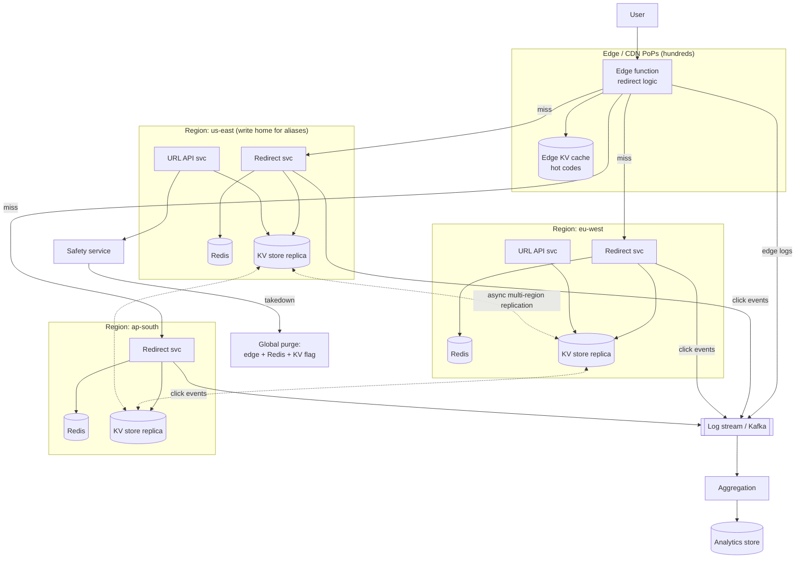
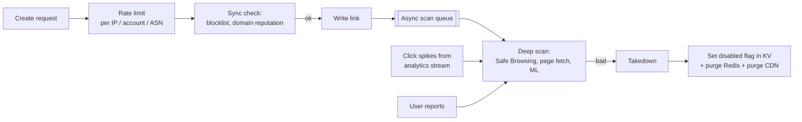

# URL Shortener — L6 (Staff) Interview

> **Level expectation:** the core design (L5) is assumed — you'll cover it quickly. The interview is about **judgement**: challenging requirements, designing for global scale and failure, abuse, cost, operability, and how the system *evolves* and is *owned*. A staff engineer also knows what **not** to build. Read [L5-senior.md](L5-senior.md) first.

Legend: **🧑‍💼 Interviewer** · **🧑‍💻 Candidate** · **📝 Note** = commentary for you.

---

## 1. Requirements — challenge and shape them

**🧑‍💼 Interviewer:** Design a URL shortener.

**🧑‍💻 Candidate:** Before requirements, I want to understand *why* we're building it, because it changes the design a lot:

| Context | What changes |
|---|---|
| **Public product** (bit.ly) | Abuse is the #1 operational cost. Custom domains, analytics are the paid features. Multi-tenant. |
| **Platform feature** (Twitter's t.co, all links auto-wrapped) | Write volume = every post. Codes needn't be pretty. **Security scanning at click time** is the main purpose. |
| **Internal tool** (go/links) | Tiny scale, SSO, human-readable aliases are the whole feature. One Postgres. Done. |

**🧑‍💼 Interviewer:** Public product, global users, think bit.ly.

**🧑‍💻 Candidate:** Then my requirements, with what I'd push back on:

- **Redirect: 99.99% availability, p99 < 50 ms *as experienced by the user, globally*.** That last part matters — 50 ms server-side means nothing if the server is 200 ms away. → implies **multi-region / edge**.
- **Create: 99.9%, single-digit-second global visibility.** Fine to be eventually consistent for reads.
- **Uniqueness of codes: strict, globally.** Non-negotiable.
- **Analytics: near-real-time (minutes), may lose < 0.1% of events.** I'd confirm with product — exact counting would cost a lot more and nobody makes decisions on the 0.1%.
- **Abuse: phishing/malware links must be disabled within minutes of detection globally.**
- **Compliance:** analytics store IPs / user agents → personal data under GDPR. Need retention limits and deletion.

**🧑‍💻 Candidate:** And what I'd **push back on**: "links never expire". Storing every link forever is fine cost-wise (~3 TB / 5 yrs), but *serving* dead links of free anonymous users forever is a liability for abuse. I'd propose: free anonymous links expire after N years of zero clicks; paid links never expire.

> 📝 **Note:** Staff signal: asking "why are we building this?" and showing that the answer changes the architecture. And negotiating requirements based on cost/risk, not just accepting them.

---

## 2. Estimates — now include cost and geography

Base numbers from L5: ~40 creates/s, ~4k redirects/s avg, ~20k+ peak, 6B links / 3 TB over 5 years. See [back-of-the-envelope](../../concepts/back-of-the-envelope.md).

**🧑‍💻 Candidate:** Additional staff-level lens:

- **Geography:** assume ~40% Americas, 30% Europe, 30% Asia. A single region in us-east means ~150–250 ms extra for Asian users *per redirect*. That violates the SLO → we need presence in at least 3 regions, or the edge.
- **Cost (order of magnitude):** storage ~9 TB replicated is cheap (low thousands $/month). Redis ~35 GB ×3 regions — cheap. **The big costs are**: the app fleet sized for viral peaks, cross-region replication traffic, and the analytics pipeline (billions of events/month, stored raw). Analytics is likely >50% of the infra bill — so that's where to economise (aggregate early, keep raw events 30 days only).
- **Peak vs average:** viral spikes can be 50–100× average for a single link. Designing for average is how this system pages people at 3 am.

> 📝 **Note:** You don't need precise dollar numbers. Knowing *which component dominates cost* is the staff signal.

---

## 3. Architecture



**🧑‍💻 Candidate:** Walking through the important choices.

### 3.1 The redirect path lives at the edge

- A **[CDN](../../technologies/cdn.md) edge function** handles `GET /{code}`. Hot codes are cached at the edge (short TTL, e.g. 60 s). A cache hit is answered from a PoP ~10–20 ms from the user — that's how we meet "50 ms p99 globally".
- Edge miss → nearest region's redirect service → [Redis](../../technologies/redis.md) → regional KV replica.
- **But wait — caching at the edge breaks analytics?** Not if analytics comes from **edge request logs** instead of origin hits. Every request is logged at the edge, including cache hits. So we get both: edge caching *and* full click data.
- Still return **302**, never 301. 301 is cached by the *browser*, which we can't purge — and we need to be able to kill phishing links instantly. The CDN cache, on the other hand, *we* control and can purge.

> 📝 **Note:** "302 so we can revoke" is a stronger argument than "302 for analytics" — it's a safety argument. That's the staff framing.

### 3.2 Storage: multi-region KV with careful consistency

**🧑‍💻 Candidate:** I'd use a multi-region KV store (DynamoDB Global Tables, or [Cassandra](../../technologies/cassandra.md) with multi-DC replication). Reads are local in every region.

The trap: **multi-region replication in these stores is asynchronous and last-writer-wins.** A conditional write ("only if code doesn't exist") is checked *only in the region that receives it*. So:

```text
t=0  us-east: PutIfAbsent("summer-sale") → OK (customer A)
t=0  eu-west: PutIfAbsent("summer-sale") → OK (customer B)   ← also succeeds locally!
t=1  replication: last writer wins → one customer silently loses their link
```

This is the most important correctness bug in a global design. (Background: [CAP & consistency](../../concepts/cap-and-consistency.md).)

**Fixes, in order of preference:**
1. **Generated codes can't conflict by construction** — each region gets disjoint ID space (see 3.3). No coordination needed. That covers ~99% of creates.
2. **Custom aliases** are rare (~1% of creates) → route *all* alias creates to **one home region** where the conditional write is the single source of truth. Cross-region latency (~100–200 ms) on a rare, non-critical write is a perfectly fine price.
3. If we ever needed multi-region strong consistency for everything, use a globally consistent store (Spanner / CockroachDB) — but that buys a lot of latency and cost for a problem we've already solved for 1% of writes.

> 📝 **Note:** This is the kind of insight that differentiates staff: knowing a tool's exact guarantee (conditional write is *regional*) and designing around it with the cheapest correct solution.

### 3.3 ID generation without cross-region coordination

**🧑‍💻 Candidate:** Extend L5's counter-range scheme. Split the 41-bit ID space (fits in 7 Base62 chars — see [ID generation](../../concepts/id-generation.md)):

```text
| region (3 bits) | counter (38 bits) |
  up to 8 regions   2^38 ≈ 275 billion IDs per region
```

- Each region has its own range allocator ([etcd/ZooKeeper](../../technologies/zookeeper-etcd.md) in that region) handing out blocks to API servers.
- No cross-region call on any create. A region being down doesn't block other regions creating links.
- Then apply the Feistel shuffle so codes aren't sequential and don't leak the region.

### 3.4 Abuse is a system, not a checkbox



- Cheap checks synchronously (so create stays fast), expensive checks async.
- **Re-scan on click spikes** — phishers create a clean link, then swap the destination page. A link that suddenly gets 10k clicks from email referrers is worth re-checking.
- **Takedown must be global and fast**: flag in KV (replicates in ~1 s), Redis `DEL` in every region, CDN purge API. Target < 1 minute. That's why our edge TTL is short.

---

## 4. Operability — how this runs in production

**🧑‍💻 Candidate:** Being infra-minded, here's what I'd want before launch:

**SLOs & alerting**
- SLI for redirects: % of `GET /{code}` that return 3xx/404/410 within 100 ms, measured **at the edge** (the user's experience), not at the origin.
- 99.99% → error budget of ~4.3 minutes/month. Page on fast burn rate (e.g. 2% of monthly budget in 1 hour), ticket on slow burn.

**Degraded modes (decide them in advance)**
| Dependency down | Behaviour |
|---|---|
| Analytics pipeline | Redirects unaffected; events dropped after bounded buffer. Dashboard shows "data delayed". |
| Redis in a region | Fall through to KV; local in-process cache absorbs hot keys; KV autoscaled for miss storms |
| KV in a region | Edge fails over to another region's redirect service (higher latency, still correct) |
| Range allocator in a region | Servers drain current ranges (sized for ~30 min), then route creates to another region |
| Safety service | Fail **open** for create (accept, scan later), not closed — but tighten rate limits. Product/security decision, documented. |

**Blast radius**
- Redirect and create are separate services, separate deploys, separate autoscaling.
- Deploys roll region by region with automated rollback on SLO burn.
- Cell-based isolation for big tenants: an enterprise customer with a viral campaign can't starve everyone else's capacity.

**Capacity**
- Load test to 10× peak. Autoscaling alone is too slow for viral spikes (minutes to start pods) → keep headroom + edge caching does the real work.

---

## 5. Data lifecycle & privacy

- **Link data:** small, keep. Expire inactive free links per policy (native TTL).
- **Raw click events:** keep 30 days for debugging/fraud, then only aggregates. This is the dominant storage cost and the main privacy risk.
- **IP addresses:** truncate (/24 for IPv4) or derive country at ingestion and drop the IP. Don't store what you don't need — you can't leak it.
- **Right to erasure:** user deletes account → delete their links (tombstone + cache purge), and their aggregates.

---

## 6. Evolution & build-vs-buy

**🧑‍💼 Interviewer:** If you were starting this today with a team of 4, what would you actually build first?

**🧑‍💻 Candidate:** Not this diagram. Phase it:

1. **v1 (weeks):** single region, Postgres + Redis, L4/L5-style design, counter ranges with the region bits *already reserved* in the ID format (cheap now, painful later), managed CDN in front. Analytics via edge logs into a managed warehouse. This serves millions of users.
2. **v2 (when global latency or scale demands it):** move mappings to a multi-region KV store via dual-write migration; add regions; alias writes pinned to a home region.
3. **v3:** dedicated abuse platform, cell isolation for enterprise tenants.

**Buy vs build:** CDN, edge compute, KV store, Kafka, OLAP — all managed. The only things worth building are the code generation scheme, the redirect logic, and abuse detection, because those are the product.

> 📝 **Note:** The decisions that are expensive to change later (ID format, code length, 302 semantics) are made carefully in v1. Everything else is deferred. That's the core of staff-level judgement: **know which decisions are one-way doors.**

---

## 7. Curveball follow-ups

**🧑‍💼 Interviewer:** A customer says "my link redirects to the wrong page in Europe but the right one in the US".

**🧑‍💻 Candidate:** Mappings are immutable, so this is either (a) the link was **edited** — if we allow editing destination URLs, it's replication lag plus stale caches (Redis TTL, edge TTL), or (b) a takedown/flag that hasn't propagated, or (c) worse: an alias collision as in §3.2 where last-writer-wins resolved differently. I'd check the KV item's version in both regions. This is why I'd only allow edits for paid users and purge all cache layers on edit — and why alias creation is pinned to one region.

**🧑‍💼 Interviewer:** Our CDN vendor has a global outage.

**🧑‍💻 Candidate:** DNS failover to regional origins directly (a low-TTL DNS record, pre-tested). Latency gets worse, availability holds — *if* the origins are sized to handle traffic the edge was absorbing. That's an expensive amount of idle capacity; the honest answer is we'd accept degraded latency and possibly shed analytics, and we'd have **run this failover as a game day** before it happened for real.

**🧑‍💼 Interviewer:** Could someone use our service to do a DDoS on a third party?

**🧑‍💻 Candidate:** Yes — they can't amplify bandwidth (we only send a redirect), but they can launder the source. Rate limits per destination domain on *creates*, and anomaly detection on redirect volume per destination domain, with the ability to temporarily interstitial ("You're being redirected to X, continue?") instead of a blind redirect.

---

## 8. What the interviewer was evaluating (L6)

- [ ] Asked *why* — and showed how context changes the architecture
- [ ] Negotiated requirements (expiry, analytics accuracy) using cost and risk
- [ ] Defined SLOs from the **user's** perspective, with error budgets
- [ ] Identified the precise consistency trap (regional conditional writes + LWW) and solved it with the cheapest correct design
- [ ] Coordination-free global ID scheme
- [ ] Abuse as a full lifecycle, with fast global takedown
- [ ] Degraded modes decided in advance; blast radius; game days
- [ ] Knew which component dominates cost
- [ ] Phased plan with one-way-door decisions made early; build vs buy
- [ ] Still remembered the fundamentals (302 vs 301, caching, read-heavy) — but covered them in minutes

## 9. Common mistakes at this level

| Mistake | Why it hurts at L6 |
|---|---|
| Spending 30 minutes on the L5 design | Staff interview time is for judgement and cross-cutting concerns |
| "Use DynamoDB Global Tables" without knowing conflicts resolve last-writer-wins | Exactly the depth staff engineers are expected to have |
| Designing the final v3 architecture as if a team would build it all at once | Shows no sense of sequencing, cost, or team capacity |
| Never questioning requirements | Staff engineers shape requirements, not just satisfy them |
| No mention of operations (SLOs, rollouts, on-call) | Systems are run, not just built — especially relevant with an infra background, so use it |
| Treating abuse as "add a blocklist" | For a public shortener, abuse is the business-critical problem |

⬅️ Previous: [L5-senior.md](L5-senior.md) · 🏠 [Problem overview](README.md)
