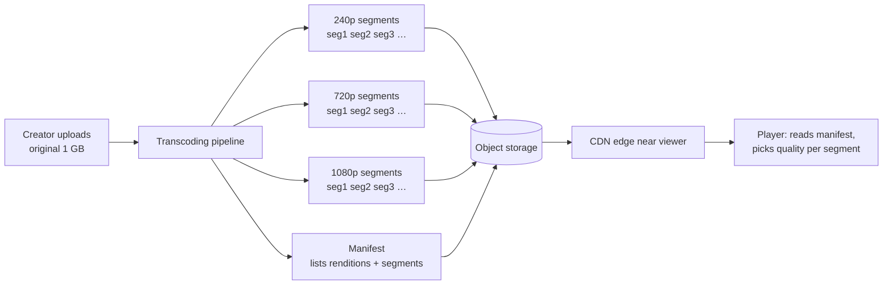

# Start Here: What Is a Video Streaming Platform? (Before the Interview)

> You record a 10-minute video on your phone, tap "upload" on a shaky train Wi-Fi, and an hour later someone on a 3G connection in a small town watches it without it stopping to load, while someone else watches it in 4K on a TV. Behind those two taps: resumable uploads, a factory that turns one file into many versions, petabytes of storage, and a delivery network that sits inside your internet provider.
>
> Time: ~15 minutes. Then: [L4](L4-mid.md) → [L5](L5-senior.md) → [L6](L6-staff.md). For how real companies do it, see the case study [Video platforms: upload, transcode, store, stream](../../../case-studies/video-upload-transcode-and-storage.md).

---

## 1. The story: one file in, smooth playback everywhere

**The creator:** Priya films a cooking video: 10 minutes, 1080p, about **1 GB** straight off her phone. She uploads it on train Wi-Fi that drops every few minutes.

**The viewers:**
- Ravi on a phone with a weak 3G signal.
- Anita on office broadband, watching in a browser.
- Priya's parents on a smart TV with a 4K screen.

Each needs a **different version** of the same video: Ravi can't download 1080p fast enough (it would stop every few seconds to load, which is called **buffering**), and the TV would look terrible at 240p. And Ravi's signal changes from second to second, so the right version changes *while he watches*.

What goes wrong with the naive version ("store the uploaded file, serve it with a download link"):
- **The upload restarts from zero** every time the Wi-Fi drops. A 1 GB upload on a flaky connection may never finish.
- **One file for everyone:** the phone file is too big for Ravi, may use a format some TVs can't play, and is wasteful for small screens.
- **Every viewer downloads from your servers:** for a popular video that's thousands of copies of the same bytes crossing the internet, and a huge bandwidth bill.
- **Seeking** to minute 7 means downloading everything before it, or a server that can serve parts of the file.

---

## 2. Where you've already seen it

| Where | What you notice |
|---|---|
| **YouTube** | Quality changes by itself (blurry for a moment, then sharp); the gear icon lists 144p…2160p |
| **Netflix / Prime Video / Hotstar** | Starts in a second or two, rarely buffers, even on mobile data |
| **Instagram Reels / YouTube Shorts** | The next video starts instantly (it was pre-loaded) |
| **Cricket live streams (IPL)** | Millions watching the same moment; a few seconds behind TV |
| **Google Drive / WhatsApp uploads** | A big upload pauses and resumes instead of failing |
| **At work** | Uploading a big artifact to S3 with multipart upload; a CDN in front of static assets |

---

## 3. The features, through situations

### 3.1 "The Wi-Fi dropped at 70%" → resumable, chunked uploads
The app cuts the file into chunks (say 8 MB), uploads them separately, and after a drop asks the server "how much did you get?" and continues from there. Uploads usually go **straight to object storage** with a temporary signed URL, so your app servers never carry the bytes. → [Resumable & chunked uploads](../../concepts/resumable-and-chunked-uploads.md), L4 §5.1.

💡 **Object storage** (like Amazon S3): a service that stores files ("objects") by name, cheaply and durably, at any size. See [object storage](../../technologies/object-storage.md).

### 3.2 "Make it play on every device and every connection" → transcoding into a ladder
After upload, a pipeline converts the original into several **renditions**: the same video at different resolutions and bitrates (240p, 360p, 480p, 720p, 1080p, 4K). That conversion is **transcoding**. The list of renditions is the **bitrate ladder**. → [Video transcoding pipeline](../../concepts/video-transcoding-pipeline.md), L4 §5.2.

💡 **Bitrate:** how many bits of data one second of video takes, e.g. 5 Mbps (megabits per second) for 1080p. Higher bitrate = better quality = more data to download.

💡 **Codec:** the compression method (H.264, VP9, AV1…). **Container:** the file format that wraps it (MP4, WebM). Like a zip algorithm vs the .zip file.

### 3.3 "My connection keeps changing" → adaptive bitrate streaming
Each rendition is cut into **segments** of a few seconds. The player downloads a small **manifest** (a playlist listing the renditions and their segments), then fetches segments one by one, choosing the quality of *each next segment* based on how fast the last ones arrived and how much video is buffered. Signal drops → the next segment comes from 360p; it recovers → back to 1080p. → [Adaptive bitrate streaming](../../concepts/adaptive-bitrate-streaming.md), L4 §5.3.

### 3.4 "A million people watch the same video" → CDN
Segments are just static files, so a [CDN](../../technologies/cdn.md) (servers in many cities that cache content close to viewers) can serve them. The popular video is fetched from your storage once per CDN location, then served locally thousands of times. Netflix goes further and puts its own cache servers *inside* internet providers. → L4 §5.4.

### 3.5 "Jump to minute 7" → seeking and thumbnails
Because the video is already in segments, seeking just means fetching the segment that contains minute 7. The little preview pictures when you hover over the progress bar come from **thumbnail sprites** made during processing. → L5 §3.6.

### 3.6 "Is my video ready yet?" → processing states
After upload, the video is *processing* for a while. The app shows states (uploading → processing → ready, or failed) and often lets lower qualities go live first. → L4 §5.5, L5 §3.2.

### 3.7 "The match is live" → live streaming
For a live cricket match there's no finished file: the camera feed is transcoded in real time into segments a few seconds long, and viewers are always fetching the newest one. The delay behind real life ("latency") is the main new trade-off. → L6 §2.

### 3.8 "Don't let people download our movies" → DRM
Paid services encrypt segments and only give the key to licensed players. That's **DRM** (digital rights management): Widevine (Google), FairPlay (Apple), PlayReady (Microsoft). → L6 §5.

---

## 4. The key mechanism: segments + manifest + CDN



A real (simplified) HLS master manifest, the file a player reads first:

```text
#EXTM3U
#EXT-X-STREAM-INF:BANDWIDTH=800000,RESOLUTION=640x360
360p/playlist.m3u8
#EXT-X-STREAM-INF:BANDWIDTH=2800000,RESOLUTION=1280x720
720p/playlist.m3u8
#EXT-X-STREAM-INF:BANDWIDTH=5000000,RESOLUTION=1920x1080
1080p/playlist.m3u8
```

Each listed playlist then names the segment files (`seg_00001.ts`, `seg_00002.ts`, …). The player does the rest.

---

## 5. Try it yourself

- **YouTube "Stats for nerds":** right-click on a playing video → *Stats for nerds*. Watch *Current / Optimal Res*, the codec (`avc1`, `vp09`, `av01`), *Connection Speed* and *Buffer Health*. Throttle your network (next point) and watch the resolution drop.
- **Browser DevTools:** open *Network*, play any video, and watch a stream of small requests every few seconds: those are segments. In the throttling dropdown choose "Slow 4G" or "3G" and see the player switch quality.
- **Netflix in a desktop browser:** `Ctrl + Alt + Shift + D` (Windows) shows a stats overlay with bitrate and buffer (this shortcut is widely reported; it may change).
- **Your own S3 multipart upload** (if you have an AWS account): `aws s3 cp big.mp4 s3://bucket/` uses multipart automatically for large files; `aws s3api list-multipart-uploads --bucket bucket` shows unfinished ones.
- **ffmpeg** (if installed): `ffprobe -hide_banner video.mp4` shows codec, resolution, bitrate and frame rate of any video file on your laptop.

> Commands that need the internet weren't run from the environment this repo was written in (outbound network was blocked).

---

## 6. From experience to requirements

| What people experience | Requirement |
|---|---|
| Big uploads survive flaky networks | **F:** resumable chunked upload; **NF:** uploads never pass through app servers |
| Video plays on any device | **F:** transcode to common codecs/containers and a resolution ladder |
| No buffering on weak connections | **F:** adaptive bitrate streaming; **NF:** time-to-first-frame ~1–2 s, rebuffering rare |
| Popular videos never melt servers | **NF:** CDN delivery, high cache-hit ratio |
| Seek anywhere instantly | **F:** segmented renditions, thumbnails |
| "Processing…" doesn't take forever | **NF:** time-to-publish minutes, not hours (parallel transcoding) |
| Uploaded videos never get lost | **NF:** durable original storage |
| Platform stays affordable | **NF:** storage tiering, codec choices, egress cost under control |

---

## 7. Mini glossary

| Term | Plain meaning |
|---|---|
| Rendition | One version of the video at a given resolution/bitrate/codec |
| Bitrate ladder | The list of renditions a video is transcoded into |
| Transcoding | Decoding a video and re-encoding it into another format/quality |
| Codec / container | Compression method / the file format wrapping it |
| Segment | A few seconds of one rendition, stored as its own small file |
| Manifest / playlist | Text file listing renditions and segments (HLS `.m3u8`, DASH `.mpd`) |
| ABR | Adaptive bitrate: the player picks a quality per segment |
| Buffering / rebuffering | Playback stops because the next segment hasn't arrived |
| CDN | Servers near viewers that cache and serve content |
| Multipart / resumable upload | Uploading a big file in parts that can be retried and resumed |
| DRM | Encrypting content so only licensed players can play it |

➡️ Next: [README.md](README.md) · then [L4-mid.md](L4-mid.md)
