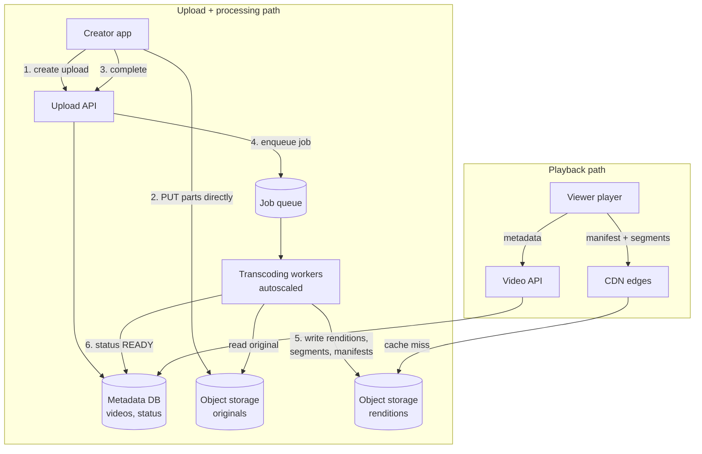
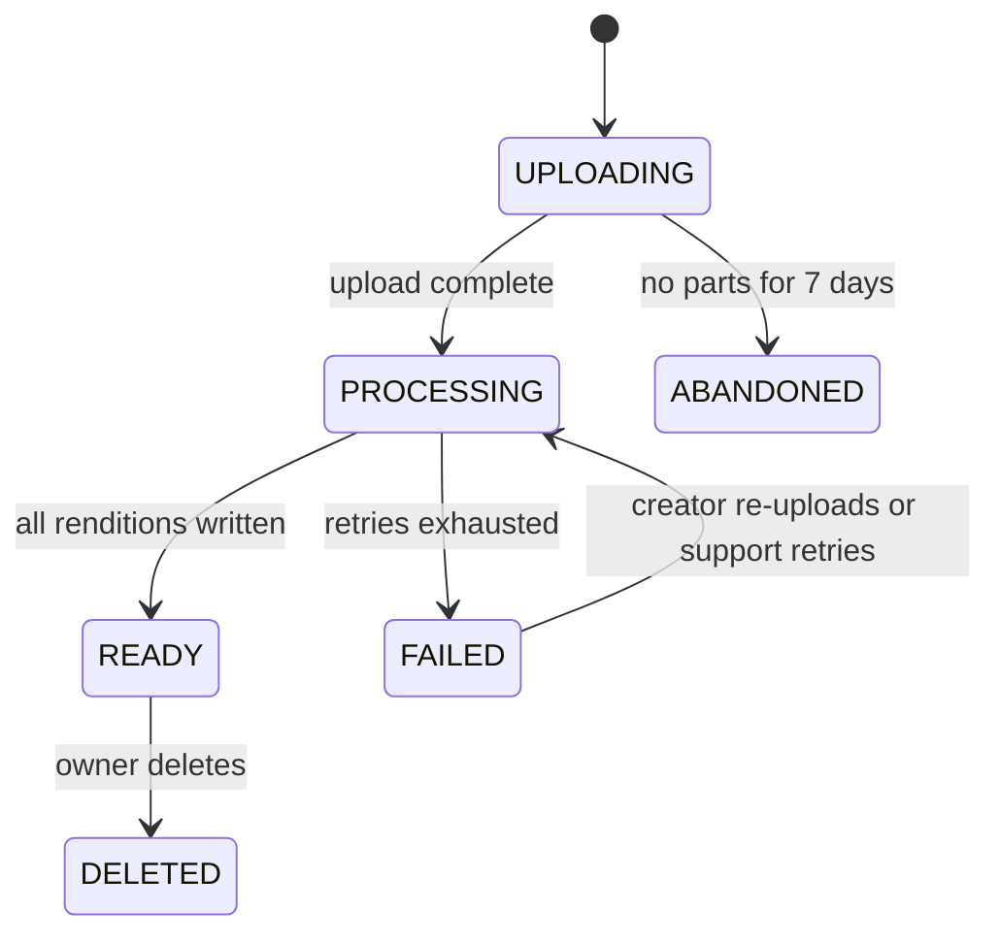

# Video Streaming (YouTube / Netflix) — L4 (Mid-level / SDE2) Interview

> **Level expectation:** a working end-to-end design with the two halves separated: an **upload + processing** path (resumable uploads straight to object storage, a queue, transcoding workers producing a bitrate ladder) and a **playback** path (manifest + segments served from a CDN, adaptive bitrate in the player). Show the estimates that prove the CDN and storage are the big costs, and track each video's processing state.

> 🆕 Never thought about how video streaming works? Read [00-understand-the-product.md](00-understand-the-product.md) first. It explains renditions, segments, manifests and CDNs with a real example.

Legend: **🧑‍💼 Interviewer** · **🧑‍💻 Candidate** · **📝 Note** = commentary for you.

---

## 1. Clarifying requirements

**🧑‍💼 Interviewer:** Design a video platform like YouTube.

**🧑‍💻 Candidate:** It's a big product, so let me scope:
- Core flows: **upload** and **watch**. Search, comments, recommendations, monetisation out of scope?
- Video-on-demand only, or **live streaming** too?
- Scale: uploads per day, average length, daily viewers, watch time?
- Devices: phones, browsers, TVs? (Drives the formats.)
- Is a few minutes of processing after upload acceptable?

**🧑‍💼 Interviewer:** Upload and watch only. On-demand, no live. 500k uploads a day, about 10 minutes each. 100M daily viewers watching about an hour each. All device types. A few minutes of processing is fine.

**🧑‍💻 Candidate:**

**Functional**
1. Upload a video (large files, flaky networks).
2. Process it into formats and qualities every device can play.
3. Watch it with smooth playback and seeking; quality adapts to the network.
4. Video metadata (title, owner, status, duration).

**Non-functional**
1. **Playback quality:** start in ~1–2 s, rare buffering.
2. **Massive read bandwidth** (calculated below); reads ≫ writes.
3. **Durable:** an uploaded video is never lost.
4. **Available:** watching must keep working even if uploads/processing are degraded.
5. **Cost-aware:** storage and bandwidth dominate the bill.

---

## 2. Back-of-the-envelope estimates

(Method: [back-of-the-envelope](../../concepts/back-of-the-envelope.md).)

| What | Calculation | Result |
|---|---|---|
| Original upload size | 1080p phone video ≈ 13 Mbps × 600 s ÷ 8 bits/byte | **~1 GB per video** |
| Upload ingress | 500k × 1 GB ÷ 86,400 s | **~5.8 GB/s ≈ 46 Gbps** average |
| Ladder size (all renditions) | illustrative H.264 ladder: 0.4 + 0.8 + 1.4 + 3 + 5 = **10.6 Mbps** combined (240p…1080p) × 600 s ÷ 8 | **~0.8 GB per video** |
| New storage per day | 500k × (1 GB original + 0.8 GB renditions) | **~900 TB/day** → ~330 PB/year |
| Watch time | 100M viewers × 60 min | **6B minutes/day** |
| Delivery volume | assume average 2 Mbps delivered: 2 Mbps × 60 s ÷ 8 = 15 MB per minute × 6B | **~90 PB/day** |
| Delivery bandwidth | 90 PB ÷ 86,400 s = ~1 TB/s × 8 | **~8 Tbps average**, peaks higher in the evening |
| Transcoding compute | assume ~2.5 CPU-core-minutes per minute of video for the whole ladder; 500k × 10 min × 2.5 = 12.5M core-min/day ÷ 1,440 min/day | **~8,700 cores busy on average** |

**🧑‍💻 Candidate:** Takeaways:
- **Delivery (~8 Tbps) can't come from our own data centre.** It must be a [CDN](../../technologies/cdn.md); this is the single most important design decision.
- **Storage grows by ~1 PB a day.** Object storage, with cheaper tiers for old and unpopular content (L5).
- **Uploads (~46 Gbps)** are big too: they should go straight to object storage, not through our API servers.
- Transcoding is a large but **elastic batch workload**: a queue plus an autoscaled worker fleet.

> 📝 **Note:** Every number here is an assumption; say so. What the interviewer wants is the shape: read bandwidth ≫ upload bandwidth ≫ metadata traffic, and storage that grows forever.

---

## 3. API

```http
POST /v1/uploads                         body: {title, sizeBytes, contentType}
→ { videoId, uploadId, partSize: 8388608, partUrls: [ "https://storage…?signature=…", … ] }

PUT  <partUrl>   (client → object storage directly, one per 8 MB part, retried independently)

POST /v1/uploads/{uploadId}/complete     body: { parts: [{partNumber, etag}, …] }
→ { videoId, status: "PROCESSING" }

GET  /v1/videos/{videoId}
→ { title, status: "READY", durationSec, manifestUrl: "https://cdn.example.com/v/abc123/master.m3u8" }
```

- Upload URLs are **pre-signed**: temporary URLs that let the client write one specific object to storage without our credentials, valid for, say, an hour.
- Playback is just the manifest URL on the CDN; the player fetches everything else itself.

---

## 4. High-level design



**🧑‍💻 Candidate:** Two independent paths that share only storage and metadata:
- **Upload path:** bytes go client → [object storage](../../technologies/object-storage.md) directly; our services only coordinate. A [queue](../../technologies/message-queues.md) decouples "upload finished" from "transcoding done", so a burst of uploads just makes the queue longer.
- **Playback path:** the API returns metadata and a manifest URL; everything heavy is served by the CDN from the renditions bucket.

---

## 5. Deep dives

### 5.1 Uploads that survive bad networks

**🧑‍💻 Candidate:** ([Resumable & chunked uploads](../../concepts/resumable-and-chunked-uploads.md).)
1. The client asks our API to start an upload. We create a `videos` row (status `UPLOADING`) and a **multipart upload** in object storage, and return pre-signed URLs for its parts.
2. The client uploads 8 MB parts, a few in parallel. A failed part is retried alone. After the app restarts, it asks which parts already arrived and uploads only the rest.
3. On "complete", storage stitches the parts into one object, and we enqueue processing.

1 GB ÷ 8 MB = 1,000 ÷ 8 = **125 parts**; losing the connection costs at most one 8 MB part, not the whole file.

> 💡 **Infra analogy:** it's `aws s3 cp` on a large file: the CLI does multipart automatically. Abandoned multipart uploads still cost storage, so add a lifecycle rule to clean them up after a few days.

### 5.2 Transcoding into a bitrate ladder

**🧑‍💻 Candidate:** A worker takes a job from the queue and ([video transcoding pipeline](../../concepts/video-transcoding-pipeline.md)):
1. **Validates** the original (is it a real video? duration? corrupt?).
2. **Transcodes** it into each rendition of the ladder:

| Rendition | Resolution | Bitrate (illustrative) |
|---|---|---|
| 240p | 426×240 | 0.4 Mbps |
| 360p | 640×360 | 0.8 Mbps |
| 480p | 854×480 | 1.4 Mbps |
| 720p | 1280×720 | 3 Mbps |
| 1080p | 1920×1080 | 5 Mbps |

3. **Segments** each rendition into ~4–6 s chunks and writes a **manifest** per rendition plus a **master manifest** listing them (HLS; DASH is the equivalent standard).
4. Makes a few **thumbnails**, writes everything under `renditions/{videoId}/…`, and marks the video `READY`.

Don't upscale: a 720p upload gets a ladder up to 720p only. H.264 in MP4 segments plays on essentially every device; newer codecs come in L5/L6.

**Retries:** jobs are **idempotent** (re-running writes the same output paths), so a crashed worker's job can simply be retried after its queue visibility timeout ([idempotency](../../concepts/idempotency-and-delivery-semantics.md), [retries & DLQ](../../concepts/retries-backoff-and-dlq.md)). A video that fails three times goes to a dead-letter queue and status `FAILED`.

### 5.3 Adaptive bitrate playback

**🧑‍💻 Candidate:** ([Adaptive bitrate streaming](../../concepts/adaptive-bitrate-streaming.md).) The player:
1. Downloads the master manifest (a few hundred bytes).
2. Starts at a **low-ish** rendition so the first frame appears fast.
3. For each next segment, estimates bandwidth from recent downloads and checks its **buffer** (seconds of video already downloaded). Plenty of buffer and bandwidth → step up; buffer draining → step down.

All the intelligence is in the **player**; the servers only serve files. That's what makes the system so CDN-friendly.

**Seek:** jump to the segment containing the target time; with 4 s segments, minute 7 is segment 420 ÷ 4 = 105.

### 5.4 Delivering through a CDN

**🧑‍💻 Candidate:** Segments and manifests are **immutable static files** with unique paths, so they cache perfectly: long `Cache-Control` max-age, no invalidation needed (a re-encode gets a new path).
- A popular video: the first viewer in a city causes one fetch from origin; everyone after is served by the edge.
- The long tail (old, rarely watched videos) misses the cache more often; that's acceptable, it's a small share of bytes.
- **Origin** = our renditions bucket (plus, in L5, a shield cache in front of it).

### 5.5 Video metadata and processing states



Metadata (`video_id, owner_id, title, status, duration, created_at, manifest_path`) is small: 500k rows a day. A relational database ([PostgreSQL](../../technologies/postgresql.md)) handles it comfortably for years; reads are cached because the same popular videos are requested constantly ([caching strategies](../../concepts/caching-strategies.md)).

---

## 6. Follow-ups

**🧑‍💼 Interviewer:** Why not let the API servers receive the upload and write it to storage?

**🧑‍💻 Candidate:** 46 Gbps of uploads would need a large fleet just to proxy bytes, and a 1 GB request ties up a server connection for minutes. Pre-signed direct uploads make storage do what it's built for; our servers only hand out permissions and record state.

**🧑‍💼 Interviewer:** Why segments instead of one MP4 file per quality, served with HTTP range requests?

**🧑‍💻 Candidate:** Range requests work for a single quality (progressive download). But adaptive switching needs aligned, independently decodable pieces across qualities, and small fixed files are what CDNs cache best. Segments give both.

**🧑‍💼 Interviewer:** A transcoding worker dies halfway through a video.

**🧑‍💻 Candidate:** The job message wasn't acknowledged, so it becomes visible again and another worker restarts it. Output paths are deterministic, so partial files are simply overwritten. L5 makes this cheaper by splitting the video into chunks, so a failure redoes one chunk, not the whole video.

---

## 7. What the interviewer was evaluating (L4)

- [ ] Scoped to upload + watch; asked about live, scale and devices
- [ ] Estimates showing delivery bandwidth needs a CDN and storage grows ~1 PB/day
- [ ] Direct-to-storage resumable/multipart uploads with pre-signed URLs
- [ ] Queue + autoscaled transcoding workers; bitrate ladder; no upscaling; idempotent retries
- [ ] Segments + manifest; adaptive bitrate logic lives in the player
- [ ] CDN with immutable, long-cached segments
- [ ] Video status state machine; metadata in a relational DB

## 8. Common mistakes at this level

| Mistake | Why it hurts |
|---|---|
| Uploading through API servers | Huge proxy fleet; long requests; no resume |
| One file per video, served from origin | Buffering on slow networks; impossible bandwidth bill |
| Transcoding synchronously in the upload request | Requests time out; no retry; no backpressure |
| Server-side quality switching | Adds state to servers; CDN can't help |
| Storing video bytes in the database | Databases are terrible blob stores at this size |
| Forgetting a processing state | Viewers hit half-processed videos; no way to show progress or failures |

➡️ Next: [L5-senior.md](L5-senior.md)
