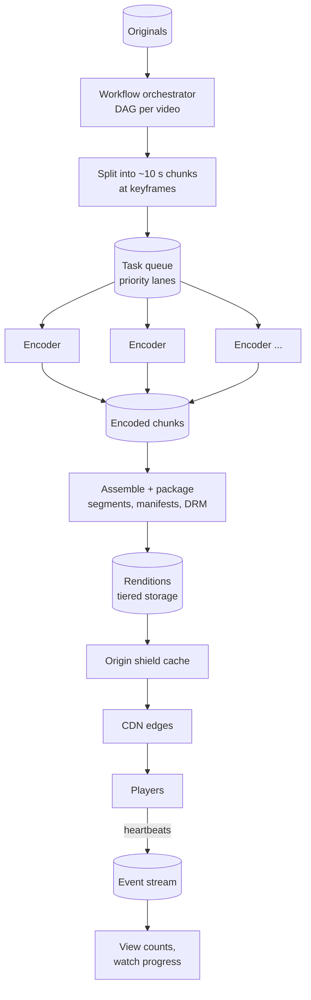

# Video Streaming (YouTube / Netflix) — L5 (Senior) Interview

> **Level expectation:** the L4 split (upload → queue → transcode → segments on a CDN) is assumed. Now make it fast and economical: **parallel chunked transcoding** as a DAG, **minutes-to-publish**, **storage tiering**, CDN **origin shielding and request coalescing**, choosing **codecs by popularity** with arithmetic, seek previews and captions, and **view counting**. Read [L4-mid.md](L4-mid.md) first.

Legend: **🧑‍💼 Interviewer** · **🧑‍💻 Candidate** · **📝 Note** = commentary for you.

---

## 1. Requirements (sharpened)

Same scale as L4 (500k uploads/day, ~8 Tbps delivery), plus:
- **Time to publish:** a 10-minute upload should be watchable within ~2–3 minutes of finishing.
- **Cost:** storage grows ~1 PB/day and delivery dominates; cut both without hurting quality.
- **Better quality per bit** for popular content (newer codecs).
- **View counts and "continue watching"** per user.

---

## 2. Architecture



---

## 3. Deep dives

### 3.1 Parallel chunked transcoding

**🧑‍💼 Interviewer:** One worker encoding a 10-minute video into 5 renditions takes how long?

**🧑‍💻 Candidate:** With the L4 assumption of ~2.5 core-minutes per video-minute for the whole ladder: 10 × 2.5 = **25 core-minutes**. On one 4-core worker, ~6 minutes; a 2-hour film takes over an hour. Too slow for "publish in 2–3 minutes", and a crash at 90% redoes everything.

So split the work ([video transcoding pipeline](../../concepts/video-transcoding-pipeline.md)):
1. **Split** the original into ~10 s chunks **at keyframes**. 💡 A **keyframe** (I-frame) is a full picture; frames between keyframes only store changes from neighbours. Cutting anywhere else would produce chunks that can't be decoded alone.
2. **Fan out:** 600 s ÷ 10 s = 60 chunks × 5 renditions = **300 independent tasks**.
3. **Encode** each task on any worker. Each is small (a 10 s chunk at one rendition takes seconds).
4. **Fan in:** when all chunks of a rendition are done, assemble them and package segments and manifests.

Wall time ≈ split + slowest chunk + assembly: well under a minute or two with enough workers, regardless of video length. A failure redoes one 10 s task.

**Orchestration:** a workflow engine (or a `tasks` table) tracks the DAG per video: which tasks are pending/running/done, retries with backoff ([retries & DLQ](../../concepts/retries-backoff-and-dlq.md)), and triggers fan-in when the last task of a stage completes. Tasks are **idempotent**: output paths are `chunks/{videoId}/{rendition}/{chunkNo}`, so a retry overwrites, never duplicates.

> 📝 **Note:** Encoding chunks independently can cause small quality jumps at chunk edges (each chunk's encoder doesn't know the neighbours). Real systems overlap chunk boundaries slightly or tune rate control to hide it. Mentioning that shows you've thought past the diagram.

### 3.2 Publish fast, finish later

**🧑‍💻 Candidate:** Not every rendition has to exist before the video goes live:
- Encode **360p and 720p first** (priority tasks). As soon as both are packaged, mark the video `READY` with a master manifest listing just those.
- Higher renditions (1080p, 4K) and newer codecs follow; when ready, publish a **new version of the master manifest** (new path, so CDN caches don't serve the old one forever) and point the video's metadata at it.
- **Priority lanes** in the task queue: interactive uploads before bulk re-encodes; creators with large audiences before others (their videos will be watched in the first minutes).

### 3.3 Storage tiering: don't pay hot prices for cold videos

**🧑‍💻 Candidate:** ~330 PB/year of new data, but views are extremely skewed: a small share of videos gets most watch time; most videos get few views after their first weeks.

| Data | Where | Why |
|---|---|---|
| Original upload | Standard storage for ~30 days, then an **archive tier** | Needed to re-encode later (new codecs, fixes); rarely read |
| Popular renditions | Standard storage + CDN | Read constantly |
| Long-tail renditions | Infrequent-access tier | Cheaper per GB; higher per-read cost is fine at low reads |
| Very cold, high renditions | Optionally deleted; re-encode **on demand** from the original if requested | Trades rare compute for permanent storage savings |

The decision is per video, from its view counts (§3.7), by a periodic job: a **lifecycle policy** driven by data, not just age.

### 3.4 The CDN at 8 Tbps

- **Origin shield:** one designated cache layer between all edges and storage. Without it, a new popular video causes a miss at *every* edge, each hitting storage; with it, storage sees one request per segment.
- **Request coalescing:** when 10,000 viewers request the same new segment at the same moment, the edge sends **one** request upstream and makes the rest wait for it ([caching strategies](../../concepts/caching-strategies.md), the cache-stampede problem).
- **Hit ratio arithmetic:** at 95% hit ratio, origin serves 5% of 8 Tbps = **0.4 Tbps**; at 99%, 0.08 Tbps. Each point of hit ratio is real money.
- **Access control:** signed, expiring URLs (or tokens in a cookie) for segments of private or paid videos, checked at the edge.
- **Multi-CDN** for big platforms: steer traffic between providers by price and measured performance; Netflix-scale companies build their own (see the [case study](../../../case-studies/video-upload-transcode-and-storage.md)).

### 3.5 Codecs: pay once to encode, save on every view

**🧑‍💻 Candidate:** Newer codecs (VP9, AV1) reach the same visual quality at noticeably lower bitrates than H.264, but take much more compute to encode and aren't supported by every device. The trade-off is per video:

```text
1080p H.264 ≈ 5 Mbps, AV1 at similar quality ≈ 3 Mbps (illustrative)
saving per viewer-hour = 2 Mbps × 3,600 s ÷ 8 = 900 MB
video watched 1M hours → 1,000,000 × 900 MB = 900 TB less delivered
```

For that video, an extra encode costing a few CPU-hours is trivial. For a video with 20 views, it's waste. So: **H.264 for everything** (compatibility), **better codecs only once a video crosses a popularity threshold**. The player picks the best codec it supports from the manifest.

### 3.6 Seeking, previews and captions

- **Seek** = find the segment with the target time (L4). To make seeking land fast, players request a lower rendition for the first segment after a seek, then climb.
- **Hover previews:** during processing, grab a frame every few seconds, tile them into **sprite sheets** (one image with, say, 10×10 thumbnails) plus an index of timestamps. The player downloads one sprite and crops; far fewer requests than one image per thumbnail.
- **Captions/subtitles:** separate text tracks (e.g. WebVTT files) listed in the manifest; added or fixed without re-encoding the video.

### 3.7 View counts and "continue watching"

**🧑‍💻 Candidate:** Players send a **heartbeat** every ~30 s (video id, position, rendition, buffer events) to an event stream ([Kafka](../../technologies/kafka.md)).
- **View counts:** a stream job counts a view once a session passes a threshold (e.g. 30 s watched), deduplicated per session, aggregated per video and flushed periodically ([counters at scale](../../concepts/counters-at-scale.md)). Approximate and slightly delayed is fine.
- **Continue watching:** latest position per (user, video) in a key-value store, last-write-wins; reads happen when the user opens the app.
- **Quality of experience:** the same events give startup time, rebuffering ratio and average bitrate per region and network: the metrics that tell you whether the system works ([observability](../../concepts/observability.md)).

### 3.8 Duplicate uploads

The same viral clip gets re-uploaded thousands of times. Hash the original ([content fingerprinting](../../concepts/content-fingerprinting-and-dedup.md)): an exact match can reuse existing renditions (a pointer, not a re-encode). Near-duplicate and copyright matching (audio/video fingerprints) is a separate system run on every upload.

---

## 4. Failure modes

| Failure | Behaviour | Mitigation |
|---|---|---|
| Encoder crashes mid-task | One chunk task lost | Visibility timeout, retry, idempotent outputs |
| Poison video (corrupt or crafted file) crashes every worker | Retries burn compute | Validation step, sandboxed decoding, max attempts → `FAILED` + DLQ |
| Upload burst (event, holiday) | Queue grows, publish time grows | Autoscale on queue depth; priority lanes keep interactive uploads fast |
| CDN edge outage | Players' segment requests fail | Players retry on another CDN host / provider listed in the manifest |
| Origin storage slow | Cache misses slow; new videos buffer | Origin shield, request coalescing, high hit ratio |
| Manifest points to a missing segment | Playback stops mid-video | Publish manifests only after all listed segments are written; verify step |

---

## 5. Follow-ups

**🧑‍💼 Interviewer:** How do you decide the bitrate ladder?

**🧑‍💻 Candidate:** A fixed ladder is a fine start. Better: per-title (or per-scene) ladders: a static slideshow looks perfect at a low bitrate, a fast football match needs much more. Encode test points, measure visual quality with a metric, and pick the cheapest bitrate for each resolution that reaches the target quality. Netflix publicly described this as per-title encoding (2015).

**🧑‍💼 Interviewer:** A creator deletes their video. What happens to the cached segments?

**🧑‍💻 Candidate:** Mark it deleted in metadata so the API stops returning the manifest URL; revoke signed URLs (they expire anyway); delete objects from storage asynchronously; optionally purge CDN paths for fast removal (e.g. legal takedowns). Cached segments of a video nobody can find die out with their TTL.

---

## 6. What the interviewer was evaluating (L5)

- [ ] Chunked parallel transcoding at keyframes, as a DAG, with arithmetic and idempotent tasks
- [ ] Publish low renditions first; versioned master manifests; priority lanes
- [ ] Storage tiering driven by popularity; originals archived, not deleted
- [ ] Origin shield, request coalescing, hit-ratio arithmetic, signed URLs
- [ ] Codec choice by expected views, with savings arithmetic
- [ ] Sprites for previews; captions as separate tracks
- [ ] Heartbeat events → view counts, continue watching, QoE metrics
- [ ] Failure handling including poison videos

## 7. Common mistakes at this level

| Mistake | Why it hurts at L5 |
|---|---|
| Transcoding a whole video on one machine | Slow publish; long tail of huge videos; expensive retries |
| Waiting for every rendition before publishing | Creators wait for 4K they mostly don't need yet |
| Same storage class for all data forever | Pays hot prices for petabytes nobody watches |
| No origin shield | Each new viral video stampedes the origin from every edge |
| AV1 for every upload | Huge encode cost for videos with a handful of views |
| Counting every heartbeat as a view | Inflated, gameable numbers |

⬅️ Previous: [L4-mid.md](L4-mid.md) · ➡️ Next: [L6-staff.md](L6-staff.md)
