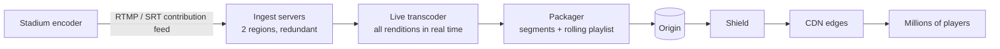

# Video Streaming (YouTube / Netflix) — L6 (Staff) Interview

> **Level expectation:** the L5 machinery (chunked transcoding, tiering, shields, codec economics) is known. The staff conversation is about **what to optimise** (quality of experience vs cost), **live streaming** at cricket-final scale, whether to **own delivery** (caches inside ISPs), a **cost model** with real arithmetic, **DRM and piracy**, multi-region resilience, and build vs buy. Read [L5-senior.md](L5-senior.md) first, and the [case study](../../../case-studies/video-upload-transcode-and-storage.md) for what YouTube and Netflix actually do.

Legend: **🧑‍💼 Interviewer** · **🧑‍💻 Candidate** · **📝 Note** = commentary for you.

---

## 1. Shape the problem: quality of experience vs cost

**🧑‍💼 Interviewer:** How do you know the platform is doing well?

**🧑‍💻 Candidate:** Viewers feel four things, all measurable from player heartbeats:

| QoE metric | Meaning | Typical lever |
|---|---|---|
| **Startup time** | Tap play → first frame | Small first segment, low starting rendition, CDN proximity, pre-fetch |
| **Rebuffering ratio** | Time stalled ÷ time watched | ABR tuning, CDN capacity per ISP, lower renditions available |
| **Average bitrate / resolution** | How sharp it looks | Better codecs, per-title ladders, more capacity |
| **Playback failures** | Video never starts | Manifest/segment availability, DRM licence errors |

And the business feels cost: **delivery** (per GB), **storage** (per GB-month, growing forever), **encoding** (CPU/GPU hours). Every big decision trades QoE against one of these. Make the trade explicit per segment of the audience: a phone user on 4G in a small town and a 4K TV in a city want different defaults.

> 📝 **Note:** Naming rebuffering ratio and startup time, and tying each to a design lever, is what turns "make it fast" into an engineering plan.

---

## 2. Live streaming at cricket-final scale

**🧑‍💼 Interviewer:** Now add live: an India–Pakistan match with tens of millions watching at once.

**🧑‍💻 Candidate:** Same building blocks, different constraints:



- **No time to parallelise over the video:** the feed arrives in real time, so each rendition must encode at ≥ 1× speed, continuously. Parallelism is across renditions, plus a **hot standby** pipeline in another region (if the primary dies, players switch with a blip, not an outage).
- **Latency comes from segments:** with 6 s segments and a player that keeps ~3 segments buffered, viewers are roughly 6 × 3 = **18 s or more** behind live, plus encoding and CDN time. **Low-latency HLS/DASH** publishes partial segments (sub-second parts) and gets to a few seconds, at the cost of more requests and less buffer to absorb network hiccups. For sports, a few seconds' extra delay is often accepted to avoid buffering, but a big gap from TV or social media ("my neighbour cheered 20 s ago") hurts.
- **The playlist becomes the hot object:** in live, players re-fetch the media playlist about once per segment to learn the newest segment. With 25M viewers and 4 s segments: 25,000,000 ÷ 4 = **~6M playlist requests/s**. Cache the playlist at the edge with a TTL of a second or two and coalesce misses, so the origin sees a handful of requests per edge per second.
- **Everyone at once:** load spikes at the toss, at innings breaks, at the last over. Pre-warm CDN capacity with providers, and **load-shed gracefully**: cap the top rendition for everyone before letting anyone fail ([resilience patterns](../../concepts/resilience-patterns.md)).

Indian streaming services have publicly claimed tens of millions of concurrent viewers for cricket (e.g. Disney+ Hotstar reported ~25 million in 2019, JioCinema later reported higher figures; these are company announcements, not independently verified).

---

## 3. Owning delivery: caches inside ISPs

**🧑‍💻 Candidate:** At ~8 Tbps, delivery is the biggest cost and the biggest QoE lever. Options:

| Option | How | When |
|---|---|---|
| Commercial CDNs | Pay per GB, multi-CDN steering | Default up to very large scale |
| **Own CDN with appliances inside ISPs** | Put cache servers in internet providers' networks; ISPs host them because it cuts *their* transit costs | Only the very largest (Netflix's Open Connect, Google Global Cache) |

Two delivery styles:
- **Pull (on-demand caching):** an edge fetches a segment the first time it's requested. Simple; first viewers in each location pay a miss.
- **Push (proactive fill):** predict tomorrow's popular titles per region and copy them to appliances during **off-peak hours**, when the network is idle. Works brilliantly for a catalogue (Netflix knows what's popular); poorly for user uploads whose popularity is unpredictable (YouTube relies more on pull plus popularity signals).

> 💡 **Infra analogy:** proactive fill is pre-pulling container images onto nodes before a big rollout, instead of letting every node pull at once when pods start.

---

## 4. The cost model, with arithmetic

All prices below are **assumptions for illustration**; real negotiated prices vary hugely by volume and region.

```text
Delivery:  90 PB/day = 90,000,000 GB/day
           at $0.002/GB (a heavily negotiated CDN price, assumed)
           → $180,000/day ≈ $66M/year

Storage:   +330 PB/year; average across tiers assumed $0.004/GB-month
           after one year: 330,000,000 GB × $0.004 ≈ $1.3M/month, and growing every month

Encoding:  ~8,700 cores busy on average (L4); at ~$0.02 per core-hour (assumed)
           → 8,700 × 24 × $0.02 ≈ $4,200/day ≈ $1.5M/year
```

**🧑‍💻 Candidate:** Even with rough prices, the order is clear: **delivery ≫ storage ≫ encoding**. That justifies spending *more* encoding compute (better codecs, per-title ladders) to save delivery bytes on popular content, and spending engineering on cache-hit ratio before anything else.

---

## 5. DRM and piracy

- **DRM:** segments are encrypted with content keys; the player gets a key from a **licence server** only after the user is authorised, and the device's DRM module (Widevine, FairPlay, PlayReady) keeps the key away from the app. One encrypted copy can serve all three systems using common encryption in CMAF segments, so you don't triple your storage.
- **Licence servers are on the critical path** of every play: replicate them, cache licences per session, and alert on licence error rate (it shows up as "video won't start").
- **Piracy:** DRM raises the cost of copying, not to infinity (screen recording exists). Premium content adds **forensic watermarking** (an invisible per-session mark) so a leaked copy can be traced to an account. Live sports piracy is fought mostly with takedowns during the match.

---

## 6. Multi-region and resilience

- **Uploads:** to the nearest region's storage; originals replicated to a second region (losing a creator's only copy is unacceptable).
- **Transcoding:** a global task queue; work can run wherever capacity is cheapest, including spot/preemptible machines, since tasks are small and idempotent.
- **Metadata:** replicated reads in every region; writes (uploads, edits) to a home region per video or a multi-region database. Viewers only need reads, so a write-region outage pauses uploads, not watching.
- **Playback never depends on one thing:** manifests can list multiple CDN hosts; players fail over between them.

---

## 7. Build vs buy

| Option | When |
|---|---|
| **Video platform APIs** (Mux, Cloudflare Stream, Vimeo OTT, similar) | A product with video as a feature: upload, encode, deliver and player analytics as a service |
| **Cloud media services** (e.g. AWS Elemental MediaConvert / MediaLive + a CDN) | You want control of ladders and pipelines without running encoders |
| **Open source** (ffmpeg for encoding, packagers like Shaka Packager, open players like hls.js / Shaka Player) on your own infrastructure | Large scale, cost-sensitive, with a team to run it |
| **Own everything incl. ISP caches and custom encoding hardware** | Only the largest platforms, where delivery cost is existential |

**🧑‍💻 Candidate:** Most companies should buy the pipeline and focus on the product. The thresholds that justify building are delivery spend and quality differentiation, not "we could do it".

---

## 8. Curveballs

**🧑‍💼 Interviewer:** Rebuffering doubled, but only for one mobile operator in one state.

**🧑‍💻 Candidate:** Localised: likely that operator's path to our CDN (peering congestion) or one edge site overloaded. Steer that operator's traffic to another CDN/site, check edge capacity and error rates for its network, and temporarily cap the top rendition for it. Long-term: more capacity or a cache inside that operator's network. This is why QoE metrics must be sliced by network and region, not averaged globally.

**🧑‍💼 Interviewer:** We want to roll out AV1 to all supported devices.

**🧑‍💻 Candidate:** Gradual: encode AV1 for the most-watched titles first (where savings are largest), expose it to a small percentage of capable devices, compare QoE and device battery/CPU (software decoding drains phones), then widen. Keep H.264 for everything, forever, as the fallback.

**🧑‍💼 Interviewer:** A 3-hour 4K upload arrives at 3 a.m. and a viral 30-second clip at the same time.

**🧑‍💻 Candidate:** Priority lanes (L5): the clip's tasks jump ahead; the long video's chunks fill idle capacity. Because work is split into small chunk tasks, neither blocks the other.

---

## 9. What the interviewer was evaluating (L6)

- [ ] QoE metrics tied to design levers; cost structure named
- [ ] Live: real-time transcoding, redundancy, segment latency arithmetic, low-latency trade-off, playlist request arithmetic and edge caching, load shedding
- [ ] Owning delivery: ISP caches, push vs pull, when it's worth it
- [ ] Cost model with arithmetic showing delivery ≫ storage ≫ encoding
- [ ] DRM with licence servers on the critical path; watermarking
- [ ] Multi-region: replicated originals, global transcode queue, read-only playback path
- [ ] Build vs buy with sensible thresholds

## 10. Common mistakes at this level

| Mistake | Why it hurts at L6 |
|---|---|
| Optimising average bitrate alone | Sharper video that buffers more is a worse product |
| Treating live as "VOD but faster" | Misses real-time encoding, playlist load and latency trade-offs |
| Building a private CDN early | Huge capital and ops cost before the volume justifies it |
| Ignoring the licence server | DRM outage = nobody can press play |
| Global QoE averages | Hide the one region or operator that's suffering |
| No fallback codec | A bad decoder on some devices becomes an outage |

⬅️ Previous: [L5-senior.md](L5-senior.md) · 🏠 [Problem overview](README.md)
