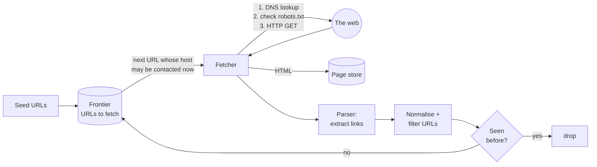

# Start Here: What Is a Web Crawler? (Before the Interview)

> Every search engine, every link preview in Slack, every "AI trained on the web" and the Internet Archive starts with the same program: something that downloads a page, finds the links in it, and downloads those too. It sounds like a 20-line script, and it is, until you run it against billions of pages owned by millions of strangers who didn't ask to be crawled.
>
> Time: ~15 minutes. Then: [L4](L4-mid.md) → [L5](L5-senior.md) → [L6](L6-staff.md).

---

## 1. The story: a search engine needs a copy of the web

You're building a search engine. When someone searches "best biryani in Hyderabad", you can't go and visit every website at that moment: there are billions of pages and the user wants an answer in 200 ms. So you need **your own copy of the web**, kept reasonably up to date, which you can index ahead of time.

Nobody gives you that copy. You have to **download it page by page**:

1. Start from a few known pages (the **seed URLs**, e.g. popular news sites, Wikipedia).
2. Download each page.
3. Find the links in it, and add the new ones to a to-do list.
4. Repeat, forever.

💡 **Crawler** (also *spider* or *bot*): a program that does exactly this loop. The to-do list of URLs waiting to be downloaded is called the **frontier**.

What goes wrong with the naive 20-line version:
- It **hammers one website** with hundreds of requests per second (because pages link mostly to their own site), and that site's owner blocks you or, worse, their server falls over. You've built a denial-of-service tool by accident.
- It **downloads the same page again and again** (`example.com`, `example.com/`, `EXAMPLE.com/index.html` are the same page).
- It falls into an **infinite calendar** (`/calendar?month=2026-11` links to `?month=2026-12`, forever) and never crawls anything else.
- It **never revisits** pages, so your copy of a news site is three months old.
- It runs on one machine. At 100 pages per second, 1 billion pages takes 1,000,000,000 ÷ 100 = 10,000,000 seconds ≈ **116 days**, and by then the first pages are stale.

Each of those becomes a section of the interview.

---

## 2. Where you've already seen crawlers

| Where | What's crawling |
|---|---|
| **Your own nginx / load-balancer access logs** | Lines with `User-Agent: Googlebot`, `bingbot`, `GPTBot`, `AhrefsBot`. Those are crawlers visiting *you* |
| **`/robots.txt`** on any site | The site's instructions to crawlers: "don't crawl `/admin`", "this bot is not welcome" |
| **Slack / WhatsApp / LinkedIn link previews** | When you paste a URL, a small crawler fetches the page to get its title and image |
| **Google Search** | The biggest crawler: billions of pages, revisited constantly |
| **Internet Archive (Wayback Machine)** | Crawls to *preserve* pages, so it keeps every version |
| **Common Crawl** | A non-profit that crawls billions of pages per month and publishes the data free; much AI training data comes from it |
| **SEO tools, price trackers, uptime monitors** | Small, focused crawlers |

> 💡 **Infra analogy:** if you've ever seen a sudden traffic spike from one user agent and rate-limited it at the load balancer, you've been on the *receiving* end of an impolite crawler. This interview is about not being that crawler.

---

## 3. The features, through situations

### 3.1 "Don't knock down my small website" → politeness
A bakery's website runs on a ₹500/month server. Your crawler finds 2,000 pages on it and fetches them all in parallel. The site goes down during their lunch rush. **Politeness** means: at most one request at a time per website, with a pause between requests (e.g. 1 second, or longer if the site is slow). This single rule shapes the whole design, because the crawler must keep track of *when* each host may be contacted next. → [URL frontier & politeness](../../concepts/url-frontier-and-politeness.md), L4 §4 and L5 §3.1.

💡 **Host:** the machine name part of a URL, e.g. `www.example.com` in `https://www.example.com/a/b`. Politeness is tracked per host (or per IP address, since one server can host many sites).

### 3.2 "Please don't crawl /checkout" → robots.txt
A shop doesn't want bots in its cart pages. It publishes `https://shop.com/robots.txt`:

```text
User-agent: *
Disallow: /checkout
Disallow: /search

User-agent: BadBot
Disallow: /
```

A well-behaved crawler downloads this file **before** crawling a site, caches it (for about a day), and obeys it. It's a convention (standardised as RFC 9309 in 2022), not a security mechanism: a bad bot can ignore it. → L4 §5.2.

### 3.3 "That's the same page" → URL normalisation and dedup
`HTTP://Example.com:80/a/../b/?utm_source=twitter` and `http://example.com/b/` are the same page. Normalising URLs (lowercase host, remove default port, resolve `..`, strip tracking parameters) before checking "have I seen this?" saves billions of wasted downloads. → [Content fingerprinting & dedup](../../concepts/content-fingerprinting-and-dedup.md), L4 §5.3.

### 3.4 "Different URL, same content" → content dedup
The same news article is syndicated on 40 sites; a site serves identical pages at `/print/123` and `/article/123`. A **hash of the content** catches exact copies; **SimHash** (a fingerprint where similar pages get similar fingerprints) catches near-copies that differ only in an ad or a timestamp. → L5 §3.3.

💡 **Hash:** a function that turns any amount of data into a short fixed-size number, like a checksum. Same input → same hash; a one-character change → a completely different hash.

### 3.5 "I've seen 10 billion URLs; have I seen this one?" → Bloom filter
Checking every discovered link against a 10-billion-entry database is slow. A [Bloom filter](../../concepts/bloom-filters.md) answers "definitely new" or "probably seen" from memory. → L4 §5.4.

### 3.6 "The calendar never ends" → spider traps
Infinite URL spaces (calendars, session IDs in URLs, `/a/a/a/a/...` from a broken relative link) can eat the whole crawl budget. Defences: maximum URL length and depth, a page budget per site, and detecting repeating path patterns. → L5 §3.4.

### 3.7 "The news site changes every 5 minutes, my uncle's blog once a year" → recrawl scheduling
You can't recrawl everything daily. Revisit pages based on how often they've changed before, and ask the server "has this changed since Tuesday?" with a **conditional request** so unchanged pages cost almost nothing. → L5 §3.5.

### 3.8 "Looking up the address is slower than downloading the page" → DNS caching
Before fetching `example.com`, the crawler must turn the name into an IP address via [DNS](../../technologies/dns.md). At hundreds of fetches per second, uncached lookups become a bottleneck, so crawlers run their own caching resolver. → L4 §5.1.

### 3.9 "One machine isn't enough" → distribution
Split the work across many crawler machines **by host**, so all pages of one site are handled by one machine, which can then enforce politeness locally without asking anyone else. → L5 §3.6.

---

## 4. The key mechanism: the crawl loop



In words: take a URL from the frontier **whose website is allowed to be contacted right now**, download it, save it, pull out its links, clean them up, throw away ones you've seen, and add the rest to the frontier. That's a **breadth-first search** (BFS: explore everything one link away, then two links away, and so on) over the graph of the web, with politeness rules deciding the order.

💡 **What an HTTP GET looks like** from a crawler (you can do this yourself):

```text
GET /about HTTP/1.1
Host: example.com
User-Agent: MyCrawler/1.0 (+https://mycrawler.example/info)
If-Modified-Since: Tue, 06 Oct 2026 10:00:00 GMT
```

A polite crawler identifies itself in `User-Agent` with a link explaining who it is. `If-Modified-Since` asks for the page only if it changed; the server replies `304 Not Modified` with no body if it didn't.

---

## 5. Try it yourself

> These are standard public endpoints. The network policy of the environment this repo was written in blocked outbound requests, so the outputs weren't re-checked here; they should work from your laptop.

```sh
# Read real robots.txt files: notice per-bot rules, Sitemap lines, and AI-bot blocks
curl -s https://www.google.com/robots.txt | head -30
curl -s https://en.wikipedia.org/robots.txt | head -60

# Be a crawler for one page: fetch, then pull out the links
curl -s -A "LearningCrawler/0.1" https://example.com/ | grep -o 'href="[^"]*"'

# Conditional GET: ask "changed since...?"  Look for 304 vs 200
curl -sI https://example.com/
curl -sI -H 'If-Modified-Since: Thu, 01 Jan 2099 00:00:00 GMT' https://example.com/

# DNS: what the crawler does before every new host (see the TTL column)
dig +noall +answer example.com

# The Wayback Machine: a crawler that keeps every version
curl -s 'https://archive.org/wayback/available?url=example.com'

# Common Crawl: list of published monthly crawls
curl -s https://index.commoncrawl.org/collinfo.json | head -c 600
```

Also try: search your company's load-balancer or ingress logs for `bot` in the user agent, and look at how often each crawler hits you. That's politeness (or its absence) as seen from the other side.

---

## 6. From experience to requirements

| What a user / site owner experiences | Requirement |
|---|---|
| Search results include pages from all over the web | **F:** crawl from seeds, discover new URLs from links |
| Search results show fresh news | **F:** recrawl pages; **NF:** freshness proportional to change rate |
| Site owners aren't overloaded | **NF:** politeness, at most N requests per host per interval |
| Site owners can opt out | **F:** obey robots.txt; identify the crawler |
| Index isn't full of copies | **F:** URL and content dedup |
| Crawl keeps going for months | **NF:** robust to traps, bad HTML, slow/dead servers, crashes (checkpointing) |
| Billions of pages per month | **NF:** horizontally scalable; throughput hundreds to thousands of pages/s |
| Downstream (indexing, ML) can use the data | **F:** store raw pages + metadata durably |

---

## 7. Mini glossary

| Term | Plain meaning |
|---|---|
| Seed URLs | The starting pages |
| Frontier | The to-do list of URLs waiting to be fetched, with scheduling rules |
| Politeness | Not overloading any single site: one request at a time, with gaps |
| robots.txt | A site's file telling crawlers what they may fetch |
| URL normalisation | Rewriting equivalent URLs into one standard form |
| Content dedup | Detecting pages whose content is the same (or nearly) |
| SimHash | A fingerprint where near-identical pages get near-identical numbers |
| Spider trap | An infinite or huge URL space that wastes the crawl |
| Recrawl / freshness | Revisiting pages so the copy stays current |
| Conditional GET / 304 | "Send it only if it changed"; "it didn't" |
| DNS resolution | Turning a host name into an IP address |
| User-Agent | The header naming the program making a request |
| BFS | Breadth-first search: visit near pages before far ones |

➡️ Next: [README.md](README.md) · then [L4-mid.md](L4-mid.md)
