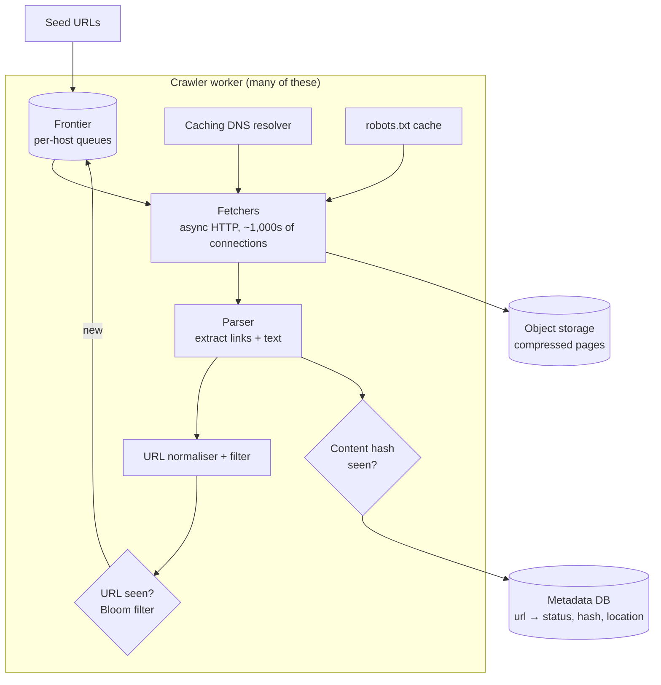
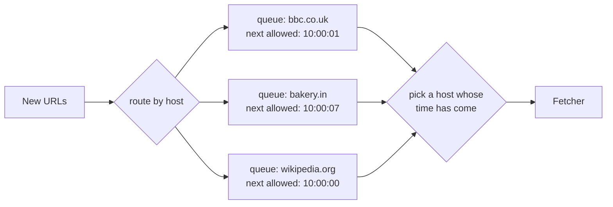

# Web Crawler — L4 (Mid-level / SDE2) Interview

> **Level expectation:** a working crawl loop that scales out: seeds → frontier → fetchers → page store → link extraction → URL dedup → back into the frontier. You must handle **politeness** (per-host queues and delays) and **robots.txt** without being prompted too much, normalise URLs, dedupe URLs and exact-duplicate content, cache DNS, and show estimates with arithmetic.

> 🆕 Never thought about how crawlers work? Read [00-understand-the-product.md](00-understand-the-product.md) first. It explains politeness, robots.txt and the crawl loop with real examples.

Legend: **🧑‍💼 Interviewer** · **🧑‍💻 Candidate** · **📝 Note** = commentary for you.

---

## 1. Clarifying requirements

**🧑‍💼 Interviewer:** Design a web crawler.

**🧑‍💻 Candidate:** A crawler for what? That changes a lot:
- **Purpose:** a search engine index, an archive, ML training data, or monitoring a few sites?
- **Scale:** how many pages per month?
- **Content types:** HTML only, or also PDFs, images, JavaScript-rendered pages?
- **Freshness:** crawl once, or keep re-crawling?
- **Storage:** do we keep the raw pages? For how long?
- **Politeness and robots.txt:** I assume we must obey both.

**🧑‍💼 Interviewer:** For a search engine. 1 billion pages per month. HTML only, no JavaScript rendering. Keep re-crawling, but focus on the first crawl. Store raw HTML for downstream indexing; keep it a year. Yes, be polite.

**🧑‍💻 Candidate:**

**Functional**
1. Start from seed URLs; discover new URLs by extracting links.
2. Fetch HTML pages and store them with metadata (URL, fetch time, HTTP status, headers).
3. Obey robots.txt.
4. Don't fetch the same URL twice in one crawl cycle; detect exact-duplicate content.

**Non-functional**
1. **Throughput:** 1B pages/month.
2. **Politeness:** never more than one request at a time to a host, with a delay between requests.
3. **Robust:** malformed HTML, slow or dead servers, redirect loops, and huge pages must not stall or crash the crawler.
4. **Scalable:** add machines to crawl more.
5. **Durable progress:** a crash shouldn't restart the crawl from scratch.

> 📝 **Note:** Asking "what's it for?" is the senior habit even at L4: an archive keeps every version, a search engine wants fresh important pages, a monitor wants a few sites very often. The design follows.

---

## 2. Back-of-the-envelope estimates

(Method: [back-of-the-envelope](../../concepts/back-of-the-envelope.md).)

| What | Calculation | Result |
|---|---|---|
| Pages per second | 1,000,000,000 ÷ (30 × 86,400 s = 2,592,000 s) | **~386 pages/s** average, plan for **~800/s** peak |
| Average page size | assume ~100 KB of HTML (the median is smaller, but large pages pull the average up) | 100 KB |
| Download bandwidth | 800 pages/s × 100 KB | **~80 MB/s ≈ 640 Mbit/s** at peak |
| Raw storage | 1B × 100 KB | **100 TB/month** |
| Compressed | HTML compresses ~4–5×: 100 TB ÷ 5 | **~20 TB/month → ~240 TB/year** |
| Concurrent fetches | Little's law: in-flight = rate × time per fetch = 800/s × ~2 s (DNS + connect + TLS + slow servers) | **~1,600 fetches in flight** |
| Hosts active at once | at 1 request/s per host, 800 pages/s needs ≥ 800 hosts | **≥ 800 different hosts** at any moment |
| URLs known | each page has ~50 links, mostly duplicates; assume ~10B unique URLs seen over time | 10B |
| URL-seen set (exact) | 10B × 8-byte fingerprint | **80 GB** |
| URL-seen set (Bloom, 1% false positives) | 10B × ~9.6 bits | **~12 GB** (fits in RAM) |

💡 **TLS:** the encryption layer of HTTPS; setting it up costs extra round trips before the first byte ([TLS](../../concepts/tls-and-mtls.md)).

💡 **Little's law:** the number of things in progress = arrival rate × how long each takes. 800 fetches/s that each take 2 s means about 1,600 are happening at any moment. It's how you size connection pools too.

**🧑‍💻 Candidate:** Takeaways:
- 800 pages/s is **not** a lot of CPU. The constraints are **network waiting** (1,600 open connections, handled with **async I/O**: a few threads juggle thousands of connections and react when data arrives, instead of one blocked thread per connection, like Netty or Node) and **politeness** (we need hundreds of hosts in parallel, so the frontier must spread work across hosts).
- Storage is large but simple: compressed files in [object storage](../../technologies/object-storage.md).
- The URL-seen set fits in memory as a [Bloom filter](../../concepts/bloom-filters.md).

> 📝 **Note:** The "≥ 800 hosts at once" line is the insight interviewers like most. It shows you understand that politeness, not hardware, limits a crawler.

---

## 3. API / interfaces

A crawler has no public API; its interfaces are internal. Being clear about them shows the components.

```text
Frontier
  add(url, priority)                 // from the seed loader and the link extractor
  next() -> url                      // a URL whose host may be contacted now
  done(url, result)                  // mark finished, set the host's next allowed time

Fetcher
  fetch(url) -> { status, headers, body, finalUrl, fetchedAt }

PageStore (object storage, one compressed batch file per few thousand pages)
  put(batch) -> location
Metadata DB (one row per URL)
  url_hash -> { url, last_fetched, status, content_hash, location }
```

---

## 4. High-level design



**🧑‍💻 Candidate:** Walking one URL through:
1. **Frontier** gives a fetcher a URL whose host isn't being contacted and whose delay has passed.
2. **Fetcher** resolves DNS (cached), checks robots.txt (cached), sends `GET` with our `User-Agent`, follows a few redirects, stops at a size limit (e.g. 2 MB) and a timeout (e.g. 30 s).
3. Page goes to **object storage** in batches (writing 1 billion tiny objects is slow and expensive; batching thousands per file is not).
4. **Parser** extracts links (`<a href>`), resolves relative links against the page URL.
5. **Normaliser** cleans each URL; **filter** drops ones we don't want (wrong file types, too long, blocked domains).
6. **URL-seen check**: new URLs go to the frontier; seen ones are dropped.
7. **Content hash** of the page goes to the metadata DB; an exact duplicate is recorded but its links aren't re-extracted.

### 4.1 Politeness: one queue per host

**🧑‍💼 Interviewer:** How do you stop hammering one site?

**🧑‍💻 Candidate:** The frontier isn't one big FIFO queue. If it were, a page with 200 links to the same site would put 200 URLs of that site next to each other, and parallel fetchers would hit it 200 times at once.

Instead ([URL frontier & politeness](../../concepts/url-frontier-and-politeness.md)):
- Keep **one queue per host**.
- For each host, remember **next allowed time** (e.g. last fetch finished + 1 s, or + 10× how long the last fetch took, so slow servers get more breathing room).
- A fetcher asks for work → the frontier picks a host whose next allowed time has passed and that nobody is currently fetching, and hands out the head of its queue.



> 📝 **Note:** At L4, "a queue per host plus a next-allowed time" is enough. How to do that efficiently for millions of hosts (a heap of hosts ordered by next allowed time, front and back queues) is the L5 deep dive.
>
> 💡 **Infra analogy:** it's per-tenant rate limiting turned around: instead of protecting *your* service from noisy clients, you protect *other people's* services from you. Compare the [rate limiter](../../../LLD/interviews/rate-limiter/README.md).

---

## 5. Deep dives

### 5.1 DNS

**🧑‍💻 Candidate:** Every new host needs a [DNS](../../technologies/dns.md) lookup (name → IP address). A lookup through a shared resolver can take 10–200 ms and the resolver may rate-limit us. With 800 fetches/s across many hosts, that's a bottleneck. So each crawler worker runs a **local caching resolver** and caches answers for their TTL (time to live: how long the answer may be reused, set by the domain owner). Since we crawl one host's pages one after another, the hit rate is high.

### 5.2 robots.txt

**🧑‍💻 Candidate:** Before the first URL of a host, fetch `https://host/robots.txt`, parse the rules for our user agent (or `*`), and **cache them per host for ~24 hours**. Every URL is checked against the cached rules before fetching. Edge cases:
- `404` for robots.txt → no rules, crawl allowed.
- `5xx` or timeout → treat as "disallow everything" for now and retry later (the standard, RFC 9309, says so: the site may be in trouble).
- The file can contain `Sitemap:` lines: free lists of URLs the site wants crawled. Add them to the frontier.

### 5.3 URL normalisation

**🧑‍💻 Candidate:** Before the "seen?" check, rewrite URLs into one standard form ([content fingerprinting & dedup](../../concepts/content-fingerprinting-and-dedup.md)):

| Rule | Before | After |
|---|---|---|
| Lowercase scheme and host | `HTTP://Example.COM/a` | `http://example.com/a` |
| Remove default port | `http://example.com:80/` | `http://example.com/` |
| Resolve `.` and `..` | `/a/./b/../c` | `/a/c` |
| Remove fragment (the part after `#`, never sent to the server) | `/page#section2` | `/page` |
| Drop known tracking params | `?id=5&utm_source=x` | `?id=5` |
| Sort query params (optional; can be wrong for some sites) | `?b=2&a=1` | `?a=1&b=2` |

The path's case is **not** lowercased: `/About` and `/about` can be different pages on most servers.

### 5.4 Have we seen this URL?

**🧑‍💻 Candidate:** ~10B URLs. Options:

| Option | Memory | Trade-off |
|---|---|---|
| Set of full URLs | 10B × ~100 bytes = 1 TB | Too big for RAM |
| Set of 8-byte URL hashes | 80 GB | Exact (hash collisions are very rare with 64 bits); needs a distributed store or disk |
| **Bloom filter**, 1% false positive | ~12 GB | Tiny; 1% of new URLs are wrongly skipped as "seen" |

Bloom filter sizing: bits = −n × ln(p) ÷ (ln 2)² = 10B × 4.6 ÷ 0.48 ≈ 96B bits ≈ **12 GB**, with about 7 hash functions.

**🧑‍💻 Candidate:** For a search engine, missing 1% of new URLs on first sight is acceptable: important pages are linked from many places, so we'll likely see them again by another URL, and the sitemap helps. Where it matters, check the Bloom filter first and confirm "probably seen" against the exact hash set on disk.

### 5.5 Exact-duplicate content

**🧑‍💻 Candidate:** Different URLs, same bytes (mirrors, `/print/` versions). Compute a hash of the page body (e.g. 64 bits of SHA-256) and keep `content_hash → first URL` in the metadata DB. If we've seen the hash, store a pointer instead of the page and skip link extraction (its links are the same). Near-duplicates (same article, different ads) need SimHash: L5.

### 5.6 Storing pages and metadata

- **Pages:** append compressed pages into large batch files (e.g. 1 GB each) in object storage; record `(file, offset, length)` per page. This is how the WARC format (Web ARChive, used by the Internet Archive and Common Crawl) works.
- **Metadata:** one row per URL (url hash → URL, last fetch time, status, content hash, location, ETag). 10B rows × ~500 bytes ≈ 5 TB: a wide-column store such as [Cassandra](../../technologies/cassandra.md) fits (simple key lookups, huge write volume).

### 5.7 Errors and retries

- **Timeouts and 5xx:** retry later with backoff ([retries & backoff](../../concepts/retries-backoff-and-dlq.md)); after a few failures mark the URL dead for this cycle.
- **429 Too Many Requests / 503 with `Retry-After`:** the site is asking us to slow down. Increase that host's delay; don't just retry the one URL.
- **Redirects:** follow up to ~5; the final URL also goes through the seen-check (two URLs redirecting to one page).
- **Huge or endless responses:** cap body size and total time per fetch.

---

## 6. Follow-ups

**🧑‍💼 Interviewer:** How do you split work across 20 crawler machines?

**🧑‍💻 Candidate:** By **host**: `hash(host) → machine`. Then each host's queue and its next-allowed time live on exactly one machine, so politeness is enforced locally with no coordination. A link to another host is sent to the machine that owns that host. Use [consistent hashing](../../concepts/consistent-hashing.md) so adding a machine moves only a fraction of hosts. (Details in L5.)

**🧑‍💼 Interviewer:** A crawler machine crashes. What's lost?

**🧑‍💻 Candidate:** The in-memory frontier. So the frontier is **disk-backed**: queues are files on local disk (or a durable log like [Kafka](../../technologies/kafka.md)), with periodic checkpoints. On restart we lose at most the last few seconds of in-flight work, which just gets re-fetched. Re-fetching a page twice is harmless (the content hash makes the second one a no-op).

**🧑‍💼 Interviewer:** Why not one central database table as the frontier?

**🧑‍💻 Candidate:** 800+ fetches/s, each doing "find a host whose time has come, lock it, take a URL, update times": that's a hot, contended table and one more network round trip per page. Partitioning by host makes each worker's frontier private and fast.

---

## 7. What the interviewer was evaluating (L4)

- [ ] Asked what the crawl is for, scale, content types, freshness
- [ ] Estimates with arithmetic: pages/s, bandwidth, storage, concurrency; noticed politeness limits throughput
- [ ] Clear crawl loop with frontier, fetcher, parser, dedup, storage
- [ ] Per-host queues + delay for politeness; robots.txt cached per host
- [ ] DNS caching
- [ ] URL normalisation; Bloom filter or hash set for URL-seen, with sizing
- [ ] Exact content dedup by hash
- [ ] Batch page storage in object storage; metadata in a KV/wide-column store
- [ ] Partition by host across machines; disk-backed frontier

## 8. Common mistakes at this level

| Mistake | Why it hurts |
|---|---|
| One global FIFO queue | Bursts of same-host URLs → you hammer sites and get blocked |
| Ignoring robots.txt or checking it on every request | Rude, or 2× the requests |
| No URL normalisation | Billions of wasted fetches of the same pages |
| "Store every page as one S3 object" | Billions of tiny objects: slow and costly per request |
| Partitioning by URL hash instead of host | One host's pages spread over every machine; politeness needs global coordination |
| No limits on page size, redirects or time | One bad server ties up fetchers forever |
| Treating it as CPU-bound | The real limits are network waiting and per-host politeness |

➡️ Next: [L5-senior.md](L5-senior.md)
