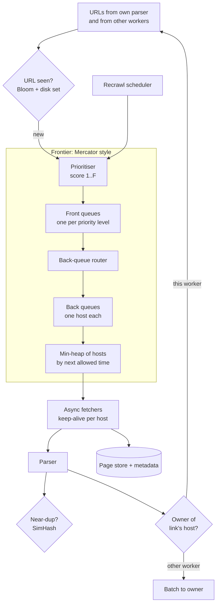
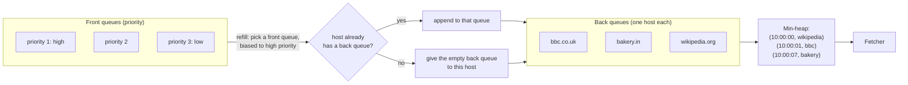

# Web Crawler — L5 (Senior) Interview

> **Level expectation:** the L4 crawl loop is assumed. You now design the parts that decide whether a crawler works at scale: a frontier that is both **polite and prioritised** (front/back queues and a heap of host times), **near-duplicate** detection, **spider-trap** defences, **recrawl scheduling** with conditional requests, **partitioning by host** across machines, and crash recovery. Read [L4-mid.md](L4-mid.md) first.

Legend: **🧑‍💼 Interviewer** · **🧑‍💻 Candidate** · **📝 Note** = commentary for you.

---

## 1. Requirements (sharpened)

Same as L4 (1B pages/month, HTML, polite, robots.txt), plus:
- **Important pages first:** if we can only fetch 1B of 10B known URLs, they should be the most useful billion.
- **Freshness:** news homepages within minutes to hours; most pages within weeks.
- **No near-duplicates** filling the index.
- **Unattended for months:** traps, bad servers and crashes must not need a human.

---

## 2. Architecture of one crawler worker



---

## 3. Deep dives

### 3.1 The frontier: polite *and* prioritised

**🧑‍💼 Interviewer:** You have per-host queues. How does a fetcher find a host it may contact *now*, among millions of hosts, quickly? And where does priority come in?

**🧑‍💻 Candidate:** This is the Mercator design (Najork and Heydon, 2001), still the textbook answer ([URL frontier & politeness](../../concepts/url-frontier-and-politeness.md)). Two layers:

- **Front queues (priority):** F queues, one per priority level. New URLs go to the queue matching their score.
- **Back queues (politeness):** B queues, each holding URLs of **exactly one host** at a time, plus a table `host → back queue`.
- **A min-heap** with one entry per back queue: `(next allowed time, back queue)`. The top is the host that may be contacted soonest.

💡 **Min-heap:** a data structure that always gives you the smallest item in O(log n) time, like Java's `PriorityQueue`. Here "smallest" = earliest allowed time.



A fetcher's loop:
1. Pop the heap top `(t, queue)`. If `t` is in the future, wait until `t`.
2. Take the head URL of that back queue and fetch it.
3. Set the host's next allowed time = now + a delay that adapts: e.g. **10 × the time the fetch took** (Mercator's rule), bounded to, say, 1–60 s. A fast server gets visited often; a struggling one gets breathing room automatically.
4. Push `(new time, queue)` back on the heap.
5. If the back queue is now empty, the host is done for now: refill the queue from the front queues (step "refill" in the diagram), which may assign it a new host.

**Sizing:** the standard textbook treatment of this design (*Introduction to Information Retrieval*, 2008) suggests about **3 back queues per fetcher thread**, so there's always a ready host. With 1,600 concurrent fetches per cluster, spread over 20 workers, that's 80 fetches per worker → ~240 back queues per worker. Millions of hosts wait in the front queues, not in the back queues.

> 📝 **Note:** The elegance to point out: **priority** decides *which* URLs enter the back queues; **politeness** decides *when* each host is served. Separating the two is the senior insight.

### 3.2 Prioritisation: what makes a URL important?

| Signal | Why |
|---|---|
| Link-based importance (how many, and how important, pages link to it: a PageRank-like score computed offline from the last crawl) | Many links in = more people want it |
| Host importance | A new page on a big news site beats one on a parked domain |
| Depth from seed | Shallow pages are usually more important than `/archive/2009/page/412` |
| Listed in sitemap, with `lastmod` recent | The site itself says it's new or changed |
| Recrawl urgency (§3.5) | Known-changing pages that are overdue |

The score maps to front queue 1..F. The refill step picks front queues randomly but **weighted toward high priority**, so low-priority URLs still trickle through instead of starving forever.

### 3.3 Near-duplicate content: SimHash

**🧑‍💻 Candidate:** Exact hashes miss pages that differ by an ad, a date or a session counter. A normal hash changes completely if one byte changes. **SimHash** (Charikar, 2002) is designed so that **similar documents get fingerprints that differ in only a few bits** ([content fingerprinting & dedup](../../concepts/content-fingerprinting-and-dedup.md)):

1. Split the page's text into features (words or short word sequences), each with a weight.
2. Hash each feature to 64 bits. For each bit position, add the weight if that bit is 1, subtract it if 0.
3. The fingerprint's bit i = 1 if the total at position i is positive.

Two pages are near-duplicates if their fingerprints differ in at most **k bits** (Hamming distance). Google reported using 64-bit SimHash with **k = 3** over about 8 billion pages (Manku, Jain and Das Sarma, 2007).

💡 **Hamming distance:** the number of bit positions where two numbers differ. `1011` vs `1001` → 1.

**Finding near matches fast** (not comparing against 8 billion fingerprints): split the 64 bits into 4 blocks of 16. If two fingerprints differ in ≤ 3 bits, at least **one of the 4 blocks is identical** (3 differing bits can touch at most 3 blocks; that's the pigeonhole principle). So keep 4 tables, each indexed by one block; look up the page's 4 blocks and compare only the candidates found.

What to do with a near-duplicate: store a pointer to the original, don't index it separately, and lower that URL's recrawl priority.

### 3.4 Spider traps

**🧑‍💼 Interviewer:** You notice one host has 40 million URLs in your frontier.

**🧑‍💻 Candidate:** Almost certainly a trap. Defences, cheapest first:

| Trap | Defence |
|---|---|
| Endless calendar `?month=…` | **Per-host page budget** proportional to host importance (a small site gets thousands, not millions) |
| Session IDs in URLs (`;jsessionid=…`, `?sid=…`) | Strip known session parameters in normalisation |
| `/a/b/a/b/a/b/…` from broken relative links | Max path depth; reject repeating path segments |
| Very long URLs | Max URL length (~2,000 characters) |
| Many URLs → same content | If a host's pages keep matching the same content hash, stop expanding its links |
| "Soft 404" (a 200 response saying "page not found") | Fetch a random made-up URL on the host once; pages that look like that reply are errors |
| Query-parameter explosion (`?sort=…&filter=…&page=…`) | Limit distinct URLs per path pattern |

> 📝 **Note:** The **per-host budget** is the general answer: it caps damage from traps you didn't predict. Specific rules handle the common cases cheaply.

### 3.5 Recrawl scheduling and freshness

**🧑‍💻 Candidate:** Pages change at very different rates. Keep per-URL history (last fetch, whether it changed) and estimate how often it changes.

- **Adaptive interval:** if the page changed since last time, halve its revisit interval; if not, double it; clamp between, say, 1 hour and 90 days.
- **Conditional requests** make unchanged pages cheap:

```text
GET /news HTTP/1.1
If-None-Match: "a1b2c3"                       ← the ETag (version tag) from last time
If-Modified-Since: Tue, 06 Oct 2026 10:00:00 GMT
→ 304 Not Modified (no body)  or  200 OK with the new page
```

- **Which overdue page next?** Score = importance × probability it changed. If a page changes on average λ times per day and we last saw it I days ago, a common model gives P(changed) = 1 − e^(−λ·I). Example: λ = 0.5/day (every ~2 days), I = 2 days → 1 − e^(−1) ≈ 63%.
- **Sitemaps** with `lastmod` and RSS/Atom feeds tell us about changes directly; poll them often, they're tiny.

The recrawl scheduler feeds due URLs into the same front queues, so recrawls and new discoveries share the politeness budget.

### 3.6 Partitioning across workers

**🧑‍💻 Candidate:** As in L4, `owner = consistentHash(host)` ([consistent hashing](../../concepts/consistent-hashing.md)). Consequences worth stating:
- **The URL-seen set is partitioned too.** A URL is checked only by its host's owner, so each worker keeps a Bloom filter for its own hosts: 12 GB ÷ 20 workers ≈ 600 MB each.
- **Links to other hosts** are batched (e.g. every second or every 1,000 URLs) and sent to their owners. Most links are same-host, so cross-worker traffic is modest.
- **Politeness per IP, not just per host:** shared hosting puts thousands of small sites on one IP. Track a next-allowed time per IP too (after DNS), or that one server gets hammered through many host names.
- **Giant hosts** (wikipedia.org) still live on one worker. That's fine: politeness limits us to ~1 request/s per host anyway, which no worker struggles with. Large sites may allow a higher rate; that's a per-host setting.

### 3.7 Crash recovery

**🧑‍💻 Candidate:** A worker restart must not lose its frontier or re-crawl everything:
- **Front and back queues are disk-backed** append-only files with a read position (like a [Kafka](../../technologies/kafka.md) consumer offset). Only the in-memory heads and the heap are rebuilt on restart.
- **Bloom filter:** snapshot to disk every few minutes; URLs added since the snapshot are re-derived from the queue files.
- **In-flight fetches** are simply lost and re-done. Fetches are effectively idempotent (fetching a page twice changes nothing but our bandwidth bill; see [idempotency](../../concepts/idempotency-and-delivery-semantics.md)).
- **Ownership change** (worker dies for good): its hosts move to neighbours on the ring; their queues are rebuilt from the metadata DB (URLs known but not fetched recently).

### 3.8 Fetcher details that matter

- **Async I/O:** thousands of connections per worker on a few threads (Netty/Node style), not a thread per connection.
- **Keep-alive per host:** reuse the TCP/TLS connection for consecutive pages of the same host. 💡 A TCP handshake plus TLS setup is 2–3 network round trips; reusing the connection skips them.
- **Respect server signals:** `429` and `503` with `Retry-After` → push that host's next allowed time out; repeated errors → exponential backoff per host ([retries & backoff](../../concepts/retries-backoff-and-dlq.md)).
- **Content-type sniffing:** stop downloading early if it's a 2 GB video someone linked as `.html`.

---

## 4. Failure modes

| Failure | Behaviour | Mitigation |
|---|---|---|
| Worker crash | Its hosts pause | Disk-backed frontier; restart; re-fetch in-flight URLs |
| Worker gone for good | Its hosts are orphaned | Consistent-hash reassignment; rebuild queues from metadata DB |
| DNS resolver slow/down | Fetch rate collapses | Local caching resolver; several upstream resolvers; cache negative answers briefly |
| A site goes down | Its URLs fail repeatedly | Per-host backoff; don't burn retries URL by URL |
| Spider trap | Frontier fills with junk from one host | Per-host budgets; trap heuristics; alert on per-host frontier size |
| Bloom filter false positives | ~1% of new URLs skipped | Acceptable; important URLs are rediscovered; optional exact check |
| Object store slow | Fetchers block on writes | Buffer batches locally on disk; back-pressure the frontier if the buffer fills |

---

## 5. Follow-ups

**🧑‍💼 Interviewer:** How do you know the crawler is healthy?

**🧑‍💻 Candidate:** Metrics ([observability](../../concepts/observability.md)): pages/s by status code; fetch latency; bytes/s; frontier size per priority; **top hosts by frontier size** (trap detector); robots.txt fetch failures; DNS cache hit rate; duplicate rate; per-worker cross-traffic. Plus a "freshness" metric: for a sample of important pages, how old is our copy?

**🧑‍💼 Interviewer:** Should the crawler also extract text and build the index?

**🧑‍💻 Candidate:** No: keep the crawler's job to fetching and storing. Parsing for links stays in the crawler (it needs them); indexing, ranking and ML extraction are downstream consumers reading the page store or a [Kafka](../../technologies/kafka.md) topic of "page fetched" events. That way a slow indexer can't slow down crawling, and we can re-index without re-crawling.

---

## 6. What the interviewer was evaluating (L5)

- [ ] Front/back queue frontier with a heap of host times; adaptive per-host delay
- [ ] Separated priority (which URLs) from politeness (when each host)
- [ ] Concrete prioritisation signals and no starvation of low priority
- [ ] SimHash with Hamming distance and the block-table lookup trick
- [ ] Spider-trap defences, with per-host budgets as the general safety net
- [ ] Recrawl scheduling with change-rate estimates and conditional GET
- [ ] Partition by host; partitioned seen-set; per-IP politeness; cross-worker batching
- [ ] Crash recovery with disk-backed queues and idempotent re-fetch

## 7. Common mistakes at this level

| Mistake | Why it hurts at L5 |
|---|---|
| A single priority queue for all URLs | Priority and politeness fight; top-priority host gets hammered |
| Exact hashes only | Index full of near-duplicates |
| Only specific trap rules | The trap you didn't foresee eats the crawl; budgets cap the damage |
| Recrawling everything on a fixed schedule | Wastes the budget on static pages, news goes stale |
| Politeness per host name only | Shared-hosting IPs get overloaded through many names |
| Indexing inside the crawler | Couples crawl speed to indexer speed; can't re-index without re-crawling |

⬅️ Previous: [L4-mid.md](L4-mid.md) · ➡️ Next: [L6-staff.md](L6-staff.md)
