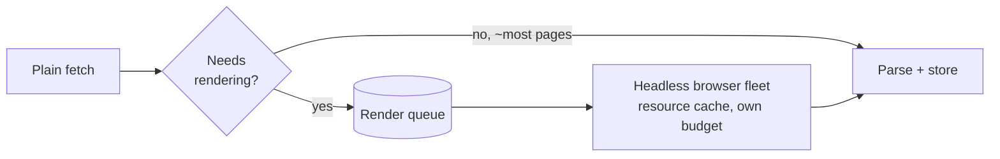

# Web Crawler — L6 (Staff) Interview

> **Level expectation:** the L5 mechanisms are known. The staff conversation is about **spending a fixed budget well** (which pages, how fresh, at what cost), JavaScript rendering economics, running a crawl across regions, being a **good citizen of the web** (and the legal and reputational side of crawling), adversarial content, serving several internal customers, and whether to build at all. Read [L5-senior.md](L5-senior.md) first.

Legend: **🧑‍💼 Interviewer** · **🧑‍💻 Candidate** · **📝 Note** = commentary for you.

---

## 1. Shape the problem: it's a budget problem

**🧑‍💼 Interviewer:** We have a fixed crawl capacity: 1B fetches a month. The web has far more pages than that. How do you decide what to do with it?

**🧑‍💻 Candidate:** Every fetch is spent on one of three things:

| Spend on | Value | Example |
|---|---|---|
| **Discovery** (new URLs) | Coverage: pages we don't have at all | A new article on a news site |
| **Refresh** (known URLs) | Freshness: our copy is up to date | Re-fetching a homepage hourly |
| **Waste** | None | Traps, duplicates, errors, pages nobody will ever search for |

So the plan is: **minimise waste**, then split the rest between discovery and refresh based on what the product needs. A news search product skews to refresh of a small set; a long-tail web search skews to discovery.

**What to measure** (so the split is a decision, not an accident):
- **Coverage of what users want:** sample real search queries; for the pages users clicked in the past, do we have them?
- **Freshness of what users see:** for pages actually shown in results, how stale is our copy versus the live page?
- **Waste rate:** % of fetches that were errors, duplicates, or trap pages.

> 📝 **Note:** Turning "crawl the web" into "allocate a budget and measure value per fetch" is the staff move. It's the same thinking as capacity planning in infra: you never have enough, so you decide what's worth it.

---

## 2. JavaScript rendering: the expensive 10%

**🧑‍💼 Interviewer:** Many modern sites render content with JavaScript. Our HTML-only crawler sees an empty `
`.

**🧑‍💻 Candidate:** Rendering means running a **headless browser** (Chrome without a screen) to execute the page's JavaScript and read the resulting page. It's far more expensive than a plain fetch: it loads scripts, styles and API calls (often dozens of extra requests, all subject to politeness), and uses a lot of CPU and memory per page. The exact multiple varies; plan for it being **one to two orders of magnitude** more costly per page.

So render **selectively**:
1. Fetch HTML as usual.
2. A cheap classifier decides whether rendering would add content: almost-empty body text, known frameworks, a site's history ("rendering this host found 10× more text last time").
3. Rendering goes to a **separate queue and fleet** with its own capacity; it never blocks the plain crawl.
4. Cache the static resources (JS/CSS bundles) across pages of the same site; most pages share them.

> 📝 **Note:** Google publicly describes a similar two-stage approach (crawl, then render later when resources allow). The general lesson: **put the expensive path on its own queue with its own budget**, the same bulkhead idea as in [resilience patterns](../../concepts/resilience-patterns.md).

---

## 3. Multi-region crawling

**🧑‍💻 Candidate:** Crawling a Japanese site from Virginia adds ~150 ms round trips to every request (and TLS setup takes several). Options:

| Option | Pros | Cons |
|---|---|---|
| One region | Simple; one frontier | Slow fetches abroad; more connections in flight for the same rate (Little's law); some sites serve different content by country |
| **Crawl workers in several regions, hosts assigned to the nearest region** | Fast fetches; less cross-ocean bandwidth | Need to place hosts (by IP geolocation of the server); move host ownership between regions |
| Fetch near, store centrally | Pages end up where indexing happens | Cross-region transfer cost for ~20 TB/month compressed (acceptable, and compressed) |

**Design:** host ownership becomes `region(host) → consistentHash(host) within the region`. The region is chosen by where the site's servers are, not where its users are. Pages are compressed in-region and shipped in big batches to central storage. The global URL-seen check stays partitioned by host, so it follows the same ownership.

---

## 4. Being a good citizen (and staying out of trouble)

**🧑‍💼 Interviewer:** A site owner emails: "your crawler took us down last night." What failed, and what do you build so it doesn't happen again?

**🧑‍💻 Candidate:** Likely causes: politeness was per host name but the site served thousands of host names from one small server (per-IP limit missing); or our adaptive delay misread a slow server as fast because errors returned instantly; or a recrawl burst after a deploy reset our per-host state. What to build:

- **Per-IP and per-network limits**, not only per host.
- **Back off on errors**, not just on slowness: a fast `500` is still a struggling server.
- **Persist per-host state** (delays, error counts) across restarts.
- **A clear `User-Agent` with a contact URL**, and an **opt-out channel**: a page explaining the crawler, and a human-monitored address. Honour robots.txt changes within a day.
- **Verify your identity:** publish the IP ranges you crawl from (or support reverse-DNS verification), so sites can tell your crawler from impostors using your user-agent string.

**Legal and policy:** robots.txt is a convention, but ignoring it is a reputational and sometimes legal risk; terms of service, copyright and data-protection law (for example GDPR, the EU's personal-data law) affect what you may store and how you use it. Since 2023 many sites publish separate robots.txt rules for AI-training crawlers versus search crawlers, so the **purpose** of the crawl matters: one crawler identity should not be used for both if sites treat them differently. This is a conversation with legal, not a design choice made alone.

> 📝 **Note:** Staff engineers own the system's impact on *other people's* systems. An infra reader knows this from the receiving end: a misbehaving client gets rate-limited, then blocked, then escalated.

---

## 5. Adversarial content

| Attack | What it looks like | Response |
|---|---|---|
| **Cloaking** | The site serves good content to the crawler's user agent and spam to people | Occasionally fetch with a browser-like profile from unannounced IPs and compare; flag big differences |
| **Link farms** | Thousands of fake sites linking to each other to look important | Importance signals must be robust (don't count links from low-trust clusters); downstream ranking's job too |
| **Generated junk** | Millions of auto-generated pages on cheap domains | Per-domain budgets, content-quality scoring, near-dup clustering |
| **Traps on purpose** | Endless URL spaces to waste crawler budgets | L5's per-host budgets; tighten budgets for low-value hosts |
| **Malicious payloads** | Decompression bombs (tiny gzip → huge output), parser exploits | Limits on decompressed size and parse time; parse in sandboxed processes |

---

## 6. One crawler, several customers

**🧑‍💻 Candidate:** Once a company has a crawler, other teams want it: search, a price-comparison feature, an ML data team, link previews. Each wants different pages, freshness and content types. Options:

- **Shared fetch layer, separate frontiers per customer:** each team submits URLs with its own priority and budget; the **politeness layer is shared**, because the site sees *our company*, not our teams. Without that, three teams each "politely" crawling one site at 1 request/s add up to 3 requests/s.
- **A shared page store** with a "fetched pages" event stream: one fetch can serve several consumers.
- **Quotas and chargeback:** each customer's fetches count against its budget, which forces prioritisation conversations.

> 💡 **Infra analogy:** this is a platform team problem: multi-tenancy with a shared rate limit toward an external dependency, like several services sharing one third-party API key.

---

## 7. Build vs buy

| Option | When |
|---|---|
| **Use existing data (Common Crawl)** | Research, ML datasets, one-off analysis: billions of pages already crawled and published monthly |
| **Open-source crawlers** (Apache Nutch, StormCrawler, Heritrix for archiving, Scrapy for small focused crawls) | Focused or medium crawls; a team that can operate them |
| **Commercial crawling / scraping APIs** | Small targeted needs (a few sites), especially with JS rendering |
| **Build your own** | Web-scale search, or very specific freshness/coverage needs. Years of tuning politeness, traps and quality |

**🧑‍💻 Candidate:** If the need is "analyse the web", start from Common Crawl; you may never fetch a page yourself. Build only if crawl strategy is your product's competitive edge.

---

## 8. Curveballs

**🧑‍💼 Interviewer:** Your frontier keeps growing faster than you can crawl. Is that a problem?

**🧑‍💻 Candidate:** Expected: the web links to more than you'll ever fetch. It only becomes a problem if it fills disks or if junk crowds out good URLs. Cap the frontier: when it's over budget, drop the lowest-priority URLs (they can be rediscovered), and keep per-host caps so one host can't dominate.

**🧑‍💼 Interviewer:** A large site moves to a new domain with redirects for every URL.

**🧑‍💻 Candidate:** Each old URL now costs a fetch that returns a redirect. Detect the pattern (most fetches on host A redirect to host B), then rewrite queued URLs in bulk to the new host, transfer importance and recrawl history, and recrawl the old host rarely. Same idea as handling a site-wide `rel=canonical` change.

**🧑‍💼 Interviewer:** Freshness dropped from a median of 3 days to 9 days, but pages/s is unchanged.

**🧑‍💻 Candidate:** Same throughput, worse freshness → the budget is going somewhere else. Check the waste rate (a trap or duplicate explosion), the discovery/refresh split (a burst of new URLs, maybe a sitemap flood), and whether recrawl priorities are being computed (a broken offline importance job silently falls back to defaults).

---

## 9. What the interviewer was evaluating (L6)

- [ ] Framed crawling as budget allocation: discovery vs refresh vs waste, with metrics for each
- [ ] Selective JavaScript rendering on a separate queue and budget
- [ ] Multi-region host placement and central storage
- [ ] Good-citizen engineering: per-IP limits, error backoff, contact/opt-out, verifiable identity, legal awareness, crawl purpose
- [ ] Adversarial content: cloaking, link farms, bombs
- [ ] Multi-tenant crawler with shared politeness
- [ ] Build vs buy (Common Crawl first)

## 10. Common mistakes at this level

| Mistake | Why it hurts at L6 |
|---|---|
| Optimising pages/s | Pages/s says nothing about value; waste can be most of it |
| Rendering every page | Multiplies cost for little gain on most pages |
| Each team running its own crawler | Combined load breaks politeness; duplicated infrastructure |
| Treating robots.txt and legal as afterthoughts | Blocks, complaints, legal exposure |
| Trusting what sites serve the crawler | Cloaking and spam pollute the index |
| Building before checking Common Crawl | Months of work to get data that already exists |

⬅️ Previous: [L5-senior.md](L5-senior.md) · 🏠 [Problem overview](README.md)
