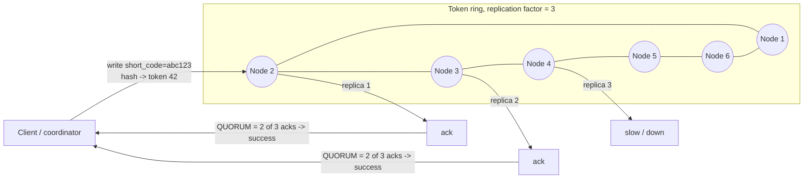
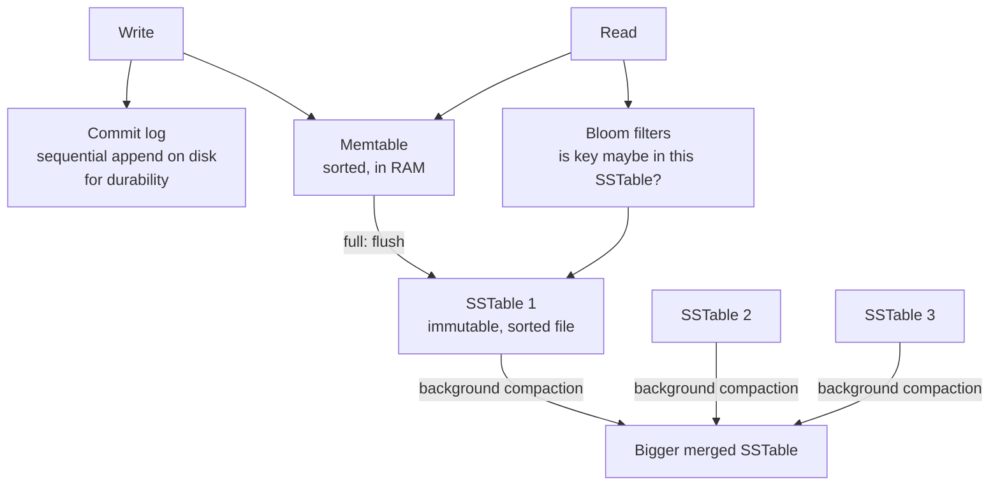

# Cassandra (and DynamoDB)

## 1. One-line summary

Apache Cassandra is a **distributed wide-column NoSQL database** built for **huge write throughput and always-on availability** across many nodes and data centers; **Amazon DynamoDB** is its fully managed cousin with the same core idea: *you look data up by key, and you design tables around your queries*.

---

## 2. The problem it solves

**The pain:** your Postgres primary is at its limit. You need, say, **200k writes/sec** and **50 TB** of data, in several regions, with no downtime when a node or even a whole data center dies. With a single-primary relational DB you're hand-sharding, scripting failovers, and still have a write bottleneck per shard.

**The fix:** a database that is **partitioned and replicated by design**:
- Data is spread across nodes by hashing a **partition key** (via [consistent hashing](../concepts/consistent-hashing.md)). Add nodes → capacity grows roughly linearly.
- Every piece of data is stored on N replicas (usually 3). There is **no single primary** in Cassandra — any replica can take a write (leaderless). Losing a node is a non-event.
- Writes are turned into **sequential appends** (LSM tree), so writes are extremely cheap.

The price: you lose joins, ad-hoc queries, and multi-row transactions. You must know your queries up front.

---

## 3. How it works

### 3.1 Partition key and clustering key

```sql
-- Cassandra CQL
CREATE TABLE urls_by_code (
  short_code text,
  long_url   text,
  user_id    bigint,
  created_at timestamp,
  PRIMARY KEY (short_code)              -- partition key only
);

CREATE TABLE urls_by_user (
  user_id    bigint,
  created_at timestamp,
  short_code text,
  long_url   text,
  PRIMARY KEY ((user_id), created_at, short_code)   -- partition key: user_id
) WITH CLUSTERING ORDER BY (created_at DESC);       -- clustering keys: sort within partition
```

- **Partition key** → decides **which nodes** store the row (`hash(user_id)` → position on the token ring). All rows with the same partition key live together.
- **Clustering key** → decides the **sort order inside a partition**. Lets you do range queries *within* one partition: "user 42's last 20 links".
- Allowed: `WHERE user_id = 42 AND created_at > '2026-01-01' LIMIT 20`.
- Not allowed (without `ALLOW FILTERING` = full cluster scan): `WHERE long_url = '...'` or `WHERE created_at > ...` without a `user_id`.

DynamoDB is the same with different words: **partition key** (hash key) + optional **sort key** (range key); "GSI" (global secondary index) is essentially a second, automatically maintained table keyed differently.

### 3.2 Query-first data modeling (denormalize on purpose)

In Postgres you model **entities** and then write queries. In Cassandra you list **queries** and create **one table per query**:

| Query | Table |
|---|---|
| Redirect: short code → long URL | `urls_by_code` (PK `short_code`) |
| "My links" page: user → their URLs newest first | `urls_by_user` (PK `user_id`, CK `created_at`) |

Yes, the same data is written twice. Disk is cheap; cross-node joins are not. The app (or a batch) writes to both.

**Partition size matters:** keep partitions under ~100 MB / ~100k rows. `PRIMARY KEY (country)` would put all of India's data in one partition on 3 nodes — a **hot partition**.

### 3.3 Ring, replication and tunable consistency



With replication factor **RF = 3**, each write goes to 3 replicas. You choose, **per query**, how many must answer:

| Level | Write waits for | Read asks | Trade-off |
|---|---|---|---|
| `ONE` | 1 replica | 1 replica | Fastest, most available; reads may be stale |
| `QUORUM` | 2 of 3 | 2 of 3 | **Read QUORUM + write QUORUM overlap (2 + 2 > 3) → you read the latest write** |
| `ALL` | 3 of 3 | 3 of 3 | Strongest; one node down = request fails |
| `LOCAL_QUORUM` | quorum in the local DC only | same | Multi-DC standard: strong-ish locally, no cross-ocean latency |

The rule: **R + W > RF** ⇒ strongly consistent reads. This is a dial between consistency and availability (see [CAP and consistency](../concepts/cap-and-consistency.md)).

Replicas that missed writes catch up via **hinted handoff** (a neighbour stores the write and replays it), **read repair**, and periodic **anti-entropy repair**.

DynamoDB hides all of this: 3 replicas across availability zones; reads are **eventually consistent** by default (half the cost) or **strongly consistent** on request.

### 3.4 Why writes are so fast: LSM trees



**LSM tree** = Log-Structured Merge tree:
1. Write = append to commit log + insert into in-memory sorted **memtable**. No disk seeks, no read-before-write. That's why one node can take **~10k–50k+ writes/s**, and a 100-node cluster over a **million**.
2. When the memtable fills, it's flushed as an immutable sorted file (**SSTable**).
3. Background **compaction** merges SSTables and drops overwritten/deleted data.
4. Reads may check the memtable + several SSTables (Bloom filters skip files that don't have the key), so **reads are more expensive than writes** — the opposite of a B-tree database like [Postgres](postgresql.md).

Deletes write a **tombstone** marker; lots of deletes + range reads = slow queries until compaction cleans up. (Classic production pain: using Cassandra as a queue.)

### 3.5 Lightweight transactions (LWT) are expensive

"Insert this short code only if it doesn't exist" needs agreement among replicas:

```sql
INSERT INTO urls_by_code (short_code, long_url) VALUES ('abc123', '...') IF NOT EXISTS;
```

This runs **Paxos** (a consensus protocol): ~4 round trips between replicas instead of 1, so ~**4x latency** and much lower throughput. Fine occasionally (custom aliases), bad on the hot path. Better: generate **unique IDs up front** ([ID generation](../concepts/id-generation.md)) so you never need "if not exists".

DynamoDB's equivalent: **conditional writes** (`attribute_not_exists(short_code)`), which are cheap per item — a nice advantage — plus `TransactWriteItems` for small multi-item transactions at 2x cost.

---

## 4. When to use it

- **Very high write throughput** (events, time series, messages, click logs, IoT): 100k+ writes/s.
- **Massive data** (tens of TB to PB) that won't fit on one node.
- **Simple, known access patterns** — mostly get by key, or range within a key.
- **Always-on / multi-region** requirements: no failover moment, every DC takes writes.
- DynamoDB specifically: you're on AWS and want **zero ops** with predictable single-digit-ms latency at any scale.

## 5. When NOT to use it (and why it's a mistake)

| Situation | Why it's a mistake |
|---|---|
| Data fits on one Postgres node (< few TB, < ~10k writes/s) | You give up SQL, joins, constraints and transactions and take on heavy ops for scale you don't need. |
| Many ad-hoc / analytical queries, or queries not known yet | Each new query pattern = new table + backfill. Use Postgres or a warehouse. |
| Need multi-row ACID (money transfers, inventory) | Only single-partition atomicity; LWTs are slow and limited. |
| Read-heavy with complex filters | LSM reads are costlier than writes; no secondary indexes worth relying on at scale. |
| Small team, self-hosted | Cassandra ops (repairs, compaction tuning, JVM GC, tombstones) are a real burden. Consider DynamoDB/Keyspaces/ScyllaDB Cloud. |

---

## 6. Commonly confused with

| | **Cassandra / DynamoDB** | **PostgreSQL** | **MongoDB** | **Redis** |
|---|---|---|---|---|
| Model | Wide-column / key-value with sorted rows per partition | Relational tables | JSON documents | In-memory data structures |
| Query flexibility | By partition key (+ clustering range) only | Full SQL | Rich queries + secondary indexes on any field | By key only |
| Scaling writes | Linear, leaderless (Cassandra) | One primary | Sharded, one primary per shard | Cluster with one primary per shard |
| Storage | Disk (LSM) | Disk (B-tree heap) | Disk (B-tree, WiredTiger) | RAM |
| Consistency | Tunable per query | Strong (on primary) | Strong on primary by default | Async replication |
| Joins / transactions | No / single-partition only | Yes / full ACID | `$lookup` / multi-doc ACID (since 4.0) | No / Lua, MULTI |
| Best at | Huge write volume, multi-DC availability | Correctness, flexibility | Flexible-schema documents, developer speed | Sub-ms cache, counters |

"NoSQL" is not one thing: MongoDB is closer to "Postgres with JSON and easier sharding" than to Cassandra. Redis is a cache, not a store of record.

---

## 7. Common mistakes / misuse

1. **Choosing it "because scale"** without numbers. At 40 writes/s, Cassandra is all cost.
2. **Modeling it like SQL** — normalized tables then wishing for joins, or using `ALLOW FILTERING` / secondary indexes for the main query (cluster-wide scans).
3. **Bad partition key**: low-cardinality (`country`, `status`) → hot partitions; or unbounded partitions (`user_id` for a user with 50M events) → huge partitions. Fix with bucketing: `PRIMARY KEY ((user_id, month), ts)`.
4. **LWT / "IF NOT EXISTS" on every write** → throughput collapses. Pre-allocate unique IDs instead.
5. **Read-modify-write without LWT** → lost updates (last write wins by timestamp). Use counters, or design writes to be idempotent overwrites.
6. **Queue-like usage** (insert, then delete when processed) → tombstone storms. Use [Kafka](kafka.md).
7. **Saying "eventually consistent" without knowing the dial**: mention `QUORUM` and `R + W > RF`.
8. **DynamoDB hot partition / throttling**: a viral key exceeding per-partition limits (~3,000 reads/s, 1,000 writes/s per partition). Put a cache ([Redis](redis.md), or DAX) in front of hot reads.

---

## 8. Interview cheat-sheet

> "Once writes and storage outgrow a single Postgres primary, I'd move the URL mapping to a partitioned store like Cassandra or DynamoDB, keyed by short code. The partition key is hashed onto a ring of nodes, each row is replicated three times, and I'd read and write at QUORUM so R plus W is greater than the replication factor and reads see the latest write. Writes are cheap because of the LSM-tree design — append to a commit log and an in-memory memtable — so it scales linearly by adding nodes and survives node or zone failures without a failover. The trade-off is query-first modeling: no joins, no ad-hoc queries, so for 'list my URLs' I'd keep a second table keyed by user ID. I'd avoid lightweight transactions on the hot path because they run Paxos and cost several round trips — instead I'd make short codes unique by construction with a range-based ID generator."

---

## 9. Used in

- [URL shortener](../interviews/url-shortener/README.md) — the **L5/L6 at-scale store** for short code → long URL mappings (Cassandra or DynamoDB), replacing the single Postgres from the L4 answer.
- [Notification system](../interviews/notification-system/README.md) — the **notification log / in-app inbox and delivery-status history** at scale (write-heavy, partitioned by user_id, time-ordered).
- [Chat system](../interviews/chat-system/README.md): the **message store**: partition key `conversation_id`, clustering key message `seq`, so "last 50 messages" and "sync since seq N" are single sequential reads; write-heavy at 1M+ messages/s.
- [News feed](../interviews/news-feed/README.md): the **post store** (partitioned by author id, clustered by time-ordered post id, so "latest posts by X" is one partition read for celebrity fan-out on read) and optionally the follow-graph adjacency lists ([graph databases](graph-databases.md)).
- Related concepts: [consistent hashing](../concepts/consistent-hashing.md), [CAP and consistency](../concepts/cap-and-consistency.md), [sharding and replication](../concepts/sharding-and-replication.md), [ID generation](../concepts/id-generation.md).
