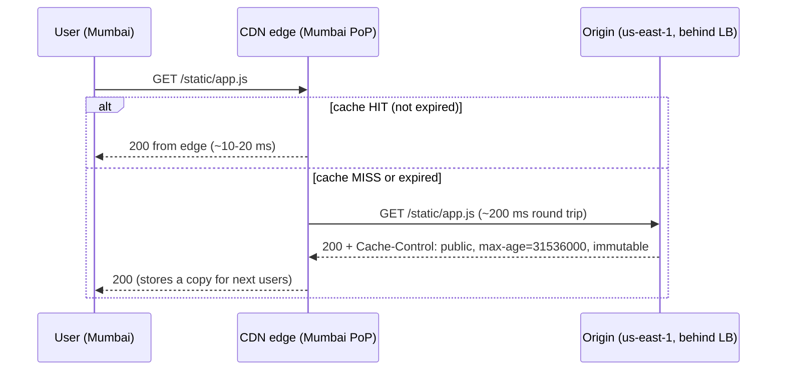

# CDN (Content Delivery Network)

## 1. One-line summary

A CDN is a **globally distributed fleet of caching reverse proxies ("edge servers" / PoPs)** run by a provider like CloudFront, Cloudflare, Akamai or Fastly. Users hit the nearest edge, and if it already has the response cached, your servers never see the request.

---

## 2. The problem it solves

**The pain:** your servers are in `us-east-1`. A user in Mumbai fetching a 2 MB JS bundle pays a round trip of ~200 ms across the world — several times over for TCP + TLS handshakes — and every user worldwide downloads the same file from your origin, burning your bandwidth and CPU.

**The fix:** copies of cacheable responses live in **hundreds of edge locations (PoPs, points of presence)** close to users:
- Latency drops from ~200 ms to ~10–30 ms for cache hits (the edge is in the same city / ISP).
- TLS handshakes terminate at the edge, nearby, which alone saves a lot.
- The origin only sees **cache misses** — with a 95% hit rate, origin traffic drops 20x.
- The CDN absorbs traffic spikes and many DDoS attacks with its huge capacity.

> Infra analogy: a CDN is "nginx with `proxy_cache`" deployed in 300 cities by someone else, with Anycast/GeoDNS steering each user to the nearest box.

---

## 3. How it works

### 3.1 Routing users to the nearest edge

- **GeoDNS**: `cdn.example.com` resolves to a different IP depending on where the resolver is.
- **Anycast**: the same IP is announced from every PoP via BGP; the internet routes you to the nearest one (Cloudflare does this).

### 3.2 Cache-Control headers: the origin tells the CDN what to do

| Header | Meaning |
|---|---|
| `Cache-Control: public, max-age=86400` | Anyone (browser and CDN) may cache for 1 day. |
| `Cache-Control: s-maxage=300, max-age=0` | **Shared caches (CDN)** may cache 5 min; browsers must revalidate. |
| `Cache-Control: private` | Only the user's browser may cache — **never the CDN** (personalized content). |
| `Cache-Control: no-store` | Nobody caches. |
| `immutable` | Content at this URL never changes (fingerprinted files like `app.3f9a2c.js`). |
| `stale-while-revalidate=60` | Serve the stale copy while fetching a fresh one in the background. |
| `ETag` / `Last-Modified` | Allow cheap revalidation (`304 Not Modified`). |
| `Vary: Accept-Encoding` | Cache separate copies per header value. `Vary: Cookie` effectively kills caching. |

The **cache key** is normally the URL (host + path + chosen query params). Anything that changes the response but isn't in the key (cookies, auth headers) is a bug waiting to happen — the CDN might serve user A's page to user B.

### 3.3 What can and can't be cached at the edge

| Cacheable | Not cacheable (or only very carefully) |
|---|---|
| Images, video segments, JS/CSS, fonts | Responses depending on **who** the user is (dashboard, cart) |
| Public API responses identical for everyone (product catalog, a public profile) | Anything requiring per-request **auth checks** at origin |
| Software downloads | Writes (`POST`, `PUT`) |
| Redirects that never change (with care, see below) | Responses where the origin must **see every request** (analytics, rate limiting, billing) |

### 3.4 Invalidation is costly

Once something is cached in 300 PoPs, getting it out is slow and (sometimes) paid:
- **Purge / invalidation API**: CloudFront takes seconds to minutes to propagate; first 1,000 paths/month free, then charged per path. Cloudflare purges are fast but rate-limited.
- Better: **don't invalidate — version the URL**. `app.3f9a2c.js` → new deploy produces `app.81bd07.js`; old file just ages out. Short `max-age` for things that do change (e.g. `index.html`).
- This is the "cache invalidation is hard" problem at global scale — see [caching strategies](../concepts/caching-strategies.md).

### 3.5 Edge compute

CDNs can now run your code at the edge: **Cloudflare Workers**, **CloudFront Functions / Lambda@Edge**, **Fastly Compute**. Uses: header rewrites, A/B routing, auth token checks, geo-blocking — and **serving redirects from the edge** using a small edge key-value store (Cloudflare Workers KV, CloudFront KeyValueStore). The edge function can also fire an async analytics event, which keeps the latency win without losing click data.

Limits: tight CPU/memory budgets (e.g. a few ms of CPU), eventually consistent edge KV stores (writes take seconds to propagate globally), and a different runtime from your Java services.

---

## 4. When to use it

- **Static assets** for any user-facing web/mobile app — essentially always.
- **Large media**: images, video (HLS/DASH segments), downloads.
- **Public, identical-for-everyone responses** with a tolerable staleness window.
- **Global audiences** where latency matters.
- **DDoS protection / WAF** at the edge, TLS termination near users.

## 5. When NOT to use it (and why it's a mistake)

| Situation | Why it's a mistake |
|---|---|
| **Highly personalized / per-user responses** | Hit rate ~0% (every key unique), so every request pays an extra hop; worse, a misconfigured cache key **leaks one user's data to another**. |
| Data that must be **fresh to the second** | You'd set TTL ≈ 0 or purge constantly; then it's just an expensive proxy. |
| When the origin must **observe every request** (click analytics, per-request billing, rate limits) | Cache hits never reach the origin, so those requests are invisible. |
| Internal service-to-service traffic | No geographic distance to save; use a load balancer and Redis. |

### The URL shortener trap: caching 301 redirects

A short URL redirect looks perfectly cacheable: `GET /abc123` → `301 Location: https://long...`. It never changes. But:

- **301 (Moved Permanently)**: browsers cache it **indefinitely by default**; CDNs cache it too. Second click from the same browser never even reaches the CDN, and CDN hits never reach you → **you lose click analytics**, and you can't later change or disable the link (e.g. it's reported as malware).
- **302 (Found / temporary)** with `Cache-Control: no-store` or a short `s-maxage`: every click reaches your service (or an edge function that logs it). More load, but accurate analytics and control.

The L6 nuance: you can get both via **edge compute** — the edge function looks up the mapping in edge KV, returns a 302, and asynchronously sends a click event to your [Kafka](kafka.md) pipeline. Or cache at the CDN with a short TTL and accept sampled/approximate analytics. Say the trade-off out loud.

---

## 6. Commonly confused with

| | **CDN** | **Redis cache** | **Load balancer** |
|---|---|---|---|
| Where | Edge PoPs worldwide, near users | Inside your data center, near app servers | In front of your servers in your DC/region |
| Caches | Full **HTTP responses** (by URL) | **Data** your code chooses (objects, rows) | Nothing (usually) |
| Who controls caching | HTTP headers + CDN config | Your application code | n/a |
| Saves | Network latency to user + origin load/bandwidth | DB load + query latency | Nothing; it **distributes** load |
| Invalidation | Slow/costly purge or URL versioning | `DEL key`, instant | n/a |
| Personalized data | No (unless keyed carefully) | Yes, per user keys fine | n/a |
| Example | CloudFront, Cloudflare, Akamai, Fastly | [Redis](redis.md), Memcached | [ALB, nginx, Envoy](load-balancer.md) |

They stack: **User → CDN edge → load balancer → app servers → Redis → DB.** Each layer catches some requests so the next layer sees fewer.

---

## 7. Common mistakes / misuse

1. **Caching personalized responses** at the CDN (missing `private`, cookie not in cache key) → serving someone else's account page. A real, recurring production incident.
2. **Caching 301s for a URL shortener** and then wondering why analytics show nothing, or being unable to kill a malicious link.
3. **Relying on purges for correctness** instead of versioned URLs + sensible TTLs.
4. **Long TTL on `index.html`** → users stuck on an old app version that references deleted bundles.
5. **`Vary: Cookie` or random query strings** (`?t=timestamp`) → cache key explosion, hit rate near zero.
6. **"Add a CDN" as a generic speed-up** for a dynamic API with no cacheable responses. It doesn't help (beyond TLS/edge networking).
7. **Forgetting the origin can still be overwhelmed** by a synchronized expiry or a purge — enable origin shielding / request collapsing.

---

## 8. Interview cheat-sheet

> "Static assets go behind a CDN like CloudFront, with fingerprinted file names and long `max-age` so we never need to purge. For the redirect endpoint itself, a CDN could serve hot short links from the edge in ~10-20 ms instead of a cross-region round trip, but if we cache redirects — especially 301s, which browsers cache permanently — clicks never reach us, so we lose analytics and the ability to disable a bad link. So I'd return 302 with no-store by default, or, if latency is critical, run the redirect in an edge function backed by an edge key-value store that also emits the click event asynchronously. Personalized or auth-dependent responses are never cached at the CDN."

---

## 9. Used in

- [URL shortener](../interviews/url-shortener/README.md) — the **L6 edge redirect caching discussion**: 301 vs 302, CDN caching vs analytics accuracy, and edge compute for redirects.
- [Chat system](../interviews/chat-system/README.md): **serving chat media** (photos, videos, voice notes) from the edge with short-lived signed URLs; the bytes live in [object storage](object-storage.md) and the message carries only the media reference.
- Related concepts: [caching strategies](../concepts/caching-strategies.md), [back-of-the-envelope](../concepts/back-of-the-envelope.md).
