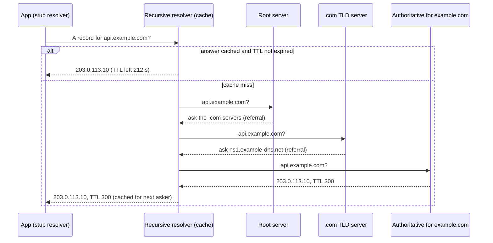

# DNS (Domain Name System)

## 1. One-line summary

**DNS** is the internet's distributed, heavily cached phone book: it turns a name like `api.example.com` into an address like `203.0.113.10` (addresses in this file come from the ranges reserved for documentation), and because every answer carries a **TTL** (how long it may be cached), it is also a slow, coarse-grained tool for **load balancing and failover**.

💡 An **IP address** is the numeric address machines actually connect to (`203.0.113.10` is IPv4; `2001:db8::10` is the longer IPv6 form).

---

## 2. The problem it solves

**The pain:** computers connect to IP addresses, but humans and config files use names. Hard-coding IPs means every server move, scale-out or failover is a config change on every client. A single central lookup table for the whole internet would be impossibly hot and a single point of failure.

**The fix:** a **hierarchy of delegated servers** (each organisation answers for its own names) plus **caching at every layer**, so most lookups never leave your machine or your network's resolver.

> Infra analogy: you already use DNS as service discovery. A Kubernetes `Service` named `orders` in namespace `shop` is reachable as `orders.shop.svc.cluster.local` because **CoreDNS** (the cluster's DNS server) answers that name with the Service's virtual IP ([service discovery](../concepts/service-discovery.md)).

---

## 3. How it works

### 3.1 The players in a lookup

| Player | What it does | Example |
|---|---|---|
| **Stub resolver** | Tiny client inside your OS / JVM. Asks one resolver and waits. Reads `/etc/resolv.conf` on Linux. | `getaddrinfo()`, Java's `InetAddress.getByName` |
| **Recursive resolver** | Does the legwork: walks the hierarchy, **caches** answers for everyone it serves. | your ISP's, `8.8.8.8` (Google), `1.1.1.1` (Cloudflare), CoreDNS in k8s |
| **Root servers** | Know who runs each top-level domain. 13 named servers (`a` to `m.root-servers.net`), each replicated to many sites via **anycast** (the same IP announced from many places, routed to the nearest). | `a.root-servers.net` |
| **TLD servers** | Know who is authoritative for each domain under `.com`, `.org`, `.in`... 💡 **TLD** = top-level domain. | `a.gtld-servers.net` for `.com` |
| **Authoritative server** | Holds the actual records for a domain. The source of truth. | Route 53, Cloudflare DNS, your own BIND (the classic open-source DNS server) |



Referrals for `.com` and popular domains are almost always cached too, so a real cache miss is usually one or two hops, not four. Typical latencies: a few ms when the resolver has it cached, tens to a couple of hundred ms when it must go to a far-away authoritative server.

### 3.2 Record types you'll actually use

| Type | Maps | Example / use |
|---|---|---|
| **A** | name → IPv4 address | `api.example.com A 203.0.113.10` |
| **AAAA** | name → IPv6 address | same, for IPv6 |
| **CNAME** | name → another name (an alias) | `www.example.com CNAME example.cdn-provider.net`: point at a [CDN](cdn.md) or load balancer whose IPs change. Not allowed at the zone apex (`example.com` itself); providers offer "ALIAS"/flattening instead. |
| **NS** | domain → its authoritative name servers | delegation: how `.com` knows who answers for `example.com` |
| **MX** | domain → mail servers, with priority | `example.com MX 10 mx1.example.com` |
| **TXT** | name → free text | domain ownership proofs, SPF/DKIM email-auth policies |
| **SRV** | service → host **and port**, with priority/weight | `_http._tcp.orders.shop.svc.cluster.local` in k8s; also used by SIP, XMPP |

### 3.3 TTLs and caching

Every record carries a **TTL** in seconds. Each cache (recursive resolver, OS, JVM, browser) may reuse the answer until it expires. "Not found" answers (**NXDOMAIN**) are cached too (**negative caching**), for a time the domain owner sets in its **SOA** ("start of authority") record, the settings record every zone has.

The trade-off is the usual cache one ([caching strategies](../concepts/caching-strategies.md)):

| TTL | Pros | Cons |
|---|---|---|
| Long (1 h to 1 day) | fewer lookups, faster, survives DNS outages | changes take hours to reach everyone |
| Short (30 to 60 s) | fast failover and traffic shifting | more queries, more latency on misses, more load on DNS |

Common practice: run with a long TTL, and **lower it a day before a planned migration** (the old long TTL must expire first), then raise it again afterwards.

### 3.4 DNS-based load balancing and GeoDNS

- **Round-robin DNS:** return several A records, clients pick one (usually the first). Spreads load roughly, but DNS has **no idea which servers are healthy or busy**.
- **Weighted / health-checked DNS:** managed DNS (e.g. AWS Route 53) can drop unhealthy IPs from answers and send 10% to a canary region.
- **GeoDNS / latency-based routing:** the authoritative server answers differently depending on **where the query comes from**: Mumbai users get the Mumbai region's IP. It sees the *resolver's* IP, not the user's, unless the resolver passes a slice of the client subnet (**EDNS Client Subnet**, RFC 7871). A user in India using a US-based resolver might be routed to the US.

DNS picks a **region or a front door**; a real [load balancer](load-balancer.md) then picks the healthy server inside it.

### 3.5 Why DNS failover is slower than the TTL says

You set TTL 60 s and fail over. Some clients still hit the dead IP 10 minutes later. Why:

1. **Clients ignore or extend TTLs.** Some resolvers enforce a minimum TTL; some apps cache "forever".
2. **The JVM caches DNS itself.** `InetAddress` keeps its own cache controlled by the security property **`networkaddress.cache.ttl`** (in `$JAVA_HOME/conf/security/java.security`, or `Security.setProperty(...)` before the first lookup). The JDK docs say the default is **cache forever when a security manager is installed**, and an implementation-specific value (**30 s** in current JDKs) when not. Old setups and some app servers still end up caching forever. AWS recommends setting it to 60 s or less. Failed lookups are cached separately via `networkaddress.cache.negative.ttl` (default 10 s).
3. **Long-lived connections never re-resolve.** A connection pool or gRPC channel opened to the old IP keeps using it until the connection breaks. DNS only matters for *new* connections.

So: DNS is fine for "move traffic within minutes", not for "fail over within seconds". For seconds, put a load balancer or anycast IP in front and keep DNS pointing at it.

### 3.6 DNS in a crawler: lookups are a bottleneck

A crawler talks to **millions of different hosts**, so it can't lean on a warm cache the way a normal service does. The Mercator authors (Heydon & Najork, 1999) reported that DNS resolution was a major bottleneck in their crawler, partly because the standard lookup interface they had effectively handled one lookup at a time, and they built their own multi-threaded resolver.

Rough arithmetic at 386 pages/s (1 billion pages a month, see [URL frontier and politeness](../concepts/url-frontier-and-politeness.md)):

```
assume 20% of fetches go to a host not in our cache  → 386 × 0.2 ≈ 77 lookups/s
assume ~100 ms per uncached lookup                   → 77 × 0.1 s ≈ 7.7 s of waiting per second
```

That's ~8 threads doing nothing but waiting on DNS at all times, and far worse if lookups block a shared lock. Hence crawlers:

- run their **own caching recursive resolver** (e.g. Unbound) on or near each crawler node, instead of hammering a shared corporate or public resolver (public resolvers rate-limit heavy users);
- **resolve asynchronously and ahead of time**, when a host's URLs enter its back queue, so the IP is ready when the fetch is due;
- cache per host alongside robots.txt and politeness state, and group politeness by **IP** as well as hostname.

### 3.7 Infra analogy: CoreDNS and `ndots:5`

A pod's `/etc/resolv.conf` typically looks like:

```
nameserver 10.96.0.10
search shop.svc.cluster.local svc.cluster.local cluster.local
options ndots:5
```

**`ndots:5`** means "if the name has fewer than 5 dots, try the search suffixes first". So a pod in namespace `shop` resolving `api.stripe.com` (2 dots) asks:

```
api.stripe.com.shop.svc.cluster.local   → NXDOMAIN
api.stripe.com.svc.cluster.local        → NXDOMAIN
api.stripe.com.cluster.local            → NXDOMAIN
api.stripe.com.                         → answer
4 names × 2 record types (A and AAAA) = 8 queries, 6 of them wasted
```

Fixes: use a fully qualified name with a trailing dot (`api.stripe.com.`), lower `ndots` via the pod's `dnsConfig`, or run NodeLocal DNSCache. Same lesson as the crawler: DNS volume and latency are real costs.

### 3.8 Try it yourself with `dig`

```bash
dig api.github.com +short          # just the IPs
dig api.github.com                 # full answer: note the TTL column
dig api.github.com                 # run again: TTL has counted down (served from cache)
dig +trace example.com             # walk root → .com → authoritative yourself
dig AAAA google.com +short         # IPv6 addresses
dig MX gmail.com +short            # mail servers with priorities
dig TXT google.com +short          # SPF and verification strings
dig NS example.com +short          # who is authoritative
dig @1.1.1.1 example.com           # ask a specific resolver (Cloudflare)
```

---

## 4. When to use it

- **Naming every endpoint** clients reach, so IPs can change without client changes.
- **Coarse global traffic steering**: GeoDNS / latency routing to the nearest region, weighted shifts between regions.
- **Planned migrations and DR** (disaster recovery), where minutes of convergence are acceptable.
- **Service discovery** inside k8s (Services, headless Services returning pod IPs, SRV records).

## 5. When NOT to use it (and why it's a mistake)

| Situation | Why |
|---|---|
| Sub-second or seconds-level failover | TTLs, JVM caches and pooled connections delay it for minutes. Use a load balancer, anycast or client-side health checks. |
| Fine-grained load balancing between servers | DNS can't see load or per-request health, and clients cache one answer. |
| Carrying changing per-request data or config | Not what it's for; caching makes changes unpredictable. Use a config service ([ZooKeeper / etcd](zookeeper-etcd.md)). |
| Crawling via a shared public resolver at high volume | You'll be rate-limited and slow. Run your own caching resolver. |

---

## 6. Commonly confused with

| | **DNS** | **Load balancer** | **Service registry (Consul, Eureka)** | **CDN** |
|---|---|---|---|---|
| Answers | name → IPs | picks a backend per connection/request | name → healthy instances + metadata | serves cached content near users |
| Health-aware | only managed DNS with health checks, delayed by TTL | yes, seconds | yes, seconds | yes |
| Granularity | per lookup (cached by clients) | per connection / request | per lookup, client re-polls | per request |
| Typical role | front door, region selection | spread load inside a region | internal microservice discovery | static and media delivery |

---

## 7. Common mistakes / misuse

1. **"We'll fail over with DNS in 5 seconds."** Not with real-world caches and connection pools.
2. **Forgetting the JVM DNS cache** (`networkaddress.cache.ttl`): a service keeps calling a decommissioned IP after a blue/green switch.
3. **Very low TTLs everywhere** "just in case": more latency on misses, more DNS load, little real benefit.
4. **Not lowering the TTL ahead of a migration**, then waiting a day for the old TTL to expire.
5. **Ignoring `ndots:5` in k8s**: external calls generate 4× the DNS queries and CoreDNS becomes a hotspot.
6. **Crawler design with no DNS story**: synchronous lookups on fetcher threads, no caching resolver.

---

## 8. Interview cheat-sheet

> "Clients resolve our domain through their recursive resolver, which caches answers for the record's TTL; on a miss it walks from the root to the .com servers to our authoritative DNS. I'd use DNS with latency-based routing to pick a region, and a load balancer inside the region to pick healthy servers, because DNS failover is limited by TTLs, by clients that cache longer (the JVM has its own cache, networkaddress.cache.ttl), and by pooled connections that never re-resolve. For a crawler DNS is a real bottleneck since it hits millions of hosts: at about 77 uncached lookups per second and 100 ms each, that's 8 threads just waiting, so I'd run a local caching resolver, resolve asynchronously when a host's URLs enter its queue, and cache IPs per host alongside robots.txt."

---

## 9. Used in

- [Web Crawler](../interviews/web-crawler/README.md): **DNS resolution as a crawler bottleneck**: local caching resolver, asynchronous pre-resolution per host, politeness grouped by IP (see the [L4](../interviews/web-crawler/L4-mid.md), [L5](../interviews/web-crawler/L5-senior.md) and [L6](../interviews/web-crawler/L6-staff.md) answers).
- [Search autocomplete](../interviews/search-autocomplete/README.md): GeoDNS/anycast to send each keystroke to the nearest region, because network round trips dominate the latency budget.
- 🔍 [Under the Hood: what happens when you type a URL](../../under-the-hood/what-happens-when-you-type-a-url.md): DNS as step one of the full request journey.
- Related: [URL frontier and politeness](../concepts/url-frontier-and-politeness.md), [content fingerprinting and dedup](../concepts/content-fingerprinting-and-dedup.md), [CDN](cdn.md) (GeoDNS / anycast routing to edges), [load balancer](load-balancer.md), [service discovery](../concepts/service-discovery.md), [caching strategies](../concepts/caching-strategies.md).
