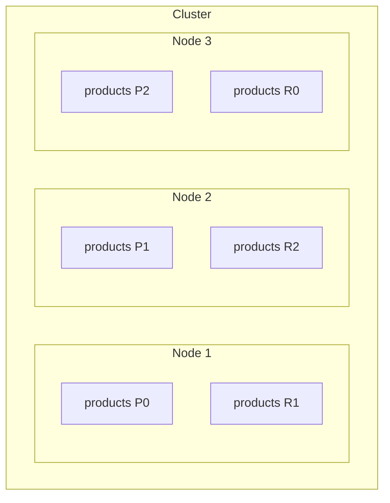
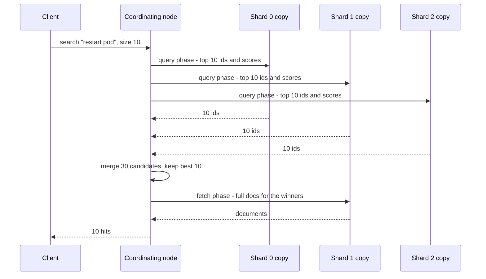

# Elasticsearch

## 1. One-line summary

**Elasticsearch** is a distributed search engine built on the **Apache Lucene** library: you send it JSON documents over HTTP, it builds [inverted indexes](../concepts/inverted-index.md) split into **shards** spread across nodes, and it answers full-text, autocomplete and aggregation queries in milliseconds, with new data searchable about **1 second** after it's written.

💡 **Lucene** is a Java library (a jar, not a server) that builds and searches inverted indexes on one machine. Elasticsearch adds the HTTP API, clustering, sharding, replication and the query language on top. **OpenSearch** is a 2021 fork of Elasticsearch (section 6).

---

## 2. The problem it solves

**The pain:** your product data lives in [PostgreSQL](postgresql.md). Users want a search box that:

- finds `restart pod` in "How to **restart** a Kubernetes **pod**" (words in any order, any case, any form: "restarting"),
- ranks the best matches first,
- suggests completions as they type,
- shows counts per category next to the results ("Docs (120), Blog (14)").

`WHERE title LIKE '%restart%'` can't use an index, scans every row, ignores word forms and has no ranking. Building Lucene into your own service means writing sharding, replication and failover yourself.

**The fix:** run a search cluster next to your database. Copy (index) the searchable fields into it, query it for search, and keep the database as the source of truth.

> Infra analogy: you probably already run it. The "E" in the **ELK** stack (Elasticsearch, Logstash, Kibana) is where your logs go; Kibana's search bar is a query against inverted indexes over log lines.

---

## 3. How it works

### 3.1 Vocabulary

| Term | Meaning | Infra analogy |
|---|---|---|
| **Cluster** | a set of nodes that share data and elect one **master** to manage metadata | a k8s cluster with its control plane |
| **Node** | one Elasticsearch process (a JVM) | a pod |
| **Index** | a named collection of documents, like a table | a Deployment, one logical thing made of replicas |
| **Document** | one JSON object with an `_id` | a row |
| **Mapping** | the schema: field names and types (`text`, `keyword`, `date`, ...) and analyzers | a CRD schema |
| **Shard** | one slice of an index; each shard is a full Lucene index | one partition of a Kafka topic |
| **Replica** | a copy of a shard on a different node, for failover and read throughput | a replica pod on another node |

Since version 7.0 a new index gets **1 primary shard and 1 replica** by default (before 7.0 it was 5 primaries).



Index `products` with 3 primaries (P) and 1 replica each (R): a primary and its replica never share a node, so losing any one node loses no data.

### 3.2 Write path and routing

Each document goes to one shard: `shard = hash(_routing) % number_of_primary_shards`, where `_routing` defaults to the document `_id`. Because of that modulo, **the number of primary shards is fixed at index creation**; changing it means the `_split`/`_shrink` APIs or reindexing into a new index (compare [consistent hashing](../concepts/consistent-hashing.md), which avoids this).

The primary writes the document to its in-memory buffer and its **translog** (a write-ahead log: an append-only file of changes, replayed after a crash), forwards it to the replicas, and acknowledges once they have it.

### 3.3 Near-real-time refresh

New documents become searchable on **refresh**, which turns the buffer into a new immutable Lucene **segment**. The default `refresh_interval` is **1 s**, hence "near-real-time". Details in [inverted index: segments and merges](../concepts/inverted-index.md).

- Need read-your-write in a test or after a user action? Index with `?refresh=wait_for` (waits for the next refresh) instead of forcing refreshes constantly.
- Bulk loading? Set `refresh_interval` to `30s` or `-1` (off) during the load: fewer tiny segments, much faster indexing.
- Since 7.0, if you haven't set `refresh_interval` explicitly, a shard that hasn't received a search for 30 s ("search idle") skips scheduled refreshes until the next search arrives.

### 3.4 Read path: query then fetch



The node that receives the request (**coordinating node**) asks one copy (primary or replica) of every shard for its local top results, merges them, then fetches the winning documents. Scores use **BM25** ([inverted index](../concepts/inverted-index.md)).

**Deep pagination** is where this hurts. `from=10000, size=10` means every shard must return its top **10,010**:

```
20 shards × 10,010 = 200,200 entries sent to and sorted by one coordinating node, to show 10 results
```

That's why `index.max_result_window` defaults to **10,000** and deeper `from + size` is rejected. Use `search_after` (continue after the last sort value, ideally with a **point in time** so the data doesn't shift under you) instead; it's keyset pagination ([pagination](../concepts/pagination.md)).

### 3.5 Three ways to build autocomplete

| | **Completion suggester** | **`search_as_you_type` field** | **Edge n-gram analyzer** |
|---|---|---|---|
| How | field type `completion`, stored as an in-memory **FST** (a compact weighted prefix graph, see [tries](../concepts/tries-and-prefix-search.md)) | field type that auto-creates subfields for 2- and 3-word shingles and prefixes | custom analyzer: index `k`, `ku`, `kub`, ... for every word |
| Matches | prefix of the **whole input** (you can add several inputs per doc) | prefix of **any word**, word order aware | prefix of **any word** |
| Speed | fastest (no scoring of postings) | fast | fast, bigger index |
| Ranking | a static `weight` per input | normal BM25 + any query logic | normal BM25 + any query logic |
| Filters | only "contexts" (category / geo) | any query filter | any query filter |
| Good for | query suggestions with popularity weights | product / title search-as-you-type | full control over tokenisation |

For **query suggestions** (the Search Autocomplete interview), the completion suggester maps directly onto "top-k completions by weight". For **search-as-you-type over documents**, use `search_as_you_type` or edge n-grams.

### 3.6 Try it locally with `curl`

Start a single throwaway node (security disabled, local use only):

```bash
docker run -d --name es -p 9200:9200 \
  -e discovery.type=single-node -e xpack.security.enabled=false \
  -e ES_JAVA_OPTS="-Xms1g -Xmx1g" \
  docker.elastic.co/elasticsearch/elasticsearch:8.15.3
curl -s localhost:9200            # cluster name, version, "You Know, for Search"
```

Create an index with both autocomplete styles, add documents, query:

```bash
curl -s -X PUT localhost:9200/queries -H 'Content-Type: application/json' -d '{
  "mappings": { "properties": {
    "text":    { "type": "search_as_you_type" },
    "suggest": { "type": "completion" }
  } } }'

curl -s -X POST 'localhost:9200/queries/_doc?refresh=wait_for' -H 'Content-Type: application/json' \
  -d '{"text": "java stream api", "suggest": {"input": ["java stream api"], "weight": 300}}'
curl -s -X POST 'localhost:9200/queries/_doc?refresh=wait_for' -H 'Content-Type: application/json' \
  -d '{"text": "javascript promises", "suggest": {"input": ["javascript promises"], "weight": 1200}}'

# 1. Completion suggester: prefix of the whole input, ordered by weight
curl -s localhost:9200/queries/_search -H 'Content-Type: application/json' -d '{
  "suggest": { "s": { "prefix": "jav", "completion": { "field": "suggest", "size": 5 } } } }'

# 2. search_as_you_type: matches a prefix of ANY word ("stre" finds "java stream api")
curl -s localhost:9200/queries/_search -H 'Content-Type: application/json' -d '{
  "query": { "multi_match": { "query": "stre", "type": "bool_prefix",
    "fields": ["text", "text._2gram", "text._3gram"] } } }'

curl -s 'localhost:9200/_cat/shards/queries?v'   # where the shards live
```

What to look for in the JSON: the first query lists both entries under `suggest.s[0].options`, `javascript promises` first because its weight (1200) is higher. The second has only `java stream api` in `hits.hits`, because no word in "javascript promises" starts with `stre`. Clean up with `docker rm -f es`.

---

## 4. When to use it

- **Full-text search** over products, docs, tickets, with ranking, typo tolerance (`fuzziness`), synonyms and highlighting.
- **Autocomplete / search-as-you-type** (section 3.5).
- **Log and event search** with aggregations ([observability](../concepts/observability.md)).
- **Faceted navigation**: filters with counts per category, price ranges.
- As a **read-optimised secondary index** fed from your database via a change stream ([Kafka](kafka.md), CDC).

## 5. When NOT to use it (and why it's a mistake)

| Situation | Why |
|---|---|
| **Primary database / source of truth** | No multi-document transactions, refresh delays visibility, and mapping changes often mean reindexing. Keep the truth in a database and make the index rebuildable. |
| **Strong consistency** (balances, inventory decrements, unique usernames) | Reads may hit a replica that hasn't caught up and search is NRT. Per-document optimistic concurrency exists (`if_seq_no` / `if_primary_term`), but there's nothing like a cross-document transaction. |
| **Simple key-value lookups** | [Redis](redis.md) or a database primary key is cheaper and faster. |
| **Heavy update-in-place workloads** (counters updated per click) | Every update is delete + reindex of the whole document plus a later merge. Aggregate elsewhere ([counters at scale](../concepts/counters-at-scale.md)) and index periodically. |
| **Small data that Postgres handles** | Postgres full-text search (`tsvector`) avoids running a second system. |

---

## 6. Commonly confused with

| | **Elasticsearch** | **OpenSearch** | **Apache Lucene** | **Apache Solr** | **Postgres full-text** |
|---|---|---|---|---|---|
| What | distributed search server | fork of Elasticsearch 7.10.2 | Java library, one machine | distributed search server | feature inside the database |
| Built on | Lucene | Lucene | itself | Lucene | Postgres GIN indexes |
| Owner / license | Elastic (see below) | Linux Foundation project, Apache 2.0 | Apache | Apache | PostgreSQL license |
| Use when | you want the Elastic stack | AWS-managed or Apache-licensed stack | embedding search in an app | existing Solr shop | modest search needs, one less system |

**The fork, briefly:** in **January 2021** Elastic moved new Elasticsearch releases from the Apache 2.0 license to a choice of the Server Side Public License (SSPL) or the Elastic License, largely in response to cloud providers selling it as a service. AWS forked the last Apache-licensed version (7.10.2) as **OpenSearch** (1.0 released in **2021**). In **2024** Elastic added the AGPL as a third license option, and OpenSearch moved to a Linux Foundation foundation. APIs were identical at the fork and have drifted since; client libraries and some features differ.

---

## 7. Common mistakes / misuse

1. **Mapping explosion.** By default, every new JSON key becomes a new field (**dynamic mapping**). Index logs with keys like `{"user_123": ...}` and you get thousands of fields, a bloated cluster state (the metadata every node holds) and memory pressure. There's a guard rail, `index.mapping.total_fields.limit` (default 1,000). Fix: `"dynamic": "strict"` or `false`, or the `flattened` field type for arbitrary key-value data.
2. **Too many shards.** Each shard is a Lucene index with its own memory, file handles and threads. 1,000 daily indexes × 5 shards × 2 copies = 10,000 shards of 50 MB each is a classic way to melt a cluster. Elastic's sizing guidance has long suggested shards of roughly **10–50 GB**, and each node refuses more than `cluster.max_shards_per_node` (default 1,000) shards. Use fewer shards, rollover by size, and ILM (index lifecycle management: automatic rollover/delete by age or size).
3. **Deep pagination** with `from`/`size` (section 3.4). Use `search_after` with a point in time.
4. **`text` vs `keyword` confusion.** A `text` field is analyzed (split into words) and can't be sorted or aggregated sensibly; `keyword` is the exact string. Dynamic mapping creates both (`title` and `title.keyword`).
5. **Forgetting it's NRT** and asserting on search results immediately after indexing in tests.
6. **Split brain, the history lesson.** Before 7.0, you had to set `discovery.zen.minimum_master_nodes` to a majority of master-eligible nodes yourself (3 nodes → 2). Leave it at the default of 1 and a network partition could elect **two masters**, each accepting writes, with data lost on reconcile. Jepsen tests in 2014–2015 also showed acknowledged writes being lost under partitions in 1.x versions. Since **7.0** the cluster manages its voting quorum automatically. Interview lesson: any leader election needs a majority quorum ([consensus and Raft](../concepts/consensus-and-raft.md)), and use an **odd number (3) of dedicated master-eligible nodes**.
7. **Huge JVM heaps.** Keep the heap at or below about half the machine's RAM (and under ~31 GB so the JVM keeps compressed object pointers, 4-byte references instead of 8); Lucene relies on the OS **page cache** (file data the OS keeps in spare RAM) for the rest.

---

## 8. Interview cheat-sheet

> "Elasticsearch is a distributed layer over Lucene inverted indexes. An index is split into primary shards chosen by hash of the document ID, so the primary count is fixed at creation, and each shard has replicas on other nodes. Writes go to the primary and translog then replicas; they become searchable on refresh, every second by default, so it's near-real-time, not read-your-write. Searches scatter to one copy of each shard and gather the top results, which is why deep from/size pagination is capped at 10,000 and you use search_after instead. For autocomplete I'd use the completion suggester, an in-memory FST with weights, for query suggestions, or search_as_you_type / edge n-grams for matching inside titles. It's a secondary index fed from the database, never the source of truth, and I'd watch shard count, mapping explosion and use three dedicated master nodes."

---

## 9. Used in

- [Search Autocomplete](../interviews/search-autocomplete/README.md): an off-the-shelf alternative to a custom trie service (completion suggester with popularity weights, or `search_as_you_type` for matching inside titles), and its trade-offs against a precomputed in-memory trie.
- Related: [inverted index](../concepts/inverted-index.md), [tries and prefix search](../concepts/tries-and-prefix-search.md), [top-k and heavy hitters](../concepts/top-k-and-heavy-hitters.md), [sharding and replication](../concepts/sharding-and-replication.md), [pagination](../concepts/pagination.md), [Kafka](kafka.md) (feeding the index).
