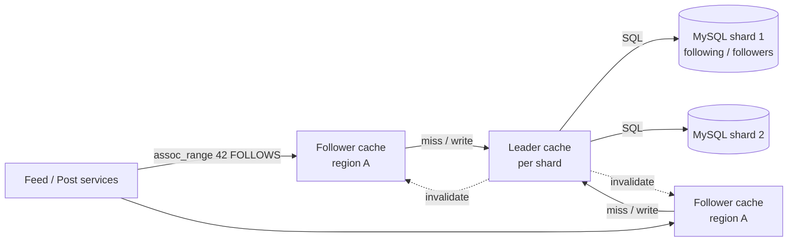

# Graph databases (and storing social graphs without one)

## 1. One-line summary

A **social graph** is "who follows / is friends with whom". You can store it as **adjacency lists in an ordinary sharded database** (one row per edge, kept in both directions) with a cache in front, like Facebook's **TAO**, or in a **native graph database** (Neo4j, Amazon Neptune) that is built to walk many hops of relationships quickly. For a news feed's 1-hop "who do I follow?" question, the boring sharded table wins almost every time.

💡 **Graph** here means the math kind: **nodes** (users, posts) connected by **edges** (follows, likes). An **edge** is one relationship, e.g. "Asha follows Ravi". **1-hop** = your direct connections; **2-hop** = connections of your connections.

---

## 2. The problem it solves

**The pain:** the feed needs two questions answered, millions of times a second:

- "Who does user 42 follow?" (to build 42's feed at read time)
- "Who follows user 7?" (to push 7's new post into followers' feeds, i.e. [fan-out](../concepts/fan-out.md) on write)

Scale for an Instagram-sized app: 500M users × 200 follows on average = **100 billion edges**. At ~30 bytes per edge (two 8-byte IDs + timestamp + overhead) that is `100B × 30 B = 3 TB` **per direction**, so ~6 TB for both. That does not fit on one machine, and a naive `SELECT follower_id FROM follows WHERE followee_id = 7` on a single table indexed only one way scans everything.

**The fix:** store each edge **twice**, once per direction, in tables **sharded by the user the query starts from**, so each question is a single-shard range read. Put a write-through graph cache in front, because reads outnumber writes ~500:1 (people scroll far more than they follow).

> Infra analogy: like keeping both a forward DNS zone (name → IP) and a reverse zone (IP → name). Same facts, stored twice so each lookup direction is one cheap query.

---

## 3. How it works

### 3.1 Adjacency lists in a relational / key-value store

An **adjacency list** is just "for each node, the list of its neighbours". In SQL:

```sql
-- "who does user_id follow?"  sharded by user_id
CREATE TABLE following (
  user_id      BIGINT,
  followee_id  BIGINT,
  created_at   TIMESTAMP,
  PRIMARY KEY (user_id, followee_id)
);

-- "who follows user_id?"  sharded by user_id (the person being followed)
CREATE TABLE followers (
  user_id      BIGINT,
  follower_id  BIGINT,
  created_at   TIMESTAMP,
  PRIMARY KEY (user_id, follower_id)
);
```

- A **follow** writes one row to each table. They usually live on **different shards** (shard of 42 vs shard of 7), so the second write is done asynchronously (via [Kafka](kafka.md) or a retry queue) and the two can disagree for a moment. That is fine: "followed 2 s ago" being invisible for 2 s hurts nobody.
- Both reads are a **primary-key range scan on one shard**: `SELECT followee_id FROM following WHERE user_id = 42 LIMIT 1000`.
- Store follower **counts** in a separate row (see [counters at scale](../concepts/counters-at-scale.md)), never `COUNT(*)` over 100M follower rows.
- Works in [PostgreSQL](postgresql.md)/MySQL (sharded), or in [Cassandra](cassandra.md) where partition key `user_id` + clustering key `followee_id` gives exactly this layout. See [sharding and replication](../concepts/sharding-and-replication.md).

💡 **Shard** = one slice of the data living on its own DB server. **Range scan** = reading consecutive rows in index order, which is fast because they sit next to each other on disk.

### 3.2 A TAO-style graph cache

Facebook's **TAO** ("The Associations and Objects") is a read-through, write-through **cache layer** over sharded MySQL, specialised for graph data. In plain words:

- It knows only two things: **objects** (a user, a post, with an ID and fields) and **associations** (typed edges: `FOLLOWS`, `LIKES`, `AUTHORED`, each with a timestamp).
- Its API is tiny: `assoc_add`, `assoc_delete`, `assoc_range(id, type, offset, limit)` ("newest 50 people 7 follows"), `assoc_count(id, type)`.
- Each association list is cached as a unit, sorted by time, so "latest N" is a slice of an in-memory list.
- **Leader / follower cache tiers:** many follower caches per region serve reads; writes go through one leader cache per shard which updates MySQL and invalidates the followers. That keeps the DB from seeing thundering herds.
- Reads hit cache >99% of the time; MySQL is mostly the durable source of truth.



You don't need to build TAO in an interview. Saying "adjacency lists sharded by user id, both directions, with a write-through cache in front (Redis or a TAO-like tier)" is the expected answer. See [caching strategies](../concepts/caching-strategies.md) and [Redis](redis.md).

### 3.3 Native graph databases

A **native graph database** (Neo4j, Amazon Neptune, JanusGraph) stores each node with **direct pointers to its neighbours** ("index-free adjacency"), so walking from a node to its neighbours costs the same no matter how big the graph is. You query with a graph language:

```cypher
// Neo4j Cypher: friends-of-friends of Asha who are not already her friends
MATCH (a:User {id: 42})-[:FRIEND]->(f)-[:FRIEND]->(fof)
WHERE NOT (a)-[:FRIEND]->(fof) AND fof <> a
RETURN fof.id, count(*) AS mutual ORDER BY mutual DESC LIMIT 20
```

In SQL the same thing is a self-join per hop; at 3–4 hops the joins explode. Graph DBs shine exactly there:

- **Friends of friends** / "people you may know" with mutual-friend counts.
- **Fraud rings:** 10 accounts that share 3 devices and 2 credit cards, found by walking account → device → account → card.
- **Recommendations:** "users who liked X also liked Y" over a few hops; knowledge graphs; network topology / dependency graphs.

The catch: graph traversals jump randomly across the graph, so **sharding a graph DB is hard** (any hop may cross machines). Neo4j's sweet spot is a graph that fits on one big server (billions of edges at most) with replicas for reads.

---

## 4. When to use it

- **Adjacency lists in a sharded store (+ cache):** 1-hop questions at huge scale: followers, following, "did I like this post?", "is X blocked by Y?". This is the news-feed case.
- **Native graph DB:** multi-hop questions (2+ hops) where the shape of the path matters: PYMK, fraud detection, access-control graphs, recommendation exploration. Often fed **offline** from the main store, not on the hot request path.
- **Offline graph processing (Spark GraphX, Pregel-style jobs):** whole-graph computations like PageRank or community detection, run in batch and written back as precomputed results.

## 5. When NOT to use it (and why it's a mistake)

| Situation | Why |
|---|---|
| Neo4j for 1-hop follower lists at 100B edges | You pay for traversal power you never use, and you inherit a store that is hard to shard. A `followers` table partitioned by `user_id` serves the same read as one range scan. |
| Live 3-hop query per feed request | Even in a graph DB, a 3-hop walk from a user with 1,000 friends touches 1,000 × 1,000 × 1,000 paths. Precompute PYMK offline. |
| Storing only one direction of the edge | "Who follows 7?" becomes a scatter-gather over every shard. Store both directions. |
| Celebrities as ordinary adjacency rows with no special handling | A 100M-follower list is a giant partition; page it, and use fan-out on read for them. |

---

## 6. Commonly confused with

| | **Adjacency list in SQL/KV** | **TAO-style graph cache** | **Native graph DB (Neo4j/Neptune)** | **Wide-column (Cassandra)** |
|---|---|---|---|---|
| What it is | Edge table(s) with an index | Cache tier + API over sharded SQL | DB with pointer-based traversal | Partitioned KV with sorted rows |
| Best query | 1-hop: list/count neighbours | 1-hop, very read-heavy, time-ordered | Multi-hop paths, pattern matching | 1-hop range reads at huge write rates |
| Scale | Billions of edges (sharded) | Trillions of reads/day at Facebook | Typically one big machine + replicas | Billions+ of edges |
| Consistency | Per shard; two directions eventually | Eventual across regions | Usually strong on the leader | Tunable |
| Example use | `followers(user_id, follower_id)` | Facebook social graph | Fraud rings, PYMK | Follower lists in a Cassandra cluster |

---

## 7. Common mistakes / misuse

1. **"It's a social network, so I need a graph DB."** The feed asks 1-hop questions; interviewers want to hear that a sharded table does it.
2. **One table, one direction.** Then fan-out on write ("who follows me?") is a cross-shard scan.
3. **Synchronous dual write of both directions** across shards in one distributed transaction. Use async repair; tolerate seconds of lag.
4. **`COUNT(*)` for follower counts.** Keep a denormalized counter.
5. **Loading a celebrity's 100M followers in one call.** Page by `follower_id` cursor (see [pagination](../concepts/pagination.md)), or don't fan out for them at all.
6. **Ignoring unfollow and block.** Deletes must remove both directions and invalidate caches, or a blocked user keeps seeing posts.

---

## 8. Interview cheat-sheet

> "The follow graph is about 100 billion edges, so I store it as adjacency lists: a `following` table and a `followers` table, both keyed and sharded by user id, so 'who do I follow' and 'who follows me' are each a single-shard range scan. A follow writes both rows, the second asynchronously, and we accept a few seconds of inconsistency. A TAO-style write-through cache sits in front because graph reads outnumber writes by hundreds to one. Counts are stored as separate counters, never computed. I'd only bring in a native graph database like Neo4j or Neptune for multi-hop questions such as friends-of-friends or fraud rings, and even then I'd run them offline rather than on the feed's request path."

---

## 9. Used in

- [News feed](../interviews/news-feed/README.md): the **follow graph** (`followers` / `following` adjacency lists sharded by user id, TAO-like cache in front) used by fan-out on write to find a poster's followers and by fan-out on read to find whom a user follows; graph DBs come up only for "people you may know" at L6.
- Related: [fan-out](../concepts/fan-out.md), [sharding and replication](../concepts/sharding-and-replication.md), [caching strategies](../concepts/caching-strategies.md), [Cassandra](cassandra.md), [PostgreSQL](postgresql.md), [Redis](redis.md), [pagination](../concepts/pagination.md).
