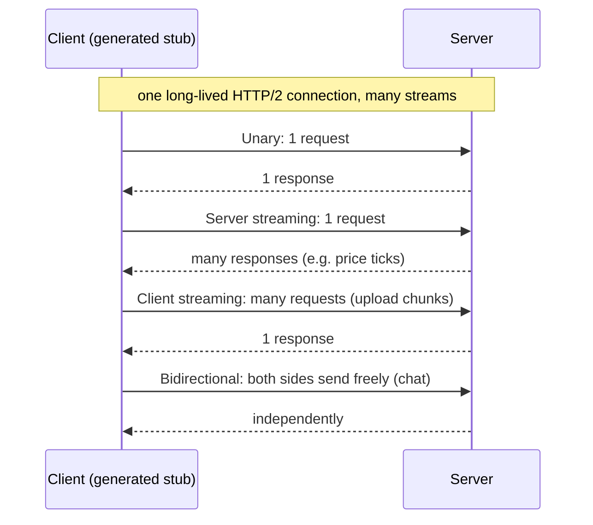
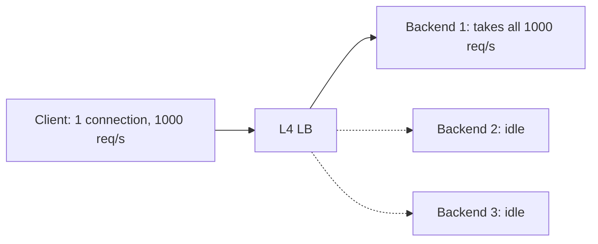

# gRPC and Protocol Buffers

## 1. One-line summary

**Protocol Buffers (protobuf)** is a compact binary format for structured data, defined by a schema file. **gRPC** is a framework that lets one service call a function on another service over [HTTP/2](../../under-the-hood/http-1-2-3.md), with code generated from that schema.

💡 **RPC (remote procedure call):** calling a function that runs on another machine as if it were a local method (`orderService.getOrder(id)`).
💡 **Serialization:** turning an in-memory object into bytes to send or store, and back.
💡 **Schema:** a written description of what fields a message has and their types.

---

## 2. The problem it solves

Service-to-service calls with JSON over HTTP/1.1 hurt at scale:

- **Text is bulky and slow to parse.** Field names are repeated in every message, numbers become text.
- **No enforced contract.** Client and server drift apart; a renamed field breaks the caller at 3 a.m. and you find out in production.
- **Hand-written clients** in each language, each with its own bugs.
- **One request at a time per connection** (HTTP/1.1), no streaming.

Google used an internal RPC system (Stubby) for over a decade; **gRPC** was open-sourced in **2015** as its public descendant, built on HTTP/2 (🟡 dates from memory). Protobuf itself was open-sourced in 2008 (🟡).

---

## 3. How it works

### 3.1 Protobuf: a schema, field numbers and a binary encoding

```proto
syntax = "proto3";
message User {
  int32  id     = 1;
  string name   = 2;
  bool   active = 3;
}
service UserService {
  rpc GetUser (GetUserRequest) returns (User);
}
```

The numbers (`= 1`, `= 2`) are **field numbers**. On the wire, each field is written as (field number + type) then the value. **Names never travel**, only numbers. That is both why it is small and why the numbers are sacred.

**Size example (hand-computed, not measured).** One user: id 150, name "Asha", active true.

| Format | Bytes | Arithmetic |
|---|---|---|
| JSON `{"id":150,"name":"Asha","active":true}` | 38 | counted with `wc -c`: braces 2, keys with quotes 4+6+8 = 18, colons 3, commas 2, values 3 + 6 + 4 = 13 |
| Protobuf | 11 | id: 1 tag byte + 2 bytes for 150 (a **varint**, a number stored in 7-bit groups so small numbers take fewer bytes) = 3; name: 1 tag + 1 length + 4 chars = 6; active: 1 tag + 1 value = 2; total 3 + 6 + 2 = 11 |

About 3.5x smaller here. Real messages with long field names and many numbers show bigger gains; messages that are mostly long strings gain little. Gzipped JSON closes part of the gap (🟡 measure your own payloads).

### 3.2 Compatibility rules (the part interviewers ask)

| Change | Safe? | Why |
|---|---|---|
| Add a new field with a new number | Yes | Old readers skip unknown numbers; new readers see a default when absent. |
| Remove a field | Yes, but **reserve** its number and name (`reserved 4;`) | Reusing the number later would make old data decode into the wrong field. |
| Rename a field | Yes on the wire (names do not travel), but breaks JSON mapping and source code | |
| Change a field's number | **No** | Same as deleting plus adding. |
| Change type (`int32` to `string`) | **No** (a few compatible pairs like int32/int64 exist) | Bytes decode wrongly. |

Backward compatible = new code reads old data. Forward compatible = old code reads new data. Following the table gives both. Compare to a database migration: field numbers are like column IDs that must never be reused.

### 3.3 gRPC on HTTP/2: four call shapes



HTTP/2 lets many **streams** (independent request/response pairs) share one TCP connection, so a client opens one connection and fires thousands of concurrent calls. Each call is a POST to `/UserService/GetUser` with a protobuf body.

### 3.4 Deadlines, cancellation and status codes

- A **deadline** is an absolute time by which the call must finish (`stub.withDeadlineAfter(200, MILLISECONDS)`). It is sent to the server and **propagates**: if A calls B calls C, each hop sees the remaining time. When it expires, everyone down the chain gets cancelled and stops working. Compare to a REST timeout, which only the caller knows about while the downstream keeps burning CPU.
- **Cancellation** works the same way: if the client goes away, the server's context is cancelled.
- **Status codes** are a fixed set, richer than a bare 200/500: `OK`, `INVALID_ARGUMENT`, `NOT_FOUND`, `ALREADY_EXISTS`, `PERMISSION_DENIED`, `RESOURCE_EXHAUSTED` (rate limited), `FAILED_PRECONDITION`, `DEADLINE_EXCEEDED`, `UNAVAILABLE` (retry me), `INTERNAL`, `UNAUTHENTICATED`, and others (about 17 in total, 🟡). Retry logic keys off these: retry `UNAVAILABLE`, do not retry `INVALID_ARGUMENT`.

### 3.5 The load-balancing trap

gRPC connections are long-lived and multiplexed. A classic [L4 load balancer](load-balancer.md) balances **connections**, not requests:



With HTTP/1.1 a client opens many short connections, so they spread out. With gRPC it opens one and everything sticks to one backend. After a rollout, the oldest pods get the traffic, new pods get none. Also a Kubernetes ClusterIP Service is L4, so plain gRPC through it is unbalanced.

Fixes:
1. **L7 proxy** (Envoy, NGINX, a gateway) that understands HTTP/2 streams and balances each request. See [service-mesh-and-envoy](service-mesh-and-envoy.md).
2. **Client-side load balancing:** the client resolves all backend IPs (headless Service, DNS, or a service registry) and round-robins across its own connections.
3. Server sends `GOAWAY` / max connection age so clients reconnect periodically and rebalance.

---

## 4. When to use it

- Internal microservice-to-microservice calls with high request volume or tight latency.
- Streaming (live updates, upload/download chunks, bidirectional control channels).
- Many languages: one `.proto` generates clients for Java, Go, Python, and others.
- You want a typed contract reviewed in pull requests, with lint tools that flag breaking changes (e.g. Buf, 🟡).

**Java note.** In Java you add `grpc-java` and `protobuf-java`; the build plugin runs `protoc` and generates a base class to extend on the server (`UserServiceGrpc.UserServiceImplBase`) and a stub class the client calls (`UserServiceGrpc.newBlockingStub(channel)`). A `ManagedChannel` represents the long-lived connection and should be created once and shared. No code from this library lives in this repo; check the grpc-java docs for the current setup.

## 5. When NOT to use it

- **Public APIs for third parties:** they expect curl-able JSON, browser dev-tools readability, and documentation they can try. Binary payloads are hard to debug by eye.
- **Directly from browsers:** browsers do not expose HTTP/2 trailers and framing controls that gRPC needs. You need **gRPC-Web** plus a translating proxy (e.g. Envoy). That is extra moving parts.
- **Simple CRUD with few clients:** the codegen and tooling overhead is not worth it.
- **Behind infrastructure that only speaks HTTP/1.1** (some old proxies, some serverless gateways).

## 6. Commonly confused with

| | gRPC + protobuf | REST + JSON | GraphQL |
|---|---|---|---|
| Format | Binary | Text | Text (JSON) |
| Contract | `.proto` schema, codegen | Optional (OpenAPI) | Typed schema |
| Transport | HTTP/2 | HTTP/1.1 or 2 | Usually HTTP POST |
| Streaming | Built in, 4 shapes | Not natively (SSE, WebSockets) | Subscriptions (separate transport) |
| Browser-friendly | Needs gRPC-Web | Yes | Yes |
| Caching | Hard (POST) | Easy (HTTP GET caches, CDN) | Hard |
| Best at | Internal fast RPC | Public, cacheable resources | Flexible reads for many UI clients |
| Typical user | Backend services | Everyone | Frontend teams |

Also confused: **protobuf vs Avro/Thrift** (similar idea; Thrift also bundles RPC; Avro suits Kafka-style schema registries) and **gRPC vs WebSockets** (WebSocket is a raw two-way pipe with no schema or call semantics; see [websockets-and-sse](websockets-and-sse.md)).

## 7. Common mistakes / misuse

- **Reusing or renumbering field numbers** after deleting a field: silent data corruption.
- **No deadlines.** The default is often "wait forever", so one slow dependency piles up threads. Set a deadline on every call and let it propagate.
- **L4 load balancer in front of gRPC** (section 3.5).
- **Retrying non-idempotent calls** on `DEADLINE_EXCEEDED`: the server may have finished the work (see idempotency in payment designs).
- **Huge messages** (default limit is 4 MB in many implementations, 🟡): stream chunks instead.
- Treating proto3 defaults as "absent": `0`, `""` and `false` are not sent, so "unset" and "zero" look the same unless you use `optional` or wrapper types.
- Putting the generated code in each repo by hand instead of publishing the `.proto` as a shared artifact.

## 8. Interview cheat-sheet

"For internal service calls I'd use gRPC: protobuf gives a compact binary format and a schema-enforced contract, and HTTP/2 multiplexes many calls over one connection with streaming. I'd keep field numbers immutable and reserve removed ones so schemas evolve backward and forward compatibly. Every call gets a deadline that propagates down the chain, and I retry only on `UNAVAILABLE` with backoff. Because the connections are long-lived, I'd balance with an L7 proxy or client-side balancing, not an L4 load balancer. For browsers and public partners I'd expose REST/JSON through the [API gateway](../interviews/api-gateway/README.md), which translates to gRPC internally."

## 9. Used in

- [API gateway](../interviews/api-gateway/README.md): the L4/L5/L6 answers state the gateway handles HTTP and gRPC traffic (L4-mid, L5-senior, L6-staff mention gRPC explicitly).
- [Distributed message queue](../interviews/distributed-message-queue/README.md): relevant to (the text does not name gRPC) client-to-broker and broker-to-broker RPC, where binary framing and streaming matter.
- [Load balancer](load-balancer.md), [service mesh and Envoy](service-mesh-and-envoy.md): the L7 balancing of gRPC.
- Under the hood: [http-1-2-3](../../under-the-hood/http-1-2-3.md) for the HTTP/2 streams gRPC rides on.

Sources: gRPC documentation (grpc.io: core concepts, status codes, load balancing blog, 2015-2024); Protocol Buffers documentation, "Encoding" and "Updating a message type" (developers.google.com/protocol-buffers); RFC 9113 (HTTP/2, 2022). Dates marked 🟡 are from memory.
