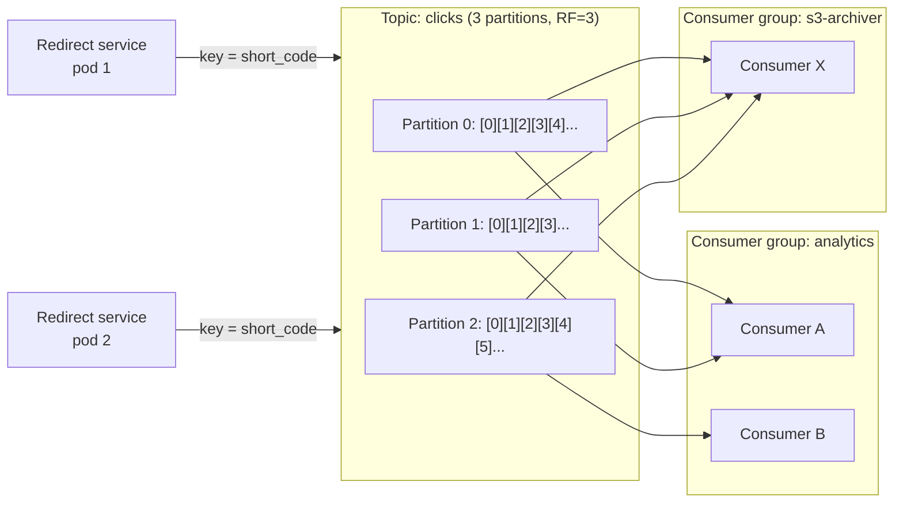

# Kafka

## 1. One-line summary

Apache Kafka is a **distributed, durable, append-only log**: producers append events to it, and any number of consumers read those events at their own pace, each remembering how far they've read (an **offset**). Use it to **decouple** services and move big streams of events asynchronously.

---

## 2. The problem it solves

**The pain:** every time someone clicks a short URL, you want to record the click for analytics (country, referrer, device). If the redirect handler writes to an analytics DB **synchronously**:
- The redirect (which should take ~5 ms) now waits on a slower write.
- If the analytics DB is slow or down, **redirects fail** — the critical path depends on a non-critical system.
- At 10k–100k clicks/s, the analytics DB gets hammered with tiny writes.
- Tomorrow, the fraud team also wants the click stream. Do you write to their system too?

**The fix:** the redirect handler just **appends a "click" event to Kafka** (~1–5 ms, batched, async) and returns. Separate consumers — an analytics aggregator, a fraud detector, an archiver to S3 — each read the stream independently, at their own speed, and can **replay** history if they have a bug.

> Infra analogy: it's like a centralized log pipeline (Fluentd → Kafka → Elasticsearch). The app emits lines; downstream systems index, alert, or archive them independently. Kafka is the durable buffer in the middle.

---

## 3. How it works

### 3.1 Core vocabulary

| Term | Meaning |
|---|---|
| **Broker** | A Kafka server. A cluster has several (e.g. 3–30+). |
| **Topic** | A named stream, e.g. `clicks`. Like a table name for events. |
| **Partition** | A topic is split into N partitions; each is an **ordered, append-only log** stored on disk on one leader broker and replicated to followers. Partitions are the unit of parallelism. |
| **Offset** | The position of a message within a partition (0, 1, 2, ...). Monotonic, never reused. |
| **Producer** | Appends messages. Message **key** decides partition: `hash(key) % numPartitions`. No key → spread round-robin-ish. |
| **Consumer group** | A set of consumers sharing work. **Each partition is read by exactly one consumer in the group.** Different groups read the same data independently. |
| **Committed offset** | Each group stores "I've processed partition 1 up to offset 7,042" (in an internal Kafka topic). On restart it resumes from there. |
| **Retention** | Messages are kept for a time (e.g. 7 days) or size, **whether or not anyone read them**. Consuming doesn't delete. |
| **Replication factor** | Each partition copied to e.g. 3 brokers; `acks=all` + `min.insync.replicas=2` = a write survives a broker loss. |

### 3.2 Why it's fast

- Writes are **sequential appends** to disk files, and reads are mostly sequential too, served from the OS page cache.
- Producers **batch** messages and compress them; consumers fetch in batches.
- Zero-copy (`sendfile`) from page cache to the network socket.

Rough numbers: one broker can sustain **hundreds of MB/s**; a modest cluster handles **millions of messages/sec**. End-to-end latency is typically **a few ms to tens of ms** — fast, but not request/response fast.

### 3.3 Ordering: per partition only

Kafka guarantees order **within a partition**, not across the topic. If you need "all events for short code abc123 in order", use `short_code` as the key so they all land in one partition. Global ordering would require 1 partition = no parallelism.

Parallelism ceiling: a group can have at most **#partitions active consumers**. 12 partitions → max 12 consumers doing work; the 13th sits idle. Choose partition count for future throughput (e.g. 12–100), since increasing it later changes key → partition mapping.

### 3.4 Delivery semantics and idempotent consumers

A consumer does: read batch → process → commit offset. Crashes in between decide the semantics:

| Order | Crash between steps | Result |
|---|---|---|
| Process, **then** commit | Reprocess the batch after restart | **At-least-once** (duplicates possible) — the usual default |
| Commit, then process | Batch skipped | At-most-once (data loss) |

So with at-least-once, **design consumers to be idempotent**: processing the same event twice must have the same effect as once. Techniques:
- Give each event a unique `event_id`; store processed IDs (or upsert by ID) so duplicates are ignored.
- Use upserts / "set" operations instead of blind increments, or aggregate per window and overwrite the window's row.

Kafka also offers **idempotent producers** (no duplicates from producer retries) and **transactions** for "exactly-once" *within Kafka* (read-process-write Kafka to Kafka, e.g. Kafka Streams). Once you write to an external DB, idempotency is back on you.

### 3.5 Click analytics pipeline example

1. Redirect service: `producer.send("clicks", shortCode, clickJson)` — async, fire and continue; return 302.
2. Analytics consumer group: reads clicks, aggregates per (short_code, minute) in memory, flushes counts every few seconds to an analytics store (ClickHouse, Cassandra counters, or Postgres for small scale).
3. Archiver consumer group: writes raw events to S3/Parquet for batch jobs.
4. If the analytics DB is down for an hour, Kafka just **buffers** (consumer lag grows); when it recovers, consumers catch up. Redirects never noticed.

Monitor **consumer lag** (latest offset − committed offset) — it's the key on-call metric, like queue depth.

---

## 4. When to use it

- **High-volume event streams**: clicks, page views, logs, metrics, IoT, CDC (change data capture from a DB).
- **Decoupling** a fast critical path from slower non-critical work (analytics, emails, search indexing).
- **Fan-out** of the same events to many independent consumers.
- **Replay**: rebuild a derived store or fix a buggy consumer by re-reading from an old offset.
- **Buffering** spikes so downstream systems process at a steady rate.

## 5. When NOT to use it (and why it's a mistake)

| Situation | Why it's a mistake |
|---|---|
| **Request/response** (user waits for an answer) | Kafka is async; you'd build reply topics and correlation IDs to recreate an HTTP call, with worse latency. Just use HTTP/gRPC. |
| **10 events/sec** | A Kafka cluster (3+ brokers, plus KRaft/ZooKeeper, monitoring, upgrades) for a trickle. A DB table, SQS, or a simple in-process queue is enough. |
| **Per-message work queue** with retries, delays, priority | Kafka has no per-message ack/redelivery or delay; a slow message blocks its partition. RabbitMQ/SQS fit better. |
| **Querying** events by arbitrary fields | Kafka isn't a database; you can only read sequentially by offset. Sink to a DB first. |
| Strict **global** ordering at high throughput | Only per-partition order exists. |

---

## 6. Commonly confused with

| | **Kafka (log)** | **RabbitMQ / SQS (queue)** | **Redis Pub/Sub** |
|---|---|---|---|
| Model | Append-only log; consumers track offsets | Queue; broker tracks each message, deletes after ack | Fire-and-forget broadcast |
| After consumption | Message **stays** until retention expires | Message **removed** once acked | Gone immediately |
| Replay | Yes, reset offset | No | No |
| Multiple independent consumers | Natural (consumer groups) | Need fan-out exchange / SNS + multiple queues | All current subscribers get it |
| Offline consumer | Catches up later | Messages wait in its queue | **Misses** messages |
| Ordering | Per partition | Per queue (SQS FIFO), weaker under redelivery | Per connection, best effort |
| Per-message ack, retry, delay, DLQ | Not natively (commit offsets only) | Yes | No |
| Throughput | Very high (millions/s) | Medium (tens of thousands/s per node) | High but lossy |
| Pick when | Event streams, analytics, many consumers, replay | Task/job queues ("send this email") | Ephemeral notifications (cache invalidation pings, chat presence) |

Mental model: a **queue** is a to-do list — finished items are crossed out. A **log** is a newspaper archive — everyone reads it at their own pace and old issues stay on the shelf.

For a deeper look at the queue side (ack, visibility timeout, DLQ, priority queues, DB-table queues), see [Message queues](message-queues.md).

---

## 7. Common mistakes / misuse

1. **Using Kafka for request/response** between services. Use HTTP/gRPC.
2. **Adding Kafka for tiny volume** "for future scale" — huge operational cost at 10 events/s.
3. **Non-idempotent consumers** with at-least-once delivery → double-counted clicks after every rebalance or crash.
4. **Expecting global ordering**, or keying by something random and then needing per-entity order.
5. **Too few partitions** → can't add consumers to keep up. **Hot keys** → one partition (and one consumer) overloaded by a viral short code.
6. **Producing synchronously in the critical path** with `acks=all` and waiting per message → you just moved the latency problem. Batch, send async, and decide what happens if Kafka is down (drop clicks? local buffer?).
7. **Treating Kafka as a database** forever (infinite retention + querying). Sink to a proper store.
8. **Ignoring consumer lag** — the silent failure: everything "works" but analytics are 6 hours behind.

---

## 8. Interview cheat-sheet

> "The redirect path should stay fast and not depend on analytics, so the redirect service publishes a click event to a Kafka topic asynchronously and returns the 302 immediately. Kafka is a partitioned, replicated append-only log: I'd key events by short code so a given URL's clicks stay ordered in one partition, and size the topic with enough partitions — say 32 — to scale consumers. An analytics consumer group aggregates clicks per URL per minute and writes them to the analytics store; delivery is at-least-once, so the consumer is idempotent, using event IDs or overwriting per-window aggregates. Because Kafka retains data for days, if the analytics DB goes down, the events just buffer and we catch up, and we can replay if we ship a bug. I'd monitor consumer lag as the main health signal."

---

## 9. Used in

- [URL shortener](../interviews/url-shortener/README.md) — the **click analytics pipeline**: redirect servers publish click events to Kafka; consumers aggregate stats off the critical path.
- [Notification system](../interviews/notification-system/README.md) — the **event bus** that upstream services publish to (e.g. "order shipped", "payment failed") and that the notification pipeline consumes; also a candidate for delivery-status/analytics event streams. Compare with per-message [message queues](message-queues.md) used for the channel workers.
- Related concepts: [back-of-the-envelope](../concepts/back-of-the-envelope.md) (sizing events/s and storage), [CAP and consistency](../concepts/cap-and-consistency.md), [sharding and replication](../concepts/sharding-and-replication.md) (partitions are shards).
