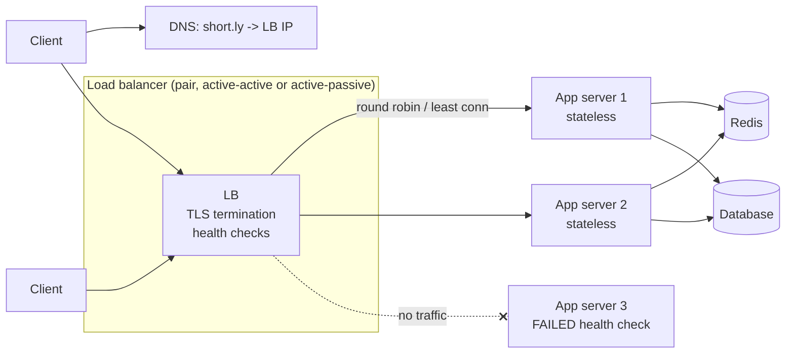

# Load Balancer

## 1. One-line summary

A load balancer is a **single front door** that receives client traffic and **spreads it across many identical backend servers**, skipping the ones that are unhealthy.

---

## 2. The problem it solves

**The pain:** one app server handles maybe a few thousand requests/sec. You need 40,000 req/s, so you run 20 servers. Now:

- Clients need *one* address, not 20.
- If server 7 crashes, clients pointing at it get errors.
- You want to deploy server-by-server without downtime.
- You want to add 10 more servers on Black Friday without telling anyone.

**The fix:** put a load balancer (LB) in front. Clients talk to one IP/hostname; the LB keeps a list of healthy backends and picks one per connection or request. Adding capacity = add backends to the pool. This is what makes **horizontal scaling** of stateless services possible.

You already use these daily: a Kubernetes `Service` (kube-proxy / IPVS) is an L4 load balancer across pods; an `Ingress` (nginx-ingress, Envoy, Traefik) is an L7 load balancer; on AWS that's an NLB (L4) or ALB (L7).

---

## 3. How it works

### 3.1 L4 vs L7

The "L" is the OSI layer the LB understands.

| | **L4 (transport)** | **L7 (application)** |
|---|---|---|
| Sees | IP + TCP/UDP port | Full HTTP: path, headers, cookies, method |
| Routing decision | Per **connection** | Per **request** (can route `/api` and `/static` differently) |
| TLS | Usually passes through (or terminates, e.g. NLB with TLS listener) | Terminates TLS, reads the plaintext request |
| Speed | Very fast, millions of conns, tiny overhead | Slower (parses HTTP), still ~tens of thousands of req/s per core |
| Can do | Forward packets/streams | Retries, header rewriting, path routing, auth, rate limits, gRPC per-call balancing |
| Examples | AWS NLB, k8s `Service`, IPVS, HAProxy (TCP mode), LVS | AWS ALB, nginx, Envoy, HAProxy (HTTP mode), k8s `Ingress` |

A subtle L4 gotcha: with **HTTP/2 or gRPC**, a client opens one long-lived connection and sends thousands of requests on it. An L4 LB balances *connections*, so all those requests hit one pod. You need an L7 LB (Envoy, a service mesh) to balance per request.

### 3.2 Algorithms

| Algorithm | How | Good for | Weakness |
|---|---|---|---|
| **Round robin** | 1, 2, 3, 1, 2, 3... | Equal servers, similar request cost | Ignores that one server may be busy with slow requests |
| **Weighted round robin** | Big server gets 2x share | Mixed instance sizes, canary (send 5% to new version) | Static weights |
| **Least connections** | Pick the backend with fewest open connections | Requests with varying duration (some take 10 ms, some 2 s) | Needs LB to track state |
| **Least response time / P2C** | Pick 2 random backends, send to the less loaded ("power of two choices") | Large fleets; used by Envoy, Finagle | Slightly more complex |
| **IP hash / consistent hash** | `hash(client IP or key) → backend` | When the same key should hit the same server (e.g. a cache shard, local in-memory cache) | Uneven if keys are skewed; see [consistent hashing](../concepts/consistent-hashing.md) |

For stateless app servers, **round robin or least connections** is almost always the right answer. Consistent hashing is for when the backend *holds* data for that key.

### 3.3 Health checks

- **Active**: LB calls `GET /healthz` every ~5–10 s; after e.g. 3 failures the backend is removed; after 2 successes it's added back. (Same idea as a k8s readiness probe — in fact, readiness probe failure is exactly what removes a pod from a `Service`'s endpoints.)
- **Passive**: LB notices real requests failing (5xx, timeouts) and ejects the backend (Envoy "outlier detection").
- Keep the health check **shallow-ish**: if `/healthz` checks the DB and the DB hiccups, *every* backend fails health checks at once and the LB has nothing to send traffic to. Liveness = "is my process OK", not "is the world OK".

### 3.4 Stateless services and sticky sessions

The LB works best when **any backend can serve any request** — the server keeps no user state in memory between requests. State goes to a shared store (DB, [Redis](redis.md)), or into the request itself (a signed JWT).

**Sticky sessions** (session affinity): the LB pins a user to one backend, via a cookie or IP hash, because that server holds their session in memory.

Why it's usually a **smell**:
- Server dies → all its users lose their session.
- Uneven load: a few heavy users stuck on one box; new servers get no existing users after scale-up.
- Deploys/draining get slow because you must wait for sessions to end.
- It hides the real problem: the service is stateful.

Legitimate uses: WebSocket connections (inherently pinned to a server), or an in-memory cache you deliberately shard by user — but then say "consistent hashing", not "sticky sessions".

### 3.5 TLS termination

The LB holds the certificate, decrypts HTTPS, and forwards plain HTTP (or re-encrypted HTTPS / mTLS in a mesh) to backends.
- **Pros**: one place to manage certs (cert-manager, ACM), backends save CPU, L7 features need plaintext anyway.
- **Cons**: traffic inside your network is unencrypted unless you re-encrypt. Many companies require mTLS internally (service mesh does this).

### 3.6 Who load-balances the load balancer?

An LB is itself a single point of failure unless you run several:
- **Cloud LBs** (ALB/NLB) are already a distributed fleet behind one DNS name.
- **Self-hosted**: two nginx/HAProxy boxes sharing a **virtual IP** via keepalived (VRRP) — if the active one dies, the standby takes the IP. Or multiple LBs with **anycast** / **DNS** spreading across them.

---

## 4. When to use it

- Any time you have **more than one instance** of a stateless service (basically always in an HLD interview).
- To do **zero-downtime deploys** (drain a backend, deploy, re-add) and canaries (weighted routing).
- To terminate TLS in one place.
- Internally between services too (k8s `Service`, or client-side LB in gRPC / a service mesh sidecar).

## 5. When NOT to use it (and why it's a mistake)

| Situation | Why it's a mistake |
|---|---|
| In front of a **database primary** to "scale writes" | There's only one writer; an LB can't split writes across replicas that don't accept them. Scaling writes needs [sharding](../concepts/sharding-and-replication.md). |
| Round-robin in front of **stateful shards** (cache nodes, Cassandra) | Request for key X lands on a node that doesn't have X. Those systems route by key (consistent hashing / smart clients) instead. |
| Using sticky sessions to fix a stateful app | Treats the symptom; failures and scaling still break users. Move state out. |
| An extra L7 hop between every internal call "just because" | Adds latency (~0.5–1 ms) and another component per hop; client-side LB or a k8s Service may be enough. |

---

## 6. Commonly confused with

| | **Load balancer** | **Reverse proxy** | **API gateway** | **DNS load balancing** |
|---|---|---|---|---|
| Main job | Spread traffic across identical backends | Sit in front of servers, forward requests (caching, TLS, compression) | Single entry point for **many different APIs**: auth, rate limits, API keys, request transformation | Return different IPs for one hostname |
| Layer | L4 or L7 | L7 | L7 | DNS (before any connection) |
| Health awareness | Real-time (seconds) | Usually yes | Yes | Weak — clients and resolvers **cache** answers for the TTL, often longer |
| Examples | NLB, ALB, HAProxy | nginx, Envoy, Varnish | Kong, AWS API Gateway, Apigee, Spring Cloud Gateway | Route 53 weighted / latency / geo routing |
| Typical place | In front of each service | In front of web servers | At the edge of a microservices platform | Across regions / data centers |

Honest truth: these overlap heavily. **nginx is a reverse proxy that also load-balances**; an API gateway is a reverse proxy with business-y features; an L7 LB is a reverse proxy focused on distribution. In an interview, name the *job* you need: "L7 load balancer for distribution and TLS", "API gateway for auth and per-client rate limits", "geo-DNS to send users to the nearest region".

DNS LB is good for coarse, global routing (pick a region) but bad for fast failover because of caching — you'd still put a real LB in each region.

---

## 7. Common mistakes / misuse

1. **Drawing one LB box and calling it done.** Mention it's redundant (cloud-managed or an active-passive pair), otherwise it's a SPOF.
2. **Sticky sessions as the default.** Say "app servers are stateless; session data lives in Redis or a token".
3. **Deep health checks** that take down the whole fleet when a dependency blips.
4. **L4 LB for gRPC/HTTP/2** and wondering why one pod is at 100% CPU.
5. **No connection draining** on deploys: in-flight requests get cut. Use a deregistration delay (ALB default 300 s) / `preStop` hook in k8s.
6. **Forgetting the client IP.** Behind an L7 LB the backend sees the LB's IP; use `X-Forwarded-For` (or PROXY protocol for L4) for rate limiting and analytics.
7. **Using an LB to "scale the database".** It doesn't.

---

## 8. Interview cheat-sheet

> "The app servers are stateless, so I put them behind an L7 load balancer — think AWS ALB or nginx/Envoy — which terminates TLS and spreads requests with round robin or least connections. It runs active health checks and removes unhealthy instances within a few seconds, which also lets us do rolling deploys and autoscale by just adding instances. The LB itself is redundant: a managed cloud LB or a pair with a floating IP. I avoid sticky sessions; any state goes to Redis or the database so any server can handle any request. For multi-region I'd use geo-DNS on top to pick the nearest region's load balancer."

---

## 9. Used in

- [URL shortener](../interviews/url-shortener/README.md) — sits **in front of the stateless app servers** that handle create and redirect requests; lets the redirect tier scale horizontally.
- Related concepts: [consistent hashing](../concepts/consistent-hashing.md) (when routing must be key-aware), [back-of-the-envelope](../concepts/back-of-the-envelope.md) (how many servers behind the LB).
