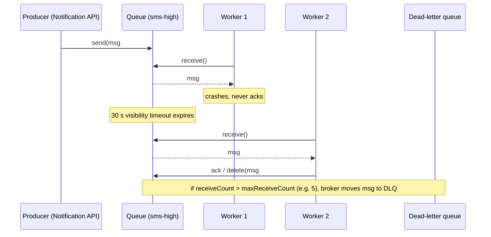
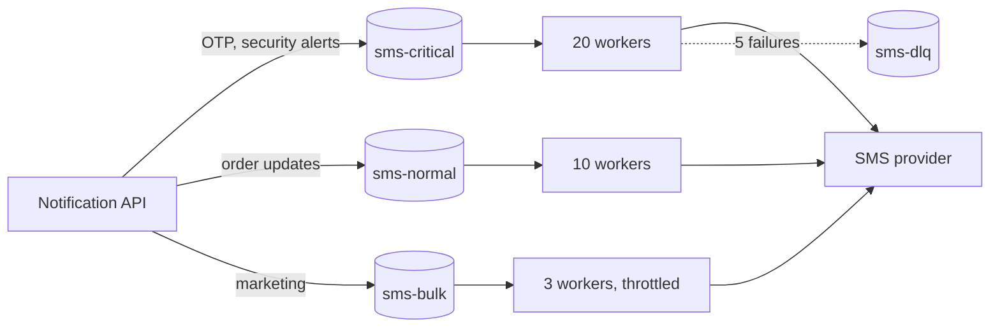

# Message Queues (RabbitMQ, Amazon SQS)

## 1. One-line summary

A message queue is a **to-do list shared between services**: producers drop jobs in ("send this SMS"), a pool of workers takes them out one at a time, and the **broker** (the queue server) deletes each job only after a worker **acknowledges** it finished. If a worker dies mid-job, the job comes back for someone else.

💡 **Producer / worker / broker:** the producer is the program that enqueues, the worker (consumer) is the program that processes, and the broker is the server holding the queue in between (RabbitMQ, SQS).

---

## 2. The problem it solves

**The pain:** the Order service wants to send a "your order shipped" SMS. If it calls Twilio directly inside the HTTP request:

💡 **503 / rate-limited / idempotencyKey:** 503 is the HTTP "service unavailable" status. Rate-limited = the provider rejects you for sending too fast. An idempotency key is a unique ID on the message so that processing it twice can be detected and ignored.

- The user waits 300 ms to 2 s for a third party they don't care about.
- If Twilio is slow or returns 503, the order request fails or hangs.
- A flash sale creates 50,000 SMS in one minute; you either hammer the provider (and get rate-limited) or drop messages.
- If the pod crashes after the DB commit but before the SMS call, the SMS is simply lost.

**The fix:** the Order service puts a small message `{userId, template, idempotencyKey}` on a queue and returns in ~5 ms. A pool of SMS workers pulls messages at a steady rate, calls the provider, and **acks** on success. Failures are retried later; messages that keep failing move to a **dead-letter queue (DLQ)** for a human to inspect.

> Infra analogy: it's a Kubernetes `Job` queue or a ticket backlog for on-call. Tickets wait until someone picks them up; a ticket picked up by someone who then goes offline gets reassigned after a timeout.

💡 **Acks, visibility timeout, DLQ** are defined in the vocabulary table in 3.1; the sequence diagram below shows them in action.

---

## 3. How it works



### 3.1 Core vocabulary

| Term | Meaning |
|---|---|
| **Ack (acknowledge)** | Worker tells the broker "done, delete it". In SQS this is `DeleteMessage`; in RabbitMQ `basic.ack`. |
| **Nack / reject** | Worker says "failed". RabbitMQ can requeue it or route it to a DLQ. |
| **Visibility timeout** (SQS) | After a worker receives a message, it is hidden from others for N seconds (default 30 s, max 12 h). No ack in time → it reappears. RabbitMQ's equivalent: an unacked message is redelivered when the consumer's connection/channel closes (plus a delivery-ack timeout, default 30 min). |
| **Redelivery** | The same message delivered again. This is why queues are **at-least-once**. See [idempotency](../concepts/idempotency-and-delivery-semantics.md). |
| **Dead-letter queue (DLQ)** | Side queue for messages that failed too many times (`maxReceiveCount`) or expired. See [retries, backoff and DLQ](../concepts/retries-backoff-and-dlq.md). |
| **Competing consumers** | N workers read from one queue; each message goes to exactly one of them. Add pods to go faster. |
| **Prefetch** (RabbitMQ) | How many unacked messages a consumer may hold at once (e.g. `basic.qos(20)`). Too high = one slow worker hoards work. |
| **Priority queue** | Higher-priority messages are delivered first. RabbitMQ supports `x-max-priority` (1-255, use ~10). SQS has **no** priority, so you use **separate queues** (e.g. `sms-otp`, `sms-marketing`) and give the urgent one more workers. |
| **Delay / scheduled delivery** | SQS `DelaySeconds` (up to 15 min); RabbitMQ via a delayed-message plugin or TTL + DLX trick. Longer delays belong in a scheduler table. |
| **Exchange** (RabbitMQ) | Router in front of queues: `direct`, `topic`, `fanout`. One published message can be copied to several queues. |

💡 **Table terms:** *at-least-once* = a message is delivered one or more times, never zero, so duplicates are possible. *Nack* = negative acknowledgement. *TTL* (time to live) = how long a message may wait before it is dropped; *DLX* is RabbitMQ's dead-letter exchange. *Hoards work* = holds many messages while others sit idle. A *plugin* is an add-on module for the broker.

### 3.2 Priority by separate queues (the common real-world pattern)



A 10M-user marketing blast sitting in `sms-bulk` can never delay an OTP, because OTPs have their own queue and their own workers. A single queue with a priority field still suffers if all workers are busy with long-running bulk jobs.

💡 **Starvation:** low-priority work being so plentiful that high-priority work never gets a worker, like a noisy batch job eating all the CPU quota on a shared node.

### 3.3 Rough numbers

| Broker | Throughput | Notes |
|---|---|---|
| RabbitMQ (one node, persistent, acked) | ~10k-50k msg/s | Quorum queues for replication; slower than classic. |
| Amazon SQS standard | "Nearly unlimited" (scales per queue) | At-least-once, **best-effort ordering**. ~$0.40 per million requests. |
| Amazon SQS FIFO | 300 msg/s per API action, 3,000 with batching (higher in high-throughput mode) | Ordered per `MessageGroupId`, 5-minute dedup window. |
| Max message size | SQS 256 KB, RabbitMQ configurable (keep small) | Put large payloads in S3 and send a pointer. |

💡 **Throughput terms:** *quorum queues* are RabbitMQ queues replicated across nodes with Raft (a consensus algorithm where a majority must agree) so they survive a node loss. *FIFO* = first in, first out ordering. *Dedup window* = period during which SQS drops a repeated message ID. *Batching* = sending many messages in one API call. *S3* = Amazon's object (file/blob) storage.

---

## 4. When to use it

- **Background jobs** that a user should not wait for: send email/SMS/push, resize image, generate PDF.
- **Smoothing spikes**: absorb 50k jobs in a minute, drain at the provider's allowed rate.
- **Per-message retry, delay and DLQ** semantics where each job succeeds or fails on its own.
- **Work distribution** across a pool of identical workers (competing consumers), autoscaled on queue depth (KEDA in k8s does exactly this).
- **Priority lanes** (separate queues for critical vs bulk traffic).

💡 **Queue depth / KEDA:** queue depth = number of messages waiting. KEDA is a Kubernetes add-on that scales the number of pods based on such external metrics.

## 5. When NOT to use it (and why it's a mistake)

| Situation | Why it's a mistake |
|---|---|
| **Request/response** (caller needs the answer now) | You'd build reply queues and correlation IDs to recreate a slow HTTP call. Use HTTP/gRPC. |
| **Many independent consumers of the same events + replay** | A queue deletes on ack; a second team can't read history. Use [Kafka](kafka.md) (log). |
| **Strict ordering at high throughput** | Redelivery and competing consumers reorder messages. Use Kafka partitions or SQS FIFO with group IDs (lower throughput). |
| **Huge payloads** | 256 KB limit, memory pressure on brokers. Store blob elsewhere, enqueue a reference. |
| **10 jobs per minute in an app that already has Postgres** | A DB table with `SKIP LOCKED` is simpler (see section 6). |

💡 **Correlation ID / gRPC:** see [Kafka](kafka.md) for correlation IDs; gRPC is a fast RPC framework on top of HTTP/2. **`SKIP LOCKED`** is a SQL clause explained in section 6.

---

## 6. Commonly confused with

| | **Queue (RabbitMQ / SQS)** | **[Kafka](kafka.md) (log)** | **[Redis](redis.md) list / stream** | **DB table as queue** |
|---|---|---|---|---|
| Model | Broker tracks each message; deleted after ack | Append-only log; consumer tracks offset | List: `LPUSH`/`BRPOP`. Stream: log with consumer groups and pending list | Rows with `status`, workers poll |
| Per-message ack / retry | Yes | No (commit offset per partition) | List: no (message lost if worker dies after `BRPOP`, unless `LMOVE` pattern). Stream: yes (`XACK`, `XAUTOCLAIM`) | Yes, you write it |
| Replay / multiple consumer teams | No | Yes | Stream: yes, limited by memory | Yes (rows stay) |
| DLQ, delay | Built in | Build it yourself (retry topics) | Build it yourself | Easy (`next_attempt_at` column) |
| Durability | Disk, replicated | Disk, replicated | Memory (+ AOF); can lose recent writes on failover | As durable as your DB |
| Throughput | 10k-100k/s | Millions/s | 100k+/s | ~hundreds to a few thousand/s |
| Pick when | Job queues, notifications | Event streams, many consumers | Already run Redis, small/ephemeral jobs | Low volume, need transactional enqueue |

**Mental model:** a queue is a to-do list (crossed off when done). A log is a newspaper archive (everyone reads at their own pace, old issues stay).

💡 **Redis terms in the table:** *LPUSH/BRPOP* push onto and block-pop from a list; *LMOVE* atomically moves an item to a "processing" list; *Streams* are Redis's log type (`XACK` acks, `XAUTOCLAIM` reclaims stuck messages); *AOF* (append-only file) is Redis's optional disk log. *Poll* = repeatedly ask "anything new?".

### When a DB table as a queue is actually fine

Two cases where Postgres beats a broker:

1. **Low volume** (under ~1,000 jobs/s). Workers claim jobs safely with:

```sql
SELECT id, payload FROM jobs
WHERE status = 'PENDING' AND next_attempt_at <= now()
ORDER BY priority DESC, id
LIMIT 50
FOR UPDATE SKIP LOCKED;   -- other workers skip rows I locked, no blocking
```

💡 **`FOR UPDATE SKIP LOCKED`:** locks the rows this transaction selected, and tells other transactions that run the same query to silently skip locked rows instead of waiting. That is what lets many workers each grab different jobs without blocking each other.

2. **Transactional outbox.** You need "save the order AND publish the event" atomically. Write the event to an `outbox` table **in the same DB transaction** as the business row, then a relay process copies outbox rows to the real queue. No lost or phantom events. See the transactional outbox section in [fan-out](../concepts/fan-out.md).

💡 **Atomically / transaction:** "all or nothing": either both the order row and the outbox row are saved, or neither is.

---

## 7. Common mistakes / misuse

1. **Using a queue for request/response.** The API "waits for the worker's reply" with a 30 s timeout. You now have an HTTP call with extra failure modes.
2. **Unbounded queues hiding outages.** The provider is down, the queue grows to 40M messages, nobody notices for 6 hours, and then 40M stale "your code is 482913" OTPs go out. Alert on **queue depth and age of oldest message**, and set a **TTL** on time-sensitive messages (an OTP older than 5 minutes is useless: drop it).
3. **No DLQ.** A poison message (malformed template) is retried forever, burning a worker and spamming logs. Always set `maxReceiveCount` + DLQ, and alert when DLQ depth > 0.

💡 **p99 / heartbeat (next items):** p99 = the latency that 99% of requests are faster than (a good "nearly worst case" number). A heartbeat is a periodic "still working" signal.

💡 **Poison message:** one message that always fails (bad data), so retries never succeed. **Exponential backoff:** waiting longer between each retry (1 s, 2 s, 4 s...) so a struggling provider can recover.

4. **Visibility timeout shorter than processing time.** Job takes 45 s, timeout is 30 s, so a second worker picks it up while the first is still working: duplicate sends. Set timeout > p99 processing time, or extend it with a heartbeat (`ChangeMessageVisibility`).
5. **Acking before processing.** Ack first then crash = message lost (at-most-once). Ack **after** the side effect succeeds.
6. **Assuming exactly-once.** Every queue redelivers sometimes. Consumers must be [idempotent](../concepts/idempotency-and-delivery-semantics.md).
7. **One queue for everything.** Marketing blasts starve OTPs. Separate queues per channel and priority.
8. **Huge prefetch.** One worker grabs 1,000 messages, gets stuck, and the rest of the pool sits idle.

---

## 8. Interview cheat-sheet

> "I won't call the providers in the request path. The Notification API validates the request, writes it to the DB, and enqueues a small message on a per-channel queue, with separate queues for critical traffic like OTPs and for bulk marketing so a blast can never delay a login code. Workers are competing consumers that ack only after the provider accepts the message; if a worker dies, the visibility timeout makes the message reappear, so delivery is at-least-once and the worker dedups on an idempotency key. After about five failed attempts with exponential backoff the message goes to a dead-letter queue that we alert on. I'd autoscale workers on queue depth and also alert on the age of the oldest message, and I'd put a TTL on OTPs so we never deliver a stale code after an outage. I'd pick SQS or RabbitMQ here over Kafka because I want per-message retries, delays and DLQs, not replay."

---

## 9. Used in

- [Notification system](../interviews/notification-system/README.md): the **per-channel, per-priority queues** (push / SMS / email / in-app, critical vs marketing) between the Notification API and the channel workers, with retries, DLQs and autoscaling on queue depth.
- [Video streaming](../interviews/video-streaming/README.md): the **transcoding job/task queue** with priority lanes, visibility timeouts for crashed encoders, and a DLQ for poison videos.
- [Distributed message queue](../interviews/distributed-message-queue/README.md): queue vs log semantics as the first clarifying question, and when a job queue shouldn't be forced onto a log (L6 §7).
- Related: [Kafka](kafka.md) (log vs queue), [Redis](redis.md) (lists/streams), [PostgreSQL](postgresql.md) (`SKIP LOCKED`, outbox), [retries, backoff and DLQ](../concepts/retries-backoff-and-dlq.md), [idempotency and delivery semantics](../concepts/idempotency-and-delivery-semantics.md), [fan-out](../concepts/fan-out.md).
