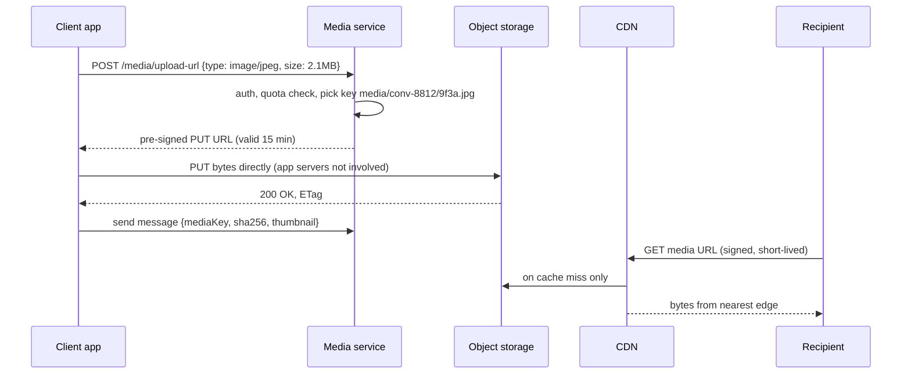

# Object Storage (S3, GCS, MinIO)

## 1. One-line summary

**Object storage** is a huge, cheap, extremely durable "bucket of files over HTTP": you `PUT` a blob of bytes under a name (the **key**) and `GET` it back later by that name. Amazon **S3**, Google Cloud Storage (**GCS**), Azure Blob Storage and self-hosted **MinIO** all work this way, and it is where photos, videos, backups, logs and build artifacts live.

---

## 2. The problem it solves

**The pain:** a chat app lets users send photos and videos. Say 100M media messages/day at an average of 200 KB each:

```
100,000,000 × 200 KB = 20,000,000,000 KB = 20 TB per day
20 TB × 365          ≈ 7.3 PB per year
```

Where do you put 7 PB?

- **In the database** (a `BYTEA`/`BLOB` column in [Postgres](postgresql.md) or [Cassandra](cassandra.md)): the DB is sized and priced for small, hot rows. Every 5 MB video bloats backups, replication, the page cache and the network between replicas. Restoring a 7 PB Postgres is not a thing.
- **On the app servers' local disks:** a pod dies and its disk is gone; a different pod gets the next `GET` and doesn't have the file. You end up reinventing replication.
- **On an NFS share:** works for a few TB, but one file server becomes the bottleneck and single point of failure.

**The fix:** put the bytes in object storage and keep only a small **reference** (`bucket + key`, size, content type, hash) in your database. The object store handles replication across machines and data centers, scales to exabytes, and costs roughly **$0.023 per GB-month** for S3 Standard (and ~$0.004 or less for cold tiers).

```
7.3 PB = 7,300,000 GB × $0.023 ≈ $168k per month on the hot tier
Move objects older than 30 days to an infrequent tier (~$0.0125): roughly halves it.
```

> Infra analogy: you already use this. Your container images live in a registry backed by S3/GCS, Terraform state sits in an S3 bucket, and Loki/Thanos/Velero ship logs, metrics blocks and cluster backups to object storage. Nobody stores those in Postgres.

---

## 3. How it works

### 3.1 Buckets, keys, objects

- **Bucket:** a top-level container with a globally unique name, a region, and settings (access policy, versioning, lifecycle rules). Think "namespace".
- **Key:** the object's full name, e.g. `media/2026/10/08/conv-8812/9f3a.jpg`. The slashes are **just characters**; there are no real folders. Consoles *pretend* there are folders by grouping on the `/` prefix.
- **Object:** the bytes (up to 5 TB on S3) plus metadata (`Content-Type`, custom headers, an **ETag**, which is a hash/version tag of the content).
- **Operations:** basically `PUT`, `GET` (including byte ranges, used for video seeking), `HEAD` (metadata only), `DELETE`, `LIST` (by prefix, 1,000 keys per page). No "append", no "edit byte 500", no rename: you rewrite or copy the whole object.

### 3.2 "Eleven nines" of durability, in plain words

S3 advertises **99.999999999% durability** (11 nines). That means: if you store **10 million objects**, you'd expect to lose **one object every ~10,000 years** on average.

```
loss probability per object per year = 1 − 0.99999999999 = 10^-11
10,000,000 objects × 10^-11 = 10^-4 objects lost per year → 1 object per 10,000 years
```

How: every object is split and spread across many disks in at least **3 availability zones** (separate data centers), using replication or **erasure coding** (like RAID: data plus parity chunks, so any few chunks can be lost and the object rebuilt). Background jobs constantly checksum and repair.

**Durability ≠ availability.** Durability = "the bytes won't be lost". Availability = "I can read them right now" (S3 Standard: 99.99%, so ~53 minutes/year of possible errors). Your client still needs retries.

### 3.3 Not a filesystem

| You might expect (POSIX filesystem) | Object storage reality |
|---|---|
| Rename a folder instantly | "Rename" = copy every object to a new key + delete old ones |
| Append to a file (logs) | Not supported; write a new object per chunk |
| Low latency (< 1 ms) | First byte in **~20-100 ms** |
| `ls` a directory is cheap | `LIST` returns 1,000 keys per call; 10M keys = 10,000 sequential calls |
| File locking | None; last writer wins |

Since 2020 S3 gives **strong read-after-write consistency**: once a `PUT` returns 200, any `GET` sees the new object. (Older articles say "eventually consistent"; that is outdated.)

### 3.4 Pre-signed URLs: let the client upload directly

The killer feature for media in apps. Instead of streaming a 50 MB video **through** your app servers (tying up threads, bandwidth and memory), the server hands the client a **pre-signed URL**: a normal S3 URL with a signature and expiry in the query string, proving "the bucket owner allows one `PUT` to this exact key until 10:15".



- The **signature** is computed with your service's secret key, so the client never sees credentials. It can't upload to any other key, and the URL expires.
- Include `Content-Type` and max size (S3 **POST policy** or `Content-Length` in the signed headers) so nobody uploads 5 GB to your "profile picture" slot.
- Downloads work the same way: a pre-signed `GET`, or a **CDN signed URL/cookie** when served through a [CDN](cdn.md).

### 3.5 Multipart upload

Large objects are uploaded in **parts** (5 MB-5 GB each, up to 10,000 parts), in parallel, then "completed" in one call. A failed part is retried alone; a flaky mobile connection resumes instead of restarting a 500 MB video. Gotcha: **abandoned multipart uploads keep costing money** until you abort them; add a lifecycle rule "abort incomplete multipart uploads after 7 days".

### 3.6 Storage classes and lifecycle rules

| Class (S3 names) | ~$/GB-month | Retrieval | Use for |
|---|---|---|---|
| Standard | 0.023 | ms, free | Hot media (last 30 days) |
| Infrequent Access | 0.0125 | ms, per-GB fee | Older chat media, rarely opened |
| Glacier Instant / Flexible | 0.004 / 0.0036 | ms / minutes-hours | Compliance archives |
| Deep Archive | ~0.001 | ~12 hours | Legal retention, "never read" backups |

A **lifecycle rule** moves or deletes objects automatically by age or prefix: e.g. "`media/` → IA after 30 days, delete after 2 years; `tmp/` → delete after 1 day". It's a cron job you don't have to run.

### 3.7 Pairing with a CDN

Object storage is the **origin**; the [CDN](cdn.md) is the cache close to users. A viral photo forwarded to 50 group chats is fetched from S3 once per edge location, not once per viewer. This cuts both latency (edge ~20 ms vs cross-region ~150 ms) and **egress** cost (S3 → internet ~$0.09/GB is often the biggest line on the bill).

---

## 4. When to use it

- **User-generated media**: chat photos/videos/voice notes, avatars, attachments, documents.
- **Static website assets** (JS/CSS/images) behind a CDN.
- **Backups and snapshots**: DB dumps, Velero, etcd snapshots.
- **Data lake / analytics**: Parquet files queried by Athena, Spark, BigQuery.
- **Logs and metrics long-term storage** (Loki, Thanos, Tempo).
- Anything **large, written once, read many times**, where ~50 ms latency is fine.

## 5. When NOT to use it (and why it's a mistake)

| Situation | Why it's a mistake | Use instead |
|---|---|---|
| Small, frequently updated records (user profile, counters) | Every update rewrites the whole object; 20-100 ms per call; per-request pricing adds up | A database / [Redis](redis.md) |
| Low-latency key-value lookups on the hot path | 50 ms first byte vs < 1 ms in Redis | [Redis](redis.md), [Cassandra](cassandra.md) |
| A database's data directory or a VM boot disk | Needs random writes, fsync, locks | Block storage (EBS, persistent volumes) |
| Many writers editing the same file | No locks, no append, last write wins | A database, or a real shared filesystem |
| Querying "all files where X" | `LIST` is prefix-only and slow | Keep an index of keys + metadata in a DB |

---

## 6. Commonly confused with

| | **Object storage** (S3, GCS) | **Block storage** (EBS, PD, k8s PV) | **File storage** (NFS, EFS, Filestore) | **Blobs in a DB** |
|---|---|---|---|---|
| What you get | Buckets of objects over HTTP | A raw virtual disk attached to one VM | A shared POSIX filesystem mounted by many machines | A `BYTEA`/`BLOB` column |
| Access | `PUT`/`GET` by key | Format it (ext4), mount it | `open()`, `read()`, `write()` | SQL |
| Latency | ~20-100 ms | < 1 ms | ~1-10 ms | Same as DB queries, but slows them |
| Scale | Effectively unlimited | Up to ~64 TB per volume | TB-PB, throughput limited | GBs before pain |
| Shared by many clients | Yes (millions, over the internet) | Usually one node at a time | Yes (within the network) | Yes, via DB |
| Cost (~$/GB-month) | 0.023 (down to 0.001) | ~0.08 | ~0.30 | DB storage + replicas + backups |
| Typical use | Media, backups, data lake | Postgres data dir, Kafka logs | Legacy apps that need a shared folder | Tiny files only, if ever |

---

## 7. Common mistakes / misuse

1. **Storing blobs in Postgres.** A 7 PB media table makes backups, replication lag and vacuum miserable. Store bytes in object storage, the key in the DB.
2. **Proxying uploads through app servers.** A 100 MB video ties up a thread and pod bandwidth for a minute. Use pre-signed URLs.
3. **Using S3 as a low-latency KV store** on the request path (e.g. read a config object on every API call). Cache it.
4. **Listing millions of keys** to find things ("which files belong to user 42?"). `LIST` is paged by 1,000; keep an index table instead.
5. **Public buckets** "to make the CDN work". Many data leaks start here. Keep buckets private and give the CDN access via an origin identity, or use signed URLs.
6. **Guessable keys** like `/media/1.jpg`, `/media/2.jpg`. Use random IDs (UUID/hash) so URLs can't be enumerated.
7. **No lifecycle rules**: abandoned multipart uploads and 5-year-old media on the hottest tier forever.
8. **Ignoring egress cost**: serving directly from S3 to millions of users instead of via a CDN.
9. **Confusing durability with backups**: 11 nines does not protect you from your own `DELETE`. Turn on **versioning** (old versions are kept on overwrite/delete) for important buckets.

---

## 8. Interview cheat-sheet

> "Media never goes through the database or the chat servers. The client asks the media service for a pre-signed upload URL, uploads the bytes straight to object storage like S3, and the chat message only carries the object key, size, hash and a small thumbnail. Recipients download through a CDN with short-lived signed URLs, so a photo forwarded to many chats is served from the edge, not the bucket. S3 gives eleven nines of durability by spreading data across three zones, but it's 20 to 100 milliseconds per request, so it's for big write-once blobs, not hot key-value lookups. Large videos use multipart upload so a flaky mobile connection resumes per part. Lifecycle rules move media older than 30 days to a cheaper tier and clean up incomplete uploads."

---

## 9. Used in

- [Chat system](../interviews/chat-system/README.md): **media messages**: pre-signed upload URLs straight from the phone to object storage, the message carries only the media reference, download through a CDN, lifecycle tiers for old media.
- [News feed](../interviews/news-feed/README.md): **post media** (photos, videos, resized variants) uploaded via pre-signed URLs and served through the [CDN](cdn.md); posts store only the media key.
- [Web crawler](../interviews/web-crawler/README.md): the **page store**: compressed pages appended into large batch files (like WARC, the Web ARChive format used by the Internet Archive) with (file, offset, length) recorded per page, instead of billions of tiny objects.
- [Search autocomplete](../interviews/search-autocomplete/README.md): raw query logs for the daily batch job, and **versioned index snapshots** that servers download, verify and swap in.
- [Video streaming](../interviews/video-streaming/README.md): **direct multipart uploads** with pre-signed URLs, the originals bucket, and the renditions bucket as CDN origin, tiered by popularity (archive originals, infrequent-access long tail).
- [Metrics & monitoring](../interviews/metrics-monitoring/README.md): long-term home of immutable 2-hour **time-series blocks**, compacted and downsampled for a year of history.
- Related: [CDN](cdn.md), [PostgreSQL](postgresql.md) (store metadata, not bytes), [Cassandra](cassandra.md), [back-of-the-envelope](../concepts/back-of-the-envelope.md) (storage per day/year), [end-to-end encryption](../concepts/end-to-end-encryption.md) (media is encrypted on the device before upload).
