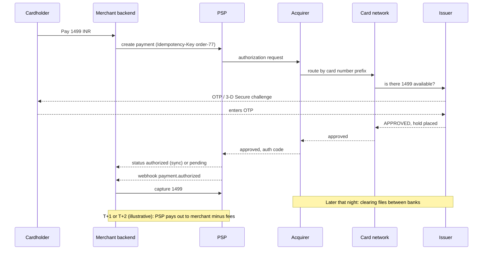

# Payment Gateways and PSPs (Stripe, Razorpay, PayU, Adyen)

## 1. One-line summary

A **payment gateway / PSP** (Payment Service Provider) is the company your backend calls over HTTPS to take money from a customer; it hides a long chain of banks and card networks behind one API (`create payment`, `capture`, `refund`) and tells you the result, often later, through a **webhook**.

> 💡 **Gateway vs PSP**: strictly, a *gateway* only carries the card data to the bank side, while a *PSP* also signs you up as a merchant, holds funds and pays you out. Stripe, Razorpay, PayU and Adyen do both, so in interviews the words are used interchangeably.

---

## 2. The problem it solves

**The pain:** you run an e-commerce site and want to accept a ₹1,499 card payment. Doing it yourself means:

- A contract with an **acquiring bank** and certification with each **card network** (Visa, Mastercard, RuPay), each with its own message formats.
- Handling raw card numbers, which puts your whole infrastructure under **PCI DSS** audit (explained in §3.7).
- Implementing **3-D Secure / OTP** flows, refunds, disputes, UPI, netbanking, wallets, each a different integration.

**The fix:** pay a PSP a small fee per transaction. You integrate once; they handle banks, networks, card storage and regulation.

> Infra analogy: like a managed cloud load balancer in front of many backends. You call one endpoint; it routes to the right "backend" (Visa, RuPay, UPI) and returns a result. And like any remote dependency, it can time out, so you design for that.

---

## 3. How it works

### 3.1 The cast

| Party | Who it is | Plain words |
|---|---|---|
| **Cardholder** | The customer | Owns the card |
| **Merchant** | You (the shop) | Sells something |
| **PSP / gateway** | Stripe, Razorpay, PayU, Adyen | Your single API to everything below |
| **Acquirer** | The merchant's bank (e.g. HDFC, Axis as acquirers) | Bank that "acquires" card payments on the merchant's behalf and receives the money |
| **Card network** | Visa, Mastercard, RuPay (RuPay is run by NPCI, India's national payments body) | The "switch" routing messages between thousands of acquirers and issuers, and setting rules |
| **Issuer** | The cardholder's bank (e.g. SBI, ICICI) | Bank that issued the card, decides approve/decline, holds the customer's money |

### 3.2 Authorization, capture, settlement

| Step | What happens | Money moves? |
|---|---|---|
| **Authorization** | Issuer checks balance/fraud, places a **hold** (shows as "pending" in the customer's app) | No, only reserved |
| **Capture** | Merchant says "I'm actually taking it" (often automatic right after auth; manual for hotels, cabs, pre-orders) | Marked for transfer |
| **Clearing** | Networks exchange batch files of captured transactions between acquirers and issuers | Calculated |
| **Settlement** | Issuer pays acquirer, acquirer/PSP pays merchant, usually in **daily batches**, e.g. T+1 or T+2 (T = transaction day, numbers vary by PSP and contract) | Yes |
| **Void** | Cancel an authorization before capture, releasing the hold | No |

A hold that is never captured **expires** (commonly around 7 days for cards, varies by network and merchant category).

### 3.3 Refunds and chargebacks

- **Refund**: the merchant decides to return money (full or **partial**, e.g. 1 of 3 items returned). It's a new transaction linked to the original, takes days to reach the card (often 5–7 working days, illustrative).
- **Chargeback / dispute**: the **customer** complains to their issuer ("I never got the item", "not my transaction"). The issuer pulls the money back from the acquirer, the PSP debits you plus a dispute fee, and you have a deadline to submit evidence (delivery proof). Windows are long: networks allow disputes for months (around 120 days is a common figure, illustrative).

Design impact: a payment that was `SUCCESS` can become `REFUNDED`, `PARTIALLY_REFUNDED` or `DISPUTED` weeks later, so it needs a [state machine](../../LLD/concepts/state-machines.md), not a boolean.

### 3.4 3-D Secure, OTP and India's AFA rule

**3-D Secure** ("Verified by Visa", "Mastercard SecureCode/Identity Check") adds a step where the **issuer** authenticates the customer, usually an OTP or bank-app approval, before approving an online card payment. Version 2 (EMVCo, ~2016) adds device data so low-risk payments can skip the challenge.

India requires an **Additional Factor of Authentication (AFA)** for online ("card-not-present") card payments, which is why Indian cards almost always ask for an OTP (in place since around 2009–2011). RBI's *Authentication Mechanisms for Digital Payment Transactions Directions, 2025* (issued 25 Sep 2025, compliance by 1 Apr 2026) generalise this: at least two factors for digital payments, at least one of them **dynamic** (unique per transaction, like an OTP), with exemptions such as small contactless payments and recurring e-mandates (a standing instruction the customer approved once, e.g. a monthly Netflix charge). It allows other factors besides SMS OTP but does not ban SMS OTP.

Design impact: the payment is **asynchronous**. The user is redirected to the bank page, may close the tab, and your server learns the result only via webhook or status check.

### 3.5 Tokenization

**Tokenization** replaces the 16-digit card number (**PAN**, Primary Account Number) with a **token**, a substitute value that's useless outside one merchant/device. In India, RBI's **card-on-file (CoF) tokenization** framework (2021, deadlines extended several times, finally effective from **1 Oct 2022** after the 30 Sep 2022 deadline) says that **no one in the payment chain except the card issuer and card network may store card data**. "Save this card" on Swiggy or Amazon now stores a network token created with the customer's consent (confirmed with AFA), not the card number.

Design impact: your DB stores `token_id`, last 4 digits and expiry for display, never the PAN.

### 3.6 Webhooks: async results, verified and idempotent

A **webhook** is the PSP calling **your** HTTPS endpoint when something happens (`payment.captured`, `refund.processed`, `dispute.created`). It's how you learn the result of 3-D Secure, refunds and disputes.

| Rule | Why |
|---|---|
| **Verify the signature** | Anyone can POST to `/webhooks/psp`. PSPs sign the body with a shared secret using **HMAC-SHA256** (a keyed hash: only someone with the secret can produce it), e.g. Stripe's `Stripe-Signature` header, Razorpay's `X-Razorpay-Signature`. Recompute it and compare, and reject old timestamps to stop **replay** (re-sending a captured valid request). |
| **Make processing idempotent** | PSPs deliver **at least once**: they retry until you return 2xx (Stripe retries for up to ~3 days). Store the event id with a unique constraint and skip duplicates. See [idempotency and delivery semantics](../concepts/idempotency-and-delivery-semantics.md). |
| **Ack fast, process async** | Return 200 after writing the event to a table/queue ([message queues](message-queues.md)), do the work in a worker. A slow handler times out and triggers retries. |
| **Handle out-of-order** | `payment.captured` may arrive before `payment.authorized`. Apply events through a state machine that ignores moves backwards. |
| **Don't rely on them alone** | Webhooks can be missed for hours. Poll the PSP's status API for payments stuck in `PENDING` and run daily [reconciliation](../concepts/payment-reconciliation.md). |

### 3.7 Idempotency keys in PSP APIs

The scariest moment: you call `create payment`, and the connection times out. Did it charge? Stripe's API accepts an **`Idempotency-Key` header**: send the same key on retry and Stripe returns the stored result of the first request (even if it was an error) instead of charging again. Stripe documents that keys may be pruned once they are **at least 24 hours old**, and reusing the same key with different parameters is rejected. Other PSPs offer similar mechanisms or let you look up by your own `receipt`/order id.

Use a key derived from your business id (`order-77-attempt-1`), never a random one per retry. Full pattern: [sagas and distributed transactions](../concepts/sagas-and-distributed-transactions.md) §3.4.

### 3.8 PCI DSS scope reduction

**PCI DSS** (Payment Card Industry Data Security Standard, run by the PCI Security Standards Council, founded 2006; current version 4.0.1, 2024) is the security checklist every system that **stores, processes or transmits** card numbers must pass: network segmentation, encryption, access logs, quarterly scans. The more of your system touches card data, the bigger and costlier the audit ("scope").

The trick: **never let the card number touch your servers.**

| Integration | How | Your PCI scope |
|---|---|---|
| **Redirect / hosted checkout** | Customer is sent to the PSP's payment page | Smallest (short self-assessment questionnaire) |
| **Hosted fields / iframe / SDK** | Card inputs are PSP-served iframes inside your page, return a token | Small |
| **Direct API with raw card data** | Card number posts to your backend, you forward it | Full audit, rarely worth it |

Infra analogy: like keeping secrets in Vault so app pods never hold the raw value; fewer places with secrets means a smaller blast radius and a smaller audit.

### 3.9 UPI is a different rail

**UPI** (Unified Payments Interface, run by NPCI, the National Payments Corporation of India) moves money **bank account to bank account** in real time, identified by a VPA like `name@okbank`, approved by the customer's UPI PIN in their app. No card network, no separate capture step, and settlement between banks happens in NPCI cycles several times a day. PSPs expose UPI through the same API (`method: upi`), but the outcome is often `PENDING` for seconds to minutes, so the same webhook + polling design applies. Deep dive: [How UPI works](../../under-the-hood/upi.md).

### 3.10 Fees

The merchant pays a **MDR** (Merchant Discount Rate): a percentage of each payment split between issuer (**interchange**), network and acquirer/PSP. Illustrative: a PSP plan of ~2% on ₹1,499 = ₹29.98 + 18% GST (India's goods and services tax) on the fee ≈ ₹35.38, so you receive ≈ ₹1,463.62. In India, MDR on **UPI and RuPay debit cards is zero** by law since Jan 2020, which is one reason UPI took off. Fees are deducted at settlement, so the amount you receive ≠ the amount charged: a key [reconciliation](../concepts/payment-reconciliation.md) detail. Store money as integer paise or `BigDecimal` ([BigDecimal and money](../../LLD/libraries/java/bigdecimal-and-money.md)).

---

## 4. When to use it

- Almost any product that takes money from consumers: e-commerce, ride-hailing, subscriptions, wallet top-ups.
- When you need many methods (cards, UPI, netbanking, wallets) behind one API.
- When you want to stay out of most PCI DSS scope and let the PSP handle 3-D Secure, tokenization and disputes.

## 5. When NOT to use it (and why it's a mistake)

| Situation | Why |
|---|---|
| Moving money **inside** your own system (wallet to wallet) | That's a [ledger](../../LLD/concepts/ledgers-and-event-sourcing.md) entry in your DB. Calling a PSP adds fees and latency for no reason. |
| Huge volume where every 0.1% matters (Amazon-scale) | Big players connect directly to acquirers or run multiple PSPs with smart routing. Even then they keep PSPs as fallback. |
| Bulk B2B payouts / salary | Use banking payout APIs (NEFT/IMPS/RTGS via a bank or payout product), not a card checkout. |
| Treating the PSP as your source of truth | You still need your own payments table and ledger; the PSP is one party in [reconciliation](../concepts/payment-reconciliation.md). |

---

## 6. Commonly confused with

| | **PSP / gateway** | **Acquirer** | **Card network** | **Issuer** | **UPI / NPCI** |
|---|---|---|---|---|---|
| Who | Stripe, Razorpay | Merchant's bank | Visa, Mastercard, RuPay | Customer's bank | National switch for account-to-account |
| You talk to it? | Yes, via API | Rarely directly | Never | Never | Via PSP or bank |
| Decides approve/decline | No | No | Routes, sets rules | **Yes** | Customer's bank, with UPI PIN |
| Holds merchant's money | Often, until payout | Yes | No | No | No |

| | **Authorization** | **Capture** | **Settlement** | **Refund** | **Chargeback** |
|---|---|---|---|---|---|
| Started by | Merchant (via PSP) | Merchant | Banks, batch | Merchant | **Customer** via issuer |
| Money moves | No (hold) | Queued | Yes | Back to customer | Pulled back from merchant |

---

## 7. Common mistakes / misuse

1. **Treating a timeout as failure** and letting the user pay again: double charge. Retry with the same idempotency key or query status first.
2. **Random idempotency key per retry**, which defeats the purpose.
3. **Calling the PSP inside a DB transaction**, holding row locks for seconds; see [sagas](../concepts/sagas-and-distributed-transactions.md) §7.
4. **Trusting the browser redirect** (`/success?payment_id=...`) as proof of payment. Anyone can open that URL. Confirm via verified webhook or a server-side status call.
5. **Unverified webhooks**, so an attacker can mark orders paid.
6. **Non-idempotent webhook handler**: a retried `payment.captured` ships the order twice or credits a wallet twice.
7. **Storing card numbers** "for convenience": PCI DSS violation, and illegal for merchants in India since the 2022 CoF rule.
8. **Using `double` for amounts** (₹0.1 + ₹0.2 ≠ ₹0.3). Use paise as `long` or `BigDecimal`.
9. **Forgetting that SUCCESS isn't final**: refunds and chargebacks arrive weeks later.

---

## 8. Interview cheat-sheet

> "We integrate with a PSP like Razorpay or Stripe through hosted checkout, so card numbers never touch our servers and our PCI scope stays small. Behind the PSP, the acquirer, card network and issuer handle authorization, then capture, and settlement arrives in daily batches minus MDR. Every create or capture call carries an idempotency key derived from our order id, so retries after a timeout can't double-charge. Results arrive asynchronously, because of OTP and UPI, so we treat the payment as PENDING, process signed webhooks idempotently by event id, and poll the status API for anything stuck. A daily reconciliation against PSP settlement reports catches anything that slipped through, and refunds and chargebacks are later states in the payment's state machine."

---

## 9. Used in

- [Payment system](../interviews/payment-system/README.md): the external PSP integration: payment lifecycle (authorize, capture, refund, dispute), idempotency keys on outgoing calls, signed and deduplicated webhooks, status polling for pending payments, PCI scope reduction with hosted checkout, UPI as a second rail.
- Related: [payment reconciliation](../concepts/payment-reconciliation.md), [sagas and distributed transactions](../concepts/sagas-and-distributed-transactions.md), [idempotency and delivery semantics](../concepts/idempotency-and-delivery-semantics.md), [retries, backoff and DLQ](../concepts/retries-backoff-and-dlq.md), [TLS and mTLS](../concepts/tls-and-mtls.md), [card and PIN security](../../LLD/concepts/card-and-pin-security.md), [ledgers and event sourcing](../../LLD/concepts/ledgers-and-event-sourcing.md), [How UPI works](../../under-the-hood/upi.md), [double-entry ledgers](../../under-the-hood/double-entry-ledgers.md).

**Sources:** Stripe docs, "Idempotent requests" (keys pruned after ≥24 h) and webhook signature docs; RBI card-on-file tokenisation framework (Sep 2021, deadline extended to 30 Sep 2022); RBI (Authentication Mechanisms for Digital Payment Transactions) Directions, 2025 (25 Sep 2025, compliance 1 Apr 2026); PCI SSC, PCI DSS v4.0.1 (Jun 2024). Fee, settlement and dispute-window numbers are illustrative.
