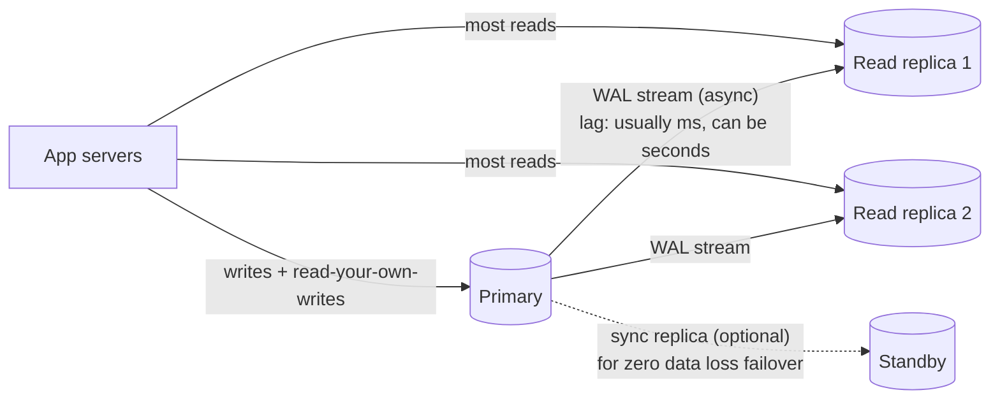

# PostgreSQL

## 1. One-line summary

PostgreSQL is a battle-tested **open-source relational database**: data in tables with a schema, queried with SQL, with **ACID transactions**, indexes, constraints and joins. It is the sensible default database for most systems.

---

## 2. The problem it solves

**The pain:** you need to store business data so that it is *correct* — no lost writes after a crash, no two users getting the same username, no money appearing from nowhere when two requests run at once — and you want to ask new questions of the data later without rewriting storage code.

**The fix:** a relational database gives you:
- **Durability** — once `COMMIT` returns, the data survives a crash.
- **Constraints** — `UNIQUE`, `NOT NULL`, `FOREIGN KEY`, `CHECK` enforced by the DB, not by hopeful app code.
- **Transactions** — several changes succeed or fail together.
- **Flexible queries** — joins, aggregations, ad-hoc SQL, add an index later when a new query appears.

And a single modern node is **much bigger than people think**: e.g. 64 vCPU, 512 GB RAM, several TB of NVMe. That handles **tens of thousands of writes/sec** and **many TB of data**, and read replicas multiply read capacity.

---

## 3. How it works

### 3.1 ACID in plain words

| Letter | Meaning | Plain words |
|---|---|---|
| **A**tomicity | All or nothing | Transfer debits A *and* credits B, or neither. |
| **C**onsistency | Constraints always hold | A `UNIQUE` short code can never appear twice. |
| **I**solation | Concurrent transactions don't see each other's half-done work | Default `READ COMMITTED`; `SERIALIZABLE` available when you need it. |
| **D**urability | Committed = safe | Written to the **WAL** (write-ahead log) and fsynced before `COMMIT` returns. |

The **WAL** is the key internal: every change is first appended to a sequential log on disk, then applied to table pages lazily. On crash, Postgres replays the WAL. The same WAL is streamed to replicas — that's how replication works.

Postgres uses **MVCC** (multi-version concurrency control): an update writes a new row version instead of overwriting, so readers never block writers. Old versions are cleaned up by `VACUUM` (autovacuum) — a common source of on-call pain on very write-heavy tables.

### 3.2 Indexes (B-tree)

Without an index, `WHERE short_code = 'abc123'` scans every row: O(N). A **B-tree index** is a sorted, balanced tree (wide and shallow — each node holds hundreds of keys), so finding a key takes ~3–4 page reads even for a billion rows: O(log N).

```sql
CREATE TABLE urls (
  id          BIGINT PRIMARY KEY,           -- PK = unique B-tree index automatically
  short_code  VARCHAR(10) NOT NULL UNIQUE,  -- UNIQUE = another B-tree index
  long_url    TEXT NOT NULL,
  user_id     BIGINT,
  created_at  TIMESTAMPTZ NOT NULL DEFAULT now(),
  expires_at  TIMESTAMPTZ
);
CREATE INDEX idx_urls_user_created ON urls (user_id, created_at DESC);  -- "my links" page
```

- B-trees support equality **and** range/sort (`created_at > ...`, `ORDER BY`).
- Cost: every index slows writes (each insert updates every index) and takes disk. Don't index everything.
- Composite index `(user_id, created_at)` works for `WHERE user_id = ?` and `WHERE user_id = ? ORDER BY created_at`, but **not** for `WHERE created_at > ?` alone (leftmost-prefix rule).

### 3.3 Unique constraints as a correctness tool

`UNIQUE(short_code)` means: if two app servers race to insert the same custom alias, **exactly one** succeeds and the other gets an error (`23505 unique_violation`) — no locks or "check then insert" in Java needed. Check-then-insert in app code is a race condition; the constraint is not.

### 3.4 Replication: primary + read replicas



- One **primary** accepts writes. Replicas replay its WAL and serve **read-only** queries.
- **Replication lag**: async replicas are behind by milliseconds normally, seconds under load. So "create a short URL, then immediately redirect via a replica" can 404. Fix: read your own writes from the primary, or fall back to primary on a miss.
- **Failover**: if the primary dies, promote a replica (Patroni, AWS RDS Multi-AZ, Cloud SQL HA). With **async** replication you can lose the last few ms of commits; **synchronous** replication to one standby avoids that at the cost of write latency.
- Replicas scale **reads**, not **writes**. Every replica still applies every write.

### 3.5 When vertical scaling + replicas is enough

Do the math (see [back-of-the-envelope](../concepts/back-of-the-envelope.md)). Example: URL shortener, 100M new URLs/month.

- Writes: 100M / (30 × 86,400 s) ≈ 100M / 2.6M ≈ **~40 writes/s** (peak maybe 400/s). A single Postgres node does **thousands** of simple inserts/s. Easily fine.
- Storage: 100M/month × 12 × 5 years = 6B rows × ~500 bytes ≈ **3 TB** over 5 years. Fits on one big node (with partitioning by time, or archiving).
- Reads: 100:1 read:write → ~4,000 reads/s average. A cache plus 2–3 replicas covers it.

Rule of thumb: if writes are < ~10k/s and data < a few TB, **one primary + replicas + cache** is enough, and it is far simpler than anything distributed.

### 3.6 Sharding pain

When you outgrow one primary for writes or storage, you **shard**: split rows across many independent Postgres clusters by a key (see [sharding and replication](../concepts/sharding-and-replication.md)). It hurts:
- Pick a shard key; every query without it must hit **all** shards (scatter-gather).
- **Cross-shard transactions and joins** are gone (or need 2PC — slow and fragile).
- **Unique constraints** only hold within a shard.
- **Resharding** (adding shards) means moving live data.
- Global IDs can't come from one `SERIAL` anymore → [ID generation](../concepts/id-generation.md).

Tools like **Citus** or **Vitess** (MySQL) automate parts, and "NewSQL" databases (CockroachDB, Spanner, YugabyteDB) give SQL + auto-sharding. But this is exactly where a store designed to be partitioned, like [Cassandra / DynamoDB](cassandra.md), becomes attractive *if* your access pattern is simple key lookups.

---

## 4. When to use it

- The default for **most** business data: users, orders, payments, URL mappings at moderate scale.
- When you need **transactions** across rows/tables, **constraints**, or **ad-hoc queries/reporting**.
- When the data model is relational (entities referencing each other) or still evolving.
- When numbers say it fits on one node (+ replicas) — which is more often than candidates assume.

## 5. When NOT to use it (and why it's a mistake)

| Situation | Why it's a mistake |
|---|---|
| Sustained **100k+ writes/s** or **tens of TB+** with simple key access | You'll be hand-sharding Postgres and rebuilding what Cassandra/DynamoDB give natively. |
| Multi-region active-active writes | Postgres has one primary; multi-primary setups are complex and conflict-prone. |
| Huge append-only event streams (clickstream) | Better in [Kafka](kafka.md) → a columnar/analytics store (ClickHouse, BigQuery). Row-store + indexes + VACUUM struggle. |
| Ephemeral, sub-ms hot data | Use [Redis](redis.md) as a cache in front. |

---

## 6. Commonly confused with

| | **PostgreSQL** | **Cassandra / DynamoDB** |
|---|---|---|
| Model | Relational tables, schema, joins | Wide-column / key-value; data modeled per query |
| Queries | Any SQL, ad-hoc, add indexes later | Only by partition key (+ clustering key range); new query often = new table |
| Transactions | Full ACID, multi-row, multi-table | Single-partition atomicity; LWT/transactions limited and expensive |
| Consistency | Strong on primary | Tunable (ONE/QUORUM/ALL) / eventually consistent by default |
| Write scaling | One primary (vertical) → manual sharding | Linear: add nodes, data rebalances automatically |
| Availability | Failover in seconds–tens of seconds | Leaderless (Cassandra): no failover needed, any replica takes writes |
| Ops | Familiar, huge ecosystem | Cassandra: heavy ops; DynamoDB: zero ops, pay per request |
| Sweet spot | Correctness, flexibility, up to ~TBs and ~10k writes/s per primary | Massive scale, simple known access patterns, high write rates |

See [CAP and consistency](../concepts/cap-and-consistency.md) for why these trade-offs exist.

---

## 7. Common mistakes / misuse

1. **Choosing NoSQL "because scale"** when the numbers fit on one Postgres node. 40 writes/s and 3 TB is not "scale". You give up constraints, transactions and ad-hoc queries for nothing. Interviewers at L4/L5 love a candidate who **does the math first**.
2. **The opposite: forcing Postgres** at 500k writes/s across regions, then drawing "shard it" without explaining shard key, resharding, cross-shard queries and unique constraints.
3. **Check-then-insert** in app code instead of a `UNIQUE` constraint → duplicates under concurrency.
4. **Reading from a replica right after writing** → stale reads / 404s due to replication lag.
5. **Indexing every column**, killing write throughput; or **missing the index** for the main query and doing full scans.
6. **"Add read replicas" to fix write load.** Replicas don't help writes.
7. **Too many connections**: each Postgres connection is a process (~5–10 MB). 50 pods × 50-connection Hikari pools = 2,500 connections → trouble. Use PgBouncer or smaller pools.
8. **Long-running transactions** blocking VACUUM → table bloat.

---

## 8. Interview cheat-sheet

> "I'll start with PostgreSQL as the source of truth. At ~40 writes/s and about 3 TB over five years, a single primary handles this comfortably, and I get ACID transactions and a `UNIQUE` constraint on the short code, so collisions are rejected by the database rather than by racy app logic. Reads go through a cache, then to read replicas; I'm aware replicas lag by milliseconds to seconds, so read-after-write goes to the primary. Failover is handled by something like Patroni or RDS Multi-AZ. If writes grew past what one primary can take, I'd shard by short code or move to a partitioned store like DynamoDB or Cassandra, accepting that I lose cross-row transactions and ad-hoc queries."

---

## 9. Used in

- [URL shortener](../interviews/url-shortener/README.md) — the **L4 answer's database**: a single Postgres with a `UNIQUE` short code, replicas for reads, cache in front.
- [Notification system](../interviews/notification-system/README.md) — stores **user preferences, contact info, templates and device tokens**; can also hold the **transactional outbox** and a low-volume job table using `SKIP LOCKED`.
- [News feed](../interviews/news-feed/README.md): the **L4 answer's store** for users, posts and the follow graph (`followers` / `following` tables), and the place to show keyset pagination SQL ([pagination](../concepts/pagination.md), [graph databases](graph-databases.md)).
- [Ride-sharing](../interviews/ride-sharing/README.md): the **trip store and state machine** (`REQUESTED → DRIVER_ASSIGNED → ... → COMPLETED/CANCELLED` guarded by conditional `UPDATE ... WHERE state = ?`), payment/saga state with an outbox, and PostGIS for service-area polygons and geofences.
- [Distributed key-value store](../interviews/distributed-kv-store/README.md): the **B-tree, single-leader baseline** that the LSM storage engine and leaderless replication are contrasted with ([LSM trees and storage engines](../concepts/lsm-trees-and-storage-engines.md)).
- [LLD: Task Scheduler](../../LLD/interviews/task-scheduler/README.md): a **durable task table** where many scheduler instances claim due rows with `SELECT ... FOR UPDATE SKIP LOCKED` without blocking each other.
- [Video streaming](../interviews/video-streaming/README.md): video metadata and the processing **state machine** (UPLOADING → PROCESSING → READY / FAILED): small rows, heavily cached reads.
- [LLD: Thread Pool / Connection Pool](../../LLD/interviews/thread-pool/README.md): `max_connections` vs pods × pool size, and when to put **pgbouncer / RDS Proxy** in front.
- [Payment system](../interviews/payment-system/README.md): payments, ledger, idempotency keys and outbox in **one transaction**; conditional state updates; synchronous replication for RPO 0.
- Related concepts: [sharding and replication](../concepts/sharding-and-replication.md), [CAP and consistency](../concepts/cap-and-consistency.md), [back-of-the-envelope](../concepts/back-of-the-envelope.md), [ID generation](../concepts/id-generation.md).
