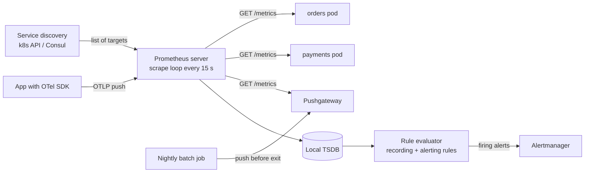
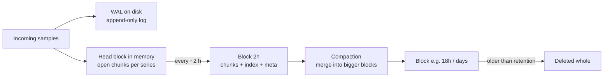

# Prometheus and Time-Series Databases

## 1. One-line summary

**Prometheus** is an open-source monitoring system that **pulls** ("scrapes") numbers from your services every few seconds and stores them in its own **time-series database (TSDB)**: a store built for one shape of data, *(series identity, timestamp, number)*, appended constantly and read back as ranges and aggregates with a query language called **PromQL**.

💡 A **time series** is a list of (timestamp, value) points for one thing being measured, e.g. "requests served by pod `orders-7f9c` on route `/checkout`, sampled every 15 s".

> You already use Prometheus + Grafana at work. This file is about *how it works inside* and *why it is built that way*, which is what an interview "design a metrics system" question is really asking. For the big picture (metrics vs logs vs traces, RED/USE, percentiles) see [observability](../concepts/observability.md).

---

## 2. The problem it solves

**The pain:** 2,000 pods each expose ~1,000 numbers (request counts, latency buckets, heap used, pool usage). You want to keep every one every 15 s, graph any of them, and alert within a minute.

```
2,000 pods × 1,000 series = 2,000,000 active series
2,000,000 series / 15 s   ≈ 133,000 samples written per second
per day: 133,000 × 86,400 ≈ 11.5 billion samples
```

A general-purpose database like [PostgreSQL](postgresql.md) with one row per sample would need ~11.5 B rows a day with an index on (series, time): huge, write-amplified (every insert also updates a **B-tree** index, the sorted tree structure databases use for lookups) and slow to scan. But metrics data has special properties you can exploit:

- **Append-only, in time order.** You never update yesterday's CPU value.
- **Recent data is hot**, old data is rarely read and can be coarser.
- **Values change slowly**, so neighbouring points compress extremely well.
- **Queries are by label sets and time ranges** ("all pods of `orders`, last 1 h"), never by value.

**The fix:** a TSDB that keeps the newest data in memory, writes immutable compressed blocks to disk, and indexes **labels → series** like a search engine indexes words → documents.

---

## 3. How it works

### 3.1 Data model: metric name + labels = one series

```
http_requests_total{service="orders", route="/checkout", status="500", pod="orders-7f9c"}  →  [(t1, 1027), (t2, 1031), ...]
└── metric name ──┘ └──────────────── labels (key=value pairs) ────────────────────────┘     samples: (int64 ms timestamp, float64)
```

Every **unique combination** of name + label values is a separate series. A **sample** is one (timestamp, value) point: a 64-bit millisecond timestamp and a 64-bit floating-point number (**float64**, Java's `double`).

### 3.2 The four metric types

| Type | What it is | Example | How you query it |
|---|---|---|---|
| **Counter** | Only goes up (resets to 0 on restart) | `http_requests_total` | `rate(...)` per second; never graph the raw value |
| **Gauge** | Goes up and down | `hikaricp_connections_active`, `jvm_memory_used_bytes` | raw value, `avg`, `max` |
| **Histogram** | Counters per latency **bucket** (`le` = "less or equal" upper bound) + `_sum` + `_count` | `http_request_duration_seconds_bucket{le="0.3"}` | `histogram_quantile(0.99, ...)` |
| **Summary** | Quantiles computed **inside the app** (`{quantile="0.99"}`) | client-side p99 | read directly; **cannot be aggregated** |

**Why summaries can't be aggregated:** pod A's p99 is 100 ms, pod B's p99 is 900 ms. The fleet p99 is *not* 500 ms; it depends on how many requests each pod served and how they're distributed, and that information was thrown away inside each app. Histogram buckets are just counters, so you can **add** them across pods (`sum by (le)`) and then compute the percentile from the merged buckets. Rule: **use histograms** for anything you'll aggregate. (Prometheus also has newer **native histograms** with automatic exponential buckets; same idea, finer resolution.)

### 3.3 Pull (scrape) vs push



- **Pull:** Prometheus asks the [service discovery](../concepts/service-discovery.md) system (e.g. the Kubernetes API) "which pods exist?", then does an HTTP `GET /metrics` on each. The app just keeps counters in memory and prints them as text when asked.
  - ✅ A failed scrape **is a signal** (`up == 0`): you learn the target is dead. ✅ The server controls the load (it decides how often). ✅ You can `curl` a pod's `/metrics` while debugging.
  - ❌ Prometheus must be able to reach every target (hard across firewalls or **NAT**, where many machines hide behind one address and can't be called from outside). ❌ Short-lived jobs may finish before the next scrape.
- **Pushgateway:** a small cache for **batch jobs**: the job pushes its final metrics there before exiting, and Prometheus scrapes the gateway. Not a general push pipeline: it never forgets a series unless you delete it, and it hides whether the job is alive.
- **OTLP push:** OpenTelemetry's protocol. Recent Prometheus versions (3.x) can receive OTLP pushes directly (behind a feature flag/config), and most other backends (Mimir, VictoriaMetrics, Datadog) accept push natively.

| | **Pull (scrape)** | **Push** |
|---|---|---|
| Who controls rate | The server | Each client (a buggy client can flood you) |
| Liveness | Free (`up` metric) | Needs a separate heartbeat/staleness rule |
| Network | Server → every target | Every target → a load-balanced endpoint |
| Best for | Long-running services in k8s | Batch jobs, serverless, edge devices, cross-network |

### 3.4 TSDB internals: head block, WAL, 2-hour blocks, compaction



1. **Head block:** the last ~2 hours live in memory. Each series has an open **chunk** (a compressed run of up to ~120 samples) using Gorilla-style compression, about 1–2 bytes per sample ([time-series compression](../concepts/time-series-compression-and-downsampling.md)).
2. **WAL (write-ahead log):** every sample is also appended to a log file on disk first, so a crash loses nothing: on restart Prometheus replays the WAL to rebuild the head. Same idea as a database redo log ([LSM trees and storage engines](../concepts/lsm-trees-and-storage-engines.md)).
3. **Blocks:** every ~2 hours the head is cut into an **immutable block** directory: compressed chunks, an index, and a metadata file. Immutable = never edited, so no locking and easy to copy to [object storage](object-storage.md).
4. **Compaction:** a background job merges small blocks into larger ones (up to 10% of the retention period or 31 days, whichever is smaller), so a 30-day query opens a few files instead of 360.
5. **Retention:** default **15 days**. Deletion = drop whole old block directories. No row-by-row deletes, which is why this is cheap.

This is the **LSM-tree idea** (buffer writes in memory, flush sorted immutable files, merge later) specialised for time.

### 3.5 The label index: postings lists

To answer `http_requests_total{service="orders", status="500"}` Prometheus keeps an [inverted index](../concepts/inverted-index.md), exactly like a search engine:

```
label pair           → postings list (sorted series IDs)
__name__="http_requests_total" → [1, 2, 3, 4, 5, 6, 7, 8]
service="orders"               → [1, 2, 3, 9, 12]
status="500"                   → [3, 8, 12]
intersection                   → [3]        ← only these series' chunks are read
```

Intersecting sorted lists is fast, which is why label filtering is cheap but **regex on high-cardinality labels** (`pod=~".*"` over 1M pods) is not.

### 3.6 PromQL basics

| Query | Means |
|---|---|
| `rate(http_requests_total[5m])` | per-second increase averaged over the last 5 min, per series (handles counter resets) |
| `increase(http_requests_total[1h])` | how much it went up in the last hour (≈ `rate × 3600`) |
| `sum by (route) (rate(http_requests_total{status=~"5.."}[5m]))` | 5xx per second per route, summed across pods |
| `histogram_quantile(0.99, sum by (le, route) (rate(http_request_duration_seconds_bucket[5m])))` | fleet-wide p99 latency per route: sum buckets first, *then* take the quantile |

**Rule:** always `rate` first, then `sum`. `sum` then `rate` breaks when a single pod restarts (its counter drops to 0 and the sum looks like a reset).

### 3.7 Recording rules

A **recording rule** precomputes an expensive query on a schedule and stores the result as a new series:

```yaml
- record: route:http_requests:rate5m
  expr: sum by (route) (rate(http_requests_total[5m]))
```

Dashboards and alerts then read 200 precomputed series (one per route) instead of re-aggregating 2M raw ones on every refresh. Like a **materialised view** (a query result a database stores and refreshes, instead of recomputing on every read).

### 3.8 Scaling out: federation, remote_write, long-term storage

One Prometheus server handles a few million active series. Beyond that, or for >15 days, or for a global view across clusters:

- **Federation:** a "global" Prometheus scrapes a *subset* (usually recording-rule outputs) from per-cluster Prometheus servers via `/federate`. Simple, but only aggregates travel up; no raw data globally.
- **remote_write:** each Prometheus streams every sample (batched, compressed) to a remote backend as it ingests. The standard way to centralise. Prometheus can also run in **agent mode** (scrape + WAL + forward, no local querying).

| System | Model | Notes |
|---|---|---|
| **Thanos** | Sidecar uploads 2 h blocks to object storage; a query layer fans out to sidecars + store gateways | Reuses Prometheus blocks as-is; global view + downsampling |
| **Cortex → Grafana Mimir** | Receives remote_write; horizontally sharded ingesters, blocks in object storage | **Multi-tenant** (one cluster serves many isolated teams/customers); Mimir is the Cortex successor |
| **VictoriaMetrics** | Single binary or cluster; own storage engine | Known for low memory/disk per sample |
| **M3** | Uber's distributed TSDB (M3DB) + aggregator | Built for Uber-scale (billions of series) |

All of them shard series across nodes (by hashing the label set, see [consistent hashing](../concepts/consistent-hashing.md)) and replicate them ([sharding and replication](../concepts/sharding-and-replication.md)).

### 3.9 Cardinality explosion, with numbers

```
http_request_duration_seconds_bucket{service, route, status, le}
 = 20 services × 50 routes × 5 status classes × 12 buckets = 60,000 series   ✔

add pod (200 pods each):        60,000 × 200        = 12,000,000 series     ⚠ already heavy
add user_id (1M active users):  60,000 × 1,000,000  = 60,000,000,000 series ✘
```

At a rule-of-thumb few KB of memory per active series in the head block (exact figure depends on version and churn), 12M series is already tens of GB of RAM, and 60 B is impossible. Histograms multiply cardinality by the bucket count, so they hurt first. Also watch **churn**: pods that restart every deploy create new `pod` label values, so "active series" spikes even if the steady count looks fine.

---

## 4. When to use it

- Numeric, regularly sampled operational data: RED/USE metrics, pool usage, queue depth, JVM stats.
- Alerting on those numbers (see [alerting and SLOs](../concepts/alerting-and-slos.md)).
- Kubernetes environments, where service discovery + pull is natural.

## 5. When NOT to use it (and why it's a mistake)

| Situation | Why it's a mistake |
|---|---|
| Per-user / per-request data (`user_id`, `order_id`, `trace_id` labels) | Each value is a new series; cardinality explodes (3.9). Use logs, traces or an analytics store. |
| Billing / exact counts | Scrapes can be missed and `rate` extrapolates; metrics are approximately right, not auditable. |
| Event data you need to look up individually | A TSDB stores aggregates over time, not events. Use logs or [Kafka](kafka.md) + a store. |
| Long-term (1 year+) on a single Prometheus | Local disk only, no HA, no downsampling. Add Thanos/Mimir/VictoriaMetrics. |

---

## 6. Commonly confused with

| | **Prometheus (TSDB)** | **Elasticsearch / Loki (logs)** | **Postgres + TimescaleDB** | **Kafka** |
|---|---|---|---|---|
| Stores | numeric samples per series | text/JSON events | rows (with time partitioning) | a log of messages |
| Index | labels → series | words/labels → log lines | B-trees | offsets only |
| Cost driver | number of **series** | **volume** of log bytes | rows + indexes | bytes retained |
| Good for | dashboards, alerts | "what happened in this request" | SQL joins over time data | transport between systems |

Also: **Prometheus vs Grafana**: Grafana only draws; Prometheus stores and queries.

---

## 7. Common mistakes / misuse

1. **Unbounded labels** (user IDs, raw URL paths with IDs, error messages).
2. **Averaging summary quantiles** across pods; use histograms and `histogram_quantile` over summed buckets.
3. **`sum` before `rate`** on counters.
4. **`rate` window too short**: `rate(x[30s])` with a 15 s scrape has only ~2 points; use at least 4× the scrape interval.
5. **Pushgateway as a general push pipeline**: stale series live forever and `up` no longer means anything.
6. **One Prometheus, no HA** (high availability, i.e. no redundant copy): run two identical replicas scraping the same targets; Alertmanager dedups their alerts.
7. **Assuming Prometheus is durable long-term storage**: it is a 15-day local cache by default.

---

## 8. Interview cheat-sheet

> "Each metric is a name plus bounded labels, and every unique label combination is one series of (timestamp, float64) samples. Collectors scrape targets found through service discovery, which also gives us liveness for free; batch jobs push through a gateway and edge clients can push OTLP. The storage engine is LSM-like: a WAL plus an in-memory head block of compressed chunks, cut into immutable 2-hour blocks that get compacted and eventually uploaded to object storage, with an inverted index from label pairs to series IDs. Ingest is sharded by hashing the series labels and replicated, and recording rules precompute hot aggregations. The main risk is cardinality: 60,000 series times a million user IDs is 60 billion, so per-user detail goes to logs, not labels. I use histograms, not summaries, because bucket counters can be summed across pods before computing p99."

---

## 9. Used in

- [Metrics & Monitoring](../interviews/metrics-monitoring/README.md): the data model, scrape vs push collection, the TSDB write path (WAL, head block, blocks, compaction), the label index, query layer, long-term storage tiers and the cardinality limits a metrics platform must enforce.
- Related: [observability](../concepts/observability.md), [time-series compression and downsampling](../concepts/time-series-compression-and-downsampling.md), [alerting and SLOs](../concepts/alerting-and-slos.md), [LSM trees](../concepts/lsm-trees-and-storage-engines.md), [inverted index](../concepts/inverted-index.md), [object storage](object-storage.md), [Kafka](kafka.md), [counters at scale](../concepts/counters-at-scale.md).
