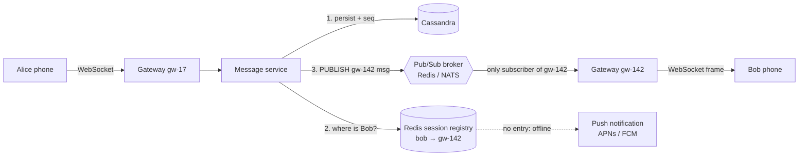

# Publish/Subscribe (Pub/Sub)

## 1. One-line summary

**Pub/Sub** is a messaging pattern where a sender (**publisher**) posts a message to a named **topic** (also called a channel or subject) without knowing who will receive it, and every **subscriber** to that topic gets its own copy. Products that implement it: **Redis Pub/Sub**, **Redis Streams**, **[Kafka](kafka.md)**, **NATS**, **Google Cloud Pub/Sub**, AWS SNS.

---

## 2. The problem it solves

**The pain:** a chat backend runs 200 gateway pods. Each pod holds ~100k WebSocket connections (a **WebSocket** is a long-lived two-way connection between the app and a server, see [WebSockets and SSE](websockets-and-sse.md)). Alice, connected to `gw-17`, sends a message to Bob. Bob's socket is on `gw-142`. How does the message get from the service that processed it to `gw-142`?

- **Every gateway calls every other gateway** directly: 200 × 199 ≈ 40,000 point-to-point links to manage, and each sender has to know the full, changing list of pods (they scale up and down all day).
- **Broadcast to all 200 gateways** and let each check "do I hold Bob?": 199 of 200 deliveries are wasted. At 1M messages/s that's 200M deliveries/s.
- **Store the message and let gateways poll the DB**: adds polling latency and hammers the database.

**The fix:** decouple sender and receiver with a topic. Each gateway subscribes to a topic named after itself (`gw-142`). A presence/session registry says "Bob is on `gw-142`". The message service publishes to topic `gw-142`; only that gateway receives it. Pods can come and go; publishers never need the pod list.

> Infra analogy: Prometheus Alertmanager → receivers. The alert rule doesn't know who's on call or which Slack channel; it emits to a route, and whoever is subscribed gets it. Or Kubernetes **watch**: controllers subscribe to "Pod changes" and the API server pushes events to every watcher.

---

## 3. How it works

### 3.1 Topic semantics vs queue semantics

The single most important distinction:

| | **Topic (pub/sub, broadcast)** | **Queue (point-to-point, work sharing)** |
|---|---|---|
| Who gets a message | **Every** subscriber gets a copy | **Exactly one** of the competing consumers |
| Adding a consumer | Another copy is delivered | Work is split further |
| Example | "Config changed" → all 50 pods reload | "Resize this image" → one of 10 workers does it |
| Products | Redis Pub/Sub, SNS, NATS subjects | SQS, RabbitMQ queue, see [message queues](message-queues.md) |

Many products give you **both** at once via **consumer groups**: in [Kafka](kafka.md), each consumer *group* gets every message (topic semantics between groups), but inside one group each partition goes to one consumer (queue semantics within a group). NATS has "queue groups"; Google Pub/Sub has one topic with many "subscriptions", each subscription being a queue.

### 3.2 Chat: routing a message to the gateway holding the connection



1. Every gateway, at startup, subscribes to its own topic (`SUBSCRIBE gw-142`).
2. When Bob connects, `gw-142` writes `session:bob → gw-142` with a TTL in [Redis](redis.md) (see [presence and heartbeats](../concepts/presence-and-heartbeats.md)).
3. The message service **persists first** (the DB is the source of truth), then looks up Bob and publishes to `gw-142`.
4. If the publish is lost, nothing is broken: Bob's app notices a gap in sequence numbers or syncs on reconnect ("give me everything after seq 1041", see [message ordering](../concepts/message-ordering-and-sequencing.md)).

Alternatives you should mention:

| Routing option | How | Trade-off |
|---|---|---|
| **Topic per gateway** (above) | 200 topics, publisher looks up registry | One registry lookup per message; very few topics |
| **Topic per user** | Gateway subscribes `user:bob` when Bob connects | No registry lookup, but 50M topics/subscriptions on the broker |
| **Direct gateway-to-gateway RPC** | Registry stores gateway address; call it with gRPC | No broker hop (lower latency), but you own retries and connection pooling |
| **Topic per conversation** (group chat) | Gateways subscribe to groups their users are in | Natural for large groups; subscribe/unsubscribe churn on connect |

### 3.3 The products and their delivery guarantees

**Delivery guarantee** terms (details in [idempotency and delivery semantics](../concepts/idempotency-and-delivery-semantics.md)): **at-most-once** = may be lost, never duplicated; **at-least-once** = never lost, may be duplicated, so consumers must dedupe.

| Product | Persistence | Guarantee | Replay? | Typical latency | Good for |
|---|---|---|---|---|---|
| **Redis Pub/Sub** | **None.** Messages go only to subscribers connected *right now* | At-most-once (fire-and-forget) | No | < 1 ms | Routing to gateways, cache invalidation pings, typing indicators |
| **Redis Streams** | In Redis memory (+ AOF), trimmed by `MAXLEN` | At-least-once with consumer groups and `XACK` | Yes, within retention | ~1 ms | Lightweight durable fan-out when you already run Redis |
| **[Kafka](kafka.md)** | Replicated log on disk, days/weeks of retention | At-least-once (exactly-once within Kafka) | Yes, by offset | ~5-50 ms | Durable event bus, analytics, many independent consumer teams |
| **NATS (core)** | None | At-most-once | No | < 1 ms | Very fast service-to-service routing, request/reply |
| **NATS JetStream** | Disk, replicated | At-least-once | Yes | ~1-5 ms | NATS with durability |
| **Google Cloud Pub/Sub / AWS SNS+SQS** | Managed, durable (Pub/Sub keeps unacked up to 7 days) | At-least-once | Pub/Sub: seek to timestamp | ~10-100 ms | Cross-service events without running brokers |

Rough throughput: one Redis node handles on the order of **~100k-1M published messages/s** (small payloads); Redis Cluster in versions before 7.0 broadcasts every `PUBLISH` to **all** nodes in the cluster, which doesn't scale. Redis 7+ **sharded pub/sub** (`SPUBLISH`/`SSUBSCRIBE`) keeps a channel on one shard, fixing that.

### 3.4 Why "fire-and-forget" is acceptable for chat routing

Redis Pub/Sub losing a message sounds scary. It's fine **because the pub/sub hop is not the source of truth**:

- The message is already in [Cassandra](cassandra.md) with a sequence number before it is published.
- The recipient's client acks each message; no ack → the message stays "sent ✓" (not "delivered ✓✓"), and on reconnect the client syncs from its last seq.
- So pub/sub is a **latency optimization**, and the durable path is "DB + sync on reconnect". Using Kafka for this hop would add 5-50 ms and disk writes for durability you already have.

Use a durable product (Kafka, Streams, JetStream) when the subscriber **must** eventually process every event and there is no other copy: search indexing, analytics, push-notification workers, audit logs.

### 3.5 Two pub/sub layers in one chat system

Real designs usually run **both** kinds side by side, for different jobs:

```
Fast, lossy layer (Redis Pub/Sub / NATS):   message service → gw-142 → Bob's socket       (~1 ms)
Durable layer (Kafka topic "messages"):     message service → push workers                 (offline users)
                                                            → search/analytics consumers   (if not E2EE)
                                                            → large-group fan-out workers
```

Sizing the fast layer, 1M messages/s at peak with an average of 1.5 recipients online:

```
1,000,000 × 1.5 = 1.5M publishes/s
At ~200k publishes/s per Redis shard (sharded pub/sub) → ~8 shards, ~16 with headroom
```

For **large groups/channels** (say 100k members), publishing once per member's gateway is wasteful. Instead, gateways subscribe to a `conv:{id}` topic when at least one of their connected users is in that conversation; one publish then reaches only the ~200 gateways that care, each forwarding to its local members. That is fan-out done by the broker for the "gateway" level, and by each gateway for the "user" level.

---

## 4. When to use it

- **Routing to stateful nodes**: chat/notification gateways, game servers, live-collaboration servers.
- **Broadcast to all instances**: config reload, cache invalidation, feature-flag change, "user X logged out everywhere".
- **Event-driven architecture**: "message sent" consumed independently by push, search indexing and analytics (durable pub/sub, usually Kafka).
- **Ephemeral signals** where staleness is worse than loss: typing indicators, presence pings, live cursor positions.

## 5. When NOT to use it (and why it's a mistake)

| Situation | Why it's a mistake | Use instead |
|---|---|---|
| Task that must run **exactly once by one worker** ("charge card", "send this email") | Topic semantics give a copy to every subscriber: 3 subscribers = 3 charges | A [queue](message-queues.md) / consumer group |
| Redis Pub/Sub for anything that must not be lost | Subscriber restarting for 2 s = 2 s of messages gone forever | Kafka, Redis Streams, JetStream, or a DB + sync |
| Request/response where the caller needs the result | Pub/sub is one-way and async | Plain RPC/HTTP (or NATS request-reply) |
| Kafka topic **per user** (50M topics) | Kafka is designed for thousands of partitions, not millions of topics | Kafka keyed by userId, or Redis per-gateway channels |
| Only 2 services, 1 consumer | Extra broker to run for no decoupling benefit | Direct call |

---

## 6. Commonly confused with

| | **Pub/Sub (topic)** | **[Message queue](message-queues.md)** | **[Kafka](kafka.md) (log)** | **[Fan-out](../concepts/fan-out.md)** |
|---|---|---|---|---|
| What it is | Pattern: every subscriber gets a copy | Pattern: one consumer per message | Product: durable partitioned log, supports both via consumer groups | Concept: 1 event → N recipient deliveries |
| Message after delivery | Gone (or kept, if durable product) | Deleted after ack | Kept until retention | n/a |
| Ordering | Usually per publisher/channel only | Mostly FIFO, weakens with retries | Strict **per partition** | n/a |
| Scale of "N" | Tens-thousands of subscribers | n/a | Many consumer groups | Can be millions of users (needs a job) |

---

## 7. Common mistakes / misuse

1. **Treating Redis Pub/Sub as durable.** It's a live broadcast; offline subscribers miss everything. Always persist first and have a catch-up path.
2. **Pub/sub where a queue was meant.** Scaling a "worker" subscriber to 5 replicas and wondering why every job runs 5 times.
3. **One topic per user on a heavy broker** (Kafka, SNS): millions of topics hit metadata limits. Route by gateway, or key by user.
4. **Ignoring slow subscribers.** Redis disconnects a pub/sub client whose output buffer exceeds the limit (default hard limit 32 MB); a stuck gateway silently drops out. Monitor it.
5. **Using pub/sub for user-level fan-out to 10M users** in one shot. Pub/sub delivers to *subscribers* (services/pods), not to millions of users; that's a [fan-out](../concepts/fan-out.md) job.
6. **Assuming global ordering.** Only Kafka-per-partition gives a firm order; assign sequence numbers yourself if order matters.
7. **Broadcasting to every gateway** "because it's simpler", then growing from 5 to 200 pods.

---

## 8. Interview cheat-sheet

> "Pub/sub decouples whoever produces a message from whoever holds the connection. Each chat gateway subscribes to a channel named after itself, a Redis registry maps user to gateway, and the message service publishes to that one channel after persisting the message. I'd use Redis Pub/Sub or NATS for that hop because it's sub-millisecond and loss is acceptable: the message is already stored with a sequence number, and the client syncs from its last seq on reconnect. For events that must never be lost and have several independent consumers, like push notifications, search indexing and analytics, I'd use Kafka, which keeps a replicated log and lets each consumer group replay. The key distinction is topic semantics, where every subscriber gets a copy, versus queue semantics, where one worker gets each job."

---

## 9. Used in

- [Chat system](../interviews/chat-system/README.md): **routing a message to the gateway holding the recipient's WebSocket** (per-gateway channels vs direct gateway-to-gateway RPC), large-group/channel delivery, and the durable "message sent" event stream for push and analytics.
- [Distributed message queue](../interviews/distributed-message-queue/README.md): the durable, partitioned log behind pub/sub at scale.
- Related: [Redis](redis.md) (Pub/Sub, Streams), [Kafka](kafka.md), [message queues](message-queues.md), [WebSockets and SSE](websockets-and-sse.md), [fan-out](../concepts/fan-out.md), [idempotency and delivery semantics](../concepts/idempotency-and-delivery-semantics.md), [presence and heartbeats](../concepts/presence-and-heartbeats.md).
