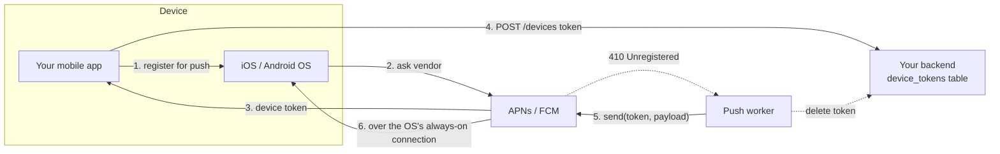

# Push, Email and SMS Providers (APNs, FCM, Twilio, SES, SendGrid)

## 1. One-line summary

These are **third-party delivery services** that actually put a message on a user's phone or inbox: **APNs** (Apple) and **FCM** (Google) for push notifications, **Twilio / SMS aggregators** for text messages, and **Amazon SES / SendGrid** for email. Your system never talks to the phone directly; it hands the message to one of these over HTTPS.

---

## 2. The problem it solves

**The pain:** you want to tell a user "your OTP is 482913". To do that yourself you would need:

- **Push:** a persistent connection to every phone. Impossible: iOS and Android kill background apps to save battery. Only the OS vendor keeps one always-on connection per device.
- **SMS:** contracts with hundreds of mobile carriers worldwide, telecom protocols (SMPP), sender ID registration per country (e.g. DLT registration in India, 10DLC in the US).
- **Email:** mail servers with a good **IP reputation**, SPF/DKIM/DMARC records, bounce handling, feedback loops with Gmail/Outlook. A new IP sending 1M emails lands straight in spam.

**The fix:** pay a provider. You make one HTTPS call (`POST /messages`), they handle carriers, reputation and devices. Your job becomes: call them reliably, respect their limits, and track what happened.

> Infra analogy: like using a managed load balancer or managed DNS instead of running BGP yourself. The hard, regulated, global part is someone else's product.

---

## 3. How it works

### 3.1 Device tokens

- A **device token** (APNs) or **registration token** (FCM) is an opaque string that means "this app on this device". It is **not** a user ID: one user with a phone, a tablet and a work phone has 3 tokens.
- Obtained when the app asks the OS for push permission (iOS shows a prompt; Android 13+ also asks). The app sends it to your backend, which stores `(user_id, platform, token, app_version, last_seen)`.
- Tokens **change or expire**: app reinstall, restore to a new phone, OS update, user disables notifications, or the app isn't opened for a long time (FCM treats tokens inactive for ~270 days as stale). The app should re-send its token on every launch.
- When you send to a dead token, APNs returns **410 Unregistered** and FCM returns **`UNREGISTERED` (404)**. You must delete the token, or you waste calls forever.

### 3.2 Provider cheat-table

| Provider | Channel | API | Rough limits | Rough cost |
|---|---|---|---|---|
| **APNs** | iOS push | HTTP/2, JWT auth, one request per device | No published hard cap; many concurrent streams per connection; Apple throttles abusive senders | Free |
| **FCM** | Android (and iOS/web) push | HTTP v1 API, OAuth2 | ~600k messages/min per project by default (quota can be raised); topic messages also rate-limited | Free |
| **Twilio / aggregators** (Twilio, Vonage, Sinch, MessageBird, local gateways) | SMS | REST `POST /Messages` | Throughput **per sender number**: ~1 msg/s for a US long code, ~100 msg/s for a short code; pay for more | **~$0.008 (US) to ~$0.05+ per SMS** (much more for some countries) |
| **Amazon SES / SendGrid** | Email | REST or SMTP | SES starts in a sandbox (200/day), then e.g. 14 msg/s and rising with reputation | **~$0.10 per 1,000 emails** = $0.0001 each |

**Order of magnitude:** push ≈ free, email ≈ $0.0001, SMS ≈ $0.01. One SMS costs about as much as **100 emails** and infinitely more than a push. A 10M-user SMS blast at $0.01 is **10,000,000 × $0.01 = $100,000**. That is why marketing goes via push/email and SMS is reserved for OTPs and critical alerts.

### 3.3 Delivery receipts and webhooks

"Provider accepted it" (HTTP 200/202) is **not** "user received it". Real status arrives later and asynchronously:

| Channel | What you can learn | How |
|---|---|---|
| SMS | queued → sent → **delivered** / undelivered / failed (carrier DLR = delivery receipt) | Status callback webhook to your URL |
| Email | delivered, **bounced** (hard/soft), **complaint** (marked as spam), opened, clicked | SES → SNS/webhook; SendGrid Event Webhook |
| Push | APNs: only "accepted" or an error. FCM: accepted, plus aggregate delivery data in reports | Opens tracked by your app calling your backend |

Your webhook endpoint receives these, matches them by the provider's message ID (stored when you sent), and updates `notification_status`. Webhooks themselves are **at-least-once and unordered**: you may get "delivered" before "sent", or the same event twice, so store the furthest state and dedupe.

### 3.4 Never call them synchronously in the user request

- Latency: 100 ms to several seconds, plus provider incidents.
- Rate limits: a burst gets you `429 Too Many Requests`.
- Retries need minutes of backoff, which a user request can't wait for.

So: request → enqueue → worker → provider, with [retries and backoff](../concepts/retries-backoff-and-dlq.md) in the worker. See [message queues](message-queues.md).

### 3.5 What to do with each provider response

| Response | Meaning | Worker action |
|---|---|---|
| 200 / 202 + provider message ID | Accepted (not yet delivered) | Store ID, status = SENT, ack |
| 429 Too Many Requests | You exceeded the quota | Back off (honor `Retry-After`), slow the token bucket |
| 5xx / timeout | Provider trouble, outcome unknown | Retry with backoff; dedupe on idempotency key |
| 400 invalid number / bad payload | Permanent | Status = FAILED, no retry |
| APNs 410 / FCM UNREGISTERED | Token dead | Delete token, no retry |
| 401 / 403 | Your credentials (expired APNs key, rotated API key) | Page on-call; pause the channel |

### 3.6 Multi-provider failover

For SMS and email, run **two providers** behind an interface (`SmsSender`):

- Route by country (provider A is cheaper/better in India, B in the US).
- If provider A's error rate or latency crosses a threshold, a **circuit breaker** opens and traffic shifts to B.
- Danger: a timeout from A doesn't mean A didn't send. Failing over after a timeout can produce a **duplicate OTP**. Usually acceptable for an OTP (the user sees two of the same code), worse for "you were charged $500". See [idempotency](../concepts/idempotency-and-delivery-semantics.md).

Push has no failover: only Apple can reach an iPhone.

---

## 4. When to use it

- Any production push, SMS or email. Always.
- SMS for **OTP / 2FA / critical alerts** where reach matters more than cost (works without the app or internet).
- Email for receipts, digests, long content, legal notices.
- Push for engagement and real-time nudges (free, instant, but only if the app is installed and permission granted).

## 5. When NOT to use it (and why it's a mistake)

| Situation | Why it's a mistake |
|---|---|
| Calling providers inside the user's HTTP request | Couples your latency and availability to theirs. Queue it. |
| SMS for marketing to millions | ~$0.01 each, carrier filtering, opt-out regulations (TCPA, GDPR). Use push/email. |
| Push for something the user must get (OTP) | Permission may be off, token stale, phone offline. Use SMS. |
| Real-time in-app updates while the app is open | Push is best-effort and can be delayed. Use [WebSockets/SSE](websockets-and-sse.md). |
| Sending to every stored token every time | Dead tokens waste quota and can get you throttled. Prune on 410/UNREGISTERED. |

---

## 6. Commonly confused with

| | **Use a provider** | **Run your own SMTP / SMS infra** |
|---|---|---|
| Setup | API key, verify domain (SPF/DKIM), register sender | Mail servers, IP warm-up over weeks, carrier/SMPP contracts |
| Deliverability | Provider's established IP reputation | New IPs start in spam |
| Bounces / complaints | Webhooks out of the box | Parse bounce emails yourself |
| Cost | Per message | Cheaper per message at huge scale, expensive people |
| Who does it | Almost everyone | Very large senders (e.g. big social networks) with dedicated teams |

Also: **APNs/FCM vs WebSocket.** Push goes through the OS vendor and works when your app is closed. A WebSocket is your own connection, works only while the app is open. Real systems use both: WebSocket for live in-app updates, push when the user is not connected.

---

## 7. Common mistakes / misuse

1. **Treating HTTP 202 as delivered.** Track the webhook status; report "accepted" vs "delivered" separately.
2. **Never cleaning up device tokens**, so 30% of push calls go to dead devices.
3. **Ignoring provider rate limits** in a broadcast: 10M messages hit FCM at once and come back as 429s, triggering retry storms. Throttle with a token bucket per provider ([rate limiter](../../LLD/interviews/rate-limiter/README.md)).
4. **Retrying non-retryable errors** (invalid phone number, 400 bad request, unsubscribed email). Only retry 429/5xx/timeouts.
5. **Not handling hard bounces and spam complaints.** Keep emailing a dead address and the provider suspends your account (SES reviews accounts above ~5% bounce or ~0.1% complaint rate).
6. **Putting secrets/PII in push payloads.** Lock screens show them. Send "You have a new message", fetch details in-app.
7. **Unsigned webhook endpoints.** Verify the provider's signature (e.g. Twilio `X-Twilio-Signature`), or anyone can mark messages as delivered.
8. **Forgetting quiet hours and time zones** for non-critical sends.

---

## 8. Interview cheat-sheet

> "We don't deliver to devices ourselves; channel workers call APNs and FCM for push, an SMS provider like Twilio, and SES or SendGrid for email. Each app install registers a device token that we store per user and prune when the provider says it's unregistered. Providers are slow, rate-limited and occasionally down, so they are never called in the request path: workers pull from queues, throttle to each provider's quota with a token bucket, and retry 429s and 5xx with backoff. A 202 from the provider only means accepted, so we record the provider message ID and update the real status from delivery-receipt webhooks. SMS is about a cent each versus a hundredth of a cent for email and free for push, so SMS is reserved for OTPs and critical alerts, and for SMS and email we keep a second provider behind a circuit breaker for failover."

---

## 9. Used in

- [Notification system](../interviews/notification-system/README.md): the **channel workers** that call APNs/FCM, SMS gateways and SES/SendGrid; device-token storage; per-provider rate limits; delivery status via webhooks; multi-provider failover.
- [Chat system](../interviews/chat-system/README.md): **push notifications (APNs/FCM) for offline recipients**: wake the app so it reconnects and syncs since its last seq; with E2EE the push carries no readable content.
- Related: [message queues](message-queues.md), [WebSockets and SSE](websockets-and-sse.md), [retries, backoff and DLQ](../concepts/retries-backoff-and-dlq.md), [idempotency and delivery semantics](../concepts/idempotency-and-delivery-semantics.md), [fan-out](../concepts/fan-out.md), [rate limiter (LLD)](../../LLD/interviews/rate-limiter/README.md).
