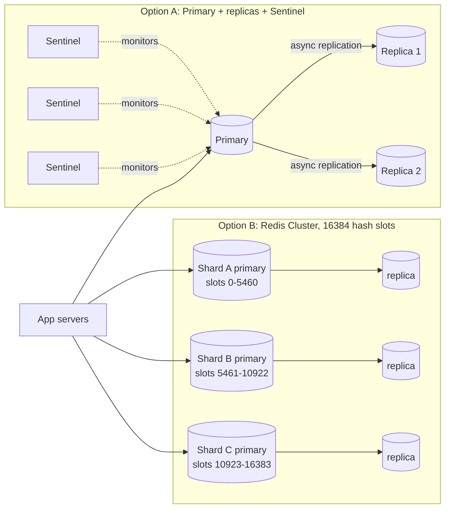

# Redis

## 1. One-line summary

Redis is an **in-memory key-value store** with rich data structures (strings, hashes, lists, sets, sorted sets...). It answers in well under a millisecond, so we mostly use it as a **cache**, a **counter**, or a **shared fast scratchpad** between stateless app servers.

---

## 2. The problem it solves

**The pain:** your app reads the same rows from Postgres again and again. Every read is a network hop + a query planner + maybe a disk read: typically **1–10 ms**, and the DB has a ceiling of maybe **10k–50k simple queries/sec** per node before CPU or I/O becomes the bottleneck. When traffic grows, the DB melts even though 90% of the queries ask for the same few thousand rows.

A second pain: you run 20 stateless app pods behind a load balancer and they need to **share small pieces of state** — a rate-limit counter, a session, a "next ID" counter. A `HashMap` in each JVM does not work, because each pod has its own copy.

**The fix:** put the hot data in RAM on a separate server that every pod talks to.

| | Postgres (indexed lookup) | Redis `GET` |
|---|---|---|
| Latency | ~1–10 ms | ~0.1–0.5 ms (mostly network) |
| Throughput per node | ~10k–50k simple queries/s | **~100k+ ops/s** (single-threaded), more with pipelining |
| Where data lives | Disk (with page cache) | RAM |

So a cache hit is roughly **10x faster** and one Redis node can absorb load that would need several DB replicas.

---

## 3. How it works

### 3.1 Single-threaded event loop

Redis executes commands on **one main thread**. That sounds slow, but every command is an in-memory operation taking microseconds, so one core can do ~100k ops/sec. The big win: **every single command is atomic** — no two commands interleave. That is why `INCR` is safe without locks.

> Infra analogy: like nginx, it uses an event loop (epoll) to handle thousands of connections on one thread instead of thread-per-connection like classic Tomcat.

### 3.2 Data structures (the real reason to pick Redis)

| Type | What it is | Typical use | Example |
|---|---|---|---|
| **String** | bytes up to 512 MB (a number counts too) | cache a value, counters | `SET url:abc123 "https://..." EX 86400` |
| **Hash** | map of field → value under one key | an object (user profile) | `HSET user:42 name "Asha" plan "pro"` |
| **List** | linked list, push/pop at both ends | simple queue, recent-items list | `LPUSH recent:42 item9` |
| **Set** | unordered unique members | tags, "who liked this" | `SADD liked:post7 user42` |
| **Sorted set (ZSET)** | members ordered by a score | leaderboards, top-K, time-ordered feeds | `ZINCRBY clicks:today 1 abc123` |
| **HyperLogLog** | approximate distinct count in 12 KB | unique visitors | `PFADD uv:abc123 ip1` |
| **Stream** | append-only log with consumer groups | lightweight Kafka-like queue | `XADD events * type click` |

Rule of thumb: if you find yourself serializing a whole object to JSON, editing one field and writing it back, you probably wanted a **hash**. If you want "top 10 by X", you want a **sorted set**.

### 3.3 TTL (time to live)

Any key can expire: `SET k v EX 3600` or `EXPIRE k 3600`. Redis deletes expired keys lazily (when you touch them) plus a background sampler. TTL is your safety net: even if your invalidation logic has a bug, stale data dies on its own.

### 3.4 Eviction: what happens when RAM is full

You set `maxmemory 8gb` and a `maxmemory-policy`:

| Policy | Behaviour | When |
|---|---|---|
| `noeviction` (default) | writes **fail** with OOM error | Redis used as a store you must not lose from |
| `allkeys-lru` | evict least-recently-used key, any key | **pure cache — the usual choice** |
| `allkeys-lfu` | evict least-frequently-used | cache with a stable hot set (e.g. popular short URLs) |
| `volatile-lru` / `volatile-lfu` | evict only keys that have a TTL | mixed: cache keys + keys you must keep |
| `volatile-ttl` | evict keys closest to expiring | rare |
| `allkeys-random` | random | rare |

> Interview tip: when you say "Redis cache", say "with `allkeys-lru` (or LFU) and a TTL". It shows you know the cache can't grow forever.

### 3.5 Persistence: RDB and AOF

Redis is in-memory, but it *can* write to disk:

- **RDB (snapshot)**: every N minutes, fork and dump the whole dataset to a file. Cheap, compact, but you **lose everything since the last snapshot** on a crash (could be minutes).
- **AOF (append-only file)**: log every write command. With `appendfsync everysec` you lose **up to ~1 second** of writes. `always` fsyncs every write — much slower and still not the same guarantees as a real DB.

**Why Redis is not a primary database by default:**
1. Default persistence loses data on crash (seconds to minutes).
2. Replication is **asynchronous** — a primary can ack a write, then die before the replica gets it; failover promotes a replica that never saw the write.
3. Dataset must fit in RAM. RAM costs ~10x+ more per GB than SSD.
4. No secondary indexes, no ad-hoc queries, no joins, no schema.

It is fine to *choose* Redis as a store for data you can afford to lose or rebuild (sessions, rate-limit counters, leaderboards rebuilt from a DB). Just say so explicitly.

### 3.6 Replication, Sentinel, Cluster

- **Replication**: one primary takes writes; replicas copy asynchronously and can serve reads (possibly slightly stale).
- **Sentinel**: a small group of watcher processes (run 3 for a majority vote). If the primary dies, they agree on it and promote a replica, and tell clients the new address. This is **high availability**, not more capacity: you still have one primary's worth of RAM and write throughput.
- **Redis Cluster**: **sharding** built in. The key space is split into **16,384 hash slots**; `slot = CRC16(key) mod 16384`; each primary owns a range of slots. Clients learn the slot map and go straight to the right node. Add a node → move some slots to it. Multi-key operations only work if all keys are in the same slot — force that with **hash tags**: `{user42}:cart` and `{user42}:profile` hash only the part inside `{}`.

Note this is *not* classic consistent hashing (see [consistent hashing](../concepts/consistent-hashing.md)) — it's a fixed number of slots mapped to nodes, which gives the same benefit (only some data moves when nodes change).

### 3.7 Atomic operations: INCR and Lua

- `INCR counter` → returns the new value atomically. 1,000 pods calling it at once never get a duplicate. Great for counters and simple ID generation.
- `INCRBY counter 1000` → reserve a **block** of 1000 IDs in one round trip (see [ID generation](../concepts/id-generation.md)).
- `SET lock:x <token> NX PX 30000` → set only if not exists, with expiry: a basic lock / dedup marker.
- **Lua scripts** (`EVAL`): run several commands as one atomic unit on the server. Example: a rate limiter "read count, if < limit then INCR and set TTL" in one script, no race between the read and the write.
- `MULTI/EXEC` transactions batch commands atomically but can't branch on intermediate results — that's what Lua is for.

---

## 4. When to use it

- **Read-heavy cache** in front of a DB (cache-aside, see [caching strategies](../concepts/caching-strategies.md)). Example: short code → long URL lookups, 100:1 read:write.
- **Counters and rate limiters** shared by many stateless servers (`INCR` + `EXPIRE`).
- **Session store** for stateless web servers (data loss = user logs in again; acceptable).
- **Leaderboards / top-K** with sorted sets.
- **Distributed lock** for *efficiency* (avoid doing the same work twice), not for correctness (see section 6).
- **Dedup / idempotency keys** with `SET NX EX`.

## 5. When NOT to use it (and why it's a mistake)

| Situation | Why it's a mistake |
|---|---|
| As the **only copy** of data you can't lose (orders, payments, URL mappings) | Async replication + periodic fsync = acknowledged writes can vanish on failover. |
| Data much larger than RAM (multi-TB) | You'd pay for terabytes of RAM; a disk-based store (Cassandra, Postgres) is far cheaper. |
| You need queries like "all URLs created by user X last week" | Redis has no secondary indexes or query language; you'd hand-build indexes and keep them consistent yourself. |
| The backing store is already fast and not overloaded | You add a network hop, a second source of truth and invalidation bugs for ~no gain. |
| Data read once and never again | 0% hit rate: every request pays Redis miss + DB read. Pure overhead. |
| Huge pub/sub fan-out that must not lose messages | Redis pub/sub is fire-and-forget; offline subscribers miss messages. Use [Kafka](kafka.md). |

---

## 6. Commonly confused with

| | **Redis** | **Memcached** | **Local in-process cache (Caffeine / Guava)** | **A database (Postgres)** |
|---|---|---|---|---|
| Where | Separate server, network hop | Separate server, network hop | Inside your JVM heap | Separate server |
| Latency | ~0.1–0.5 ms | ~0.1–0.5 ms | **~100 ns** (no network) | ~1–10 ms |
| Data types | Many (hash, zset, list...) | Only strings/blobs | Any Java object | Tables, rows |
| Shared across pods | Yes | Yes | **No** — each pod has its own copy | Yes |
| Persistence | Optional (RDB/AOF) | None | None (lost on restart) | Yes, durable (WAL) |
| Threading | Single-threaded command execution | Multi-threaded | n/a | Process/thread per connection |
| Replication / HA | Yes (replicas, Sentinel, Cluster) | No (client-side sharding only) | n/a | Yes |
| Pick when | You need structures, counters, HA | Very simple big blob cache, multi-core per node | Tiny, very hot, rarely-changing data (config, top 1k URLs) | Source of truth |

Key insight: **local cache and Redis stack**. A Caffeine cache (a popular Java library for in-memory caching inside your own process) of the top 10k hot keys in each pod (L1) in front of Redis (L2) in front of the DB is a common pattern. "L1" and "L2" are borrowed from CPU caches (see [latency numbers](../concepts/back-of-the-envelope.md#32-latency-numbers-every-engineer-should-know)): **L1** = the smallest, fastest layer closest to the code (memory inside each app server), **L2** = the next layer out (shared Redis), then the database. The catch with L1: invalidation — each pod has its own copy, so use short TTLs or immutable data (short URLs never change, which makes them perfect for L1).

---

## 7. Common mistakes / misuse

1. **Caching without a TTL.** Memory fills, eviction kicks in unpredictably (or with `noeviction` writes start failing at 3 a.m.), and stale data lives forever after a missed invalidation. Always set a TTL, even a long one.
2. **Treating Redis as durable.** "We write to Redis and a job copies to the DB later" — a crash between the two loses data. If it's the source of truth, write the DB first.
3. **Caching data that's rarely read.** Cache value comes from the hit rate. A key read once costs a Redis write + memory and saves nothing. Cache what's hot.
4. **Putting Redis in front of something already fast.** If Postgres serves a primary-key lookup in 1 ms at 5% CPU, a cache adds complexity, a consistency problem and another thing to page you, for ~0.5 ms gain.
5. **Hot keys.** One viral short URL gets 50k reads/sec; in Redis Cluster that key lives on **one** shard, so one node (one thread!) takes all of it. Fixes: local in-process cache for the hottest keys, or replicate the key (`url:abc123#1..#N`, read a random suffix), or read from replicas.
6. **Big keys / O(N) commands.** `KEYS *`, `HGETALL` on a 1M-field hash, or `SMEMBERS` on a giant set block the single thread for everyone. Use `SCAN`, keep values small (KB, not MB).
7. **Cache stampede.** A hot key expires; 1,000 requests miss at once and all hit the DB. Fixes: lock/single-flight so one request refills, jittered TTLs, refresh-ahead.
8. **Redis locks for correctness.** `SET NX PX` locks can be held by two clients at once (GC pause past the TTL, or failover losing the lock). For correctness use fencing tokens or a consensus system like [ZooKeeper / etcd](zookeeper-etcd.md).
9. **Forgetting the network.** 10 sequential `GET`s = 10 round trips. Use `MGET` or pipelining.

---

## 8. Interview cheat-sheet

> "I'll put Redis in front of the database as a cache-aside cache: check Redis, on a miss read the DB and populate Redis with a TTL. A single Redis node handles around 100k ops/sec at sub-millisecond latency, so with a ~90% hit rate the DB only sees a tenth of the reads. I'd configure `allkeys-lru` eviction so it behaves as a bounded cache, and I won't treat it as the source of truth because replication is asynchronous and persistence can lose the last second of writes. For scale I'd use Redis Cluster, which shards keys across 16,384 hash slots, and for very hot keys I'd add a small in-process cache in each app server. I can also use atomic `INCR` / `INCRBY` for counters or handing out ID blocks."

---

## 9. Used in

- [URL shortener](../interviews/url-shortener/README.md) — **cache for redirects** (short code → long URL, the read-heavy hot path) and an **atomic counter** (`INCR`/`INCRBY`) for generating IDs or counting clicks.
- [Notification system](../interviews/notification-system/README.md) — **idempotency/dedup keys** (`SET NX` with TTL), **per-user and per-provider rate limiting** (token buckets), the **WebSocket connection registry** (user → gateway), and caching user preferences.
- [Chat system](../interviews/chat-system/README.md): the **session/presence registry** (userId → gateway with a heartbeat-refreshed TTL), last-seen, Pub/Sub channels for routing messages to the right gateway, per-conversation sequence counters (`INCR`) and client-message-ID dedup keys.
- [LLD: Design an LRU Cache](../../LLD/interviews/lru-cache/README.md) — what's inside an in-process cache: the LRU/LFU data structures that Redis approximates with sampling, and when a local L1 cache sits in front of Redis.
- [News feed](../interviews/news-feed/README.md): the **per-user feed cache** (list/sorted set of ~500–800 post IDs written by fan-out on write), the **post object cache** used to hydrate feed items, like/view **counters** (`INCR`, HyperLogLog), and per-user **seen-post Bloom filters** (RedisBloom). See [counters at scale](../concepts/counters-at-scale.md) and [Bloom filters](../concepts/bloom-filters.md).
- Related concepts: [caching strategies](../concepts/caching-strategies.md), [ID generation](../concepts/id-generation.md), [consistent hashing](../concepts/consistent-hashing.md), [sharding and replication](../concepts/sharding-and-replication.md).
