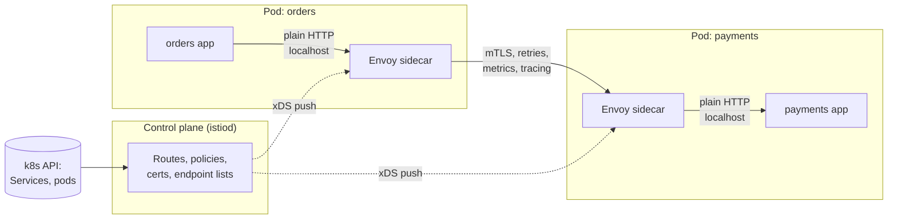

# Service Mesh and Envoy

## 1. One-line summary

**Envoy** is a fast, programmable **L7 proxy** (a program that sits between a caller and a server and understands HTTP/gRPC requests). A **service mesh** (Istio, Linkerd) puts a small proxy next to **every** service instance and manages all of them from one control plane, so retries, mTLS, traffic shifting and metrics happen in the network layer instead of in each app's code.

> 💡 **L7** = "layer 7", the application layer: the proxy reads HTTP paths, headers and gRPC method names, not just IPs and ports (that would be L4). See [load balancer](load-balancer.md) for L4 vs L7. **gRPC** is Google's RPC framework: typed method calls sent over HTTP/2, common between Java/Go services.

---

## 2. The problem it solves

**The pain:** you have 60 microservices in Java, Go and Node. Every team re-implements, slightly differently:

- timeouts and retries (one team retries 5×, another never),
- TLS between services (half of them talk plain HTTP inside the cluster),
- metrics (each library names `http_requests_total` differently),
- canary releases ("send 5% of traffic to v2") — impossible without touching the caller's code.

A fix in the Java library doesn't help the Go services. A security audit asks "is every service-to-service call encrypted?" and nobody can answer.

**The fix:** move that networking logic out of the app and into a proxy that runs beside it. Every call goes `app → local proxy → network → remote proxy → app`. One team configures the proxies centrally; apps just make plain HTTP calls to `http://payments`.

> Infra analogy: you already run k8s `Ingress` (one L7 proxy at the cluster edge) and `Service` (kube-proxy, an L4 load balancer). A mesh is like giving **every pod its own little Ingress**, all configured by one controller, the way the ingress controller configures nginx from `Ingress` objects.

---

## 3. How it works

### 3.1 Envoy's vocabulary in plain words

| Envoy term | Plain words | k8s analogy |
|---|---|---|
| **Listener** | "Open port 8443 and accept connections here" | The port in a `Service` / `containerPort` |
| **Filter chain** | Plugins run on each request in order: TLS, auth (JWT check), rate limit, router | nginx modules / servlet filters |
| **Route** | "Host `api.shop.com`, path `/orders/*` → send to cluster `orders`" | `Ingress` rule (host + path → backend) |
| **Cluster** | A named group of backend instances plus how to talk to them (LB algorithm, timeouts, circuit-breaker limits) | A `Service` |
| **Endpoint** | One concrete `IP:port` in a cluster | One pod IP in `Endpoints` / `EndpointSlice` |

A request flows: **listener → filters → route match → cluster → pick one endpoint → forward**.

### 3.2 Sidecar pattern

A **sidecar** is a second container in the same pod as your app. In a mesh, it is the Envoy proxy (Istio) or a Rust micro-proxy (Linkerd). `iptables` rules (Linux kernel packet-redirect rules) silently redirect the pod's inbound and outbound traffic through it, so the app doesn't know it's there.

### 3.3 Control plane vs data plane

- **Data plane** = the proxies that actually carry requests. Must be fast; if it breaks, traffic breaks.
- **Control plane** = the brain (istiod, Linkerd's destination/identity services) that watches k8s for services and pods, turns your YAML (`VirtualService`, `DestinationRule`) into proxy config, issues certificates, and pushes it all out.

Key property: if the control plane goes down, proxies **keep running with the last config they received**. You lose the ability to change things, not live traffic. Same as the k8s API server being down: running pods keep running.

### 3.4 xDS: dynamic config in plain words

**xDS** ("x Discovery Service") is Envoy's API for receiving config over a long-lived gRPC stream instead of reading a file and restarting. The "x" is a placeholder: **LDS** (listeners), **RDS** (routes), **CDS** (clusters), **EDS** (endpoints), **SDS** (secrets/certificates).

When a pod is added, the control plane pushes a new EDS update to every proxy that calls it, typically within **~1–5 s**. Each push carries a **version**, and the proxy ACKs or NACKs it (rejects bad config, keeps the old one). That's what makes **versioned, gradual config rollouts** possible, and it is the same mechanism an [API gateway's](../interviews/api-gateway/README.md) control plane uses to push routes to the gateway fleet.

### 3.5 What a mesh gives you

| Feature | What it means | Example config |
|---|---|---|
| **mTLS everywhere** | Both sides prove identity with certificates; traffic encrypted. See [TLS and mTLS](../concepts/tls-and-mtls.md) | Istio `PeerAuthentication: STRICT` |
| **Retries and timeouts** | Per route, consistent across languages. See [resilience patterns](../concepts/resilience-patterns.md) | `retries: 2, perTryTimeout: 300ms` |
| **Traffic shifting** | Canary: 95% → v1, 5% → v2; header-based routing for testers | `VirtualService` weights |
| **Outlier detection** | Eject an instance after 5 consecutive 5xx for 30 s (a passive circuit breaker) | `DestinationRule.outlierDetection` |
| **Telemetry** | RED metrics (request **R**ate, **E**rrors, **D**uration) and trace spans for every hop, with no code changes. See [observability](../concepts/observability.md) | Prometheus scrape of sidecar |
| **Authorization policy** | "Only `orders` may call `payments` `POST /charge`" | `AuthorizationPolicy` |

### 3.6 What it costs

Numbers are ballpark for Istio/Envoy; Linkerd's Rust proxy is lighter.

- **Latency:** each request passes 2 extra proxies (caller's sidecar + callee's sidecar), adding roughly **0.5–1 ms per hop at p50** (the median request), more at p99 (the slowest 1%). A request that fans out through 5 services sequentially pays ~5 × 1 ms = **~5 ms**.
- **Memory:** ~**50–100 MB per Envoy sidecar** (more with big route tables). 2,000 pods × 70 MB = **~140 GB of RAM** just for proxies.
- **CPU:** ~0.1–0.5 vCPU per 1,000 req/s through a sidecar; TLS adds to it.
- **Operational complexity:** a new critical component to upgrade, debug ("is it my app or the sidecar?"), and learn. Startup ordering issues (app starts before sidecar is ready, first calls fail) are a classic.

### 3.7 Ambient / sidecarless mesh (briefly)

To cut the per-pod cost, **Istio ambient mode** splits the job: a per-**node** L4 proxy (ztunnel) does mTLS for all pods on that node, and optional shared L7 "waypoint" proxies handle HTTP features only for services that need them. **Cilium** does similar with **eBPF** (small programs loaded into the Linux kernel that can inspect and redirect packets). Fewer proxies, less memory, but L7 features become opt-in.

---

## 4. When to use it

- **Envoy alone:** as an edge proxy / API gateway data plane, as an L7 load balancer for gRPC (per-request balancing), as an ingress controller (Contour, Emissary, Envoy Gateway).
- **A full mesh:** dozens+ services in several languages, a compliance need for mTLS everywhere, frequent canary releases, a platform team that can own it.

## 5. When NOT to use it (and why it's a mistake)

| Situation | Why it's a mistake |
|---|---|
| 5 services, one language | A shared library (Resilience4j, OkHttp interceptors) or plain k8s Services gives 80% of the value without 2 extra hops and a new control plane. |
| As a replacement for the **edge** API gateway | A mesh handles east-west (service ↔ service) traffic; it doesn't do API keys, partner quotas, developer portals or public request transformation well. |
| Latency budget of a few ms across a deep call chain | ~1 ms × hops adds up; consider fewer hops or ambient mode. |
| No team to own upgrades | A stale mesh with CVEs (publicly known security vulnerabilities) and a broken control plane is worse than no mesh. |
| Retries in both app and mesh | Multiplies attempts (3 × 3 = 9); pick one layer. |

---

## 6. Commonly confused with

| | **Edge API gateway** | **Service mesh** | **k8s Ingress** | **k8s Service** |
|---|---|---|---|---|
| Traffic | North-south (internet → cluster) | East-west (service ↔ service) | North-south | East-west |
| Where it runs | Fleet at the edge | Sidecar per pod / proxy per node | Ingress controller pods | kube-proxy on each node (iptables/IPVS) |
| Layer | L7 | L4 + L7 | L7 | L4 |
| Typical features | API keys, JWT auth, quotas, transformation, BFF | mTLS, retries, canary, telemetry, service-to-service authz | Host/path routing, TLS | Pick a pod IP |
| Examples | Kong, Apigee, AWS API Gateway, Envoy Gateway | Istio, Linkerd, Cilium | nginx-ingress, Traefik | `ClusterIP` |

Envoy can be the engine under all of the L7 ones: same proxy, different control plane and config.

---

## 7. Common mistakes / misuse

1. **"Add Istio" as a reflex** in an interview with no reason given. Name the problem (mTLS mandate, polyglot retries, canaries) first.
2. **Ignoring the per-hop cost** in latency estimates.
3. **Retries at app + sidecar + gateway**: a retry storm multiplier.
4. **Assuming the control plane is on the request path.** It isn't; proxies cache config.
5. **Sidecar startup/shutdown races:** app sends traffic before Envoy is ready, or Envoy exits before the app drains. Use `holdApplicationUntilProxyStarts` / native sidecar containers.
6. **Unbounded config:** every sidecar gets every route in the mesh (memory blow-up). Scope with `Sidecar` resources.

---

## 8. Interview cheat-sheet

> "Internally I'd use a service mesh only if we have many services in several languages; then each pod gets an Envoy sidecar, and a control plane like istiod pushes routes, endpoints and certificates to them over xDS. That gives mTLS between every service, consistent timeouts and retries, canary traffic splitting and per-hop metrics and traces without code changes. The control plane is off the request path: proxies keep their last config if it's down. The cost is roughly a millisecond per hop and 50–100 MB of memory per sidecar, plus real operational work, so ambient or node-level proxies are worth considering at scale. The mesh handles east-west traffic; the public edge still needs an API gateway for API keys, quotas and request transformation."

---

## 9. Used in

- [API gateway](../interviews/api-gateway/README.md): Envoy as the **gateway data plane** (listeners, routes, clusters), **xDS-style config push** from the control plane with versioned rollouts, **mTLS to backends**, and the **edge gateway vs internal mesh sidecars** discussion.
- Related: [load balancer](load-balancer.md) (L4 vs L7, gRPC balancing), [service discovery](../concepts/service-discovery.md), [TLS and mTLS](../concepts/tls-and-mtls.md), [resilience patterns](../concepts/resilience-patterns.md), [observability](../concepts/observability.md), [ZooKeeper / etcd](zookeeper-etcd.md) (where k8s stores the state the control plane watches).
