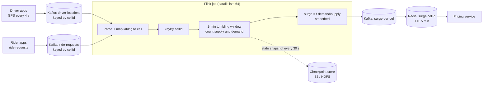

# Stream Processing (Flink, Kafka Streams, Spark Streaming)

## 1. One-line summary

A **stream processor** is a cluster of long-running workers that read an endless flow of events (usually from [Kafka](kafka.md)), keep running state such as counts and averages, and emit results continuously: "ride requests per area **per minute**", updated every minute, forever. Apache **Flink**, **Kafka Streams** and **Spark Structured Streaming** are the common engines.

> 💡 **Unbounded stream**: a dataset that never ends. A batch job reads "yesterday's file" and finishes; a stream job reads "everything that happens from now on" and never finishes.

---

## 2. The problem it solves

**The pain:** a ride-sharing app wants **surge pricing**: if an area has 300 ride requests and only 40 free drivers in the last minute, prices go up 1.8× to pull drivers in. The inputs:

```
Driver location pings: 1M online drivers ÷ 4 s per ping  = 250,000 events/s
Ride requests:         ~20M rides/day ÷ 86,400 s ≈ 230/s average, ~1,000/s peak
```

Option A, a **cron batch job** every 5 minutes that runs a big SQL query over the last 5 minutes of data: the price is already 5+ minutes stale when it lands, and the query scans 250k × 300 s = **75M rows** each run.

Option B, **write your own Kafka consumer** that keeps a `HashMap<cellId, count>` in memory: works on day one. Then the pod restarts and the counts are gone; you scale to 20 pods and have to make sure each cell's events go to one pod; a phone that was in a tunnel sends 3-minute-old pings and you count them in the wrong minute; a crash halfway through makes you count some events twice. You end up re-building a stream processor, badly.

**The fix:** a stream processing engine gives you, out of the box:

- **Windows**: "group events into 1-minute buckets" as a one-liner.
- **Keyed, partitioned state**: all events for cell `8a2a1072b59ffff` go to the same worker, which keeps that cell's counters.
- **Event-time handling**: put a late event into the minute it *happened*, not the minute it *arrived*.
- **Checkpoints**: state is snapshotted to durable storage, so a crash resumes with correct counts.

> Infra analogy: Prometheus recording rules. You don't run a nightly script over raw metrics; you declare `rate(requests[1m])` and it's evaluated continuously. A stream processor is that, for business events, with arbitrary code.

---

## 3. How it works

### 3.1 The pipeline



- **Operator**: one step of the pipeline (parse, keyBy, window, aggregate). Each operator runs as many parallel copies (**parallelism**); 64 copies here, like 64 pods of a deployment.
- **keyBy**: re-partitions events so every event with the same key lands on the same copy, so per-key state needs no locks. Same idea as a Kafka partition key.
- **Sink**: where results go (Kafka topic, Redis, DB).

### 3.2 Windows in plain words

| Window | Plain words | Ride example |
|---|---|---|
| **Tumbling** | Fixed, non-overlapping buckets: 12:00–12:01, 12:01–12:02 | Requests per cell per minute |
| **Sliding (hopping)** | Fixed size, but starts every *slide*: a 5-min window every 1 min, so windows overlap | "Requests in the last 5 min", refreshed each minute (smoother surge) |
| **Session** | Groups events per key until a gap of inactivity (e.g. 30 min) closes it | One rider's app session: opened app, checked price, left without booking |

### 3.3 Event time vs processing time, late events and watermarks

- **Event time**: when it happened on the phone (timestamp inside the event).
- **Processing time**: when the Flink worker sees it.

They differ: phones lose signal, Kafka consumers lag, a mobile batch uploads 30 s of pings at once. If you bucket by processing time, a lag spike during a Kafka rebalance makes one minute look empty and the next look like a stampede, and surge flaps.

A **watermark** is the engine's running estimate of "I've probably seen everything up to time T". Typical config: watermark = highest event time seen − **10 s** (allowed out-of-orderness). When the watermark passes 12:01:00, the 12:00–12:01 window is **closed and emitted**. Events that arrive even later are **late events**: you can drop them, send them to a side output (a separate stream for inspection), or set `allowedLateness(1 min)` to re-emit a corrected result.

> Analogy: on-call incident timeline. You don't write the postmortem the second the alert clears; you wait a bit for stragglers (delayed logs), then close the timeline. The wait is the watermark delay: longer = more complete, but later.

### 3.4 Stateful operators and checkpoints

The per-cell counters are **state**. Flink keeps it in memory or in **RocksDB** (an embedded on-disk key-value store inside each worker, for state bigger than RAM). Every 30 s, Flink takes a **checkpoint**: a consistent snapshot of all operator state **plus the Kafka offsets** (position in each partition) that state corresponds to, written to S3/HDFS. On a crash, every operator restores the last checkpoint and Kafka is rewound to the saved offsets, so events are re-read and the state ends up exactly as if nothing failed.

How it stays consistent across 64 workers: the sources inject **barriers** (marker records) into the stream; each operator snapshots its state when the barrier passes through it (the Chandy-Lamport idea). Think of it as a "cut here" line drawn through all the queues at once.

### 3.5 Exactly-once, and where it stops

Checkpoint + replay gives **exactly-once state**: each event affects the counters once, even after a crash. Output is a different story:

- To a **Kafka sink** with transactions: Flink's two-phase commit sink makes output appear exactly once, at the cost of latency (consumers using `read_committed` see results only after each checkpoint).
- To **Redis / an HTTP API**: replay re-sends results, so writes must be **idempotent** (overwriting `surge:cell=1.8` twice is harmless; `INCR` twice is not). See [idempotency](../concepts/idempotency-and-delivery-semantics.md).

"Exactly-once" is a property *inside* the pipeline, not a magic guarantee about the outside world.

### 3.6 Choosing an engine

| | **Flink** | **Kafka Streams** | **Spark Structured Streaming** |
|---|---|---|---|
| Shape | Separate cluster (JobManager + TaskManagers) | A Java **library** inside your own service | Spark cluster, micro-batches |
| Latency | Milliseconds, true per-event | Milliseconds | ~100 ms – seconds (micro-batch) |
| Input | Kafka, Kinesis, files, CDC... | Kafka only | Kafka, files, many |
| Best for | Large stateful jobs, event time, CEP | Kafka-to-Kafka transforms owned by one team | Teams already on Spark batch; ML features |

---

## 4. When to use it

- **Continuous aggregates per key per time window**: surge per H3 cell per minute, requests per city, driver supply per cell.
- **Real-time features for models**: ETA features like "average speed on this road segment in the last 5 min" built from driver pings.
- **Fraud and anomaly detection**: "same card used in 3 cities within 10 minutes" (pattern across events per key).
- **Real-time joins / enrichment**: join a trip event with the latest driver profile before writing to the warehouse.
- **Streaming ETL**: clean and route events from Kafka to a data lake continuously.

## 5. When NOT to use it (and why it's a mistake)

| Situation | Why it's a mistake |
|---|---|
| **10 events/s** (an internal admin audit log) | A Flink cluster (JobManager HA, checkpoint storage, upgrades, on-call) for something a single consumer or a SQL query every minute handles. Ops cost >> value. |
| Results needed once a day (finance report) | A batch job is cheaper, simpler to re-run and easier to reason about. |
| Simple per-event transform, no state (JSON → Avro) | A plain Kafka consumer or Kafka Connect SMT is enough. |
| Request/response path (rider waits for a price) | Stream jobs are async; the API reads the *precomputed* result from Redis, never calls Flink. |
| Source of truth for money | Stream state is derived; recompute it from Kafka. Payments live in a transactional DB. |

---

## 6. Commonly confused with

| | **Stream processor (Flink)** | **Batch job (Spark batch / cron)** | **Your own Kafka consumer** | **DB materialised view** |
|---|---|---|---|---|
| Input | Unbounded stream | Bounded dataset (a day's files) | Unbounded stream | Tables in one DB |
| Freshness | Seconds | Minutes to hours | Seconds | On refresh (or per commit for some DBs) |
| State, windows, late data | Built in | Not needed (all data present) | **You** build them | SQL over current rows; no event time |
| Crash recovery | Checkpoints, exactly-once state | Re-run the job | Whatever you code (often double counting) | DB handles it |
| Scale | Horizontal, keyed state | Horizontal | Horizontal per partition | Limited to one DB |
| Pick when | Stateful, windowed, high-volume, low-latency | Latency of hours is fine | Stateless or trivial per-event work | Data already in one DB, modest volume |

A **materialised view** is a stored query result the database keeps (e.g. `CREATE MATERIALIZED VIEW` in Postgres, refreshed on demand). Great for "dashboard over one DB", not for 250k events/s from phones.

---

## 7. Common mistakes / misuse

1. **Windowing by processing time** for business metrics: consumer lag or a replay shifts events into the wrong window, and surge spikes for no real reason.
2. **No watermark delay / too large a delay**: 0 s drops every slightly late ping; 10 min means surge reacts 10 minutes late. Pick from data (e.g. p99 lateness ≈ 8 s → 10 s).
3. **Hot keys**: `keyBy(city)` sends all of Mumbai to one worker. Key by a smaller cell, or pre-aggregate per worker then combine.
4. **Unbounded state**: keeping per-rider state forever with no TTL; RocksDB grows until disks fill. Set state TTL.
5. **Non-idempotent sinks**: `INCR` in Redis after every window; a restart replays and double counts. Write absolute values.
6. **Calling a slow external API per event** inside an operator: 250k events/s × 20 ms blocks everything. Use async I/O or pre-load lookup data as a stream.
7. **Forgetting upgrades**: changing the job's state schema without a savepoint (a manual checkpoint used for upgrades) loses all state on redeploy.

---

## 8. Interview cheat-sheet

> "Driver pings and ride requests go to Kafka keyed by H3 cell. A Flink job keys by cell, uses one-minute tumbling windows on **event time** with a ten-second watermark so late pings from phones in tunnels still land in the right minute, and computes demand over supply per cell. State is checkpointed every 30 seconds together with Kafka offsets, so after a crash we replay and get exactly-once state. Results go to a Kafka topic and are written to Redis as absolute values, so replays are idempotent; the pricing API only reads Redis and never waits on the stream job. At 250k pings per second that's a few dozen parallel workers; for something like 10 events a second I wouldn't run Flink at all, a plain consumer or a cron query is enough."

---

## 9. Used in

- [Ride-sharing](../interviews/ride-sharing/README.md): **surge pricing** per H3 cell per minute (supply vs demand over windows), **ETA features** from driver pings (live speed per road segment), and fraud/anomaly signals; results written to Redis for the pricing and matching services.
- [Search autocomplete](../interviews/search-autocomplete/README.md): **windowed and exponentially decayed query counts** with a trending score (recent rate ÷ baseline), producing a small fresh index every ~5 minutes.
- [Payment system](../interviews/payment-system/README.md): provisional real-time revenue from the ledger change stream (L6 §8).
- [Ad click aggregation](../interviews/ad-click-aggregation/README.md): event-time tumbling windows, watermarks, checkpointed state + offsets, salted two-stage aggregation for hot ads.
- Related: [Kafka](kafka.md) (the input log and offsets), [Redis](redis.md) (serving the computed values), [idempotency and delivery semantics](../concepts/idempotency-and-delivery-semantics.md), [counters at scale](../concepts/counters-at-scale.md), [geospatial indexing](../concepts/geospatial-indexing.md) (cells as keys), [back-of-the-envelope](../concepts/back-of-the-envelope.md).
