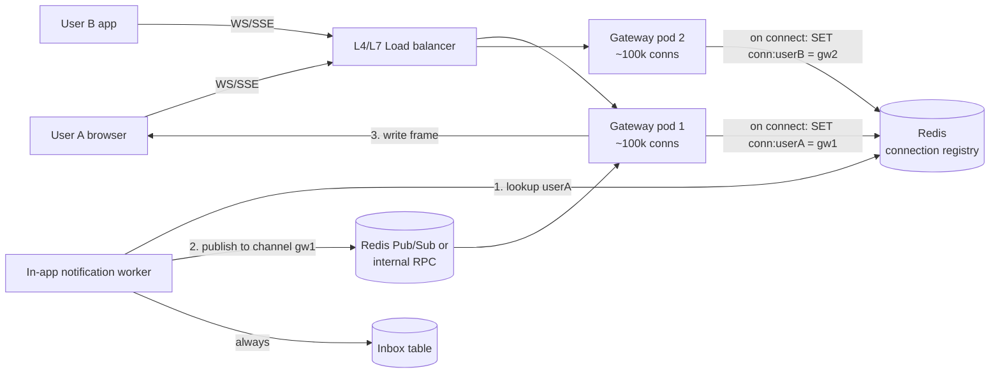

# WebSockets and Server-Sent Events (SSE)

## 1. One-line summary

**WebSocket** is a long-lived, two-way connection between browser/app and server; **Server-Sent Events (SSE)** is a long-lived, one-way HTTP stream from server to client. Both let the server **push** data the moment it happens, instead of the client asking "anything new?" over and over.

---

## 2. The problem it solves

**The pain:** a user has your web app open. Someone comments on their post. How does the bell icon show "1" right away?

- HTTP is **request/response**: the server can only answer when the client asks.
- **Short polling** (`GET /notifications` every 2 s): 10M open tabs ÷ 2 s = **5M requests/s**, almost all returning "nothing new". Huge waste, and still up to 2 s late.
- Polling every 60 s is cheap but feels broken for chat or live updates.

**The fix:** keep one connection open per client. When an event happens, the server writes it down that connection in milliseconds. Idle connections cost memory, not CPU or requests.

> Infra analogy: `kubectl logs -f` or `kubectl get pods --watch`. You don't re-run `get pods` every second; the API server streams changes to you over a held-open connection. That's exactly the SSE/WebSocket idea.

---

## 3. How it works

### 3.1 Four ways to get updates

| | **Short polling** | **Long polling** | **SSE** | **WebSocket** |
|---|---|---|---|---|
| How | Client `GET` every N s | Client `GET`; server holds it open until data or ~30 s timeout, client re-requests | One HTTP response that never ends; server writes `data: ...\n\n` lines | HTTP `Upgrade: websocket`, then raw framed TCP both ways |
| Direction | Client pull | Client pull (feels like push) | Server → client only | Both ways |
| Latency | Up to N s | ~instant | ~instant | ~instant |
| Reconnect | n/a | Each response | **Built in** (`EventSource` auto-reconnects, sends `Last-Event-ID`) | You write it |
| Works through proxies/LBs | Always | Always | Mostly (plain HTTP; disable buffering) | Needs LB/proxy upgrade support |
| Binary | Yes | Yes | Text only | Yes |
| Good for | Dashboards refreshing every 30-60 s | Legacy fallback | Notifications, feeds, live scores, LLM token streams | Chat, multiplayer, collaborative editing, typing indicators |

For a **notification bell**, data flows server → client only, so **SSE is enough**. Marking as read is a normal `POST`. Mobile apps often use WebSocket (or MQTT) because they also send presence/typing.

### 3.2 Architecture: a connection gateway tier

You separate the **stateful** connection-holding tier from the **stateless** business tier.



**Gateway pods** do nothing but hold sockets, authenticate on connect, and forward messages. With an event-loop server (Netty in Java, Node, Go), one pod can hold **~50k-1M idle connections**; memory is the limit (roughly 10-50 KB per connection for buffers and TLS state). Example: 10M concurrent users ÷ 100k per pod = **100 gateway pods**.

### 3.3 How does a backend find the right gateway?

The notification worker knows `userId`, not which pod holds the socket. Options:

| Approach | How | Trade-off |
|---|---|---|
| **Connection registry** | On connect, gateway writes `conn:{userId} → {gatewayId}` in [Redis](redis.md) with a TTL refreshed by heartbeat. Worker looks it up and calls that gateway (RPC or its Pub/Sub channel). | One lookup per message. Stale entries if a pod dies (TTL fixes). Multiple devices → store a set. |
| **Pub/Sub per user** | Gateway subscribes to channel `user:{userId}` for each connected user; worker publishes there. | Simple; millions of channels on Redis Pub/Sub is heavy but workable when sharded. |
| **Broadcast to all gateways** | Worker publishes to every gateway; each checks if it holds the user. | Fine with 5 pods, wasteful with 100. |
| **Consistent hashing** | Route user → gateway by `hash(userId)` at the LB. Worker computes the same hash. | Rebalancing on scale events drops connections. See [consistent hashing](../concepts/consistent-hashing.md). |

Key rule: the **inbox row in the DB is the source of truth**. The real-time push is a best-effort optimization. If the user is offline or the push is lost, they fetch `GET /inbox?since=...` when they reconnect, and the mobile app falls back to [APNs/FCM](push-email-sms-providers.md).

### 3.4 Reconnect and catch-up

Connections drop all the time (subway tunnel, laptop sleep, gateway deploy). The client must not miss what happened while it was away:

1. Every inbox item gets a monotonically increasing ID per user (or a timestamp + ID).
2. The client remembers the last ID it saw. SSE does this for you: the server sends `id: 1042` with each event, and `EventSource` sends `Last-Event-ID: 1042` on reconnect.
3. On reconnect the gateway (or a normal API call) returns `GET /inbox?after=1042`, then switches to live streaming.

```
id: 1043
event: notification
data: {"title":"Riya commented on your post","unread":4}

: ping
```

The `: ping` line is an SSE comment, used as a heartbeat. Ordering subtlety: subscribe to live events **before** fetching the backlog, then dedupe by ID, otherwise an event arriving between the two steps is lost.

### 3.5 Infra angles you already know

- **Sticky routing:** SSE and WebSocket are single long connections, so the LB pins them naturally. Stickiness only matters for long polling or Socket.IO's HTTP fallback (it needs cookie/IP affinity).
- **LB idle timeouts:** AWS ALB defaults to **60 s** idle timeout; nginx `proxy_read_timeout` defaults to 60 s. A quiet connection gets killed. Send a **heartbeat** (WebSocket ping every 20-30 s, or an SSE comment line `: ping`).
- **Proxy buffering:** nginx buffers responses by default, which delays SSE. Set `X-Accel-Buffering: no` or `proxy_buffering off`.
- **Pod draining in k8s:** on a deploy, a gateway pod with 100k connections gets SIGTERM. Mark it NotReady (stop new connections), then close existing ones **gradually** over e.g. 60-120 s with a "please reconnect" message, and set `terminationGracePeriodSeconds` to match. Closing all 100k at once creates a **reconnect storm** on the other pods; clients must reconnect with jittered backoff.
- **File descriptors and ports:** raise `ulimit -n` (each socket is an fd); watch conntrack tables on nodes.
- **Autoscaling:** scale on connection count, not CPU (idle sockets use almost no CPU).
- **HTTP/1.1 limit:** browsers allow ~6 connections per domain over HTTP/1.1, so many SSE tabs can starve each other. HTTP/2 multiplexes and removes this.

---

## 4. When to use it

- **In-app notifications / bell counter** while the app is open (SSE is usually enough).
- **Chat, typing indicators, presence, multiplayer, collaborative editing** (WebSocket, two-way).
- **Live feeds**: stock tickers, sports scores, order tracking, build logs, LLM token streaming (SSE).
- When freshness matters (under 1-2 s) **and** many clients are connected.

## 5. When NOT to use it (and why it's a mistake)

| Situation | Why it's a mistake | Use instead |
|---|---|---|
| Data changes every few minutes, a 30-60 s delay is fine (admin dashboard, report status) | You add a stateful tier, registry, draining, heartbeats for nothing | `GET` every 30 s, cache-friendly |
| Reaching users whose app is closed | No app open = no socket | [APNs/FCM push](push-email-sms-providers.md) |
| One-off result of a long job | Hold a socket for 1 message | Poll a status endpoint, or a webhook |
| Guaranteed delivery | Sockets drop silently | DB inbox + sync on reconnect |
| Server → client only, but you pick WebSocket | Extra protocol, custom reconnect, LB upgrade config | SSE |

---

## 6. Commonly confused with

| | **WebSocket / SSE** | **Mobile push (APNs/FCM)** | **[Message queue](message-queues.md) / [Kafka](kafka.md)** | **Webhook** |
|---|---|---|---|---|
| Between | Your server and a client app | OS vendor and a device | Your backend services | Your server and another company's server |
| Works when app closed | No | Yes | n/a | n/a |
| Delivery guarantee | None (connection may drop) | Best effort | At-least-once | At-least-once with retries |
| Typical use | Live in-app updates | Wake the user | Async jobs between services | Provider delivery receipts |

---

## 7. Common mistakes / misuse

1. **WebSockets for things a poll every 30 s handles.** A stateful tier is real operational cost: draining, registry, reconnect storms.
2. **Treating the socket as the source of truth.** Persist to the inbox first; the push is a hint. Otherwise notifications vanish when a pod restarts.
3. **No heartbeat**, so the LB silently cuts idle connections at 60 s and users stop getting updates without any error.
4. **Business logic in the gateway pods.** Keep gateways dumb so they rarely deploy; every deploy disconnects everyone.
5. **No reconnect backoff with jitter.** 1M clients reconnecting in the same second takes down auth and the gateways.
6. **Ignoring multiple devices/tabs.** The registry must map a user to a **set** of connections.
7. **Not authenticating the connection** (or never re-checking an expired token on a connection that lives for days).
8. **Scaling gateways on CPU** instead of connection count and memory.

---

## 8. Interview cheat-sheet

> "For in-app notifications, the inbox in the database is the source of truth, and real-time delivery is an optimization. Since the bell only needs server-to-client updates, I'd use SSE, or WebSocket if the client also sends things like read receipts or typing. A separate gateway tier holds the long-lived connections, around 100k per pod, so 10M concurrent users is about 100 pods scaled on connection count. When a client connects, the gateway records userId to gateway ID in Redis with a TTL, and the in-app worker looks that up and forwards the message to the right gateway. If the user isn't connected we skip the socket, and they sync from the inbox on reconnect or get a mobile push. Operationally I'd send heartbeats under the LB idle timeout, drain gateway pods slowly on deploy, and have clients reconnect with jittered backoff."

---

## 9. Used in

- [Notification system](../interviews/notification-system/README.md): **in-app channel**: gateway tier holding WebSocket/SSE connections, Redis connection registry to route a notification to the right gateway, inbox in the DB with sync on reconnect.
- [Chat system](../interviews/chat-system/README.md): the **persistent WebSocket from every phone to the chat gateway fleet** (two-way: messages, acks, typing, presence pings), gateway draining on deploy, reconnect with jittered backoff followed by sync since last seq.
- Related: [Redis](redis.md) (registry, Pub/Sub), [load balancer](load-balancer.md) (idle timeouts, L4 vs L7), [push/email/SMS providers](push-email-sms-providers.md), [consistent hashing](../concepts/consistent-hashing.md), [fan-out](../concepts/fan-out.md).
