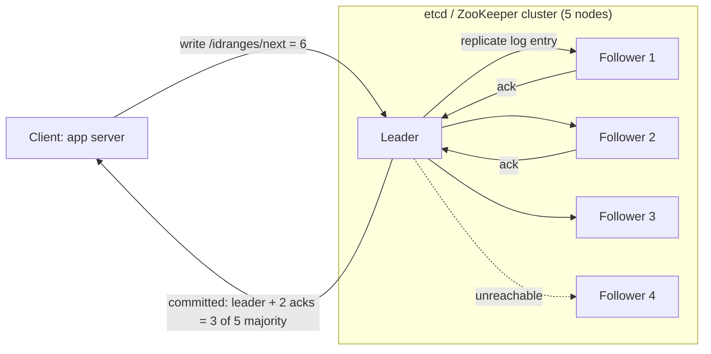
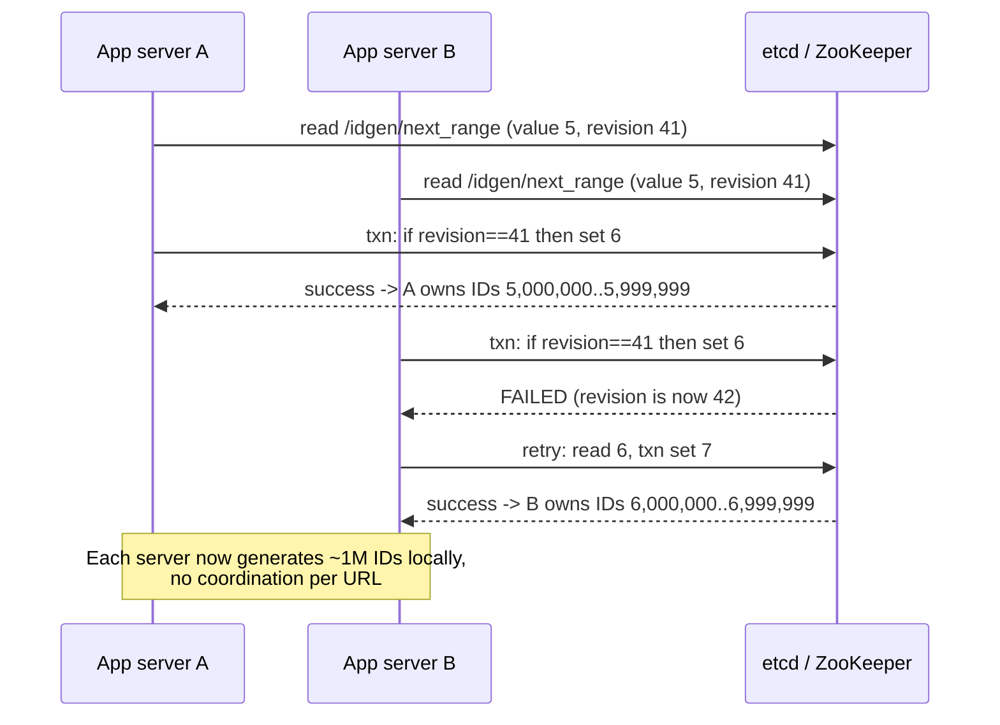

# ZooKeeper / etcd (coordination services)

## 1. One-line summary

ZooKeeper and etcd are small, **strongly consistent, replicated key-value stores** used by distributed systems to **agree on things**: who the leader is, who holds a lock, what the current config is, which ID range belongs to which server.

---

## 2. The problem it solves

**The pain:** you have 20 app servers. They need to agree on facts where a split opinion is a bug:
- "Which node is the leader that runs the nightly job?" — two leaders = job runs twice.
- "Which server owns ID range 5,000,000–5,999,999?" — two owners = **duplicate short codes**.
- "What's the current feature-flag config?" — every server must see the same thing.

Agreeing over an unreliable network, where any machine can crash or pause (GC!) and messages can be delayed, is genuinely hard. Rolling your own with a DB row or a Redis key works until a network partition or failover, and then two nodes both think they won.

**The fix:** run a **small cluster (3 or 5 nodes)** whose only job is to be a **correct, consistent source of truth for small, critical metadata**, using a **consensus algorithm** so that every acknowledged write is agreed by a majority and survives node failures.

> You already use one: **etcd is the brain of Kubernetes**. Every `kubectl apply` writes the object to etcd via the API server. Controllers *watch* etcd for changes. `kube-scheduler` and `kube-controller-manager` run several replicas but only one is active — they elect a leader via a **Lease** object stored in etcd. That's exactly the pattern this file describes.

---

## 3. How it works

### 3.1 Consensus in plain words (Raft / ZAB)

etcd uses **Raft**; ZooKeeper uses **ZAB** (ZooKeeper Atomic Broadcast). Same core idea:

1. The cluster (say 5 nodes) elects **one leader** by vote. A candidate needs a **majority** (3 of 5).
2. All writes go to the leader. The leader appends the write to its log and sends it to followers.
3. Once a **majority** has stored it, the write is **committed** and acknowledged to the client.
4. If the leader dies, followers notice missing heartbeats (~hundreds of ms to seconds), hold an election, and a new leader with the most up-to-date log wins. Committed writes are never lost because any majority overlaps with the previous majority.
5. A minority side of a network split **cannot** elect a leader or commit writes — so you never get two "truths". (It chooses **C over A** in [CAP](../concepts/cap-and-consistency.md) terms.)

**Cluster size math:** a cluster of N tolerates `floor((N-1)/2)` failures.

| Nodes | Majority | Failures tolerated |
|---|---|---|
| 1 | 1 | 0 |
| 3 | 2 | 1 |
| 4 | 3 | 1 (no better than 3!) |
| 5 | 3 | 2 |
| 7 | 4 | 3 (but every write waits on 4 nodes) |

That's why clusters are odd-sized and **small**: more nodes = more fault tolerance but *slower* writes, since each write needs more acks. Every write goes through one leader, so throughput is limited: etcd handles roughly **a few thousand to ~10k+ writes/s**, latency a few ms (dominated by disk fsync — which is why etcd docs insist on fast SSDs).

### 3.2 Data model and primitives

| | ZooKeeper | etcd |
|---|---|---|
| Data model | Tree of **znodes** like a filesystem: `/app/leader`, `/app/config` | Flat key space with prefixes: `/app/leader`, ranges by prefix |
| Value size | Up to 1 MB (meant for KBs) | Default max request 1.5 MB; total DB default 2 GB, max ~8 GB |
| Liveness tie | **Ephemeral znodes**: deleted when the client session dies | **Leases**: keys attached to a TTL lease the client keeps alive |
| Change notification | **Watches** (one-shot, re-register) | **Watch** streams (continuous, from a revision) |
| Ordering | **Sequential znodes** (`/lock/req-0000000007`) | Every write gets a global **revision** number |
| Atomic ops | Versioned `setData` (compare-and-set) | **Transactions**: `if (compare) then {ops} else {ops}` |
| API | Custom TCP protocol (use Curator in Java) | gRPC / HTTP (jetcd in Java) |

These primitives build the classic recipes:

- **Leader election**: everyone tries to create `/service/leader` as an ephemeral key (or with a lease). Exactly one succeeds; others **watch** it. Leader dies → session/lease expires → key disappears → watchers race again. (Curator `LeaderLatch`, etcd `concurrency.Election`, k8s `Lease`.)
- **Distributed lock**: same mechanism; plus use the key's **version/revision as a fencing token** — the protected resource rejects writes with an older token, so a paused ex-holder can't corrupt data.
- **Configuration / service discovery**: store config at `/config/...`; servers watch and reload on change. Register `/services/redirect/pod-7` with a lease; it disappears when the pod dies.
- **Group membership**: who's alive = which ephemeral keys exist.

### 3.3 Example: handing out ID ranges to app servers

The URL shortener needs unique numeric IDs (then base62-encoded into short codes) without asking a central service for every single URL. See [ID generation](../concepts/id-generation.md).

Why this is a perfect fit:
- **Tiny data** (one counter), **rare writes** (one per server per million URLs), **correctness critical** (a duplicate range = duplicate short codes).
- At 1,000 new URLs/s across the fleet with ranges of 1M, that's **one coordination write every ~1,000 s**. The coordination service is basically idle.
- If a server crashes, its unused IDs in the range are wasted — fine, 64-bit space is huge (and base62 of 7 chars = 62^7 ≈ 3.5 trillion codes).

(Alternative: a DB row with `UPDATE ... SET next = next + 1 RETURNING` or Redis `INCRBY` — workable; the coordination service is the "most correct" choice when you already run one.)

---

## 4. When to use it

- **Leader election** for singleton work (schedulers, primary of a custom service, Kafka controller historically).
- **Distributed locks where correctness matters**, with fencing tokens.
- **Small, critical metadata**: cluster membership, shard → node assignments, ID range allocation, feature flags.
- **Config distribution with watches** (push config changes to all servers within ~a second).
- Real systems: Kubernetes (etcd), older Kafka (ZooKeeper; new Kafka uses its own Raft, "KRaft"), HBase, Hadoop HA, Solr, Patroni (Postgres HA uses etcd/ZK/Consul for leader election).

## 5. When NOT to use it (and why it's a mistake)

| Situation | Why it's a mistake |
|---|---|
| Storing **large or bulk data** (user records, URL mappings, blobs) | Whole dataset is kept in memory on every node (ZK) / capped at a few GB (etcd); snapshots and replication slow down; the cluster that *everything* depends on gets unstable. |
| **High write rates** (per-request counters, per-click updates) | Every write goes through one leader and a majority fsync. A few thousand writes/s max. You'll bring down the thing that guards your locks and leaders. |
| As a general **cache or database** | No query language, small size limits, optimized for consistency not throughput. |
| Locks just to avoid **duplicate work** (efficiency, not correctness) | A Redis `SET NX PX` is simpler and cheaper; consensus is overkill. |
| You don't run one and the need is tiny | Operating a ZK/etcd cluster (quorum, disk latency, backups) is real work; a DB row with a conditional update might suffice. |

---

## 6. Commonly confused with

| | **ZooKeeper / etcd** | **A database (Postgres)** | **Redis locks (`SET NX PX` / Redlock)** |
|---|---|---|---|
| Purpose | Coordination: agreement on small facts | Store and query application data | Fast cache with lock-ish primitives |
| Consistency | Linearizable via consensus (majority) | Strong on a single primary; failover may lose async-replicated commits | Async replication: a lock can be **lost on failover** → two holders |
| Data size | KBs–MBs, total ≤ a few GB | GBs–TBs | GBs (RAM) |
| Write throughput | ~thousands/s | ~thousands–tens of thousands/s per primary | ~100k/s |
| Liveness detection | Built in: sessions / leases + watches | Not built in (you'd poll) | TTL only, no watch-on-delete of locks |
| Fencing tokens | Natural (zxid / revision) | Possible (sequence column) | Not built in |
| Use for locks when | **Correctness** depends on mutual exclusion | Locking rows in the same DB (`SELECT ... FOR UPDATE`) | Only **efficiency** (avoid duplicate work; occasional double is OK) |

The famous Kleppmann vs antirez debate over Redlock is the deep version of this row: with process pauses and clock drift, a TTL lock without fencing can't guarantee mutual exclusion.

---

## 7. Common mistakes / misuse

1. **Putting application data in it** — "it's a key-value store, let's keep URL mappings there". It will fall over; k8s clusters have died from etcd filling with too many objects/events.
2. **High-frequency writes** (e.g. incrementing a counter per request instead of per range).
3. **Even-sized clusters** (4 nodes tolerate the same 1 failure as 3) or **huge clusters** (9 nodes = slower writes).
4. **Running it on slow disks** / noisy shared nodes → fsync latency → missed heartbeats → leader elections flapping.
5. **Forgetting that a lock holder can pause**: a GC pause longer than the session/lease timeout means the lock is gone but the process still thinks it holds it. Use **fencing tokens**.
6. **Treating watches as a reliable event stream** — ZK watches are one-shot and you can miss intermediate changes; always re-read state after a watch fires.
7. **Spreading one cluster across distant regions** — every write waits for a cross-region majority (~100 ms+).

---

## 8. Interview cheat-sheet

> "For coordination I'd use a small ZooKeeper or etcd cluster — the same thing Kubernetes uses to store cluster state and elect controller leaders. It runs a consensus protocol, Raft for etcd, so a write is only acknowledged once a majority of the 3 or 5 nodes has it, and a partitioned minority can't diverge. In the URL shortener I use it only to hand out ID ranges: each app server atomically claims the next block of a million IDs with a compare-and-swap, then generates IDs locally, so we do one coordination write per million URLs. I'd never put the URL data itself or per-request counters in it — it's built for small, rarely-changing, correctness-critical metadata, with a few thousand writes per second at most. For locks, I'd use its leases plus fencing tokens rather than Redis when correctness matters."

---

## 9. Used in

- [URL shortener](../interviews/url-shortener/README.md) — **ID range allocation**: app servers claim unique blocks of IDs from ZooKeeper/etcd, then generate short codes locally without collisions.
- [Ride-sharing](../interviews/ride-sharing/README.md): **coordination for the matching/location tiers**: which node owns which city/region shard, leader election for single-owner matchers, and the reference point for correct-under-failover locks ([distributed locks and leases](../concepts/distributed-locks-and-leases.md)).
- [API gateway](../interviews/api-gateway/README.md): the **control plane's config store**: versioned routes, plugins and API-key/plan config (etcd backs Apache APISIX; Kubernetes' etcd backs Ingress/Gateway API objects), watched and pushed to gateway nodes; plus the endpoint data behind [service discovery](../concepts/service-discovery.md).
- [Distributed key-value store](../interviews/distributed-kv-store/README.md): the **strongly consistent alternative**: etcd as a small Raft-replicated KV store and the model for Raft-per-partition designs (TiKV, CockroachDB); also an option for storing cluster membership/ring metadata instead of gossip ([consensus and Raft](../concepts/consensus-and-raft.md)).
- Related concepts: [ID generation](../concepts/id-generation.md), [CAP and consistency](../concepts/cap-and-consistency.md), [sharding and replication](../concepts/sharding-and-replication.md).
