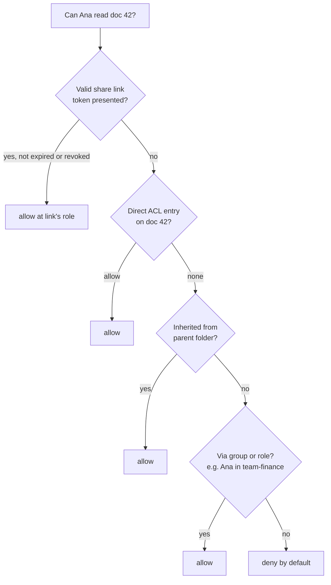

# Access Control Models (Unix permissions, ACLs, RBAC, ABAC, sharing links)

## 1. One-line summary

**Access control** answers "may *this* user do *this* action on *this* resource?", and there are a handful of standard ways to store the answer: **Unix permission bits** (owner/group/other × read/write/execute, written as `755`), **ACLs** (an explicit list of who may do what on each object), **RBAC** (users get roles, roles get permissions, like Kubernetes `Role` + `RoleBinding`), **ABAC** (rules over attributes like department or time of day), and **capability links** (whoever holds the unguessable URL gets access, like "anyone with the link" in Google Drive).

💡 **Authentication** = proving *who* you are (password, token). **Authorization** = deciding *what* you may do. This file is about authorization; for the "who" side see [authentication, OAuth and JWT](../../HLD/concepts/authentication-oauth-jwt.md).

> Infra analogy: you already use three of these daily. `chmod 600 ~/.ssh/id_ed25519` is Unix bits; a Kubernetes `RoleBinding` giving your team `edit` in a namespace is RBAC; a pre-signed S3 URL you paste into Slack is a capability link.

---

## 2. The problem it solves

A file system (or Dropbox, or an internal admin tool) holds things owned by different people. Without a model, permission logic ends up as scattered `if` statements: `if (user.isAdmin() || file.owner == user || file.sharedWith.contains(user) || ...)`. That fails because:

- **Nobody can answer "who can read this?"** without reading code.
- **Changes don't scale**: a new hire needs access to 400 folders, each edited by hand.
- **Checks get missed**: one endpoint forgets the `if`, and that's the data breach.
- **Revocation is unclear**: someone leaves the team, which of their accesses go away?

A model gives a single, explainable rule, and one place in the code (a policy check) that every request goes through.

---

## 3. How it works

### 3.1 Unix permission bits

Every file has an **owner** (a user ID), a **group** (a group ID) and 9 permission bits: `rwx` for each of three **classes**, owner (u), group (g), others (o).

| bit | value | on a **file** | on a **directory** |
|---|---|---|---|
| `r` read | 4 | read the content | **list** the names inside (`ls`) |
| `w` write | 2 | change the content | **create, delete, rename** entries inside (with `x`) |
| `x` execute | 1 | run it as a program | **enter / traverse** it (`cd`, or reach anything below it by path) |

**Octal arithmetic**: each class is one digit = sum of its bits (💡 **octal** = base 8, so one digit holds exactly 3 bits).

```
7 = 4 + 2 + 1 = rwx        5 = 4 + 0 + 1 = r-x        4 = r--        0 = ---
755 = owner 7 (rwx), group 5 (r-x), other 5 (r-x)  → rwxr-xr-x   programs, directories
644 = owner 6 (rw-), group 4 (r--), other 4 (r--)  → rw-r--r--   normal files
600 = owner 6 (rw-), nobody else                   → rw-------   private keys
```

New files get their mode from the **umask** (💡 a per-process mask of bits to *remove* from new files): files start from 666, directories from 777, and with the common umask `022`: `666 & ~022 = 644`, `777 & ~022 = 755`. That's why `touch f; mkdir d` gives `644` and `755`.

Surprises worth knowing:
- **Deleting a file needs `w` on the directory, not on the file.** A read-only file in your own directory can still be deleted.
- **Only one class applies.** The kernel picks owner if you're the owner, else group if you're in the group, else other, and uses **only** those bits. So a file with mode `074` is unreadable by its owner but readable by the group (shown in the demo).
- **`x` on every directory in the path.** To open `/home/ben/notes.txt` you need `x` on `/`, `/home` and `/home/ben`, then `r` on the file. A `750` home directory hides everything inside from other users, whatever the files' own bits say.
- **Special bits** (a 4th, leading octal digit): **setuid** (`4755`, shown as `s`: the program runs as the file's owner, e.g. `passwd` runs as root to edit the password file), **setgid** (`2xxx`), and the **sticky bit** (`1777` on `/tmp`, shown as `t`: anyone can create files, but only a file's owner can delete it).
- **root** (user ID 0) skips read/write checks entirely. It's the reason "run as non-root" is the default advice for containers.

### 3.2 Runnable example (Java 21, no dependencies)

Converts modes to `ls -l` strings and evaluates the Unix rule, including the path walk.

```java
import java.util.List;
import java.util.Set;

public class Perms {
    static final int R = 4, W = 2, X = 1;

    // 0755 -> "rwxr-xr-x", including setuid (s), setgid (s) and sticky (t) bits.
    static String toRwx(int mode) {
        char[] out = "---------".toCharArray();
        String letters = "rwx";
        for (int i = 0; i < 9; i++)                     // bit 8 = owner r ... bit 0 = other x
            if ((mode & (1 << (8 - i))) != 0) out[i] = letters.charAt(i % 3);
        if ((mode & 04000) != 0) out[2] = out[2] == 'x' ? 's' : 'S';   // setuid
        if ((mode & 02000) != 0) out[5] = out[5] == 'x' ? 's' : 'S';   // setgid
        if ((mode & 01000) != 0) out[8] = out[8] == 'x' ? 't' : 'T';   // sticky
        return new String(out);
    }

    record User(String name, int uid, Set<Integer> gids) {}
    record Inode(String path, int ownerUid, int groupGid, int mode) {}

    // Unix rule: pick ONE class (owner, else group, else other) and use only its bits.
    static boolean allowed(User u, Inode f, int want) {
        if (u.uid() == 0)                               // root skips r/w checks; x needs any x bit
            return (want & X) == 0 || (f.mode() & 0111) != 0;  // (simplified: real dirs always searchable)
        int bits;
        if (u.uid() == f.ownerUid())            bits = (f.mode() >> 6) & 7;
        else if (u.gids().contains(f.groupGid())) bits = (f.mode() >> 3) & 7;
        else                                     bits = f.mode() & 7;
        return (bits & want) == want;
    }

    // Opening /home/ben/notes.txt needs x ("search") on every directory on the way.
    static boolean canRead(User u, List<Inode> dirs, Inode file) {
        for (Inode d : dirs)
            if (!allowed(u, d, X)) { System.out.println("    blocked at " + d.path()); return false; }
        return allowed(u, file, R);
    }

    public static void main(String[] args) {
        for (int m : new int[] {0755, 0644, 0600, 0700, 04755, 01777, 0604})
            System.out.printf("%04o -> %s%n", m, toRwx(m));

        User ben = new User("ben", 1000, Set.of(1000, 50));
        User ana = new User("ana", 1001, Set.of(1001, 50));
        User eve = new User("eve", 1002, Set.of(1002));
        User root = new User("root", 0, Set.of(0));

        Inode slash = new Inode("/", 0, 0, 0755);
        Inode home = new Inode("/home", 0, 0, 0755);
        Inode benHome = new Inode("/home/ben", 1000, 1000, 0750);
        Inode notes = new Inode("/home/ben/notes.txt", 1000, 50, 0640);
        List<Inode> path = List.of(slash, home, benHome);

        for (User u : List.of(ben, ana, eve, root))
            System.out.println("read notes.txt as " + u.name() + ": " + canRead(u, path, notes));

        Inode odd = new Inode("odd.txt", 1000, 50, 0074); // owner ---, group rwx, other r--
        System.out.println("ben (owner) read odd.txt 0074: " + allowed(ben, odd, R));
        System.out.println("ana (group) read odd.txt 0074: " + allowed(ana, odd, R));
    }
}
```

Real output of `javac Perms.java && java Perms`:

```
0755 -> rwxr-xr-x
0644 -> rw-r--r--
0600 -> rw-------
0700 -> rwx------
4755 -> rwsr-xr-x
1777 -> rwxrwxrwt
0604 -> rw----r--
read notes.txt as ben: true
    blocked at /home/ben
read notes.txt as ana: false
    blocked at /home/ben
read notes.txt as eve: false
read notes.txt as root: true
ben (owner) read odd.txt 0074: false
ana (group) read odd.txt 0074: true
```

Ana is in group 50, and `notes.txt` (group 50, `640`) would let her read it, but `/home/ben` (`750`, group 1000) stops her at the directory. And Ben, the owner of `odd.txt`, can't read his own file while his group can. Compare with the real thing: `touch t1 && chmod 755 t1 && stat -c '%a %A' t1` prints `755 -rwxr-xr-x`, and `ls -ld /tmp` shows `drwxrwxrwt`.

### 3.3 ACLs: an explicit list per object

Three classes are too coarse for "Ben: write, Ana: read, the auditors group: read, everyone else: nothing". An **ACL** (access control list) attaches a list of `(who, permissions)` entries to each object. Linux has POSIX ACLs (`setfacl -m u:ana:r notes.txt`, `getfacl notes.txt`), Windows NTFS uses ACLs with allow and **deny** entries, and the "Share" dialog in Google Drive or Dropbox is a per-file/folder ACL with roles like viewer, commenter, editor.

Design points: ACLs are usually **inherited** from the parent folder (share a folder, everything inside is shared), so the effective permission is computed by walking up the tree ([Composite and trees](composite-pattern-and-trees.md)). Deny entries usually win over allow. ACLs answer "who can access *this file*?" easily but "what can *Ana* access?" only by scanning everything.

### 3.4 RBAC: users → roles → permissions

**RBAC** (role-based access control) adds one level of indirection: permissions are granted to **roles** ("billing-viewer", "editor"), and users are **bound** to roles. A new hire gets one role binding instead of 400 ACL edits; removing the binding revokes everything at once.

Kubernetes RBAC is the textbook example:

```yaml
kind: Role                         # what: permissions inside one namespace
metadata: { name: pod-reader, namespace: payments }
rules:
- apiGroups: [""]
  resources: ["pods", "pods/log"]
  verbs: ["get", "list", "watch"]
---
kind: RoleBinding                  # who: attach the role to subjects
metadata: { name: oncall-read-pods, namespace: payments }
subjects: [{ kind: Group, name: payments-oncall }]
roleRef: { kind: Role, name: pod-reader }
```

`ClusterRole`/`ClusterRoleBinding` do the same cluster-wide; `kubectl auth can-i delete pods -n payments --as ben` asks the authorizer directly. Weak spot: **role explosion**: when rules depend on context ("only their own region's customers"), you end up with hundreds of near-identical roles.

### 3.5 ABAC and relationship-based access (briefly)

**ABAC** (attribute-based) evaluates a rule over attributes of the user, the resource and the request: `allow if user.department == resource.department and request.time in office hours`. AWS IAM policy `Condition` blocks and policy engines like Open Policy Agent work this way. Flexible, but harder to audit ("who can read this?" now depends on runtime data).

Large sharing products use **relationship-based** access control (ReBAC): store relations like `doc:42#viewer@user:ana` and `folder:7#parent@doc:42`, then answer checks by following them. Google described its system, **Zanzibar**, in a 2019 USENIX ATC paper; it serves authorization for Drive, YouTube, Calendar and others. Open-source descendants include SpiceDB and OpenFGA.



### 3.6 Sharing links: capability URLs

A **capability URL** (💡 a URL that *is* the permission: possession of it grants access, no login check needed) like `https://drive.example/s/k3Jx9Q...` with "anyone with the link can view". The token must be **unguessable**: 128 random bits gives 2¹²⁸ ≈ 3.4 × 10³⁸ possibilities; even a billion guesses per second for a century is ~3.2 × 10¹⁸ guesses (10⁹ × 3.15 × 10⁹ s), a success chance of about 3.2 × 10¹⁸ / 3.4 × 10³⁸ ≈ 10⁻²⁰. Never use sequential or short IDs.

Risks and fixes: links **leak** (forwarded emails, browser history, logs, the `Referer` header 💡 which tells the next site which page you came from), so store only a hash of the token server-side, support **expiry** and **revocation**, keep the token out of logs, and offer "restricted: only people added" as the default for sensitive content. Google added a **resource key** to some older Drive links in a 2021 security update to stop guessing of old link formats. The same idea in infra: an S3 pre-signed URL ([object storage](../../HLD/technologies/object-storage.md)) is a capability with a built-in expiry.

### 3.7 Where checks happen (and how they fail)

- **Server-side, on every request.** Hiding a button in the UI is not access control. Put the check in one place (a filter, an interceptor, a policy service) that every handler goes through.
- **On the whole path**, not only the leaf: Unix checks every directory component; a sharing system checks inherited permissions up the folder tree.
- **TOCTOU** (time-of-check to time-of-use, 💡 a race where the thing you checked changes before you use it). Classic Unix bug: a setuid program calls `access("/tmp/report")` to check the real user may write it, then `open("/tmp/report")`. Between the two calls an attacker swaps the file for a symlink to `/etc/passwd`. The `access(2)` man page warns about exactly this. Fix: just `open()` with the right identity and handle failure, use `O_NOFOLLOW`/`openat`, and check the opened handle (`fstat`), not the name. The server-side version: checking "Ana may read doc 42" and then reading it in a separate step after her access was revoked. Zanzibar calls the ordering version of this the "new enemy problem" and solves it with consistency tokens ("zookies").
- **Caching decisions** speeds things up but delays revocation; bound the cache TTL and say so.

### 3.8 Least privilege

Give each user, service and token **only** the permissions it needs, for only as long as it needs them: a CI job gets a namespace-scoped `Role`, not `cluster-admin`; a share link gets "viewer", not "editor", and an expiry date; a service runs as a non-root user with a `600` key file. Default deny: anything not explicitly allowed is refused.

---

## 4. When to use it

| Model | Good fit |
|---|---|
| Unix bits | OS files, simple single-machine tools, an LLD file-system interview |
| ACLs | per-object sharing with named people (Drive/Dropbox share dialogs, NTFS) |
| RBAC | organisations with stable job functions (admin consoles, Kubernetes, internal tools) |
| ABAC | rules depending on data or context (region, data classification, time) |
| ReBAC | sharing graphs with inheritance and groups at large scale |
| Capability links | frictionless sharing with people who have no account |

## 5. When NOT to use it

- **Unix bits for multi-user sharing products**: three classes can't express "Ana edit, Bob view".
- **A role per user** ("ben-role"): you've rebuilt ACLs with extra steps.
- **ABAC for everything**: unauditable; nobody can list who has access.
- **Capability links for sensitive data** without expiry or revocation: they get forwarded.
- **Client-side checks only**: any user with `curl` bypasses them.

## 6. Commonly confused with

| | **Unix bits** | **ACL** | **RBAC** | **ABAC** | **Capability link** |
|---|---|---|---|---|---|
| Stored on | each file (9–12 bits) | each object (list) | role definitions + bindings | central policies | the token itself |
| "Who can read X?" | easy | easy | medium | hard | unknown (anyone holding it) |
| "What can Ana do?" | scan | scan | easy | hard | n/a |
| Granularity | 3 classes | per user/group | per role | per rule | per link |
| Revoke one person | change group / chmod | remove entry | remove binding | change attribute | revoke the whole link |
| Infra example | `chmod 600` | `setfacl` | k8s `RoleBinding` | IAM `Condition` | pre-signed URL |

## 7. Common mistakes / misuse

1. **Checking only the leaf**: forgetting inherited/folder permissions or directory `x`.
2. **Thinking `w` on a file is needed to delete it**: it's `w` on the directory.
3. **Check-then-use races** (TOCTOU) on file paths.
4. **Authorization only in the UI** or only on some endpoints.
5. **Guessable share IDs** (sequential, short) or logging full share tokens.
6. **`chmod 777` to "fix" a permission error**: now everyone can write it.
7. **Long-lived broad credentials** instead of least privilege with expiry.
8. **Forgetting revocation**: cached decisions, sessions and links that outlive the access.

## 8. Interview cheat-sheet

> "For the file system I'd store an owner, a group and a mode on every node, Unix style: rwx for owner, group and others, so 755 is rwx for the owner and r-x for everyone else. On a directory, r lists, w creates and deletes entries, and x lets you traverse, so a lookup checks x on every directory on the path and then the leaf's bits, picking exactly one class. For a product like Drive that's too coarse, so each file or folder gets an ACL with viewer/editor roles inherited from parent folders, groups for teams, and default deny. Share links are capability URLs: 128-bit random tokens, stored hashed, with expiry and revocation. All checks happen server-side in one place on every request; I'd avoid check-then-use races by checking and acting atomically. And least privilege everywhere, the same way we scope Kubernetes RoleBindings to a namespace."

## 9. Used in

- [File system (LLD)](../interviews/file-system/README.md): owner/group/mode on each node, permission checks during path resolution, `chmod`, root.
- [File storage and sync (HLD)](../../HLD/interviews/file-storage-sync/README.md): sharing a folder with people and groups, inherited permissions, "anyone with the link" share links, revocation.
- Related: [authentication, OAuth and JWT](../../HLD/concepts/authentication-oauth-jwt.md), [composite pattern and trees](composite-pattern-and-trees.md), [end-to-end encryption](../../HLD/concepts/end-to-end-encryption.md), [object storage](../../HLD/technologies/object-storage.md) (pre-signed URLs), [thread safety basics](thread-safety-basics.md) (check-then-act races in memory).

**Sources:** Linux man pages `chmod(1)`, `inode(7)`, `access(2)` (TOCTOU warning), `acl(5)`; Kubernetes docs, "Using RBAC Authorization"; Pang et al., "Zanzibar: Google's Consistent, Global Authorization System", USENIX ATC 2019; W3C TAG, "Good Practices for Capability URLs" (draft, 2014); Google Workspace, Drive security update for shared links (2021).
