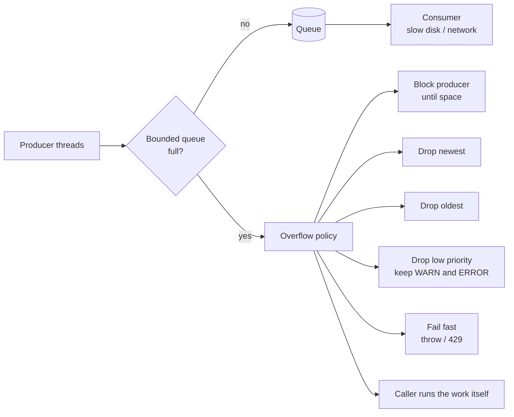

# Back-Pressure

## 1. One-line summary

**Back-pressure** is how a slow consumer pushes back on a fast producer: instead of letting work pile up in an ever-growing buffer until the process runs out of memory, the system uses a **bounded queue** and a deliberate **policy for when it's full** (block the producer, drop something, or reject), so overload becomes a visible, controlled behaviour instead of a crash.

💡 **Producer** = whatever creates work (app threads calling `log.info`, clients sending requests). **Consumer** = whatever finishes it (the thread writing log lines to disk, the worker pool). A **buffer** or **queue** sits between them.

---

## 2. The problem it solves

**The pain:** a logging framework hands log events from application threads to one background writer thread, so `log.info(...)` returns quickly. Normally the writer keeps up. Then traffic spikes, or the disk (or the network log shipper) slows down:

```
producers:  20,000 events/s
writer:     15,000 events/s
backlog grows by 20,000 − 15,000 = 5,000 events/s
```

With an **unbounded** queue (e.g. `new LinkedBlockingQueue<>()`, whose default capacity is `Integer.MAX_VALUE`) and ~500 bytes per event:

```
5,000 events/s × 500 B = 2.5 MB/s of extra heap
1 GB of free heap / 2.5 MB/s = 400 s  ≈ 7 minutes until OutOfMemoryError
```

And before the crash: GC (garbage collection, the JVM reclaiming unused memory) runs harder and harder, latency climbs for everything, and the logs you'll need to debug the incident are sitting in RAM that's about to vanish. Making the queue bigger only delays the crash; **if the consumer is slower on average, no queue size is enough**.

**The fix:** bound the queue and choose what happens when it's full. Every option has a cost, but each one is a decision instead of an accident.

> Infra analogy: a k8s node under memory pressure doesn't wait for the kernel's OOM killer; the kubelet **evicts pods**, lowest priority (BestEffort) first. That's a bounded resource with a "drop by priority" policy. An API gateway returning **429 Too Many Requests** or a load balancer returning **503** is "fail fast" back-pressure ([resilience patterns: load shedding](../../HLD/concepts/resilience-patterns.md)).

---

## 3. How it works



### 3.1 The overflow policies

| Policy | What happens when full | Good for | Cost |
|---|---|---|---|
| **Block** | producer waits until there's space (`BlockingQueue.put`) | audit logs, payments: nothing may be lost | the app slows to the consumer's speed; a stuck consumer stalls every request |
| **Drop newest** | discard the incoming item (`offer` returns `false`) | metrics, debug logs | you lose the most recent, often most relevant, data |
| **Drop oldest** | evict the head, insert the new one | live dashboards, "latest state" streams | old data vanishes; may break ordering assumptions |
| **Drop by priority** | discard low-value items first (DEBUG/INFO before WARN/ERROR) | logging | needs a notion of priority |
| **Sample** | keep 1 in N items under load | high-volume tracing, access logs | statistical view only |
| **Fail fast** | throw / return an error to the caller (429, `RejectedExecutionException`) | request handling, APIs | caller must handle and retry with backoff |
| **Caller runs** | the producer does the work itself | thread pools | producer slows down naturally (true back-pressure) |
| **Spill to disk** | overflow goes to a local file | log shippers (Fluent Bit, Vector) | disk can fill too; more moving parts |

Whatever you choose, **count what you drop** and expose it as a metric ([observability](../../HLD/concepts/observability.md)); silent loss is the worst outcome.

### 3.2 Sizing a queue: Little's law

**Little's law**: the average number of items in a system `L` equals the arrival rate `λ` times the average time each item spends in it `W`.

```
L = λ × W
```

Steady state: 5,000 log events/s, each spends 2 ms in the queue + write: `L = 5,000 × 0.002 = 10` events in flight on average. That's the *average*; a queue sized to the average overflows on the first spike. The queue is really there to **absorb bursts**:

```
burst: 20,000 events/s for 2 s, writer drains 15,000/s
backlog at the end of the burst = (20,000 − 15,000) × 2 s = 10,000 events
memory at 500 B each = 10,000 × 500 B = 5 MB
time to drain after the burst (if traffic drops to 5,000/s) = 10,000 / (15,000 − 5,000) = 1 s
```

So capacity ~10,000 (5 MB) rides out that burst without dropping or blocking. Rule: size for the **burst you expect**, and let the policy handle anything bigger. A queue also adds latency: an item at the back of a 10,000-item queue drained at 15,000/s waits `10,000 / 15,000 ≈ 0.67 s`.

### 3.3 Example: Logback `AsyncAppender`

Logback's `AsyncAppender` puts events in an `ArrayBlockingQueue` and one worker thread forwards them to the real appender (file, console). Defaults, from its source (`AsyncAppenderBase`):

| Setting | Default | Meaning |
|---|---|---|
| `queueSize` | **256** | capacity of the bounded queue |
| `discardingThreshold` | **queueSize / 5** (51 for 256) | when fewer than this many slots remain (i.e. the queue is **80% full**), events of level **TRACE, DEBUG and INFO** are **dropped**; WARN and ERROR are kept. Set it to **0** to never drop. |
| `neverBlock` | **false** | when the queue is completely full, the caller **blocks**. `true` = drop instead of blocking. |

So the default is "drop by priority at 80%, then block at 100%": a mixed policy most people don't know they have. See [SLF4J, Logback and Log4j2](../libraries/java/slf4j-logback-and-log4j2.md) for the configuration and one more trap (queued events lost at JVM exit). Log4j2's async loggers use a much larger ring buffer, and by default make the caller **wait** when it's full; a `Discard` policy (drops INFO and below) is opt-in.

### 3.4 Example: `ThreadPoolExecutor` and `CallerRunsPolicy`

A [ThreadPoolExecutor](../libraries/java/executors-and-threads.md) has a work queue and a **rejection policy** for when the queue is full and all threads are busy:

| Policy | When full |
|---|---|
| `AbortPolicy` (default) | throws `RejectedExecutionException` (fail fast) |
| `CallerRunsPolicy` | the submitting thread runs the task itself |
| `DiscardPolicy` | silently drops the new task |
| `DiscardOldestPolicy` | drops the oldest queued task, retries the submit |

`CallerRunsPolicy` is elegant back-pressure: while the producer is busy running a task, it can't submit more, so the submission rate automatically falls to what the system can handle. Runnable demo (Java 21, `java CallerRunsDemo.java`):

```java
import java.util.concurrent.*;

public class CallerRunsDemo {
    public static void main(String[] args) throws InterruptedException {
        ThreadPoolExecutor pool = new ThreadPoolExecutor(
                1, 1,                                   // one worker ("the slow disk writer")
                0, TimeUnit.MILLISECONDS,
                new ArrayBlockingQueue<>(2),            // bounded: at most 2 waiting tasks
                new ThreadPoolExecutor.CallerRunsPolicy());   // full? the submitter runs it itself

        long start = System.nanoTime();
        for (int i = 1; i <= 6; i++) {
            int n = i;
            pool.execute(() -> {
                sleep(100);                             // each "write" takes 100 ms
                System.out.printf("task %d ran on %s%n", n, Thread.currentThread().getName());
            });
            System.out.printf("submitted %d after %d ms%n", n, (System.nanoTime() - start) / 1_000_000);
        }
        pool.shutdown();
        pool.awaitTermination(5, TimeUnit.SECONDS);
    }

    static void sleep(long ms) {
        try { Thread.sleep(ms); } catch (InterruptedException e) { Thread.currentThread().interrupt(); }
    }
}
```

Output (timings vary slightly per run):

```
submitted 1 after 1 ms
submitted 2 after 15 ms
submitted 3 after 15 ms
task 1 ran on pool-1-thread-1
task 4 ran on main
submitted 4 after 116 ms
submitted 5 after 117 ms
task 2 ran on pool-1-thread-1
task 6 ran on main
submitted 6 after 218 ms
task 3 ran on pool-1-thread-1
task 5 ran on pool-1-thread-1
```

Tasks 1–3 fill the worker and the 2-slot queue instantly; task 4 runs **on `main`**, so the next submit happens ~100 ms later. The producer has been slowed to the consumer's pace, and nothing was dropped. Note that `Executors.newFixedThreadPool(n)` uses an **unbounded** queue: no back-pressure at all ([blocking queues and producer-consumer](../libraries/java/blocking-queues-and-producer-consumer.md)).

### 3.5 The same idea elsewhere

- **TCP flow control.** 💡 **TCP** is the protocol under HTTP that delivers bytes reliably and in order. Each receiver tells the sender how much free buffer it has (the **receive window**). If the receiving app stops reading, the window shrinks to **zero** and the sender's kernel stops sending; then the sender's own socket buffer fills and its `write()` blocks. Back-pressure travels hop by hop across the network with no app code.
- **Kafka consumer lag.** [Kafka](../../HLD/technologies/kafka.md) consumers **pull**, so a slow consumer can't be overwhelmed: messages wait on the broker's disk and the gap grows (**consumer lag**, the number of messages written but not yet processed). The buffer is huge and durable, but not infinite: once lag exceeds the topic's retention period, unread messages are deleted. Alert on lag.
- **Node.js streams.** A writable stream buffers up to its `highWaterMark`; `write()` returns `false` when the buffer is over it, and the stream emits `'drain'` once it has emptied. Ignoring `false` makes the buffer grow without limit. `pipeline()` handles this for you ([logging in Node](../libraries/js/logging-in-node.md), [event loop](../libraries/js/event-loop-and-concurrency.md)).

```js
import { Writable } from 'node:stream';

// A slow consumer: each chunk takes 50 ms to "write to disk".
const slow = new Writable({
  highWaterMark: 16,                      // tiny buffer (bytes) so we hit it quickly
  write(chunk, _enc, done) { setTimeout(done, 50); },
});
console.log('default highWaterMark:', new Writable().writableHighWaterMark, 'bytes');

let i = 0;
function produce() {
  while (i < 6) {
    const ok = slow.write(`line ${i}\n`);  // false = "my buffer is over highWaterMark, stop"
    console.log(`write(line ${i}) returned ${ok}, buffered=${slow.writableLength}`);
    i++;
    if (!ok) {
      slow.once('drain', () => { console.log('drain: resume'); produce(); });
      return;                              // stop producing until the consumer catches up
    }
  }
  slow.end(() => console.log('all written'));
}
produce();
```

Output on Node 22 (`node drain.mjs`):

```
default highWaterMark: 65536 bytes
write(line 0) returned true, buffered=7
write(line 1) returned true, buffered=14
write(line 2) returned false, buffered=21
drain: resume
write(line 3) returned true, buffered=7
write(line 4) returned true, buffered=14
write(line 5) returned false, buffered=21
drain: resume
all written
```

`false` is advice, not enforcement: the third line *was* accepted (21 bytes buffered, over the 16-byte mark). The producer must stop on its own. (The default `highWaterMark` for byte streams is 64 KiB in Node 22; older versions used 16 KiB.)

---

## 4. When to use it

- Any **producer-consumer hand-off** with a speed mismatch: async logging, thread pools, batch writers, message pipelines.
- **Services under load**: shed or reject at the edge instead of queueing requests until timeouts.
- **Streaming I/O**: reading a big file and sending it over a socket, piping between processes.

## 5. When NOT to use it (and why it's a mistake)

| Situation | Why |
|---|---|
| Blocking on a **request thread** for non-critical work (debug logs, metrics) | You turn a slow disk into a site outage. Drop or sample instead. |
| Dropping **must-not-lose** data (audit trail, payments) | Use blocking, a durable queue (Kafka) or fail fast so the caller can retry. |
| Huge queues "just in case" | A queue that takes minutes to drain hides overload and adds latency to everything behind it. Short queues + an explicit policy surface problems early. |
| Back-pressure across a **synchronous request chain** without timeouts | Blocking propagates upstream and every caller hangs. Pair with timeouts and load shedding ([resilience patterns](../../HLD/concepts/resilience-patterns.md)). |

---

## 6. Commonly confused with

| | **Back-pressure** | **Rate limiting** | **Load shedding** | **Buffering** |
|---|---|---|---|---|
| Triggered by | the consumer actually falling behind | a fixed quota per client, regardless of load | the server being overloaded | nothing, it just absorbs |
| Signal | dynamic (queue full, window zero) | static (100 req/min) | dynamic (CPU, queue depth) | none |
| Effect | producer slows, or items dropped | excess requests rejected (429) | low-priority work rejected (503) | delays the problem |
| Scope | between two components | per client/key | per server | between two components |

Rate limiting protects you from one noisy client; back-pressure protects a component from its own producers; a buffer without a bound is not back-pressure at all.

---

## 7. Common mistakes / misuse

1. **Unbounded queues** (`newFixedThreadPool`, `new LinkedBlockingQueue<>()`): OOM instead of a decision.
2. **Not knowing your library's policy**: Logback's default AsyncAppender silently drops INFO at 80% full, then blocks.
3. **Dropping without counting**: always increment a "dropped events" metric.
4. **Ignoring `write()` returning `false`** in Node, or `offer()` returning `false` in Java.
5. **Blocking while holding a lock** that the consumer also needs: deadlock ([thread-safety basics](thread-safety-basics.md)).
6. **Retrying immediately on rejection**: rejected callers that retry at once make the overload worse. Back off with jitter.

---

## 8. Interview cheat-sheet

> "When a producer is faster than a consumer, an unbounded queue just converts overload into an OutOfMemoryError, so I use a bounded queue and pick an overflow policy. For an async logger I'd keep WARN and ERROR and drop DEBUG and INFO when the queue is nearly full, count the drops as a metric, and offer a blocking mode for audit logs. I size the queue with Little's law and the expected burst: a 2-second burst of 5,000 extra events per second needs 10,000 slots, about 5 MB. Thread pools get a bounded queue with CallerRunsPolicy so producers slow down naturally. The same idea appears in TCP's receive window, Kafka consumer lag and Node streams' write returning false until 'drain'."

---

## 9. Used in

- [LLD: Logging Framework](../interviews/logging-framework/README.md): the async appender's bounded queue, what to do when it's full (block, drop by level, drop counter), and flushing on shutdown.
- Related: [thread-local and context propagation](thread-local-and-context-propagation.md), [SLF4J, Logback and Log4j2](../libraries/java/slf4j-logback-and-log4j2.md), [logging in Node](../libraries/js/logging-in-node.md), [blocking queues and producer-consumer](../libraries/java/blocking-queues-and-producer-consumer.md), [executors and threads](../libraries/java/executors-and-threads.md), [resilience patterns](../../HLD/concepts/resilience-patterns.md), [Kafka](../../HLD/technologies/kafka.md).
