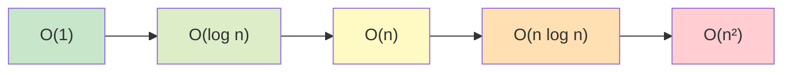

# Big-O Complexity (for interviews)

## 1. One-line summary

**Big-O** is a shorthand for **how an operation's cost grows as the data grows** — "O(1)" means the cost stays flat no matter how many items there are, "O(n)" means it grows in step with the number of items — and in LLD interviews you're expected to state it for each operation of your design.

## 2. The problem it solves

"Is this fast?" has no answer without "for how much data?". A linear scan over 100 items takes microseconds; over 100 million it's seconds, and on the request path that's an incident. Big-O gives a common language to say *how it scales* without benchmarking every design:

- In infra terms: it's like asking "does this alert query scan every time series, or look up by label index?" — the first is fine in staging and melts in production.
- In interviews: "my `get` is O(1) and `put` is O(1) amortized" is the sentence that tells the interviewer you chose the right data structures for an [LRU cache](../interviews/lru-cache/README.md).

Big-O describes the **growth rate**, ignoring constant factors and small terms: 3n + 20 is O(n); n²/2 + n is O(n²).

## 3. How it works

### The common classes, slowest-growing first

| Big-O | Name | Plain words | Example | n = 1,000,000 → roughly |
|---|---|---|---|---|
| O(1) | constant | same cost for any size | `HashMap.get`, array index, DLL unlink with a node reference | 1 step |
| O(log n) | logarithmic | each step halves the problem | binary search, `TreeMap.get`, heap push/pop | log₂(1,000,000) ≈ 20 steps |
| O(n) | linear | touch every item once | scan a list, `LinkedList.remove(Object)` | 1,000,000 steps |
| O(n log n) | linearithmic | sort | `Collections.sort`, `Arrays.sort` | 1,000,000 × 20 = 20,000,000 steps |
| O(n²) | quadratic | every pair | nested loops comparing all items | 10¹² steps — never finishes on a request path |



### Average vs worst case

Hash maps are O(1) **on average** — assuming the hash function spreads keys across buckets. If every key collides, a bucket becomes a long chain: O(n) in most languages, **O(log n)** in Java 8+ because long buckets turn into balanced trees (see [hashmap-and-linked-list](hashmap-and-linked-list.md)). Say "O(1) average" when it matters.

### Amortized O(1)

**Amortized** means "averaged over a long sequence of operations": most are cheap, a rare one is expensive, and the average stays constant.

**`ArrayList.add`**: the backing array is full → allocate one 1.5× bigger and copy everything (O(n)). Copies happen at sizes 10, 15, 22, 33, ... Total copy work for n adds is at most ~3n (a geometric series: n + n/1.5 + n/1.5² + ... = n × 1/(1 − 1/1.5) = 3n), so per add it is at most ~3 copies = O(1) amortized.

**`HashMap.put`**: when size passes capacity × 0.75, the table doubles and all entries are rehashed (O(n)). Same geometric argument with factor 2: total rehash work ≤ 2n, so `put` is O(1) amortized.

Practical consequence: amortized O(1) still has **latency spikes** — the one `put` that triggers a resize of a 10-million-entry map takes milliseconds. If p99 latency matters, **pre-size** (`new HashMap<>(expectedSize * 4 / 3 + 1)`, or `HashMap.newHashMap(expectedSize)` in Java 19+).

```java
import java.util.ArrayList;

public class AmortizedDemo {
    public static void main(String[] args) {
        int n = 1_000_000;
        long copies = 0;
        int capacity = 10;
        for (int size = 0; size < n; size++) {
            if (size == capacity) {              // full → grow 1.5x, copy 'size' elements
                copies += size;
                capacity = capacity + (capacity >> 1);
            }
        }
        System.out.printf("adds=%d copies=%d copies/add=%.2f%n", n, copies, (double) copies / n);
        // prints: copies/add=2.43 → a small constant (always < 3) per add, i.e. amortized O(1)
        var list = new ArrayList<Integer>(n);    // pre-sized: zero copies
        for (int i = 0; i < n; i++) list.add(i);
    }
}
```

### Space complexity

The same notation for **memory**: how much extra memory the structure or algorithm needs as n grows.

- An LRU cache with capacity C: **O(C)** — one map entry + one list node per item.
- LFU with frequency buckets: still **O(C)** (the bucket map has at most C non-empty lists).
- A recursive algorithm also uses stack space: recursion depth d → O(d).

Space Big-O hides real bytes. "O(C)" for 1,000,000 entries can be ~170 MB of heap in Java (worked out in [references-and-gc](../libraries/java/references-and-gc.md)). In a design discussion, give both: "O(C) space, about 170 bytes per entry".

### How to state complexity in an LLD answer

State it **per operation**, name the data structure that makes it so, and qualify average/amortized:

| Operation | `LruCache` (HashMap + DLL) | Why |
|---|---|---|
| `get(k)` | O(1) average | map lookup + unlink + append |
| `put(k, v)` | O(1) amortized | map put (may resize) + append + maybe evict head |
| eviction | O(1) | oldest is `head.next` |
| `size()` | O(1) | map keeps a count |
| iterate / snapshot | O(n) | must visit every entry |
| space | O(capacity) | one node + one map entry per key |

Then mention the alternative you rejected: "A priority queue ordered by last-access time would make `get` O(log n), so the linked list is better here." That shows you compared options.

### Constant factors matter in practice

Big-O ignores constants, but production doesn't:

- **CPU cache locality**: an `ArrayList` / `ArrayDeque` (contiguous memory) can beat a `LinkedList` even where both are O(n) or O(1), because following scattered pointers causes cache misses (~100 ns each vs ~1 ns for a cache hit).
- **Small n**: for 10 items, a linear scan over an array is often faster than hashing.
- **Hidden costs**: boxing `int` → `Integer`, `hashCode` on long strings, lock contention. A `synchronized` O(1) cache with 64 threads queued is not "fast".
- **Same Big-O, different constants**: Caffeine and a `synchronized LinkedHashMap` are both O(1) per get, but Caffeine scales across cores and the other doesn't.

Rule of thumb: **choose by Big-O, tune by measuring.**

## 4. When to use it

- In **every LLD answer**, after the API: list each operation's time and space complexity.
- When **choosing a data structure**: map vs list vs tree vs heap.
- In **code review / on-call**: spotting an O(n) scan inside a per-request loop (O(n²) overall) before it pages you.

## 5. When NOT to use it

- **As the only argument for small, fixed n** — "O(n) over 5 payment methods" is fine; don't over-engineer to O(1).
- **To compare two O(1) designs** — use benchmarks (JMH in Java) and contention analysis instead.
- **For I/O-bound work** — one network round trip (~1 ms) dwarfs millions of in-memory steps; count round trips instead.

## 6. Commonly confused with

| Term | Meaning |
|---|---|
| **Worst case** | the most expensive single operation (HashMap: O(log n) in Java 8+) |
| **Average case** | expected cost over random inputs (HashMap: O(1)) |
| **Amortized** | guaranteed average over a **sequence**, even in the worst case (ArrayList add: O(1)) — no randomness assumed |
| **Big-O vs Big-Θ vs Big-Ω** | upper bound vs tight bound vs lower bound; interviews say "Big-O" and mean the tight bound |
| **Time vs space** | steps vs memory; often traded (a cache spends space to save time) |

## 7. Common mistakes / misuse

1. **Saying "O(1)" for `LinkedList.remove(obj)`** — it searches first: O(n). O(1) only with a node reference.
2. **Forgetting the hidden loop**: `list.contains(x)` inside a loop is O(n²).
3. **Calling `HashMap` O(1) worst case** — it's average; qualify it.
4. **Ignoring amortized spikes** in latency-sensitive paths — pre-size collections.
5. **Only stating time, not space** — interviewers want both.
6. **Over-precision**: "O(2n + 3)" — drop constants: O(n).

## 8. Interview cheat-sheet

- "Both `get` and `put` are O(1) — average for the hash lookup, amortized for resizing — and eviction is O(1) because the oldest node is always `head.next`."
- "Space is O(capacity); in Java that's roughly 150–200 bytes per entry, so a million entries is a couple of hundred MB of heap."
- "I rejected a heap ordered by timestamp because it would make every access O(log n)."
- "Big-O guides the choice, but constants matter: contiguous arrays beat linked structures on cache locality, and a single lock can make an O(1) structure the bottleneck."

## 9. Used in

- [LLD: Design an LRU Cache](../interviews/lru-cache/README.md) — per-operation complexity of LRU (HashMap + DLL), LFU (frequency buckets), and the `LinkedHashMap` version.
- Related: [hashmap-and-linked-list](hashmap-and-linked-list.md), [cache-eviction-policies](cache-eviction-policies.md), [HLD back-of-the-envelope](../../HLD/concepts/back-of-the-envelope.md) (estimating memory from per-entry size).
