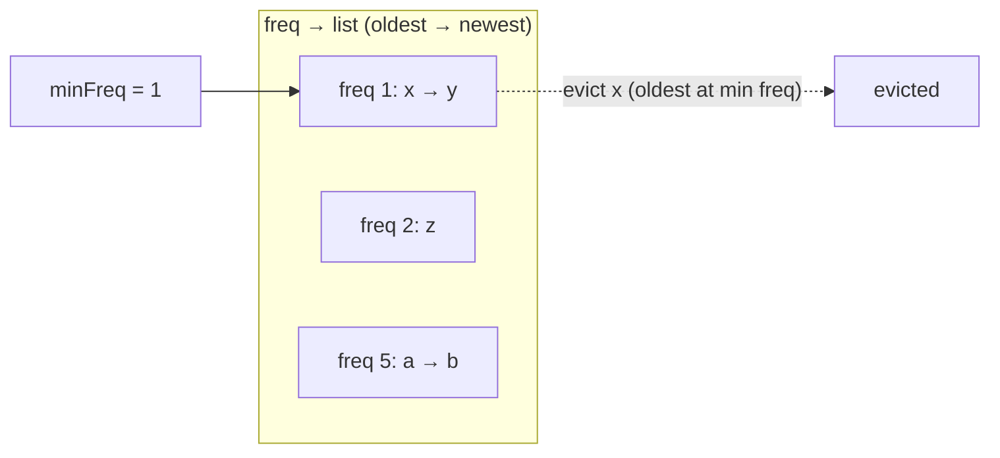

# Cache Eviction Policies

## 1. One-line summary

An **eviction policy** is the rule a full cache uses to decide **which entry to throw away** to make room for a new one — FIFO, LRU, LFU, TTL and friends — and the choice decides your hit rate (the fraction of lookups served from the cache).

## 2. The problem it solves

A cache has a fixed budget (entries or bytes). Once full, every new entry must push an old one out. Throw out the wrong one and you'll need it again a millisecond later: a **miss**, which means a slow trip to the database or a downstream service.

The ideal policy would evict "the entry that will be needed furthest in the future" (called **Bélády's optimal**), but that needs to know the future. Every real policy is a **guess about the future based on the past**:

- **Recency**: "used recently → will be used again soon" (LRU).
- **Frequency**: "used often → will be used again" (LFU).
- **Age**: "old data is stale" (TTL).

This page is the **in-process / data-structure view** (how each policy is implemented and its trade-offs). For the **system view** — cache-aside vs write-through, invalidation, stampedes, Redis `maxmemory-policy` — see [HLD: caching strategies](../../HLD/concepts/caching-strategies.md).

## 3. How it works

### The policies

| Policy | Evicts | Typical structure | Cost per op |
|---|---|---|---|
| **FIFO** (first in, first out) | the oldest **inserted** entry, regardless of use | hash map + queue | O(1) |
| **LRU** (least recently used) | the entry **untouched** the longest | hash map + doubly linked list ([how](hashmap-and-linked-list.md)) | O(1) |
| **LFU** (least frequently used) | the entry with the **fewest hits**; ties → LRU among them | hash map + frequency buckets (freq → DLL) + `minFreq` | O(1) |
| **MRU** (most recently used) | the entry used **most recently** | same as LRU, evict from the other end | O(1) |
| **Random** | a random entry | array + map (swap-remove) | O(1) |
| **TTL** (time to live) | entries **older than** a duration — not a capacity policy | timestamp per entry + lazy check or sweeper | O(1) lazy |

### LFU in O(1), briefly

Keep `Map<K, Node>`, `Map<Integer, DoublyLinkedList>` (frequency → nodes with that frequency, in LRU order) and an `int minFreq`.

- On access: remove node from list `freq`, add to list `freq + 1`; if list `minFreq` became empty and that was the node's old freq, `minFreq++`.
- On insert: new node goes into list `1`; `minFreq = 1`.
- On evict: remove the **oldest** node of list `minFreq` (that's the LRU tie-break).

### Scan resistance

A **scan** is a one-time pass over many keys (a nightly report, a crawler, a `SELECT *` warming a cache). Under **LRU**, every scanned key becomes "most recent" for a moment and pushes out the genuinely hot keys. After the scan, hit rate is near zero until the hot set reloads — like a cold cache after a deploy.

- **LFU** resists scans (scanned keys have frequency 1 and are evicted first).
- **2Q, ARC, W-TinyLFU** are designed specifically to resist scans while still adapting to recency.

### Frequency aging

Pure LFU has the opposite problem: a key that was hot **yesterday** has a huge count and never leaves, even though nobody wants it now (**cache pollution**). Fixes: periodically **halve all counters** (aging/decay), or count only within a recent window. Redis LFU uses a logarithmic counter that decays over time (`lfu-decay-time`); Caffeine halves its sketch counters periodically.

### Smarter hybrids (just the idea)

- **2Q**: new keys go into a small FIFO "probation" queue; only keys hit **again** get promoted to the main LRU. One-off keys never pollute the main area.
- **ARC** (Adaptive Replacement Cache): two LRU lists — "seen once" and "seen twice+" — plus "ghost" lists remembering recently evicted keys; it **self-tunes** how much space goes to recency vs frequency. Used in ZFS.
- **W-TinyLFU** (Caffeine): small LRU window for new keys, then a compact **frequency sketch** decides whether a candidate is more popular than the victim it would replace. Near-optimal hit rates on most workloads. Details in [caffeine-and-guava-cache](../libraries/java/caffeine-and-guava-cache.md).

### Approximated LRU (Redis)

Exact LRU needs two pointers per key and list updates on every read — expensive for a store holding hundreds of millions of keys. **Redis** instead stores a small last-access clock in each key and, when it must evict, **samples N random keys** (`maxmemory-samples`, default 5) and evicts the oldest of the sample (keeping a small pool of good candidates across rounds). With 10 samples it's very close to true LRU, at a fraction of the memory. Same trick for `allkeys-lfu`. See [HLD: Redis](../../HLD/technologies/redis.md#34-eviction-what-happens-when-ram-is-full).

### Trade-offs

| Policy | Hit rate on typical web traffic | Scan resistant | Handles changing popularity | Memory overhead | Complexity |
|---|---|---|---|---|---|
| FIFO | low–medium | no | yes (naturally) | low | trivial |
| LRU | good | **no** | yes | 2 pointers/entry | easy |
| LFU (no aging) | good for stable hot sets | yes | **no** (pollution) | pointers + counter | medium |
| LFU + aging | good | yes | yes | + aging pass | medium |
| MRU | bad, except cyclic scans | — | — | like LRU | easy |
| Random | surprisingly OK | partly | yes | lowest | trivial |
| TTL | n/a (bounds staleness) | n/a | n/a | timestamp/entry | easy |
| ARC / 2Q | very good | yes | yes | ghost lists | hard |
| W-TinyLFU | near-optimal | yes | yes (aged sketch) | few bytes/key sketch | hard (use Caffeine) |
| Sampled LRU (Redis) | ≈ LRU | no | yes | tiny | easy |

## 4. When to use it

- **LRU**: the default answer for "a bounded cache". Recency is a good predictor for most user-facing traffic.
- **LFU**: popularity is stable and skewed (a handful of viral items, product catalogs) and scans happen.
- **TTL**: **always**, in addition to a capacity policy, whenever cached data can change at the source — it bounds staleness even if invalidation fails.
- **MRU**: cyclic access larger than the cache (looping over a file bigger than memory) — LRU evicts exactly what's needed next; MRU keeps a stable part.
- **FIFO / Random**: when bookkeeping on reads is too expensive (hardware caches, very hot paths) and "good enough" is fine.

## 5. When NOT to use it

- **LRU when the workload has big scans** mixed with a hot set — use LFU-ish / W-TinyLFU.
- **Pure LFU without aging** for trending content — yesterday's hits squat forever.
- **TTL as the only bound** — under a traffic spike the cache can still grow unbounded within one TTL window. Always pair with a size limit.
- **Exact LRU for huge key counts** — the pointer overhead and read-path writes cost more than the slight hit-rate gain over sampling.

## 6. Commonly confused with

| Confusion | Difference |
|---|---|
| **Eviction vs expiration** | Eviction = removed because the cache is **full**; expiration (TTL) = removed because it's **too old**. Caches usually do both. |
| **Eviction vs invalidation** | Invalidation = removed because the **source data changed** (explicit delete on write). See [HLD caching strategies](../../HLD/concepts/caching-strategies.md). |
| **LRU vs FIFO** | FIFO ignores reads; LRU moves an entry to the front on every read. With `LinkedHashMap`, `accessOrder=false` gives FIFO. |
| **LRU vs LFU** | "When did you last use it?" vs "How often have you used it?" |

## 7. Common mistakes / misuse

1. **Saying "LRU" without justifying it** — mention the access pattern and why recency predicts reuse here.
2. **Forgetting the LFU tie-break** — several keys with the minimum frequency: which goes? Say "LRU among them".
3. **LFU that's O(log n)** with a heap when the interviewer asked for O(1) — know the frequency-bucket design.
4. **Not mentioning scans** when asked "what's wrong with LRU?"
5. **TTL implemented only by a sweeper** — between sweeps, expired values are served. Check expiry on read (lazy) **and** sweep (active), like Redis does.
6. **Ignoring entry size** — evicting by count when values range from 100 B to 10 MB makes the memory bound meaningless.

## 8. Interview cheat-sheet

- "I'll default to LRU — O(1) with a hash map and doubly linked list, and recency is a good predictor for this traffic."
- "LRU's weakness is scans: a one-off batch read flushes the hot set. LFU resists that but needs aging so old favourites don't squat."
- "For LFU in O(1) I keep frequency buckets, each an LRU list, plus `minFreq`; eviction takes the oldest node at `minFreq`."
- "TTL is orthogonal: it bounds staleness, while size-based eviction bounds memory — I'd use both."
- "In production, Caffeine's W-TinyLFU gets near-optimal hit rates, and Redis approximates LRU by sampling a few keys to save memory."

## 9. Used in

- [LLD: Design an LRU Cache](../interviews/lru-cache/README.md) — `LruCache`, `LfuCache` with O(1) frequency buckets, TTL with an injected clock, and eviction policy as a Strategy.
- Related: [hashmap-and-linked-list](hashmap-and-linked-list.md), [design-patterns](design-patterns.md) (Strategy for pluggable policies), [HLD caching strategies](../../HLD/concepts/caching-strategies.md), [HLD Redis](../../HLD/technologies/redis.md).
