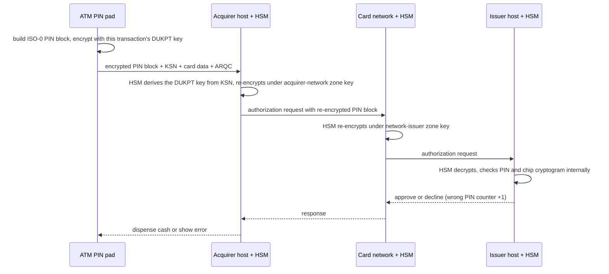

# Card and PIN Security (EMV chips, PIN blocks, HSMs, DUKPT)

## 1. One-line summary

Card security rests on three ideas: the **chip** proves the card is genuine by computing a **fresh cryptogram for every transaction** (so copying it is useless), the **PIN** never exists in clear text outside the keypad and a tamper-proof **HSM** (it travels as an encrypted **PIN block**), and the **card number** is replaced by **tokens** wherever it would otherwise be stored.

---

## 2. The problem it solves

**The pain (1990s–2010s):** a **magnetic stripe** holds the card's data as a fixed string, the same on every swipe. A criminal fits a **skimmer** (a small reader glued over the ATM's card slot) and a pinhole camera, copies the stripe onto a blank card, and withdraws cash from another ATM. Nothing in the copied data can tell the bank it's a clone.

On top of that, the PIN typed at an ATM has to reach the **issuer** (the cardholder's bank) through the ATM owner's bank, a card network and maybe a processor. If it were sent in clear, any compromised server or network tap along the way would collect PINs by the thousand.

**The fixes:**

| Threat | Fix |
|---|---|
| Card cloning | **EMV chip** with a secret key that never leaves it, and a **per-transaction cryptogram** |
| PIN theft in transit | **PIN block** encrypted at the keypad, only ever decrypted inside **HSMs** |
| Terminal key theft | **DUKPT**: a different key for every transaction |
| Guessing | Lockout after a few wrong PINs |
| Stored card numbers leaking | **Tokenization** + **PCI DSS** rules |

> Infra analogy: the chip is like a client certificate whose private key lives in a TPM (a tamper-resistant chip on a server motherboard): you can't copy the key, and each handshake signs fresh data, so a recorded handshake can't be replayed.

---

## 3. How it works

### 3.1 Magnetic stripe vs EMV chip

**EMV** (named after Europay, Mastercard, Visa, who wrote the standard in the 1990s, now managed by EMVCo) puts a tiny computer on the card.

| | **Magnetic stripe** | **EMV chip** |
|---|---|---|
| What it holds | Card number, expiry, a static check value | The same, **plus a secret key** that cannot be read out |
| Per transaction | Sends the same data every time | Computes an **ARQC** (Authorization Request Cryptogram): a short code calculated with its secret key over the amount, date, a random number from the terminal and the card's **transaction counter** |
| Copy it? | Yes, with a ₹1,000 reader | Copying visible data gives no key; a replayed cryptogram fails because the counter and random number differ |
| Verification | Issuer checks static values | Issuer recomputes the cryptogram with its copy of the key (inside an HSM) |

Rollout milestones: UK "Chip and PIN" from 2006; the US **liability shift** (whoever hasn't upgraded to chip pays for the fraud) in October 2015; in India, RBI required migration to EMV chip + PIN cards and magstripe-only cards were deactivated after 31 December 2018.

The weak spot that remains: many cards still carry a stripe for **fallback**, and online ("card-not-present") payments don't use the chip at all, which is why they need OTPs ([payment gateways and PSPs](../../HLD/technologies/payment-gateways-and-psps.md) §3.4).

### 3.2 Online vs offline PIN

- **Online PIN** (always used at ATMs): the encrypted PIN block travels to the issuer, who verifies it.
- **Offline PIN** (some shop terminals): the terminal hands the PIN to the **chip**, which compares it with a value stored inside and keeps its own **PIN try counter**. The chip blocks itself after too many wrong tries, even with no network.

### 3.3 The PIN block (ISO 9564 format 0)

A PIN block is the PIN packed into 8 bytes (16 hex digits) before encryption. Format 0 (ISO-0, also ANSI X9.8) mixes the PIN with the card number, so the same PIN `1234` on two different cards produces two different blocks; an attacker who sees encrypted blocks can't spot "everyone with PIN 1234" by matching identical ciphertexts.

1. **PIN field**: `0` + PIN length (one hex digit) + PIN digits + pad with `F` to 16 digits → `041234FFFFFFFFFF`.
2. **PAN field**: `0000` + the **rightmost 12 digits of the card number, excluding the last (check) digit** → for `4111111111111111`, `0000111111111111`.
3. **PIN block** = PIN field **XOR** PAN field (XOR: compare bits, 1 if they differ). Then this block is encrypted with a key, in hardware, using 3DES or AES (standard symmetric ciphers: the same secret key encrypts and decrypts).

> 💡 **PAN**: Primary Account Number, the long number printed on the card. Its last digit is a **check digit** (Luhn algorithm) that catches typos.

Runnable demo, pure arithmetic, no real keys (`java PinBlock.java`, Java 21):

```java
public class PinBlock {
    // ISO 9564 format 0: PIN field XOR PAN field, each 16 hex digits (8 bytes).
    static String iso0(String pin, String pan) {
        String pinField = ("0" + Integer.toHexString(pin.length()).toUpperCase() + pin + "F".repeat(14))
                .substring(0, 16);                               // 0 | length | PIN | F padding
        String pan12 = pan.substring(pan.length() - 13, pan.length() - 1); // rightmost 12, no check digit
        String panField = "0000" + pan12;
        StringBuilder out = new StringBuilder();
        for (int i = 0; i < 16; i++) {
            int x = Character.digit(pinField.charAt(i), 16) ^ Character.digit(panField.charAt(i), 16);
            out.append(Character.toUpperCase(Character.forDigit(x, 16)));
        }
        System.out.println("PIN field : " + pinField);
        System.out.println("PAN field : " + panField);
        return out.toString();
    }

    public static void main(String[] args) {
        System.out.println("PIN block : " + iso0("1234", "4111111111111111"));
        System.out.println();
        System.out.println("PIN block : " + iso0("1234", "5412751234567890"));
    }
}
```

Real output (same PIN, two cards, two different blocks):

```
PIN field : 041234FFFFFFFFFF
PAN field : 0000111111111111
PIN block : 041225EEEEEEEEEE

PIN field : 041234FFFFFFFFFF
PAN field : 0000275123456789
PIN block : 041213AEDCBA9876
```

The XOR is **not** security by itself (anyone with the PAN can undo it); the encryption that follows is. Newer standards add **format 4** (ISO-4), designed for AES with random padding.

### 3.4 HSMs: where PINs and keys live

An **HSM** (Hardware Security Module) is a tamper-resistant box (Thales payShield, Utimaco, or a cloud HSM) that stores keys and does crypto **inside**; if someone opens it, it wipes its keys. Application servers ask it "translate this PIN block" or "verify this PIN" and get back an encrypted block or a yes/no, **never the PIN or the key**.



Each hop uses its own **zone key** (a key shared only by two neighbours), so the PIN block is **translated** (decrypt + re-encrypt) inside an HSM at each hop and exists in clear only within HSM memory. Infra analogy: like [TLS](../../HLD/concepts/tls-and-mtls.md) termination at each proxy, except the "termination" happens inside sealed hardware.

**PIN verification at the issuer:** the issuer doesn't store PINs either. It stores a value derived from PIN + card data with a secret key (e.g. a PIN Verification Value or IBM 3624 "offset"); the HSM recomputes it from the incoming PIN block and compares. A database dump of the issuer reveals no PINs.

### 3.5 DUKPT: a new key for every transaction

**DUKPT** (Derived Unique Key Per Transaction, ANSI X9.24-3) solves "thousands of ATMs and card machines in the field, any of which might be stolen and opened":

- The acquirer's HSM holds one **Base Derivation Key (BDK)**, never sent anywhere.
- Each terminal is injected at the factory with an **initial key** derived from the BDK and its device ID.
- For every transaction the terminal derives a fresh key and discards the old one, and sends a **KSN** (Key Serial Number = device ID + transaction counter) in clear alongside the encrypted PIN block.
- The HSM uses BDK + KSN to re-derive the same one-time key and decrypt.

Result: stealing a terminal and extracting its current key doesn't reveal **past** transactions' keys, and the server side stores one BDK instead of a key per device. (The classic 3DES variant caps a device at about 1 million transactions; AES DUKPT, 2017, raises limits.)

### 3.6 Attacks on ATMs, briefly

| Attack | How | Defence |
|---|---|---|
| **Skimming** | Overlay on card slot copies the stripe, camera/fake keypad captures PIN | EMV chip (clone has no key), anti-skimming slot design, PIN pad shields, fallback-to-stripe blocked |
| **Shimming** | A thin "shim" inside the chip reader records chip data | Captured data can't produce new cryptograms, so mainly useful only where issuers still accept weak fallback |
| **Cash trapping** | A device over the cash slot holds the notes; customer leaves thinking the ATM failed | Slot sensors, alerting when cash isn't taken, CCTV |
| **Jackpotting** | Malware or a "black box" wired to the cash dispenser makes it empty itself (publicly demonstrated by Barnaby Jack at Black Hat, 2010) | Encrypted, authenticated dispenser link, locked-down OS, physical locks and alarms |

### 3.7 Lockout and rate limits

A 4-digit PIN has only 10,000 values, so security depends on limiting guesses: typically **3 wrong tries** and the card is blocked for the day or until reset (exact policy is the issuer's; illustrative). The counter must live at the **issuer** (or on the chip for offline PIN), not in the ATM, otherwise an attacker just walks to the next ATM. In LLD terms this is a per-card counter with a reset time: a small [state machine](state-machines.md) (`ACTIVE → TEMP_BLOCKED → ACTIVE` / `BLOCKED`), updated atomically ([optimistic vs pessimistic locking](optimistic-vs-pessimistic-locking.md)) so two parallel attempts can't both read "2 tries left". The same pattern applies to wallet or UPI PINs in an app.

### 3.8 Tokenization and PCI DSS

- **Tokenization**: store a random **token** instead of the PAN; only a secured vault (or the card network, for network tokens) can map it back. A leaked database of tokens is useless elsewhere. India's RBI card-on-file rule (effective October 2022) forbids merchants from storing card numbers at all.
- **PCI DSS** (Payment Card Industry Data Security Standard): the security checklist for any system that stores, processes or transmits card data. Shrink your **scope** by never touching the PAN (hosted payment pages, tokens). **PCI PIN Security** is a separate requirement set for systems that handle PINs: HSMs, key ceremonies with split knowledge (no single person ever sees a whole key).

---

## 4. When to use it

- Designing an **ATM**, POS terminal or **wallet** LLD: model the card as `cardToken`/masked PAN, the PIN as a verification call to a bank service, and the wrong-PIN counter as a state machine.
- Any system storing card or bank credentials: tokenize, keep secrets in an HSM/KMS, never log them.
- In-app PINs (wallet PIN, UPI PIN): same principles of "verify, don't store", and lockout.

## 5. When NOT to use it (and why it's a mistake)

| Situation | Why |
|---|---|
| Hashing a 4-digit PIN with SHA-256 and calling it "secure storage" | 10,000 possible PINs: brute-forced in milliseconds. Real systems use keyed derivation inside an HSM plus lockout. |
| Building your own crypto for PIN blocks or tokens | Use the standards (ISO 9564, DUKPT) and certified HSMs; custom schemes fail audits and attacks. |
| Putting an HSM in front of non-sensitive data | Expensive, slow, operationally heavy; KMS envelope encryption (a cloud key service encrypts a per-object data key, and the data key encrypts the data) is enough for most secrets. |
| Implementing PIN verification inside the ATM class in an LLD | The ATM never knows the right PIN; it forwards an encrypted block to the bank. Modelling it locally is a design smell. |

---

## 6. Commonly confused with

| | **Encryption** | **Hashing** | **Tokenization** | **PIN block** |
|---|---|---|---|---|
| Reversible? | Yes, with the key | No | Yes, only via the token vault | Yes (XOR with PAN), after decryption |
| Purpose | Protect data in transit/storage | Check equality, integrity | Remove PAN from your systems | Format the PIN for encryption |
| Leak impact | Bad if key leaks too | Bad for small spaces (PINs) | Low | Low if encrypted |

| | **HSM** | **KMS (AWS KMS, Vault)** | **TPM / secure element on card** |
|---|---|---|---|
| Where | Data-centre appliance / cloud HSM | Managed cloud service (often HSM-backed) | Chip inside a device or card |
| Payment-certified (PCI PIN) | Yes (payment HSMs) | Usually not for PIN translation | The card's chip is EMV-certified |
| Typical job | PIN translation, cryptogram checks, key ceremonies | Envelope encryption of app secrets | Holds one device's / card's key |

---

## 7. Common mistakes / misuse

1. **Logging PINs, CVVs (the 3-digit security code on the card's back) or full PANs** in request logs or exception traces. CVV must never be stored at all, even encrypted.
2. **Lockout counter in the client or ATM** instead of the issuer: an attacker resets it by switching machines or reinstalling the app.
3. **Non-atomic counter update**: two concurrent wrong attempts both pass a "tries < 3" check.
4. **Assuming the chip protects online payments**: card-not-present uses no chip, hence OTP / 3-D Secure.
5. **Allowing magstripe fallback** freely, which reopens the cloning hole.
6. **Saying "we encrypt the PIN with AES in our service"**: the PIN should never reach a general-purpose server in clear; it's encrypted at the PIN pad and handled only in HSMs.
7. **Storing PANs "temporarily"** for retries or refunds: use the PSP's token or payment id.

---

## 8. Interview cheat-sheet

> "The ATM never knows or stores the PIN. The PIN pad builds an ISO-0 PIN block, which is the PIN XORed with part of the card number, and encrypts it with a one-time DUKPT key, so stealing a terminal reveals nothing about past transactions. Each hop translates the block inside an HSM under its own zone key, and the issuer verifies it inside its HSM against a derived value, not a stored PIN. The EMV chip produces a per-transaction cryptogram over amount, counter and a random number, which is why cloned cards stopped working, unlike static magstripe data. Wrong-PIN attempts are counted at the issuer with an atomic counter and a lockout after about three tries. In our own systems we store only tokens and masked card numbers, which keeps us out of most PCI DSS scope."

---

## 9. Used in

- [Digital wallet](../interviews/digital-wallet/README.md): wallet PIN verification and lockout, storing linked cards as tokens and masked numbers only, and how card top-ups stay out of PCI scope. Also the background for ATM-style LLD questions (card reader, PIN entry, bank verification).
- Related: [payment gateways and PSPs](../../HLD/technologies/payment-gateways-and-psps.md), [state machines](state-machines.md), [optimistic vs pessimistic locking](optimistic-vs-pessimistic-locking.md), [access control models](access-control-models.md), [TLS and mTLS](../../HLD/concepts/tls-and-mtls.md), [end-to-end encryption](../../HLD/concepts/end-to-end-encryption.md), [authentication, OAuth and JWT](../../HLD/concepts/authentication-oauth-jwt.md), [payment reconciliation](../../HLD/concepts/payment-reconciliation.md).

**Sources:** ISO 9564-1 (PIN block formats 0–4; format 4 added for AES); ANSI X9.24-3 (DUKPT, AES variant 2017); EMVCo specifications; RBI EMV migration (magstripe cards deactivated after 31 Dec 2018); US EMV liability shift (Oct 2015); Barnaby Jack, "Jackpotting Automated Teller Machines", Black Hat USA 2010; RBI card-on-file tokenisation (effective Oct 2022). Lockout counts and DUKPT counter limit are stated from general knowledge and should be treated as approximate.
