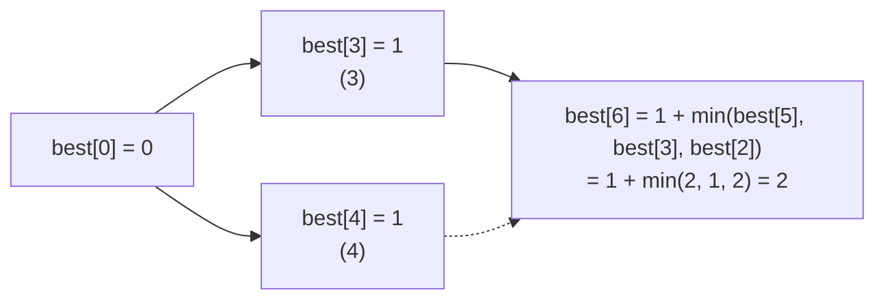

# Coin Change and Dynamic Programming

## 1. One-line summary

**Coin change** asks "what's the fewest coins that make this amount?"; the **greedy** rule "take the biggest coin that fits" is optimal only for special (**canonical**) coin systems with an unlimited supply, and as soon as the coin system is odd *or* the cash box has a **limited** number of each coin, you need an exact method: **dynamic programming** (solve every smaller amount once, store the answers in a table, build up) or a search with pruning.

💡 **Dynamic programming (DP)** in plain words: if a big problem is made of smaller versions of itself, and the *same* smaller versions come up again and again (**overlapping subproblems**), solve each smaller one once, write the answer down (a **memo** or **table**), and look it up instead of recomputing.

---

## 2. The problem it solves

**The pain:** a vending machine must return ₹6 change. Its cash box holds **one ₹5 coin and three ₹2 coins**, and no ₹1 coins.

- The obvious rule, "biggest coin first", hands out ₹5, then needs ₹1, has none, and is **stuck**. The machine shows "exact change only" or, worse, keeps the customer's money.
- The right answer exists: **₹2 + ₹2 + ₹2**.

Even with unlimited coins, greedy can be wrong if the denominations are unusual:

```
coins {1, 3, 4}, amount 6
greedy:  4 + 1 + 1 = 3 coins
best:    3 + 3     = 2 coins
```

So "biggest coin first" (see [greedy algorithms](greedy-algorithms.md)) is a shortcut that is only *sometimes* safe. You need to know when, and what to do otherwise.

> Infra analogy: greedy is like bin-packing pods by "put the biggest pod on the emptiest node". Usually fine, occasionally leaves capacity stranded. When you need the guaranteed best answer (and the problem is small enough), you compute it exactly.

---

## 3. How it works

### 3.1 When greedy is safe: canonical coin systems

A coin system is **canonical** if greedy gives the minimum number of coins for **every** amount, assuming an unlimited supply of each coin.

- **Indian rupee denominations** {1, 2, 5, 10, 20, 50, 100, 200, 500} (coins and notes treated alike) are canonical. The program below checks every amount from 1 to 1,400 against the exact answer and finds no counterexample. That is a proof, not just a sample: Kozen and Zaks (1994) showed that if a system is non-canonical, its smallest counterexample is below the sum of the two largest coins (200 + 500 = 700), and we checked up to twice that.
- **Non-canonical** examples: {1, 3, 4} (fails at 6), and pre-1971 British coins {1, 3, 6, 12, 24, 30} pence, where greedy pays 48 as 30 + 12 + 6 but two 24s would do.

Canonical only covers the **unlimited** case. A real cash box has limited coins, and then greedy can fail even with rupees (the ₹6 example). A vending machine's change problem is always the limited one.

### 3.2 DP for unlimited coins

Let `best[a]` = fewest coins that make amount `a`. To make `a`, the last coin you add is some coin `c`, and the rest must be the best way to make `a − c`:

```
best[0] = 0
best[a] = 1 + min over coins c ≤ a of best[a − c]      (∞ if no coin fits)
```

Fill the table from 0 up to the amount. Each entry looks at every coin once:



For coins {1, 3, 4}: `best[2] = 2` (1+1), `best[5] = 2` (4+1), `best[3] = 1`, so `best[6] = 1 + 1 = 2` (3+3).

**Why it's fast:** a naive recursion "try every coin, recurse on the rest" recomputes `best[2]` many times. The number of calls grows exponentially with the amount. With the table, each amount is computed once:

```
time  = O(amount × number of coins)     e.g. ₹1,000 × 9 coins = 9,000 steps
space = O(amount)                       1,001 ints ≈ 4 KB
```

(See [Big-O complexity](big-o-complexity.md).) Two equivalent styles:

| | **Top-down (memoization)** | **Bottom-up (tabulation)** |
|---|---|---|
| How | recursive function + `HashMap`/array cache | loop from small amounts to large |
| Computes | only the amounts actually reached | every amount up to the target |
| Risk | deep recursion → `StackOverflowError` for big amounts | none, but may compute unneeded entries |

### 3.3 Limited coins (bounded change-making)

Now each coin type `i` has `counts[i]` pieces. Process one coin type at a time: `table[a]` = fewest coins for `a` using only the types seen so far. For the next type, try using `k = 0, 1, ..., counts[i]` of it:

```
next[a] = min over k ≤ counts[i], k × coin ≤ a of  table[a − k × coin] + k
```

Remember which `k` won (`pick[i][a]`) to reconstruct the actual coins. Cost:

```
O(amount × total coins in the box)     ₹200 change, 60 coins in the box → 200 × 60 = 12,000 steps
```

Tiny for a vending machine. The alternative is a **DFS with pruning** (depth-first search): try big coins first, backtrack when stuck, and stop exploring a branch once it already uses more coins than the best answer found. It's often fast in practice and easy to explain, but its worst case is exponential.

💡 **Pruning** means skipping branches of a search that provably can't beat the best answer so far.

### 3.4 Runnable comparison (Java 21)

Run with `java CoinChange.java`. Amounts are whole rupees here; in real code keep money in the smallest unit (paise) as integers, see [splitting money and rounding](splitting-money-and-rounding.md).

```java
import java.util.*;

public class CoinChange {
    // Greedy: biggest coin that fits, as many as allowed. counts[i] = how many of coins[i] we have.
    // Returns coins used, or null if greedy gets stuck.
    static int[] greedy(int[] coins, int[] counts, int amount) {
        int[] used = new int[coins.length];
        for (int i = coins.length - 1; i >= 0 && amount > 0; i--) {   // coins sorted ascending
            int take = Math.min(amount / coins[i], counts[i]);
            used[i] = take;
            amount -= take * coins[i];
        }
        return amount == 0 ? used : null;
    }

    // Exact, unlimited coins. best[a] = fewest coins that make amount a. O(amount × coins).
    static int minCoinsUnlimited(int[] coins, int amount) {
        int INF = Integer.MAX_VALUE / 2;
        int[] best = new int[amount + 1];
        Arrays.fill(best, INF);
        best[0] = 0;
        for (int a = 1; a <= amount; a++)
            for (int c : coins)
                if (c <= a && best[a - c] + 1 < best[a]) best[a] = best[a - c] + 1;
        return best[amount] >= INF ? -1 : best[amount];
    }

    // Exact, LIMITED coins. Process one coin type at a time, trying 0..counts[i] of it.
    // table[a] = fewest coins for amount a using the types seen so far; pick[i][a] remembers choices.
    static int[] minCoinsBounded(int[] coins, int[] counts, int amount) {
        int INF = Integer.MAX_VALUE / 2;
        int[] table = new int[amount + 1];
        Arrays.fill(table, INF);
        table[0] = 0;
        int[][] pick = new int[coins.length][amount + 1];
        for (int i = 0; i < coins.length; i++) {
            int[] next = new int[amount + 1];
            Arrays.fill(next, INF);
            for (int a = 0; a <= amount; a++)
                for (int k = 0; k <= counts[i] && k * coins[i] <= a; k++)
                    if (table[a - k * coins[i]] + k < next[a]) {
                        next[a] = table[a - k * coins[i]] + k;
                        pick[i][a] = k;
                    }
            table = next;
        }
        if (table[amount] >= INF) return null;
        int[] used = new int[coins.length];
        for (int i = coins.length - 1, a = amount; i >= 0; i--) {   // walk the choices back
            used[i] = pick[i][a];
            a -= used[i] * coins[i];
        }
        return used;
    }

    static String show(int[] coins, int[] used) {
        if (used == null) return "stuck (no exact change)";
        StringBuilder sb = new StringBuilder();
        int n = 0;
        for (int i = coins.length - 1; i >= 0; i--)
            for (int k = 0; k < used[i]; k++) { sb.append(n++ == 0 ? "" : "+").append(coins[i]); }
        return sb + " (" + n + " coins)";
    }

    static int[] unlimited(int n) { int[] c = new int[n]; Arrays.fill(c, Integer.MAX_VALUE / 4); return c; }

    // Canonical = greedy is optimal for every amount. Compare up to `limit`.
    static int firstCounterexample(int[] coins, int limit) {
        for (int a = 1; a <= limit; a++) {
            int[] g = greedy(coins, unlimited(coins.length), a);
            int gCount = Arrays.stream(g).sum();
            if (gCount != minCoinsUnlimited(coins, a)) return a;
        }
        return -1;
    }

    public static void main(String[] args) {
        int[] odd = {1, 3, 4};
        System.out.println("{1,3,4}, 6, unlimited:");
        System.out.println("  greedy: " + show(odd, greedy(odd, unlimited(3), 6)));
        System.out.println("  exact:  " + minCoinsUnlimited(odd, 6) + " coins");

        int[] box = {2, 5};
        int[] have = {3, 1};                                   // three Rs 2 coins, one Rs 5 coin
        System.out.println("Rs 6 from a cash box with 3 x Rs 2 and 1 x Rs 5:");
        System.out.println("  greedy: " + show(box, greedy(box, have, 6)));
        System.out.println("  exact:  " + show(box, minCoinsBounded(box, have, 6)));

        int[] inr = {1, 2, 5, 10, 20, 50, 100, 200, 500};
        int bound = inr[inr.length - 1] + inr[inr.length - 2];  // Kozen-Zaks: a counterexample, if any, is below this
        System.out.println("INR {1,2,5,10,20,50,100,200,500}, every amount 1.." + (bound * 2) + ": first counterexample = "
                + firstCounterexample(inr, bound * 2));

        int[] ukOld = {1, 3, 6, 12, 24, 30};                   // pre-1971 British pence: 1d,3d,6d,1s,2s,half-crown
        int ce = firstCounterexample(ukOld, 54);
        System.out.println("Old UK {1,3,6,12,24,30}: first counterexample = " + ce
                + ", greedy " + show(ukOld, greedy(ukOld, unlimited(6), ce))
                + ", exact " + minCoinsUnlimited(ukOld, ce) + " coins");
    }
}
```

Output:

```text
{1,3,4}, 6, unlimited:
  greedy: 4+1+1 (3 coins)
  exact:  2 coins
Rs 6 from a cash box with 3 x Rs 2 and 1 x Rs 5:
  greedy: stuck (no exact change)
  exact:  2+2+2 (3 coins)
INR {1,2,5,10,20,50,100,200,500}, every amount 1..1400: first counterexample = -1
Old UK {1,3,6,12,24,30}: first counterexample = 48, greedy 30+12+6 (3 coins), exact 2 coins
```

Read it as: greedy is wrong for {1,3,4}, **stuck** for the limited cash box where DP finds 2+2+2, fine for every rupee amount, and wrong for the old British system at 48.

### 3.5 What to do when no exact change exists

DP returns "impossible" (`null`/∞) cleanly, which a greedy loop can't tell apart from "I picked badly". A vending machine should run the change check **before** accepting the sale: if change can't be made from the current box, refuse the selection or show "exact change only", and return the inserted money ([state machines](state-machines.md) model those states).

---

## 4. When to use it

- **Change-making with a limited cash box** (vending machines, ATMs dispensing notes, ticket kiosks).
- **Any non-canonical denomination set**: coupons, loyalty points, package sizes ("sold in packs of 6, 9 and 20").
- **DP in general**: when a problem splits into smaller copies of itself that repeat, e.g. knapsack, edit distance, longest common subsequence, counting paths.

## 5. When NOT to use it (and why it's a mistake)

| Situation | Why |
|---|---|
| Unlimited supply of a canonical system (₹, $, €) | Greedy is provably optimal and O(number of coins). DP is wasted work. |
| Huge amounts with tiny units (₹10 crore in paise) | The table has one entry per unit amount: 10^9 entries. Use greedy if canonical, or search. |
| You only need *any* valid change, not the fewest coins | A simple search that stops at the first answer is enough. |
| Subproblems don't repeat (e.g. plain divide and conquer like merge sort) | Memoization adds memory and gains nothing. |

---

## 6. Commonly confused with

| | **Greedy** | **Dynamic programming** | **Backtracking / DFS** |
|---|---|---|---|
| Idea | take the locally best choice, never undo | solve every subproblem once, combine stored answers | try choices, undo when stuck |
| Optimal? | only with a proof (canonical coins) | yes | yes if it explores everything (with pruning) |
| Cost for change | O(coins) | O(amount × coins) | exponential worst case |
| Handles "impossible" | can't tell bad choice from impossible | yes | yes |

**Memoization vs caching**: same mechanism (store a result keyed by input). Memoization is caching a *pure function* inside one computation; a service cache stores data that can go stale.

---

## 7. Common mistakes / misuse

1. **Assuming greedy works because it works for rupees**: rupees are canonical only with unlimited coins. A cash box is limited.
2. **Plain recursion without a memo**: correct, but exponential. Interviewers check whether you notice the repeated subproblems.
3. **Using `Integer.MAX_VALUE` as "infinity" and adding 1**: overflow to a negative number becomes the "best". Use `MAX_VALUE / 2` or check before adding.
4. **Allowing a coin more times than the box has**: using the unlimited recurrence for the bounded problem gives change the machine can't pay.
5. **Doubles for money**: 0.1 + 0.2 isn't 0.3. Work in integer paise.
6. **Not checking change feasibility before taking the money** in a vending machine.

---

## 8. Interview cheat-sheet

> "For change-making I'd first ask whether coins are unlimited. With an unlimited canonical system like rupees, greedy is optimal, and I can verify a system is canonical by comparing greedy with DP for every amount below the sum of the two largest coins. But a vending machine has a limited cash box, and there greedy fails: ₹6 from one ₹5 and three ₹2 coins gets stuck, while the right answer is 2+2+2. So I'd use DP: best of a equals one plus the min of best of a minus c, filled bottom-up in O(amount × coins), and for limited coins I process one coin type at a time trying 0 to count of it. Dynamic programming is just solving each repeated subproblem once and storing it. I'd check change is possible before accepting the sale."

---

## 9. Used in

- [LLD: Vending Machine](../interviews/vending-machine/README.md): computing change from a limited cash box, deciding whether to accept a sale, and why greedy isn't enough.
- Related: [greedy algorithms](greedy-algorithms.md), [Big-O complexity](big-o-complexity.md), [splitting money and rounding](splitting-money-and-rounding.md), [state machines](state-machines.md).
