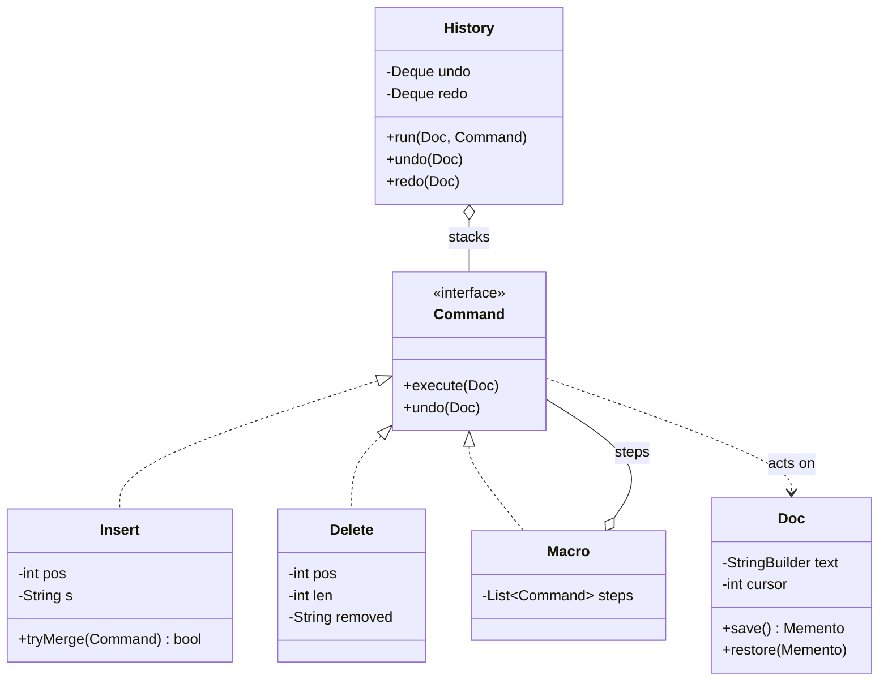
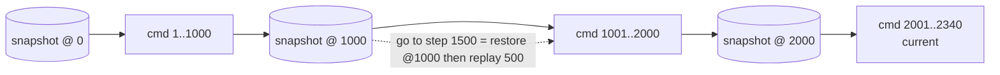

# Command and Memento (undo/redo, macros, snapshots)

## 1. One-line summary

The **Command** pattern turns every user action into an object with `execute()` and `undo()`, so actions can be stored in a history, undone, redone, queued and grouped into macros; the **Memento** pattern takes an opaque **snapshot** of an object's state that can be restored later without exposing the object's internals. For undo you choose between them, or combine them: **inverse operations** (Command) are tiny but each must be written correctly, **snapshots** (Memento) are trivially correct but expensive, and real systems keep **periodic snapshots plus a log of commands**.

💡 **Pattern** = a named, reusable shape of code for a recurring problem (from the 1994 "Gang of Four" book). See [design patterns](design-patterns.md), which introduces Command briefly as "a request as an object".

> Infra analogy: Command is `kubectl apply` of one manifest diff, Memento is an etcd snapshot. Undo by Command = apply the reverse diff. Undo by Memento = restore the snapshot. Disaster recovery in practice = restore the last snapshot, then replay the changes since, exactly the combination in section 3.5.

---

## 2. The problem it solves

A text editor needs **Ctrl+Z** and **Ctrl+Y**. The naive version scatters undo logic everywhere:

```java
void onKey(char c)       { text.insert(cursor, c); lastAction = "insert"; lastChar = c; }
void onBackspace()       { deleted = text.charAt(cursor - 1); text.deleteCharAt(cursor - 1); lastAction = "delete"; }
void undo()              { if (lastAction.equals("insert")) ... else if (lastAction.equals("delete")) ... }
```

Problems: only one level of undo; every new feature (paste, replace-all, format) adds a branch to `undo()`; redo needs another copy of the same logic; and "replace all 300 matches" should be **one** undo step, not 300.

The other naive version saves a full copy of the document before every change. Correct, but look at the memory:

```
document size            = 1 MB
undo history length      = 10,000 edits
snapshots                = 10,000 × 1 MB = 10,000 MB ≈ 10 GB      ← per open document
commands (pos + few chars + object overhead ≈ 50 B each)
                         = 10,000 × 50 B = 500,000 B ≈ 500 KB
```

Commands are about **20,000× smaller** here (10 GB / 500 KB). That's the core trade-off of this file.

---

## 3. How it works

### 3.1 Command: an action as an object



- The **receiver** (`Doc`) knows how to change text. It knows nothing about undo.
- Each **command** stores exactly what it needs to reverse itself. `Delete` must remember the removed text **when it executes**, because you can't recompute it afterwards.
- The **invoker** (`History`) keeps two stacks. `run` executes and pushes onto undo; `undo` pops, reverses, pushes onto redo; `redo` does the opposite. **Any new command clears the redo stack**: after undoing and typing something new, the old "future" no longer applies (the history is linear, not a tree).

### 3.2 Coalescing and macros

- **Coalescing**: typing `h`,`e`,`l`,`l`,`o` should undo as one word, not five keystrokes. When a new command arrives, ask the top of the undo stack "can you absorb this?" (adjacent insert, same kind, within ~1 s, no word boundary). Editors differ on the exact rule.
- **Macro / composite command**: "replace all", "paste with auto-format", or "rename symbol" is a list of commands that executes in order and **undoes in reverse order**. Reverse order matters: undoing step 1 before step 2 would apply step 2's inverse to the wrong text. This is the **Composite** pattern (💡 a group of objects treated through the same interface as one object).

### 3.3 Memento: a snapshot the outside can't peek into

The object being saved (the **originator**, here `Doc`) creates the memento; whoever stores it (the **caretaker**, e.g. an autosave timer or a "restore version" menu) just holds it and hands it back. The caretaker never reads or changes the fields, so `Doc` can change its internals without breaking callers (encapsulation, 💡 hiding an object's internal fields behind its methods). In Java 21, a nested `record` with only the originator creating and reading it is a compact way to express this.

### 3.4 Runnable example (Java 21, no dependencies)

```java
import java.util.ArrayDeque;
import java.util.ArrayList;
import java.util.Deque;
import java.util.List;

public class UndoDemo {
    // Receiver: the thing commands act on. Its fields stay private.
    static class Doc {
        private final StringBuilder text = new StringBuilder();
        private int cursor = 0;

        void insert(int pos, String s) { text.insert(pos, s); cursor = pos + s.length(); }
        String delete(int pos, int len) {
            String gone = text.substring(pos, pos + len);
            text.delete(pos, pos + len); cursor = pos; return gone;
        }
        // Memento: an opaque snapshot. Only Doc can create or read it.
        record Memento(String text, int cursor) {}
        Memento save() { return new Memento(text.toString(), cursor); }
        void restore(Memento m) { text.setLength(0); text.append(m.text()); cursor = m.cursor(); }
        @Override public String toString() { return "\"" + text + "\" cursor=" + cursor; }
    }

    interface Command { void execute(Doc d); void undo(Doc d); }

    static class Insert implements Command {
        int pos; String s;
        Insert(int pos, String s) { this.pos = pos; this.s = s; }
        public void execute(Doc d) { d.insert(pos, s); }
        public void undo(Doc d) { d.delete(pos, s.length()); }
        // Coalescing: typing "a","b","c" in a row becomes one undo step.
        boolean tryMerge(Command next) {
            if (next instanceof Insert n && n.pos == pos + s.length() && !n.s.contains(" ")) {
                s = s + n.s; return true;
            }
            return false;
        }
    }

    static class Delete implements Command {
        final int pos, len; String removed;           // filled on execute, used by undo
        Delete(int pos, int len) { this.pos = pos; this.len = len; }
        public void execute(Doc d) { removed = d.delete(pos, len); }
        public void undo(Doc d) { d.insert(pos, removed); }
    }

    record Macro(List<Command> steps) implements Command {   // Composite command
        public void execute(Doc d) { steps.forEach(c -> c.execute(d)); }
        public void undo(Doc d) { for (int i = steps.size() - 1; i >= 0; i--) steps.get(i).undo(d); }
    }

    static class History {
        final Deque<Command> undo = new ArrayDeque<>(), redo = new ArrayDeque<>();
        void run(Doc d, Command c) {
            c.execute(d);
            redo.clear();                                   // a new edit kills the redo branch
            if (undo.peek() instanceof Insert last && last.tryMerge(c)) return;
            undo.push(c);
        }
        void undo(Doc d) { if (!undo.isEmpty()) { Command c = undo.pop(); c.undo(d); redo.push(c); } }
        void redo(Doc d) { if (!redo.isEmpty()) { Command c = redo.pop(); c.execute(d); undo.push(c); } }
    }

    public static void main(String[] args) {
        Doc doc = new Doc();
        History h = new History();
        for (String ch : List.of("h", "e", "l", "l", "o")) h.run(doc, new Insert(doc.cursor, ch));
        System.out.println("typed 5 chars     " + doc + "  undo steps=" + h.undo.size());
        h.run(doc, new Insert(doc.cursor, " "));
        h.run(doc, new Insert(doc.cursor, "world"));
        System.out.println("typed ' world'    " + doc + "  undo steps=" + h.undo.size());
        Doc.Memento snap = doc.save();
        h.run(doc, new Macro(new ArrayList<>(List.of(new Delete(0, 5), new Insert(0, "HELLO")))));
        System.out.println("macro replace     " + doc);
        h.undo(doc);
        System.out.println("undo macro        " + doc);
        h.undo(doc);
        System.out.println("undo ' world'     " + doc);
        h.redo(doc);
        System.out.println("redo              " + doc);
        doc.insert(0, ">> ");                              // pretend a buggy plugin edits directly
        System.out.println("stray edit        " + doc);
        doc.restore(snap);
        System.out.println("restore memento   " + doc);
    }
}
```

Real output of `javac UndoDemo.java && java UndoDemo`:

```
typed 5 chars     "hello" cursor=5  undo steps=1
typed ' world'    "hello world" cursor=11  undo steps=2
macro replace     "HELLO world" cursor=5
undo macro        "hello world" cursor=5
undo ' world'     "hello" cursor=5
redo              "hello world" cursor=11
stray edit        ">> hello world" cursor=3
restore memento   "hello world" cursor=11
```

Things to notice: five keystrokes became **one** undo step (coalescing); `" world"` merged too because the merge rule refuses only a command that *contains* a space, so the space itself started a new step and `world` joined it; the macro undid both its delete and its insert in one Ctrl+Z; and restoring the memento fixed an edit that **bypassed** the command history, something inverse commands can never do. (The demo's memento record is visible to the whole class for brevity; in production, keep its constructor and fields private to the originator.)

### 3.5 Choosing: inverse operations vs snapshots vs both

| | **Command (inverse ops)** | **Memento (snapshots)** | **Snapshot + command log** |
|---|---|---|---|
| Memory per step | tiny (bytes) | whole state (MB) | snapshot every N steps + tiny commands |
| Correctness risk | every `undo()` must be exactly right | trivially correct | replay must be deterministic |
| Undo cost | O(size of one edit) | O(state size) to restore | restore + replay up to N commands |
| Handles side effects outside your object? | only if the command can reverse them | no | no |
| Typical use | editor undo/redo | "restore version", game save, form reset | databases, event sourcing, long histories |

The combination is the same trick databases use: a **checkpoint** (snapshot of data pages) plus a **write-ahead log** of changes since, so recovery = load checkpoint, replay the log tail ([durability, WAL and snapshots](durability-wal-and-snapshots.md), [undo logs and redo logs](undo-logs-and-redo-logs.md)). Stored as the source of truth, the command log *is* [event sourcing](ledgers-and-event-sourcing.md). For an editor: snapshot every 1,000 commands, so jumping back 5,000 steps = restore the nearest snapshot + replay ≤ 1,000 commands instead of undoing 5,000 one by one.



Immutable data structures make snapshots nearly free: a persistent rope or a piece table shares unchanged parts between versions, so a "snapshot" is a pointer ([gap buffers, piece tables and ropes](gap-buffers-piece-tables-and-ropes.md)). Git uses the same idea for version history: each commit is a snapshot that shares unchanged files with the previous one ([Git's object store](../../under-the-hood/git-object-store.md)).

## 4. When to use it

- **Command**: undo/redo, macros and scripting ("record these actions, play them back"), job queues (a command object can be serialized and run later on another thread or machine), transactional "do all or none" sequences.
- **Memento**: save points, "restore this version", rolling back a complex object after a failed multi-step operation, when writing a correct inverse would be harder than copying.
- **Both**: long histories, crash recovery, version history in an editor.

## 5. When NOT to use it

- **Command for a direct, immediate call** on the same thread with no undo, queue or log: `doc.insert(5, "x")` is clearer than `new InsertCommand(doc, 5, "x").execute()`.
- **Memento per keystroke on large state**: the 10 GB arithmetic above.
- **Command undo for actions with external side effects you can't reverse** (an email was sent, a payment was captured): an "undo" there must be a new compensating action, not a pretend reversal (see [sagas](../../HLD/concepts/sagas-and-distributed-transactions.md)).
- **Multi-user documents with a local undo stack of positions**: someone else's edit shifts the positions your stored `Delete(40, 5)` refers to. Collaborative undo must transform commands against others' edits ([OT and CRDTs](../../HLD/concepts/operational-transformation-and-crdts.md)).

## 6. Commonly confused with

| | **Command** | **Memento** | **Strategy** | **Event (event sourcing)** |
|---|---|---|---|---|
| Represents | an action to perform (and reverse) | a frozen state | an interchangeable algorithm | a fact that already happened |
| Tense | "do this" | "it looked like this" | "use this way" | "this happened" |
| Has `undo`? | yes | restore replaces it | no | no, you append a correcting event |
| Example | `Insert(5,"x")` | `Doc.Memento(text, cursor)` | `SpellChecker` impl | `TextInserted{pos:5}` |

## 7. Common mistakes / misuse

1. **`Delete` that doesn't save the removed text** at execute time: undo can't restore it.
2. **Not clearing redo** after a new command: redo then applies to a document it was never made for.
3. **Undoing a macro in forward order**: later steps' positions are wrong.
4. **No coalescing**: Ctrl+Z removes one letter at a time and users hate it.
5. **Snapshots on every edit** with no memory budget; or no cap on history length at all.
6. **Leaky memento**: exposing the originator's mutable internals (returning the live `StringBuilder`), so restoring a "snapshot" restores something that has since changed.
7. **Commands that hold references to UI widgets**: they can't be serialized, queued or replayed.

## 8. Interview cheat-sheet

> "I model every edit as a Command with execute and undo, and a History with an undo stack and a redo stack. Executing pushes to undo and clears redo, undo pops and reverses, redo replays. Each command stores what it needs to reverse itself, for example Delete saves the removed text at execute time. Consecutive typing is coalesced into one command, and multi-step actions like replace-all are a composite macro that undoes in reverse. I'd avoid full snapshots per edit: 10,000 edits on a 1 MB document is 10 GB, versus about 500 KB of commands. Memento is for save points or restoring a version: an opaque snapshot only the document can create and read. For long histories I combine them, a snapshot every thousand commands plus the command log, which is the same checkpoint-plus-WAL idea databases use."

## 9. Used in

- [Text editor](../interviews/text-editor/README.md): **undo/redo** with command objects and two stacks, coalescing keystrokes, macros for replace-all, mementos for "restore version", and periodic snapshots plus a command log for long histories.
- [Chess](../interviews/chess/README.md): moves as Commands that return a Memento of captured piece, castling rights and en-passant square, so undo restores the exact position.
- Related: [design patterns](design-patterns.md), [undo logs and redo logs](undo-logs-and-redo-logs.md), [ledgers and event sourcing](ledgers-and-event-sourcing.md), [durability, WAL and snapshots](durability-wal-and-snapshots.md), [gap buffers, piece tables and ropes](gap-buffers-piece-tables-and-ropes.md), [Git's object store](../../under-the-hood/git-object-store.md).
