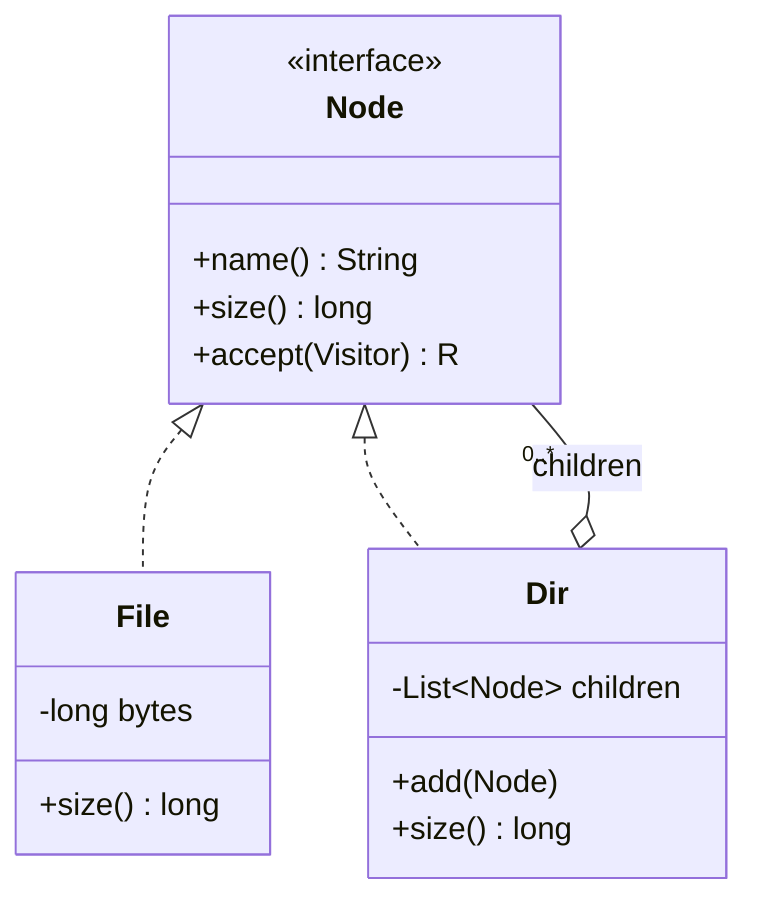

# Composite Pattern and Trees (File/Directory, traversal, Visitor)

## 1. One-line summary

The **Composite** pattern lets you treat a single thing (a **leaf**, like a `File`) and a group of things (a **container**, like a `Directory`) through **one common type** (`Node`), so callers write `node.size()` without asking "is this a file or a folder?"; the container answers by asking its children, which makes most operations **recursive tree traversals**, and the Visitor pattern or Java 21's pattern-matching `switch` lets you add new operations over the tree without editing every class.

💡 **Tree** = data where each item (a **node**) has at most one parent and any number of children, with one **root** at the top. **Leaf** = a node with no children. **Pattern** = a named, reusable code shape from the 1994 "Gang of Four" book (see [design patterns](design-patterns.md)).

> Infra analogy: `du -sh /var` doesn't care whether `/var/log` is a file or a directory; it asks for "size" and directories sum their contents. Kubernetes does the same with ownership: delete a Deployment and the garbage collector walks its owned ReplicaSets and their Pods (section 3.5).

---

## 2. The problem it solves

Without a common type, every operation on a file system tree is full of type checks:

```java
long size(Object o) {
    if (o instanceof MyFile f) return f.getBytes();
    if (o instanceof MyDir d) {
        long total = 0;
        for (Object child : d.getFiles()) total += size(child);
        for (Object child : d.getSubdirs()) total += size(child);   // two lists, two loops
        return total;
    }
    throw new IllegalArgumentException("unknown node " + o);
}
```

Every new operation (count files, find by name, delete, permission check, render) repeats the same branching. Adding a new node kind (`Symlink`) means hunting down every `if` chain. Two separate child lists (files vs subdirectories) also make simple things awkward: the order of entries is lost, and "move this item" needs to know which list it's in.

**The fix:** one interface, `Node`, with `File` and `Dir` implementing it, and `Dir` holding a single `List<Node>`. Clients call `node.size()`; the right implementation runs (polymorphism, 💡 the same method call doing different things depending on the object's actual class).

---

## 3. How it works

### 3.1 The shape



The key line is `Dir o-- Node`: a directory contains **Nodes**, not Files, so it can contain other directories. That one self-reference is what makes the structure recursive. (Diagram notation is explained in [UML class diagrams](uml-class-diagrams.md).)

**Where does `add()` live?** The original book discusses two options. *Transparency*: put `add()` on `Node`, so all nodes look the same, but `File.add()` must throw. *Safety*: put `add()` only on `Dir`, so the compiler stops you adding a child to a file, at the cost of an `instanceof` when you hold a `Node`. In Java interviews, prefer **safety**: an operation that throws for half the implementations breaks the substitution rule ([SOLID: Liskov](solid-principles.md)).

### 3.2 Runnable example (Java 21, no dependencies)

```java
import java.util.ArrayDeque;
import java.util.ArrayList;
import java.util.Deque;
import java.util.List;

public class TreeDemo {
    // Composite: File (leaf) and Dir (container) share one type, Node.
    sealed interface Node permits File, Dir {
        String name();
        long size();                                    // same call for leaf and container
        <R> R accept(Visitor<R> v);                     // Visitor hook (double dispatch)
    }
    record File(String name, long bytes) implements Node {
        public long size() { return bytes; }
        public <R> R accept(Visitor<R> v) { return v.visitFile(this); }
    }
    record Dir(String name, List<Node> children) implements Node {
        Dir(String name) { this(name, new ArrayList<>()); }
        Dir add(Node n) { children.add(n); return this; }
        public long size() {                            // recursive: sum of children
            long total = 0;
            for (Node c : children) total += c.size();
            return total;
        }
        public <R> R accept(Visitor<R> v) { return v.visitDir(this); }
    }

    // Iterative DFS with an explicit stack: depth limited by heap, not by thread stack.
    static long sizeIterative(Node root) {
        long total = 0;
        Deque<Node> stack = new ArrayDeque<>();
        stack.push(root);
        while (!stack.isEmpty()) {
            switch (stack.pop()) {                      // Java 21 pattern-matching switch
                case File f -> total += f.bytes();
                case Dir d -> d.children().forEach(stack::push);
            }
        }
        return total;
    }

    // BFS with a queue: prints level by level, like `tree -L`.
    static void printByLevel(Node root) {
        Deque<Node> queue = new ArrayDeque<>(List.of(root));
        int level = 0;
        while (!queue.isEmpty()) {
            List<String> names = new ArrayList<>();
            for (int i = queue.size(); i > 0; i--) {
                Node n = queue.poll();
                names.add(n.name());
                if (n instanceof Dir d) queue.addAll(d.children());
            }
            System.out.println("  level " + level++ + ": " + names);
        }
    }

    // Visitor: add an operation without touching File/Dir (old-school alternative to the switch).
    interface Visitor<R> { R visitFile(File f); R visitDir(Dir d); }
    static final Visitor<Integer> COUNT_FILES = new Visitor<>() {
        public Integer visitFile(File f) { return 1; }
        public Integer visitDir(Dir d) { return d.children().stream().mapToInt(c -> c.accept(this)).sum(); }
    };

    public static void main(String[] args) {
        Dir root = new Dir("/")
            .add(new Dir("docs").add(new File("cv.pdf", 120_000)).add(new File("notes.txt", 2_000)))
            .add(new Dir("photos").add(new Dir("2026").add(new File("beach.jpg", 3_500_000))))
            .add(new File("todo.md", 500));

        System.out.println("recursive size()  = " + root.size());
        System.out.println("iterative size    = " + sizeIterative(root));
        System.out.println("files (visitor)   = " + root.accept(COUNT_FILES));
        System.out.println("BFS:");
        printByLevel(root);

        // A pathologically deep tree: /a/a/a/... 100,000 levels.
        Dir deep = new Dir("a"), cur = deep;
        for (int i = 0; i < 100_000; i++) { Dir next = new Dir("a"); cur.add(next); cur = next; }
        cur.add(new File("bottom.txt", 42));
        System.out.println("deep iterative    = " + sizeIterative(deep));
        try {
            System.out.println("deep recursive    = " + deep.size());
        } catch (StackOverflowError e) {
            System.out.println("deep recursive    = StackOverflowError");
        }
    }
}
```

Real output of `javac TreeDemo.java && java TreeDemo` (OpenJDK 21):

```
recursive size()  = 3622500
iterative size    = 3622500
files (visitor)   = 4
BFS:
  level 0: [/]
  level 1: [docs, photos, todo.md]
  level 2: [cv.pdf, notes.txt, 2026]
  level 3: [beach.jpg]
deep iterative    = 42
deep recursive    = StackOverflowError
```

Check the sum: 120,000 + 2,000 + 3,500,000 + 500 = 3,622,500 bytes. The `sealed` and `record` features are explained in [sealed interfaces and pattern matching](../libraries/java/sealed-interfaces-and-pattern-matching.md) and [records](../libraries/java/records-and-immutability.md).

### 3.3 Traversal: DFS, BFS, and the stack problem

- **DFS (depth-first search)**: go all the way down one branch before the next. Two orders matter:
  - **pre-order** (visit the parent, then children): `mkdir -p` while copying a tree, printing an indented listing.
  - **post-order** (children first, then the parent): `du` (a directory's size needs its children's sizes first) and `rm -r` (a directory can only be removed once it's empty).
- **BFS (breadth-first search)**: visit level by level using a queue: "show the top two levels", or "find the shallowest match first".

Both are O(n) time for n nodes ([Big-O](big-o-complexity.md)). The difference is memory: DFS holds about one path (depth) worth of pending work, BFS holds one whole level (width).

**Recursion vs an explicit stack.** A recursive `size()` uses the **thread's call stack** (💡 the memory where each method call stores its local variables and return address; one "frame" per active call). Java's default thread stack on 64-bit Linux is 1 MB (`-Xss1m`), which allowed about 21,600 frames of a trivial recursive method in a quick test here; real methods with more locals get fewer. Normal file systems are a few dozen levels deep, but untrusted input (a zip bomb with nested folders, a generated directory chain, a deeply nested JSON document) can be arbitrarily deep, and `StackOverflowError` kills the request. An **explicit stack** (`ArrayDeque`) moves that state to the heap, which is gigabytes. The demo shows it: same tree, iterative works, recursive dies.

**Cycles.** A real file system is not always a tree: symlinks (💡 a file that points to another path) and some mount setups can point back up to an ancestor. Following them blindly loops forever. Track visited directories by a unique identity (inode + device on Unix). The JDK's `Files.walkFileTree` with `FOLLOW_LINKS` does this and reports a `FileSystemLoopException`.

### 3.4 Adding operations: Visitor vs pattern-matching `switch`

Adding a method to `Node` for every new operation (`size`, `count`, `findByName`, `toJson`, `checkPermissions`) bloats the node classes. Two ways to keep operations outside:

- **Visitor** (Gang of Four): each node has `accept(visitor)` that calls back `visitor.visitFile(this)` or `visitor.visitDir(this)`. This is **double dispatch** (💡 the method that runs depends on two runtime types: the node's and the visitor's). Each new operation is one new Visitor class. The JDK's own `java.nio.file.FileVisitor` (with `preVisitDirectory`, `visitFile`, `postVisitDirectory`) is a close cousin.
- **Sealed interface + pattern-matching `switch`** (Java 21): `switch (node) { case File f -> ...; case Dir d -> ... }`. Because `Node` is `sealed` (only `File` and `Dir` may implement it), the compiler checks the switch covers every case, just as the Visitor interface forces every `visitX` method. Far less boilerplate.

| | Add a new **operation** | Add a new **node type** | Boilerplate |
|---|---|---|---|
| Method on each node class | edit every class | one new class | low |
| Visitor | one new visitor class | edit every visitor | high (`accept` everywhere) |
| Sealed + `switch` | one new method with a switch | compiler flags every switch to update | low |

This trade-off is known as the **expression problem**. For a closed set of node types (file system, AST) with many operations, use the sealed `switch`; keep Visitor for codebases on older Java or frameworks built around it.

### 3.5 Trees everywhere (beyond file systems)

| Domain | Leaf | Container | Recursive operation |
|---|---|---|---|
| UI components (Swing, the browser DOM) | `JButton`, text node | `JPanel` (`java.awt.Container` extends `Component`), `<div>` | layout, paint, event bubbling |
| Org chart | individual contributor | manager | headcount, total salary cost |
| AST (💡 **abstract syntax tree**: code parsed into a tree, e.g. `1 + 2 * 3`) | number literal | `+`, `*` operator nodes | evaluate, type-check, pretty-print |
| Kubernetes ownership | Pod | Deployment → ReplicaSet → Pods via `ownerReferences` | cascading delete by the garbage collector |
| JSON (Jackson's `JsonNode`) | `TextNode`, `IntNode` | `ObjectNode`, `ArrayNode` | serialize, find a path |
| Bill of materials | screw | sub-assembly | total cost, total weight |
| Permissions on folders | file | folder whose sharing is inherited | effective access ([access control models](access-control-models.md)) |

---

## 4. When to use it

- **Part-whole hierarchies** where clients should treat one item and a group the same: files/folders, UI widgets, menus with submenus, shapes in a drawing, composite commands (a macro is a Command made of Commands, see [Command and Memento](command-and-memento.md)).
- When operations are naturally **"combine my children's answers"**: sizes, counts, rendering, validation.

## 5. When NOT to use it

- **Flat data**: a list of files with a `path` string is simpler if you never walk the hierarchy (e.g. object storage keys).
- **Graphs, not trees**: a node with several parents (a hard link, a team in two departments, a shared Google Drive file in many folders) breaks "sum the children" logic (double counting). Model it as a graph with explicit dedup.
- **Leaf and container really behave differently** for most operations: forcing a common interface produces methods that throw `UnsupportedOperationException`.
- **Very hot recursive aggregates on huge trees**: recomputing `size()` of `/` over millions of files per call is O(n). Cache sizes in each directory and update ancestors on change (O(depth) per write).

## 6. Commonly confused with

| | **Composite** | **Decorator** | **Visitor** | **Chain of Responsibility** |
|---|---|---|---|---|
| Structure | tree: one container, many children | chain: one wrapper, one wrapped | separate object walking a structure | chain of handlers |
| Purpose | treat part and whole the same | add behaviour to one object | add operations without editing classes | pass a request until someone handles it |
| Calls go to | all children | the single wrapped object | `visitX` per node type | next handler, maybe stops |
| Example | `Dir.size()` sums children | `BufferedInputStream(FileInputStream)` | `FileVisitor` | servlet filters |

## 7. Common mistakes / misuse

1. **Two child lists** (`files`, `subdirs`) instead of one `List<Node>`: every operation needs two loops and ordering is lost.
2. **Recursion on untrusted depth** without a limit or explicit stack: `StackOverflowError` in production.
3. **Not handling cycles** when following symlinks or links: infinite loop.
4. **Exposing the mutable children list** so callers can add children while bypassing validation (name uniqueness, parent pointers). Return an unmodifiable view.
5. **Forgetting the parent pointer** when moving a node: the child is now in two places, or `path()` computes the old path. Moving = remove from old parent, set parent, add to new parent, as one operation.
6. **Records with deep trees**: `record` generates `equals`, `hashCode` and `toString` that recurse into children, so printing a 100,000-deep `Dir` also overflows the stack.
7. **`add()` on the leaf that throws**: prefer the safe design (3.1).
8. **Stale cached sizes**: caching `size` in a directory but forgetting to update all ancestors on write.

## 8. Interview cheat-sheet

> "I model the file system with the Composite pattern: a sealed `Node` interface with `File` as the leaf and `Directory` as the container, which holds a single `List<Node>`, so a directory can hold directories. Operations like `size()` are polymorphic: a file returns its bytes, a directory sums its children, so callers never check types. Traversal is DFS; post-order for size and delete, pre-order for copy. Since depth can be untrusted, I'd use an explicit stack instead of recursion to avoid StackOverflowError, and a visited set if links can create cycles. For new operations I'd use a Java 21 pattern-matching switch over the sealed interface, which the compiler checks for exhaustiveness, instead of a classic Visitor. If `size()` on the root is hot, I cache sizes per directory and update ancestors on each write."

## 9. Used in

- [File system (LLD)](../interviews/file-system/README.md): `File`/`Directory` as a Composite, recursive `size`, `ls`/`find` traversals, path resolution, move/rename with parent pointers.
- Related: [design patterns](design-patterns.md), [Command and Memento](command-and-memento.md) (macro commands are Composites), [sealed interfaces and pattern matching](../libraries/java/sealed-interfaces-and-pattern-matching.md), [Big-O](big-o-complexity.md), [OOP modeling](oop-modeling.md), [access control models](access-control-models.md), [B-trees](../../under-the-hood/b-tree.md) (a tree built for disks), [Git's object store](../../under-the-hood/git-object-store.md) (a directory tree stored as hashes).
