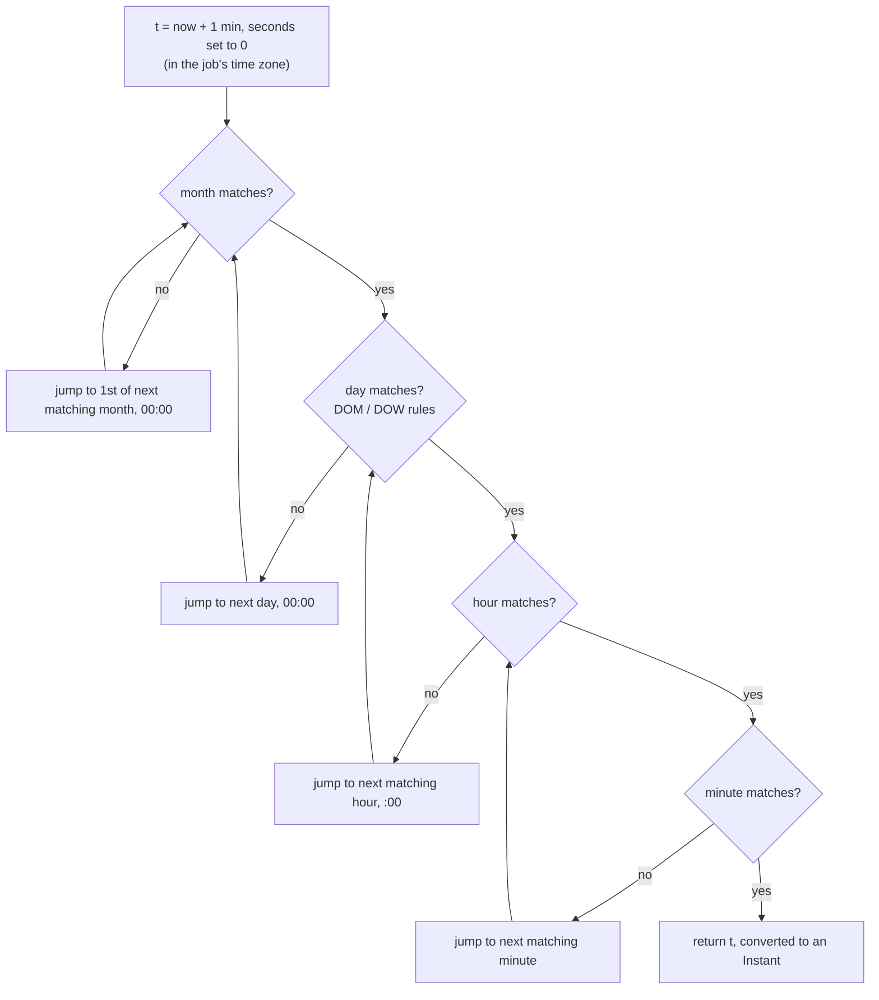

# Cron and Recurring Schedules

## 1. One-line summary

A **recurring schedule** says when a job should run again and again ("every 10 minutes", "weekdays at 09:00 IST"); **cron expressions** are the standard compact way to write calendar-based schedules, and the hard parts are not the syntax but **computing the next fire time**, **time zones and DST**, **runs missed during downtime**, **overlapping runs**, and **everyone firing at midnight**.

💡 **cron** is the Unix daemon (a background service) that runs commands on a schedule; a **crontab** is its config file of `schedule command` lines. **DST** (daylight saving time) is when a region moves its clocks forward one hour in spring and back in autumn.

---

## 2. The problem it solves

**The pain:** "send the daily report at 9 AM", "rotate logs every hour", "retry failed payouts every 15 minutes on weekdays". Hand-coding each as "sleep 24 hours, then run" breaks quickly: the 24 h drifts after every restart, 9 AM in New York is not 24 h after 9 AM yesterday twice a year, and a pod that was down at 9 AM never sends the report.

**The fix:** describe the schedule **declaratively** (a cron expression + a time zone), and have the scheduler compute "next fire time after now" from it, every time, with explicit rules for misfires and overlaps.

> Infra analogy: you've written k8s `CronJob`s and Jenkins `triggers { cron('H 2 * * *') }`. Prometheus scrape intervals are fixed-rate schedules; a log-rotation cron on every node is a calendar schedule.

---

## 3. How it works

### 3.1 Cron syntax (5 fields)

```
┌───────────── minute        0-59
│ ┌─────────── hour          0-23
│ │ ┌───────── day of month  1-31
│ │ │ ┌─────── month         1-12 (or JAN-DEC)
│ │ │ │ ┌───── day of week   0-7  (0 and 7 = Sunday, or SUN-SAT)
│ │ │ │ │
* * * * *  command
```

| Syntax | Meaning | Example | Reads as |
|---|---|---|---|
| `*` | every value | `* * * * *` | every minute |
| `a,b,c` | list | `0 9,13,18 * * *` | 09:00, 13:00, 18:00 |
| `a-b` | range | `0 9 * * 1-5` | 09:00 Monday to Friday |
| `*/n` | step | `*/15 * * * *` | minutes 0, 15, 30, 45 |
| `a-b/n` | stepped range | `0 8-18/2 * * *` | 08:00, 10:00, ... 18:00 |
| macros | shorthand | `@hourly`, `@daily`, `@weekly`, `@reboot` | `0 * * * *`, `0 0 * * *`, ... |

**Try it yourself:** paste any expression into [crontab.guru](https://crontab.guru), which explains it in English and shows the next run times.

**The day-of-month OR day-of-week quirk (Vixie cron, the cron on most Linux systems).** If **both** day fields are restricted (neither is `*`), a day matches if **either** matches:

```
0 9 1 * MON    →  09:00 on the 1st of every month AND 09:00 every Monday
                  (not "the 1st, only if it is a Monday")
```

Most people expect AND. If you need "first Monday of the month", use `0 9 1-7 * *` and check the weekday inside the job, or a scheduler with richer syntax.

**Quartz and Spring use 6 to 7 fields.** [Quartz](https://www.quartz-scheduler.org/) (the classic Java scheduler library) has `seconds minutes hours day-of-month month day-of-week [year]`, requires `?` ("no specific value") in one of the two day fields to avoid the OR ambiguity, numbers days of week 1-7 starting at **Sunday = 1**, and adds `L` (last), `W` (nearest weekday) and `#` (`MON#1` = first Monday). Spring's `@Scheduled(cron = ...)` uses 6 fields starting with seconds. So `0 0 9 * * MON-FRI` in Spring is 09:00 on weekdays, but in Unix cron the same string is invalid (6 fields). Always check which dialect a tool speaks.

### 3.2 Fixed rate vs fixed delay vs cron

| | **Fixed rate** | **Fixed delay** | **Cron (calendar)** |
|---|---|---|---|
| Next run | `start + n × period` | previous **end** + delay | next calendar time matching the expression |
| Example | metrics flush every 10 s | sweep expired holds, 1 min after the last sweep finished | 09:00 IST on weekdays |
| Slow run | later runs bunch up to catch up | gap stays constant | next matching time (maybe skipped if still running) |
| Knows calendars / time zones | no | no | yes |
| Java | `scheduleAtFixedRate` | `scheduleWithFixedDelay` | Spring `@Scheduled(cron)`, Quartz `CronTrigger` |

Fixed rate and fixed delay are just durations on the monotonic clock ([ScheduledExecutorService](../libraries/java/scheduled-executor-service.md), [timers and delay queues](timers-delay-queues-and-timing-wheels.md)). Cron needs the **wall clock and a time zone** ([java.time API](../libraries/java/java-time-api.md)).

### 3.3 Computing the next fire time

The scheduler only ever asks one question: **"given this expression, zone and time `t`, what is the first matching time after `t`?"** It then stores that as the job's `next_run_at` and puts it in the delay queue.



Jump field by field (largest first), resetting smaller fields when a larger one moves, instead of testing every minute. Brute force works but can be slow for rare schedules: `0 0 29 2 *` (Feb 29) checked from March 2025 needs up to `4 × 365.25 × 1,440 = 2,103,840` minute checks to reach 2028-02-29. And some expressions **never** match (`0 0 30 2 *`, February 30): cap the search (e.g. at 5 years) and reject such expressions when the job is created.

### 3.4 Time zones and DST

A schedule "09:00 daily" is meaningless without a zone. Store the **IANA zone ID** with the job (`Asia/Kolkata`, `America/New_York`), not a fixed offset like `+05:30`, because offsets change with DST and with laws. Compute in local time, then convert to an `Instant` (UTC) for the delay queue.

**India has no DST** (IST is UTC+5:30 all year), so `Asia/Kolkata` schedules never hit these problems; US and EU zones do, twice a year. America/New_York in 2025:

| Date | What happens | A job at `30 2 * * *` (02:30) | A job at `30 1 * * *` (01:30) |
|---|---|---|---|
| **2025-03-09** (spring forward) | 02:00 EST jumps to 03:00 EDT, so **02:00 to 02:59 doesn't exist** | no 02:30 that day: skipped, or run at 03:30? | normal |
| **2025-11-02** (fall back) | 02:00 EDT goes back to 01:00 EST, so **01:00 to 01:59 happens twice** | normal | 01:30 happens twice: run once or twice? |

What Java does if you build the local time naively (output of a real run):

```java
import java.time.*;

public class Dst {
    public static void main(String[] args) {
        ZoneId ny = ZoneId.of("America/New_York");
        ZonedDateTime spring = ZonedDateTime.of(LocalDate.of(2025, 3, 9), LocalTime.of(2, 30), ny);
        ZonedDateTime fall = ZonedDateTime.of(LocalDate.of(2025, 11, 2), LocalTime.of(1, 30), ny);
        System.out.println("02:30 on 2025-03-09 -> " + spring);
        System.out.println("01:30 on 2025-11-02 -> " + fall);
        System.out.println("              later -> " + fall.withLaterOffsetAtOverlap());
        System.out.println("in UTC: " + fall.toInstant() + " and " + fall.withLaterOffsetAtOverlap().toInstant());
    }
}
// 02:30 on 2025-03-09 -> 2025-03-09T03:30-04:00[America/New_York]   (gap: shifted forward 1 h)
// 01:30 on 2025-11-02 -> 2025-11-02T01:30-04:00[America/New_York]   (overlap: earlier offset chosen)
//               later -> 2025-11-02T01:30-05:00[America/New_York]
// in UTC: 2025-11-02T05:30:00Z and 2025-11-02T06:30:00Z              (two real instants, 1 h apart)
```

So `java.time` already picks a default (gap → shift forward by the gap length, so 03:30; overlap → first occurrence). Some schedulers instead fire a skipped job once **as soon as the gap ends** (03:00); the [Task Scheduler](../interviews/task-scheduler/README.md) code does that. Either is fine if it's documented. Your scheduler must make sure it fires **once** in the overlap and doesn't then compute "next 01:30" as the second one an hour later. Classic Vixie cron's man page describes similar special handling for clock changes of less than 3 hours: fixed-time jobs in a skipped interval run right after the jump, and jobs in a repeated interval are not run twice. Simplest policy of all: **run system jobs in UTC**, and use local zones only for user-facing schedules.

### 3.5 Misfires: what if the scheduler was down?

The scheduler was down from 08:50 to 11:10. The hourly job missed 09:00, 10:00 and 11:00. Options:

| Policy | Runs on restart | Good for | Quartz name |
|---|---|---|---|
| **Catch up all** | 3 runs, back to back | each run processes its own time window (hourly billing for hour X) | `MISFIRE_INSTRUCTION_IGNORE_MISFIRE_POLICY` |
| **Fire once now** | 1 run | "bring things up to date" jobs (sync, cleanup) | `MISFIRE_INSTRUCTION_FIRE_ONCE_NOW` (the cron default) |
| **Skip** | 0 now, next at 12:00 | stale runs are useless ("send 9 AM digest" at 11:10) | `MISFIRE_INSTRUCTION_DO_NOTHING` |

Quartz treats a trigger as misfired only if it is late by more than `misfireThreshold` (default 60 s). Catch-up is safe only if each run is **idempotent** and knows which window it covers ([idempotency](../../HLD/concepts/idempotency-and-delivery-semantics.md)).

### 3.6 Overlap: the previous run is still going

A job scheduled every 5 minutes sometimes takes 7. Without a rule, two copies run at once and fight over the same rows. Kubernetes `CronJob` makes the choice explicit:

```yaml
spec:
  schedule: "*/5 * * * *"
  timeZone: "Asia/Kolkata"
  concurrencyPolicy: Forbid        # Allow (default) | Forbid | Replace
  startingDeadlineSeconds: 120     # if we couldn't start within 2 min of the slot, skip it
```

- **Allow**: start the new run anyway; runs may overlap.
- **Forbid**: skip the new run while the old one is active.
- **Replace**: kill the old run, start the new one.
- **startingDeadlineSeconds**: a missed slot older than this is skipped instead of started late (the "skip" misfire policy). The k8s docs also warn a CronJob creates a Job only **approximately** once per slot: occasionally twice or not at all, so jobs should be idempotent.

In-process, `scheduleWithFixedDelay` can't overlap with itself. Across many pods of one service, every pod's `@Scheduled` fires: use a **lock or lease** so only one runs it (ShedLock for Spring, or a leader-elected worker; see [distributed locks and leases](../../HLD/concepts/distributed-locks-and-leases.md)).

### 3.7 Jitter: don't make everyone run at 00:00

`0 0 * * *` is the most popular schedule in the world. 10,000 customers' backup jobs all hitting your API at midnight:

```
no jitter:       10,000 requests in the first second of 00:00
30-min jitter:   10,000 / (30 × 60 s) = 10,000 / 1,800 ≈ 5.6 requests/s
```

This is the **thundering herd**: many clients waking at the same moment and stampeding a shared resource. Fixes:

- **Random delay** per run: systemd timers' `RandomizedDelaySec=`, or `sleep $((RANDOM % 1800))` at the start of a script.
- **Stable hash-based offset** per job: Jenkins' `H` syntax (`H 2 * * *` picks a fixed minute in the 02:00 hour from a hash of the job name), so each job is spread out but still predictable.
- For user-facing schedules, offer "around 9 AM" instead of exactly 09:00:00 when the business allows it. Same idea as jittered retries ([retries, backoff and DLQ](../../HLD/concepts/retries-backoff-and-dlq.md)).

---

## 4. When to use it

- **Calendar-based business jobs**: daily reports, monthly invoices, "weekdays at 09:00 in the user's zone".
- **Ops jobs**: backups, log rotation, certificate renewal checks, cache warmers.
- **A task scheduler product** where users enter recurring schedules: store the expression + zone, compute `next_run_at` after each run.

## 5. When NOT to use it (and why it's a mistake)

| Situation | Why |
|---|---|
| "Every 10 s" heartbeats or metric flushes | Cron's resolution is 1 minute (Unix) and it's calendar-based. Use fixed rate. |
| Reacting to events ("when a file lands") | Polling on a cron adds latency and wasted runs. Use an event or queue trigger. |
| Per-user delays ("remind me in 2 hours") | That's a one-shot delay, not a recurrence: a [delay queue](timers-delay-queues-and-timing-wheels.md) entry. |
| Long jobs with tight intervals and no overlap policy | Runs pile up or collide. Use fixed delay, or `Forbid`. |

---

## 6. Commonly confused with

| | **Unix (Vixie) cron** | **Quartz cron** | **Spring `@Scheduled(cron)`** | **k8s CronJob** |
|---|---|---|---|---|
| Fields | 5 (min to DOW) | 6 to 7 (sec ... DOW [year]) | 6 (sec ... DOW) | 5 |
| Seconds | no | yes | yes | no |
| DOM + DOW both set | OR | must use `?` in one | both must match (AND) in Spring 5.3+ `CronExpression`; check your version | OR (Unix style) |
| Time zone | system zone (or `CRON_TZ` in some crons) | per trigger | `zone` attribute | `timeZone` field, else controller-manager's zone |
| Misfire / overlap | none / none | misfire instructions / `@DisallowConcurrentExecution` | none built in | `startingDeadlineSeconds` / `concurrencyPolicy` |

---

## 7. Common mistakes / misuse

1. **Assuming AND for day-of-month + day-of-week** in Unix cron.
2. **Mixing dialects**: pasting a 6-field Quartz/Spring expression into crontab, or Sunday = 0 vs 1.
3. **Storing offsets instead of zone IDs**, or computing in server-local time while users think in theirs.
4. **Ignoring DST**: the 02:30 job silently skipped in March, the 01:30 job running twice in November.
5. **No misfire policy**: after an outage, 300 catch-up runs fire at once, or a critical run is silently lost.
6. **Every replica runs the job**: three pods, three invoices. Use a lease or leader.
7. **Everything at `0 0 * * *`**: a self-inflicted midnight spike. Add jitter.
8. **Computing "next" from the planned time, not the actual time** after a long outage, which causes a burst of immediate catch-up fires you didn't want.

---

## 8. Interview cheat-sheet

> "Each recurring job stores a cron expression plus an IANA time zone, and after every run I compute next_run_at by jumping field by field from now in that zone, then convert to UTC for the delay queue. Unix cron has 5 fields and ORs day-of-month with day-of-week when both are set; Quartz and Spring add seconds, so I'd validate one dialect. DST needs explicit rules: in New York on 9 March 2025 02:30 doesn't exist, so I run it once as soon as the gap ends (03:00), and on 2 November 01:30 happens twice, so I run only the first. After downtime the misfire policy is per job: catch up all for windowed jobs, fire once for sync jobs, skip for stale notifications, and runs are idempotent. Overlap is Forbid by default, only one replica runs via a lease, and I add jitter so thousands of midnight jobs don't stampede."

---

## 9. Used in

- [LLD: Task Scheduler](../interviews/task-scheduler/README.md): **recurring jobs**: parsing cron expressions, computing the next fire time in the job's time zone, misfire and overlap policies, jitter.
- [Distributed job scheduler (HLD)](../../HLD/interviews/distributed-job-scheduler/README.md): the same cron + DST rules for 50M schedules.
- Related: [timers, delay queues and timing wheels](timers-delay-queues-and-timing-wheels.md) (running each computed time), [java.time API](../libraries/java/java-time-api.md), [time and clock](../libraries/java/time-and-clock.md), [ScheduledExecutorService](../libraries/java/scheduled-executor-service.md), [distributed locks and leases](../../HLD/concepts/distributed-locks-and-leases.md).
