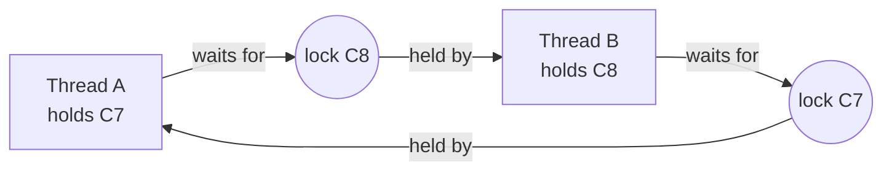

# Deadlocks and Lock Ordering

## 1. One-line summary

A **deadlock** is when two (or more) threads each hold a lock the other one needs, so all of them wait forever; the standard cure is to make every thread take locks in the **same global order**.

## 2. The problem it solves

You move from "one lock per show" to "one lock per seat" so that two users booking different seats don't wait for each other. Then:

- Alice books **C7 + C8**: her thread locks C7, then tries C8.
- Bob books **C8 + C7** (he tapped them in the other order): his thread locks C8, then tries C7.

Alice waits for Bob's C8, Bob waits for Alice's C7. Neither will ever let go. No exception, no log line, CPU at 0%: the two request threads just hang, then the thread pool slowly fills with more stuck requests. On-call sees request latency climb and health checks time out, like two pods each waiting for the other to become ready before starting.

Fine-grained locking buys throughput, but it brings deadlock risk with it.

## 3. How it works



A cycle in the "waits for" graph is a deadlock.

### The four Coffman conditions (all four must hold)

| Condition | Plain words | Break it by... |
|---|---|---|
| **Mutual exclusion** | only one thread can hold the resource | lock-free / CAS designs (nobody holds anything) |
| **Hold and wait** | a thread keeps what it has while waiting for more | take all locks at once, or release everything when one fails (`tryLock`) |
| **No preemption** | nobody can take a lock away from its holder | timeouts; the database aborting a victim transaction |
| **Circular wait** | A waits for B, B waits for A | **a global lock order**: always lock in sorted order |

Break any one and deadlock is impossible. Lock ordering (breaking circular wait) is the cheapest and most common.

### Code that can deadlock

```java
import java.util.concurrent.locks.ReentrantLock;

final class Seat {
    final String id;
    final ReentrantLock lock = new ReentrantLock();
    boolean booked;
    Seat(String id) { this.id = id; }
}

final class NaiveBooker {
    // BROKEN: lock order depends on the order the user tapped the seats
    static boolean bookPair(Seat first, Seat second) {
        first.lock.lock();
        try {
            second.lock.lock();                 // A holds C7 wants C8; B holds C8 wants C7
            try {
                if (first.booked || second.booked) return false;
                first.booked = true;
                second.booked = true;
                return true;
            } finally { second.lock.unlock(); }
        } finally { first.lock.unlock(); }
    }
}
```

Run `bookPair(c7, c8)` and `bookPair(c8, c7)` in two threads in a loop and it will hang within seconds.

### The fix: sort, then lock

```java
import java.util.Comparator;
import java.util.List;

final class OrderedBooker {
    static boolean bookAll(List<Seat> requested) {
        List<Seat> seats = requested.stream()
                .sorted(Comparator.comparing(s -> s.id))   // the global order: seat id
                .distinct()
                .toList();
        int locked = 0;
        try {
            for (Seat s : seats) { s.lock.lock(); locked++; }
            if (seats.stream().anyMatch(s -> s.booked)) return false;  // all-or-nothing
            seats.forEach(s -> s.booked = true);
            return true;
        } finally {
            for (int i = locked - 1; i >= 0; i--) seats.get(i).lock.unlock();
        }
    }
}
```

Both Alice and Bob now lock C7 first. Whoever gets C7 also gets C8; the other waits for C7 and holds nothing meanwhile, so no cycle can form. The same trick is used for bank transfers: always lock the account with the smaller id first.

The order just needs to be **total** (any two locks compare) and **the same everywhere** in the codebase. Seat id, account id, or `System.identityHashCode` with a tie-breaker lock all work.

### Escape hatch: `tryLock` with a timeout

`ReentrantLock.tryLock(timeout)` gives up instead of waiting forever (breaks "hold and wait"):

```java
static boolean tryBookPair(Seat a, Seat b) throws InterruptedException {
    if (!a.lock.tryLock(50, java.util.concurrent.TimeUnit.MILLISECONDS)) return false;
    try {
        if (!b.lock.tryLock(50, java.util.concurrent.TimeUnit.MILLISECONDS)) return false; // back off, release a
        try {
            if (a.booked || b.booked) return false;
            a.booked = b.booked = true;
            return true;
        } finally { b.lock.unlock(); }
    } finally { a.lock.unlock(); }
}
```

Useful when you can't control the order (locks owned by different libraries). The cost: callers must handle "couldn't get it, try again", and see livelock below.

### Detecting a deadlock in a running JVM

Take a **thread dump** (a snapshot of every thread's stack and the locks it holds/waits for): `jstack <pid>`, `jcmd <pid> Thread.print`, or `kill -3 <pid>` (prints to stdout, so to the pod logs in k8s). The JVM detects cycles for you:

```
Found one Java-level deadlock:
=============================
"booking-7":
  waiting for ownable synchronizer 0x..., (a java.util.concurrent.locks.ReentrantLock$NonfairSync),
  which is held by "booking-3"
"booking-3":
  waiting for ownable synchronizer 0x..., (a java.util.concurrent.locks.ReentrantLock$NonfairSync),
  which is held by "booking-7"
```

Programmatically: `ManagementFactory.getThreadMXBean().findDeadlockedThreads()`, which you can expose as a health check.

### Database deadlocks

Two transactions doing `UPDATE show_seat ... 'C7'` then `'C8'`, and `'C8'` then `'C7'`, deadlock on row locks exactly like threads. The difference: databases (PostgreSQL, MySQL InnoDB) **detect the cycle** and **abort one transaction** (the "victim") with an error such as PostgreSQL's `deadlock detected` (SQLSTATE `40P01`). They do this because a stuck transaction holds locks that would block ever more queries. Your app must catch it and retry the whole transaction. Prevention is the same: touch rows in a consistent order (`ORDER BY seat_id` in `SELECT ... FOR UPDATE`), keep transactions short.

### Livelock (briefly)

A **livelock** is when threads aren't blocked but keep reacting to each other and make no progress: both grab their first lock, both fail `tryLock` on the second, both release, both retry at the same instant, forever. Like two people stepping aside in a corridor in the same direction. Fix: **random backoff** (jitter) before retrying, or just use a lock order.

## 4. When to use it

- Any code that holds **more than one lock at a time**: per-seat locks for multi-seat bookings, transfers between two accounts, moving an item between two queues.
- Database transactions that update several rows: lock them in a sorted order.

## 5. When NOT to use it

- **One lock is enough.** A single lock per show can't deadlock with itself. Don't go per-seat until you've measured that the show lock is a bottleneck (it usually isn't: a few hundred seats, short critical section).
- **Lock-free design.** If threads never wait (CAS with rollback, like `CasSeatInventory`), there's no deadlock to prevent, though you still sort to make contention fair and predictable.
- **Single-writer design.** If one thread owns the state, there are no locks at all ([single-writer-principle](single-writer-principle.md)).

## 6. Commonly confused with

| | Deadlock | Livelock | Starvation | Contention |
|---|---|---|---|---|
| Threads | blocked forever | running, no progress | one thread never gets its turn | many threads waiting briefly |
| CPU | ~0% | high | normal | normal/high |
| Fix | lock ordering, timeouts | random backoff | fair locks, queues | finer locks, less work under lock |
| Seen in thread dump | "Found one Java-level deadlock" | threads in retry loops | one thread always WAITING | many BLOCKED on one lock |

## 7. Common mistakes / misuse

1. **Locking in "request order"** (the order the user tapped seats) instead of a canonical order.
2. **Calling out while holding a lock** (a listener, a payment client) that takes another lock: a hidden second lock, hidden order.
3. **Not releasing on the early-return path.** Always `unlock()` in `finally`, only for locks you actually acquired.
4. **Treating `40P01` as a fatal error** instead of retrying the transaction.
5. **`tryLock` retries without jitter** → livelock.
6. **Duplicate ids in the request** (`C7, C7`): with a non-reentrant lock you deadlock on yourself; `distinct()` first.

## 8. Interview cheat-sheet

- "A deadlock needs four things: exclusive locks, hold-and-wait, no preemption, and a cycle. I break the cycle by always locking seats in sorted id order."
- "With one lock per show there's no deadlock risk; per-seat locks need the global order, so I'd only go there if the show lock is measurably hot."
- "The CAS version can't deadlock because nobody ever waits; on a failed CAS it rolls back the seats it already claimed."
- "In production, a thread dump shows 'Found one Java-level deadlock'; in the database, the engine aborts a victim transaction and I retry it."
- "`tryLock` with a timeout is the escape hatch when I can't control order; I add jittered backoff so it doesn't livelock."

## 9. Used in

- [LLD: Design a Movie Ticket Booking System](../interviews/movie-booking/README.md) — why per-seat locks need a global order, why `CasSeatInventory` claims seats in sorted order and can't deadlock, and DB row locks taken in `ORDER BY seat_id` at L6.
- [LLD: Design an Elevator System](../interviews/elevator-system/README.md) — avoiding the problem entirely with a single simulation thread.
- Related: [thread-safety-basics](thread-safety-basics.md), [optimistic-vs-pessimistic-locking](optimistic-vs-pessimistic-locking.md), [locks-and-synchronized](../libraries/java/locks-and-synchronized.md), [single-writer-principle](single-writer-principle.md).
