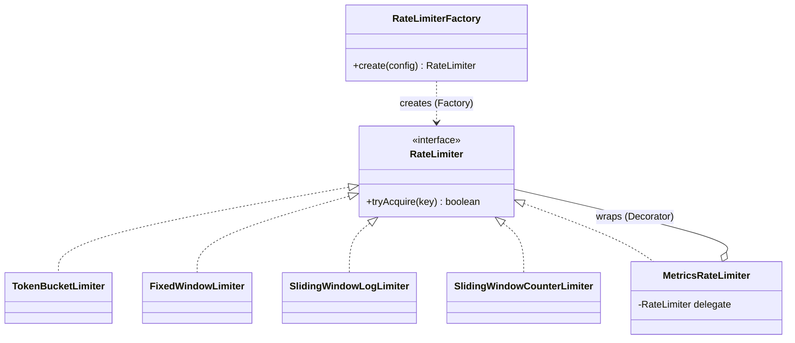

# Design Patterns (Strategy, Factory, Decorator, Singleton, Template Method)

## 1. One-line summary

Design patterns are **named, reusable shapes of code** for recurring problems; in LLD interviews a handful — Strategy, Factory, Decorator, Singleton, Template Method — come up constantly, and the skill being tested is knowing **when** each one pays for itself.

## 2. The problem it solves

Without shared vocabulary, "I'll have an interface for the algorithm, and a class that picks which implementation to build from config" takes a paragraph. With it: "Strategy for the algorithm, Factory to create it". Patterns compress design discussions the way "blue-green deploy" or "sidecar" compress infra discussions.

They also encode lessons: *program to an interface*, *add behavior by wrapping instead of editing*, *keep creation logic in one place*. The danger is the opposite pain — pattern soup, where a 50-line problem gets six interfaces and a `AbstractRateLimiterFactoryProvider`.

## 3. How it works



### Strategy — swap an algorithm behind an interface

```java
public interface RateLimiter {
    boolean tryAcquire(String key);
}

public final class TokenBucketLimiter implements RateLimiter { /* ... */ }
public final class FixedWindowLimiter implements RateLimiter { /* ... */ }

public final class ApiHandler {
    private final RateLimiter limiter;                // depends on the interface only
    public ApiHandler(RateLimiter limiter) { this.limiter = limiter; }
    public int handle(String user) { return limiter.tryAcquire(user) ? 200 : 429; }
}
```

- **Use when:** several interchangeable algorithms exist, chosen by config or at runtime, and callers shouldn't care which. Rate-limit algorithms are the textbook case.
- **Over-engineering when:** there's one algorithm and no realistic second. An interface with one implementation "for the future" is just indirection (YAGNI — *you aren't gonna need it*). Exception: an interface you need for test fakes is legitimate.

### Factory — put "which class do I build?" in one place

```java
public enum Algorithm { TOKEN_BUCKET, FIXED_WINDOW, SLIDING_LOG, SLIDING_COUNTER }

public record LimiterConfig(Algorithm algorithm, int limit, java.time.Duration window) {}

public final class RateLimiterFactory {
    private final TimeSource time;
    public RateLimiterFactory(TimeSource time) { this.time = time; }

    public RateLimiter create(LimiterConfig c) {
        return switch (c.algorithm()) {                   // exhaustive switch on enum (Java 21)
            case TOKEN_BUCKET    -> new TokenBucketLimiter(c.limit(), c.window(), time);
            case FIXED_WINDOW    -> new FixedWindowLimiter(c.limit(), c.window(), time);
            case SLIDING_LOG     -> new SlidingWindowLogLimiter(c.limit(), c.window(), time);
            case SLIDING_COUNTER -> new SlidingWindowCounterLimiter(c.limit(), c.window(), time);
        };
    }
}
```

- **Use when:** the concrete type depends on config/input, construction needs shared dependencies (a [clock](../libraries/java/time-and-clock.md), a scheduler), or you want to add a type without touching callers. Pairs naturally with Strategy.
- **Over-engineering when:** there's one type and `new Foo()` is perfectly clear; or you build an abstract factory hierarchy for a single product family.

### Decorator — add behavior by wrapping, same interface

```java
public final class MetricsRateLimiter implements RateLimiter {
    private final RateLimiter delegate;
    private final java.util.concurrent.atomic.LongAdder rejected = new java.util.concurrent.atomic.LongAdder();

    public MetricsRateLimiter(RateLimiter delegate) { this.delegate = delegate; }

    @Override public boolean tryAcquire(String key) {
        boolean ok = delegate.tryAcquire(key);
        if (!ok) rejected.increment();
        return ok;
    }
    public long rejectedCount() { return rejected.sum(); }
}

RateLimiter limiter = new MetricsRateLimiter(new LoggingRateLimiter(factory.create(config)));
```

- **Use when:** cross-cutting add-ons (metrics, logging, fail-open on errors, a per-endpoint allowlist) that should combine freely without touching each algorithm. Java's `BufferedInputStream(new FileInputStream(...))` and Resilience4j's `decorateSupplier` are decorators; so is Express [middleware](../libraries/js/express-middleware.md) in spirit.
- **Over-engineering when:** there's one fixed add-on that will always be there — just put it in the class. Deep wrapper stacks are also hard to debug (stack traces become onion layers).

### Singleton — exactly one instance

```java
public enum GlobalLimiterRegistry {                     // simplest thread-safe singleton
    INSTANCE;
    private final java.util.concurrent.ConcurrentHashMap<String, RateLimiter> limiters =
            new java.util.concurrent.ConcurrentHashMap<>();
    public RateLimiter get(String name) { return limiters.get(name); }
}
```

- **Use when:** something truly must be one-per-process and has no state worth varying in tests — rare. The enum form is lazy-safe and serialization-safe.
- **Why it's often a smell:** it's a **global variable** with a nicer name. Any class can reach `GlobalLimiterRegistry.INSTANCE`, so dependencies are hidden; tests can't substitute a fake or reset state between runs; and parallel tests leak state into each other. Prefer **"one instance by wiring"**: create one object in `main` (or let Spring create a singleton-scoped bean) and pass it through constructors. You get the "only one" property without the global access.

### Template Method — fixed skeleton, overridable steps

The sliding-window algorithms share a flow — "get now, evict expired data, check, record". A base class fixes the order; subclasses fill in steps:

```java
public abstract class WindowedLimiter implements RateLimiter {
    protected final TimeSource time;
    protected WindowedLimiter(TimeSource time) { this.time = time; }

    @Override public final boolean tryAcquire(String key) {   // final: the template
        long now = time.nanoTime();
        evictExpired(key, now);
        if (!hasCapacity(key, now)) return false;
        record(key, now);
        return true;
    }
    protected abstract void evictExpired(String key, long now);
    protected abstract boolean hasCapacity(String key, long now);
    protected abstract void record(String key, long now);
}
```

- **Use when:** several classes share the exact same algorithm outline and differ only in steps.
- **Over-engineering when:** the "shared" flow is two lines, or subclasses start overriding to skip steps. Inheritance couples subclasses to the base; composition (inject a Strategy for the varying step) is usually more flexible. Also note: making a check-then-record template thread-safe needs the lock around the whole template method, not in each step (see [thread-safety-basics](thread-safety-basics.md)).

### Observer — notify subscribers when something changes

A **subject** keeps a list of **listeners** and calls them on every change, without knowing what they do. Parking lot: a floor publishes "free spots changed" and display boards, a metrics exporter, or a mobile-app push service subscribe. Same idea as a Kafka topic or a k8s watch, inside one process.

```java
public interface AvailabilityListener {
    void onAvailabilityChanged(int floor, SpotSize size, int freeCount);
}

public final class ParkingFloor {
    private final int number;
    private final java.util.List<AvailabilityListener> listeners =
            new java.util.concurrent.CopyOnWriteArrayList<>();   // subscribe rarely, notify often
    public ParkingFloor(int number) { this.number = number; }

    public void addListener(AvailabilityListener l) { listeners.add(l); }
    void publish(SpotSize size, int free) {
        for (AvailabilityListener l : listeners) l.onAvailabilityChanged(number, size, free);
    }
}

public final class DisplayBoard implements AvailabilityListener {
    @Override public void onAvailabilityChanged(int floor, SpotSize size, int free) {
        System.out.printf("Floor %d: %d %s spots free%n", floor, free, size);
    }
}
```

`CopyOnWriteArrayList` is explained in [concurrent-collections](../libraries/java/concurrent-collections.md).

- **Use when:** one change has several independent reactions that may grow (boards, metrics, notifications) and the subject shouldn't depend on them.
- **Over-engineering / risky when:** there's exactly one consumer — just call it. Watch for: listeners running **synchronously on the caller's thread** (a slow board slows down `park()`; hand off to an executor or queue if it can block), exceptions from one listener stopping the rest (catch per listener), memory leaks from listeners never removed, and hard-to-follow control flow when listeners trigger further events. Across services, use a message broker instead.

### State — behaviour depends on a lifecycle state

An object moves through states (ticket: `ACTIVE → PAID → EXITED`) and the allowed operations differ per state. Instead of `if (status == ...)` in every method, each state decides what's legal and what comes next. In Java a small lifecycle fits neatly in an enum (see [enums-and-enummap](../libraries/java/enums-and-enummap.md)):

```java
public enum TicketStatus {
    ACTIVE { @Override TicketStatus pay()  { return PAID; } },
    PAID   { @Override TicketStatus exit() { return EXITED; } },
    EXITED;

    TicketStatus pay()  { throw new IllegalStateException("cannot pay in state " + this); }
    TicketStatus exit() { throw new IllegalStateException("cannot exit in state " + this); }
}

// status = status.pay();   // ACTIVE -> PAID; calling pay() again throws
```

The full Gang-of-Four form uses a `State` interface with one class per state, holding behaviour and data for that state — worth it when each state has substantial, different logic (a vending machine: `Idle`, `HasMoney`, `Dispensing`).

- **Use when:** there are 3+ states, transitions have rules, and invalid transitions must be impossible ("exit without paying").
- **Over-engineering when:** two states and one transition — a `boolean` or a single `if` is clearer. Also don't spread one lifecycle across a class per state if the states share almost all behaviour; an enum transition table is enough. In concurrent code, the transition itself must be atomic (e.g. `AtomicReference<TicketStatus>.compareAndSet(ACTIVE, PAID)`) or two exit gates could both "exit" the same ticket.

### Facade — one simple entry point over a subsystem

`ParkingLot.park(vehicle)` / `unpark(ticketId)` hide floors, spots, allocation, pricing and notifications behind two methods. Callers (gates) can't reach in and break invariants, and locking lives in one place. **Over-engineering when** it becomes a god class doing the work itself instead of delegating — a facade coordinates, it doesn't compute (see [oop-modeling](oop-modeling.md)).

### Command — a request as an object

Wrap "do X with these arguments" into a small object that can be **queued, logged, retried or undone** instead of calling the method directly. Elevator: a button press becomes `HallCall(floor, direction)`, `CarCall(elevatorId, floor)` or `SetMaintenance(elevatorId, on)`; any thread can create one, but only the simulation thread executes it (see [single-writer-principle](single-writer-principle.md) and [blocking-queues-and-producer-consumer](../libraries/java/blocking-queues-and-producer-consumer.md)). Same idea as a message on a Kafka topic or a k8s manifest: a description of intent, applied later by an owner.

```java
public sealed interface Command permits HallCall, CarCall, SetMaintenance {}
public record HallCall(int floor, Direction direction) implements Command {}
public record CarCall(int elevatorId, int floor) implements Command {}
public record SetMaintenance(int elevatorId, boolean on) implements Command {}

// producer (any thread):   inbox.offer(new HallCall(5, Direction.UP));
// consumer (sim thread, inside tick()):
void apply(Command c) {
    switch (c) {                                      // exhaustive over the sealed interface
        case HallCall h       -> dispatcher.assign(h.floor(), h.direction());
        case CarCall cc       -> elevators.get(cc.elevatorId()).addStop(cc.floor());
        case SetMaintenance m -> elevators.get(m.elevatorId()).setMaintenance(m.on());
    }
}
```

The classic GoF form gives each command an `execute()` (and maybe `undo()`) method; with Java 21 records + sealed interfaces, keeping commands as **pure data** and the logic in one `switch` is often clearer, and it keeps the commands immutable and safe to pass between threads.

- **Use when:** requests must cross a thread or process boundary (queue them), be recorded (audit log, replay for tests), be retried, or be undone (editor undo stack, transaction compensation).
- **Over-engineering when:** the caller and the receiver are on the same thread and the call happens immediately — `elevator.addStop(9)` is clearer than `new AddStopCommand(elevator, 9).execute()`. Also avoid a command class per trivial setter, and don't put mutable state in commands that cross threads.

## 4. When to use it

- Name a pattern when it genuinely shapes the design, and say **why** it's needed here ("algorithms are chosen per-endpoint from config, so Strategy + Factory").
- Strategy + Factory + Decorator cover most LLD problems: rate limiter, parking lot pricing, notification channels, payment methods.

## 5. When NOT to use it

- **Before there's variation.** Patterns are a response to change pressure; adding them up front is speculative complexity.
- **To show off.** Interviewers at L4/L5 reward simple, correct code first. Five patterns in 30 minutes reads as cargo cult.
- **Singleton for convenience** — hidden global state, untestable.
- **Template Method when composition works** — inheritance hierarchies are hard to change later.

## 6. Commonly confused with

| | Strategy | Template Method | Decorator | Factory | Singleton |
|---|---|---|---|---|---|
| Varies | whole algorithm | some steps of an algorithm | extra behavior around an object | which class is instantiated | — |
| Mechanism | composition (interface field) | inheritance (abstract steps) | composition (wraps same interface) | method returning interface | static / enum instance |
| Chosen at | runtime | compile time (subclass) | runtime (wrap order) | runtime | n/a |
| Rate limiter role | the algorithms | shared window flow | metrics / logging / fail-open | build limiter from config | (avoid) shared registry |

Also confused: **Decorator vs Proxy** — same shape; Decorator adds behavior, Proxy controls access (lazy loading, remote calls, security). **Factory method vs Abstract Factory** — one creation method vs a family of related products.

## 7. Common mistakes / misuse

1. Interface + factory + builder for a single class with no variation.
2. Singleton registry accessed statically from everywhere → tests interfere with each other.
3. Strategy where the "strategies" need different method signatures — then they aren't interchangeable.
4. Decorator that breaks the contract (e.g. swallows exceptions the caller relied on).
5. Factory full of `if/else` on strings — use an enum and an exhaustive `switch`, so adding a value forces a compile error at every switch.
6. Naming patterns without code that matches — interviewers check the code, not the vocabulary.

## 8. Interview cheat-sheet

- "Each algorithm implements a `RateLimiter` interface — that's Strategy, so the API layer doesn't know which one it uses."
- "A factory builds the right limiter from config and injects shared dependencies like the clock."
- "Metrics and logging are decorators that wrap any limiter, so I don't touch algorithm code to add them."
- "I avoid a Singleton; I create one registry at startup and pass it in, so tests can use their own instance."
- "I'd only add an abstraction where there's real variation — otherwise it's over-engineering."

## 9. Used in

- [LLD: Design a Rate Limiter](../interviews/rate-limiter/README.md) — Strategy for algorithms, Factory for creation, Decorator for metrics.
- [LLD: Design a Parking Lot](../interviews/parking-lot/README.md) — Strategy for pricing and spot allocation, Factory for building strategies from config, Observer for display boards, State for the ticket lifecycle (ACTIVE → PAID → EXITED), Facade for `ParkingLot`; Singleton warning (don't make `ParkingLot` a global singleton — create one and inject it).
- [LLD: Design an LRU Cache](../interviews/lru-cache/README.md) — Decorator: `SynchronizedCache` wraps any `Cache<K,V>` to add locking without changing it; Strategy: the eviction policy (LRU vs LFU) behind one `Cache` interface.
- [LLD: Design an Elevator System](../interviews/elevator-system/README.md) — Strategy: car selection (`NearestCarStrategy`, `LeastBusyStrategy`); State: elevator status (IDLE / MOVING / DOORS_OPEN / MAINTENANCE, see [state-machines](state-machines.md)); Command: button presses as `HallCall` / `CarCall` / `SetMaintenance` queued to the simulation thread; Observer: `ElevatorListener` for displays (ARRIVED, DOORS_OPENED); Facade: `ElevatorSystem`.
- [LLD: Design Splitwise](../interviews/splitwise/README.md) — Strategy: split types (`Equal` / `Exact` / `Percent` / `Shares`) turned into weights by one `Splitter` (modelled as a sealed hierarchy, see [sealed-interfaces-and-pattern-matching](../libraries/java/sealed-interfaces-and-pattern-matching.md)); Facade: the expense service in front of groups, ledgers and the splitter.
- [LLD: Design a Movie Ticket Booking System](../interviews/movie-booking/README.md) — Strategy: pricing per seat type/show and the refund policy for `cancelBooking`; Strategy again for the two `SeatInventory` implementations (locking vs CAS); Facade: the booking service in front of shows, inventory, payments and refunds; State: seat state AVAILABLE / HELD / BOOKED.
- [LLD: Design an In-Memory Key-Value Store with Transactions](../interviews/kv-store/README.md) — Command: each parsed line (`SET`, `GET`, `BEGIN`, ...) becomes an immutable command record executed by one dispatcher and appended to the log; Memento-like undo: each transaction layer saves the original value of every key it first touches so `ROLLBACK` can restore it (see [undo-logs-and-redo-logs](undo-logs-and-redo-logs.md)).
- [Logging Framework](../interviews/logging-framework/README.md): **Strategy** for layouts (pattern vs JSON), **Chain of Responsibility** for filters (ACCEPT / DENY / NEUTRAL), a fan-out to several appenders, and the singleton registry's cost in tests.
- [Vending Machine](../interviews/vending-machine/README.md): **State** pattern for the machine's modes, and a pluggable `Dispenser` so tests can simulate a motor jam.
- [Text Editor](../interviews/text-editor/README.md): **Command** (insert/delete with undo), **Composite/Macro** commands (paste, replace-all as one undo step), and Memento as the snapshot alternative.
- [In-memory File System](../interviews/file-system/README.md): **Composite** (File and Directory as Nodes, recursive size) and iterators/visitors for find.
- [Pub-Sub Broker](../interviews/pub-sub-broker/README.md): Observer scaled up (per-subscriber queues and dispatchers), Strategy for overflow policies. Deeper: [Observer & event dispatch](observer-and-event-dispatch.md).
- Related: [SOLID principles](solid-principles.md) — Strategy and Decorator are how Open/Closed is usually achieved.
